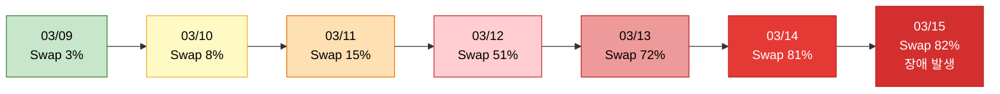
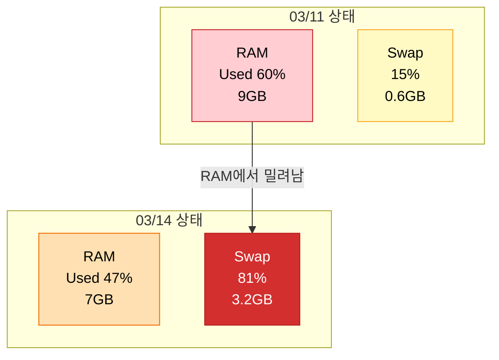
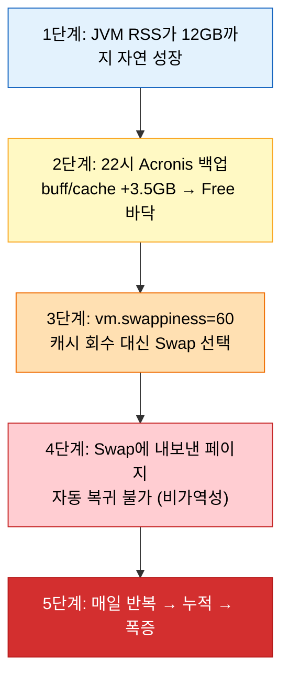
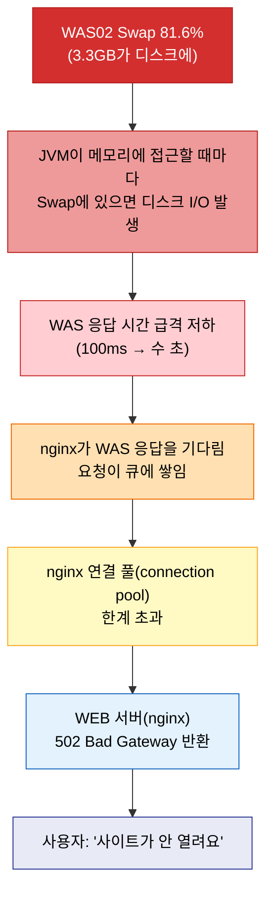
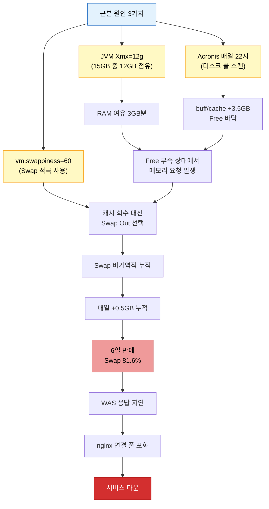

# 07. 실전 WAS02 장애분석

!!! info "난이도: :material-omega: Omega"

    01~06장 전부 이해해야 풀 수 있는 실전 분석이야.
    실제 모니터링 데이터로 장애 원인을 추적한다.
    이거 분석할 수 있으면 서버 장애 대응 기본은 된 거야.

---

## 상황: WAS02가 죽었다

2025년 3월 15일 오전, WAS02 서버 응답이 급격히 느려지더니 사실상 먹통이 됐어.

WAS01은 정상. WAS02만 장애.

**같은 설정인 서버 두 대인데, 왜 하나만 터졌을까?**

---

## 서버 환경 비교

| 항목 | WAS01 | WAS02 |
|------|-------|-------|
| 총 메모리 (RAM) | 15GB | 15GB |
| JVM -Xms / -Xmx | 8GB / 12GB | 8GB / 12GB |
| vm.swappiness | 60 | 60 |
| OS | 동일 | 동일 |
| 애플리케이션 | 동일 | 동일 |
| Acronis 백업 | **없음** | **매일 22시** |

!!! warning "차이점이 뭐야?"

    딱 하나. **Acronis 백업**. WAS02에만 매일 22시에 전체 백업이 걸려 있어.

---

## 장애 타임라인: perf-trending 모니터링 데이터

이건 실제 perf-trending에서 찍힌 데이터야.

### Memory Used %와 Swap % 추이

| 날짜 | 시간 | Memory Used % | Swap % | 비고 |
|------|------|---------------|--------|------|
| 03/09 | 11:00 | 34% | 3.1% | WAS 재기동 직후 |
| 03/09 | 23:00 | 42% | 3.1% | 첫 백업 이후 |
| 03/10 | 23:00 | 51% | 8.2% | Swap 증가 시작 |
| 03/11 | 23:00 | 60% | 15.0% | Swap 급증 |
| 03/12 | 23:00 | 54% | 51.4% | Swap 폭증 |
| 03/13 | 23:00 | 49% | 71.8% | 계속 증가 |
| 03/14 | 23:00 | 47% | 81.0% | 심각 |
| 03/15 | 11:00 | 48% | 81.6% | 응답 지연 발생 |



!!! question "이상한 점 보여?"

    Memory Used %가 **줄어들고 있어**. 60% → 54% → 49% → 47%.
    근데 Swap은 **계속 올라가**. 15% → 51% → 72% → 81%.

    메모리 사용량이 줄었는데 왜 서버가 터지지?

---

## 함정: Memory Used가 줄어드는 것처럼 보이는 이유

이건 모니터링 데이터를 잘못 읽는 전형적인 실수야.

!!! danger "핵심 착각"

    "Memory Used가 줄었으니까 메모리 상태가 나아진 거 아니야?"

    **아니. 정반대야.**

Memory Used %는 보통 **RAM 기준**으로 계산해.

| 상태 | RAM에 있는 데이터 | Swap에 있는 데이터 | Memory Used % (RAM 기준) |
|------|-------------------|--------------------|--------------------------|
| 정상 | 9GB | 0GB | 60% |
| Swap 발생 후 | 7GB | 3GB | 47% |

RAM에 있던 데이터가 Swap(디스크)으로 **밀려나니까** RAM Used는 줄어들어.
하지만 그 데이터는 사라진 게 아니야. Swap에 가 있는 거야.



!!! abstract "정리"

    - RAM Used가 줄어든 건 "여유가 생긴 것"이 아니라 "Swap으로 쫓겨난 것"이야.
    - 총 메모리 사용량(RAM + Swap)은 계속 증가하고 있어.
    - Swap에 있는 데이터에 접근할 때마다 **디스크 I/O가 발생**해서 느려지는 거야.

---

## 실제 backup_mem.log: 하룻밤의 메모리 변화

`backup_mem.log`에서 10분 단위로 `free -h`를 찍은 실제 데이터야.
하루 중 백업이 돌아가는 21:00 ~ 03:50 구간을 봐.

### 백업 전 (21:00~22:10)

| 시간 | Used | buff/cache | Free | Swap Used |
|------|------|-----------|------|-----------|
| 21:00 | 9.8GB | 3.2GB | 2.0GB | 2.1GB |
| 21:30 | 9.9GB | 3.1GB | 2.0GB | 2.1GB |
| 22:00 | 9.9GB | 3.2GB | 1.9GB | 2.1GB |
| 22:10 | 9.9GB | 3.2GB | 1.9GB | 2.1GB |

안정적이야. Used, buff/cache, Free, Swap 전부 거의 변동 없어.

### 백업 시작 (22:18~22:30)

| 시간 | Used | buff/cache | Free | Swap Used | 변화 |
|------|------|-----------|------|-----------|------|
| 22:18 | 9.9GB | 3.2GB | 1.9GB | 2.1GB | 백업 시작 직전 |
| 22:20 | 10.0GB | 4.8GB | 0.2GB | 2.1GB | Free 급감 |
| 22:25 | 10.0GB | 4.7GB | 0.1GB | 2.2GB | Swap 시작 |
| 22:30 | 10.0GB | 4.6GB | 0.1GB | 2.3GB | Swap 계속 증가 |

!!! danger "22:18 → 22:20, 2분 만에 Free가 1.9GB에서 0.2GB로"

    buff/cache가 3.2에서 4.8로 **1.6GB 증가**.
    Free가 1.9에서 0.2로 **1.7GB 감소**.
    제로섬. 06장에서 배운 그대로야.

### 백업 진행 중 (22:30~23:00)

| 시간 | Used | buff/cache | Free | Swap Used |
|------|------|-----------|------|-----------|
| 22:30 | 10.0GB | 4.6GB | 0.1GB | 2.3GB |
| 22:40 | 10.0GB | 4.5GB | 0.1GB | 2.5GB |
| 22:50 | 10.0GB | 4.4GB | 0.1GB | 2.6GB |
| 23:00 | 10.0GB | 4.3GB | 0.1GB | 2.7GB |

!!! note "패턴이 보여?"

    buff/cache가 조금씩 **줄고**, Swap이 조금씩 **늘어**.
    Free는 0.1GB로 바닥.

    무슨 뜻이냐면:
    Free가 바닥나서 OS가 캐시를 회수하고 있는데,
    그래도 모자라서 **Swap으로 내보내고 있다**는 뜻이야.

### 백업 완료 후 (23:10~03:50)

| 시간 | Used | buff/cache | Free | Swap Used |
|------|------|-----------|------|-----------|
| 23:10 | 10.0GB | 4.2GB | 0.1GB | 2.7GB |
| 00:00 | 10.0GB | 4.2GB | 0.1GB | 2.7GB |
| 01:00 | 10.0GB | 4.2GB | 0.1GB | 2.7GB |
| 02:00 | 10.1GB | 4.1GB | 0.1GB | 2.8GB |
| 03:00 | 10.1GB | 4.1GB | 0.1GB | 2.8GB |
| 03:50 | 10.1GB | 4.0GB | 0.1GB | 2.9GB |

!!! danger "백업 끝났는데 Swap이 안 줄어"

    05장에서 배운 **Swap의 비가역성**이야.
    Swap에 내보낸 페이지는 자동으로 안 돌아와.

    - 23:10 Swap 2.7GB → 03:50 Swap 2.9GB
    - 백업 끝나고도 Swap이 오히려 **0.2GB 더 늘었어**
    - Free는 0.1GB에 고정. 캐시도 계속 줄어들고 있어.

---

## 5단계 인과관계 분석

이제 왜 이렇게 됐는지 **근본 원인**을 5단계로 분석할 거야.



### 1단계: JVM RSS의 자연 성장

JVM 옵션이 `-Xms8g -Xmx12g`야.

- 시작 시: 힙이 8GB로 시작
- 운영 중: 객체가 쌓이면서 힙이 점점 성장
- 결국: **RSS(실제 물리 메모리 사용량)가 12GB 근처까지 올라감**

!!! note "RSS가 왜 12GB까지 올라가?"

    -Xmx12g는 "최대 12GB까지 힙을 쓸 수 있다"는 뜻이야.
    JVM은 메모리를 한 번 할당하면 잘 반환 안 해.
    결국 시간이 지나면 RSS가 Xmx 근처까지 자연스럽게 올라가.

    15GB RAM에서 JVM이 12GB 쓰면? **나머지 3GB**로 OS + buff/cache + Free를 다 감당해야 해.
    이미 빡빡한 상태야.

### 2단계: Acronis 백업이 Free를 죽인다

06장에서 배운 그대로야.

```
백업 전:  Used 10GB + buff/cache 3GB + Free 2GB = 15GB
백업 중:  Used 10GB + buff/cache 5GB + Free 0GB = 15GB
```

Free 2GB가 1분 만에 증발. buff/cache가 2GB 먹었어.

### 3단계: vm.swappiness=60의 재앙

여기가 핵심이야.

Free가 바닥났을 때 OS는 두 가지 선택을 할 수 있어:

| 선택지 | 설명 | OS의 판단 |
|--------|------|-----------|
| **A. 캐시 회수** | buff/cache에서 빼서 Free 확보 | 캐시를 버리는 거니까 나중에 디스크 I/O 증가 |
| **B. Swap Out** | RAM에 있는 프로세스 메모리를 디스크로 내보냄 | 캐시 유지 가능, 대신 프로세스 느려짐 |

!!! danger "vm.swappiness=60이면?"

    swappiness가 60이면 OS는 **"캐시 회수와 Swap을 반반 정도로 써라"**라는 지시를 받은 거야.

    Free가 바닥나면 캐시를 회수하기도 하지만,
    **상당 부분을 Swap으로 처리해.** 캐시를 보존하려고.

    결과: buff/cache는 유지되는데 **Swap이 늘어나.**
    이게 04장에서 배운 vm.swappiness의 실전 영향이야.

### 4단계: Swap의 비가역성

05장에서 배운 거야.

| 시점 | Swap Used | 비고 |
|------|-----------|------|
| 백업 전 | 2.1GB | 안정 |
| 백업 중 | 2.3GB | +0.2GB |
| 백업 후 | 2.7GB | +0.6GB (계속 증가) |
| 다음 날 백업 전 | 2.7GB | 안 줄어듦 |

Swap에 내보낸 페이지는 **해당 페이지에 직접 접근할 때만** RAM으로 돌아와.
그 전까지는 Swap에 **영구 잔류**해.

### 5단계: 매일 반복 = 누적 = 폭증

| 날짜 | 백업 전 Swap | 백업 후 Swap | 일일 증가분 |
|------|-------------|-------------|------------|
| 03/09 | 0.1GB | 0.6GB | +0.5GB |
| 03/10 | 0.6GB | 1.4GB | +0.8GB |
| 03/11 | 1.4GB | 2.3GB | +0.9GB |
| 03/12 | 2.3GB | 3.1GB | +0.8GB |
| 03/13 | 3.1GB | 3.5GB | +0.4GB |
| 03/14 | 3.5GB | 3.8GB | +0.3GB |

!!! abstract "패턴"

    매일 밤 백업 때마다 Swap이 0.3~0.9GB씩 늘어나.
    근데 백업 끝나도 줄어들지 않아.
    **6일 만에 0.1GB에서 3.8GB가 됐어.** 4GB Swap 영역이 거의 찼어.

---

## WAS01과의 비교: 결정적 증거

| 항목 | WAS01 | WAS02 |
|------|-------|-------|
| RAM | 15GB | 15GB |
| JVM 설정 | 동일 | 동일 |
| vm.swappiness | 60 | 60 |
| 애플리케이션 | 동일 | 동일 |
| 03/15 Swap % | **2.8%** | **81.6%** |
| Acronis 백업 | **없음** | **매일 22시** |

!!! tip "과학적 사고"

    실험에서 **통제 변인**과 **조작 변인**이 있잖아.

    - 통제 변인: RAM, JVM, swappiness, 애플리케이션 (전부 동일)
    - 조작 변인: Acronis 백업 (WAS02에만 존재)
    - 결과 변인: Swap 사용량 (WAS01: 2.8%, WAS02: 81.6%)

    유일한 차이가 백업인데, Swap 차이가 30배야.
    **백업이 원인이라는 결정적 증거.**

---

## 장애 발생 메커니즘

Swap이 81%까지 차면 서버에 무슨 일이 벌어지는지 봐.



!!! danger "연쇄 반응이야"

    Swap 폭증은 **WAS만 죽이는 게 아니야.**
    WAS가 느려지면 nginx도 같이 죽어. 전체 서비스가 다운돼.

    1. Swap에 있는 데이터 접근 = 디스크 I/O = RAM 대비 10만 배 느림
    2. WAS 응답 수 초 걸림 = nginx가 타임아웃 전까지 연결 유지
    3. 새 요청 계속 들어옴 = nginx 연결 풀 포화
    4. 연결 풀 꽉 참 = 새 요청 처리 불가 = 502

---

## 해결 방안

### 방안 1: vm.swappiness 60 → 10 (최우선)

| 항목 | 내용 |
|------|------|
| 효과 | 높음 |
| 난이도 | 쉬움 (명령어 한 줄) |
| 위험도 | 낮음 |
| 적용 방법 | 즉시 가능 |

```bash
# 즉시 적용 (재부팅 없이)
sysctl vm.swappiness=10

# 영구 적용 (/etc/sysctl.conf에 추가)
echo "vm.swappiness=10" >> /etc/sysctl.conf
sysctl -p
```

!!! tip "왜 10이야?"

    swappiness=10이면 OS가 **캐시 회수를 훨씬 우선**해.
    백업으로 buff/cache가 올라와도, Free가 부족하면 **캐시를 먼저 회수**하고
    **Swap은 최후의 수단**으로만 써.

    결과: 백업 후에도 Swap 증가가 거의 없어짐.

### 방안 2: Xmx 축소 검토 (보완 조치)

| 항목 | 내용 |
|------|------|
| 효과 | 중간 |
| 난이도 | 중간 (GC 영향 모니터링 필요) |
| 위험도 | 중간 (너무 줄이면 OOM) |
| 적용 방법 | WAS 재시작 필요 |

```
현재: -Xms8g -Xmx12g (15GB 중 12GB를 JVM이 차지)
검토: -Xms8g -Xmx10g (15GB 중 10GB → OS에 5GB 여유)
```

!!! warning "주의사항"

    Xmx를 줄이면 GC가 더 자주 돌아. Full GC 빈도가 올라갈 수 있어.
    줄이기 전에 현재 힙 사용량 추이를 반드시 확인해야 해.
    실제로 10GB 이상 쓰고 있으면 줄이면 안 돼.

### 방안 비교

| 방안 | 효과 | 난이도 | 위험도 | 재시작 | 우선순위 |
|------|------|--------|--------|--------|----------|
| swappiness 60→10 | 높음 | 낮음 | 낮음 | 불필요 | 1순위 |
| Xmx 12g→10g | 중간 | 중간 | 중간 | 필요 | 2순위 |

---

## 전체 인과관계 다이어그램



!!! abstract "이 장애의 본질"

    단일 원인이 아니야. **3가지 요인이 겹쳤어.**

    1. JVM이 RAM의 80%를 차지해서 여유가 없었고
    2. 매일 백업이 남은 여유마저 캐시로 채워버렸고
    3. swappiness=60이라 OS가 Swap을 적극적으로 썼어

    하나만 빠져도 장애가 안 났을 수 있어.
    이게 실전 장애 분석의 핵심이야. **복합 원인.**

---

## 정리

| 핵심 | 내용 |
|------|------|
| 장애 서버 | WAS02 (WAS01은 정상) |
| 유일한 차이 | Acronis 백업 (WAS02에만 매일 22시) |
| 근본 원인 | JVM 12GB + 백업 캐시 + swappiness=60 복합 |
| Swap 추이 | 6일 만에 3% → 82% (매일 누적) |
| Memory Used 함정 | RAM Used가 줄어 보이지만 Swap으로 밀려난 것 |
| 해결 1순위 | vm.swappiness 60 → 10 |
| 해결 2순위 | Xmx 축소 검토 (GC 모니터링 필요) |

---

## 확인 문제

---

### Q1. 결정적 증거

WAS01과 WAS02는 동일한 설정인데, WAS02만 Swap이 폭증했어.
WAS02의 Swap 폭증 원인이 Acronis 백업이라고 단정할 수 있는 근거를 설명해봐.

??? success "정답 보기"

    **과학적 비교(통제 실험)의 논리**로 단정할 수 있어.

    - 통제 변인: RAM(15GB), JVM(8g/12g), swappiness(60), 애플리케이션 -- 전부 동일
    - 조작 변인: Acronis 백업 -- WAS01에는 없고 WAS02에만 매일 22시 실행
    - 결과 변인: Swap 사용률 -- WAS01은 2.8%, WAS02는 81.6%

    모든 조건이 같은데 **유일하게 다른 요소(백업)가 있는 서버만 장애**가 발생했으니,
    백업이 원인이라고 결론 내릴 수 있어.

    추가 증거: backup_mem.log에서 백업 시작 시간(22:18)에 정확히
    buff/cache가 급증하고 Free가 바닥나는 패턴이 확인돼.
    시간적 상관관계까지 일치해.

---

### Q2. Memory Used 착각

perf-trending에서 Memory Used %가 03/11에 60%였는데 03/14에 47%로 줄었어.
"메모리 상태가 좋아졌다"고 판단해도 돼? 왜/왜 안 돼?

??? success "정답 보기"

    **안 돼. 정반대로 악화된 거야.**

    Memory Used %는 **RAM 기준**으로 계산해.
    RAM에 있던 데이터가 Swap(디스크)으로 **밀려났기 때문에** RAM Used가 줄어 보이는 거야.

    실제로는:

    - 03/11: RAM 60% + Swap 15% = 총 메모리 부담 높음
    - 03/14: RAM 47% + Swap 81% = 총 메모리 부담 **훨씬 더 높음**

    RAM Used만 보면 좋아진 것 같지만,
    **Swap을 같이 봐야 진짜 상태를 알 수 있어.**
    Swap에 있는 데이터는 접근할 때마다 디스크 I/O가 발생하니까
    성능 관점에서는 03/14가 훨씬 위험한 상태야.

---

### Q3. 5단계 인과관계

이 장애의 5단계 인과관계를 순서대로 설명해봐.
각 단계가 왜 다음 단계로 이어지는지도 말해야 해.

??? success "정답 보기"

    **1단계: JVM RSS가 12GB까지 자연 성장**

    -Xmx12g 설정으로 JVM 힙이 최대 12GB까지 커질 수 있어.
    시간이 지나면서 RSS가 12GB 근처까지 올라가면, 15GB RAM 중 3GB만 남아.

    **2단계: 22시 Acronis 백업 → buff/cache +3.5GB → Free 바닥**

    남은 3GB 중 일부가 buff/cache로 잡혀 있는 상태에서,
    백업이 디스크를 풀 스캔하면 OS가 읽은 데이터를 캐시에 올려.
    buff/cache가 +3.5GB 증가하면서 Free가 0에 수렴.

    **3단계: vm.swappiness=60 → 캐시 회수 대신 Swap 선택**

    Free가 바닥났을 때 OS는 캐시 회수 또는 Swap 중 선택해야 하는데,
    swappiness=60이라 Swap을 적극적으로 사용해. 캐시는 보존하고 프로세스 메모리를 Swap으로 내보내.

    **4단계: Swap에 내보낸 페이지가 자동 복귀 불가 (비가역성)**

    Swap에 내려간 페이지는 해당 페이지에 직접 접근할 때만 RAM으로 돌아와.
    접근 안 하면 Swap에 영구 잔류해.

    **5단계: 매일 반복 → 누적 → 폭증**

    매일 밤 백업 때마다 Swap이 0.3~0.9GB씩 늘어나는데 안 줄어들어.
    6일 만에 3%에서 82%까지 누적돼서 서버 응답 불가 상태에 도달.

---

### Q4. 해결 방안의 우선순위

vm.swappiness를 10으로 변경하는 것과 Xmx를 줄이는 것 중
왜 swappiness 변경이 1순위야? 두 방안의 장단점을 비교해봐.

??? success "정답 보기"

    **swappiness 변경이 1순위인 이유:**

    | 비교 항목 | swappiness 60→10 | Xmx 12g→10g |
    |-----------|------------------|-------------|
    | 효과 | 높음 (Swap 대신 캐시 회수 우선) | 중간 (여유 공간 확보) |
    | 적용 방법 | `sysctl` 명령어 한 줄 | WAS 재시작 필요 |
    | 다운타임 | 없음 (즉시 적용) | 있음 (재시작 동안 서비스 중단) |
    | 위험도 | 낮음 (캐시 회수가 늘어날 뿐) | 중간 (GC 빈도 증가, OOM 가능성) |
    | 부작용 | 캐시 Hit율 약간 감소 가능 | Full GC 증가, 힙 부족 시 OOM |

    swappiness 변경은 **재시작 없이 즉시 적용**할 수 있고,
    **위험도가 낮으면서 효과가 높아.** 장애 상황에서 가장 빠르게 적용할 수 있는 조치야.

    Xmx 축소는 GC 모니터링이 선행되어야 하고,
    실제로 10GB 이상 힙을 쓰고 있다면 줄이면 OOM이 발생해.
    그래서 **충분한 분석 후에 신중하게** 적용해야 하는 보완 조치야.

---

### Q5. 종합 분석

이 장애를 **한 번도 겪어보지 못한 동료**에게 설명해야 해.
"왜 백업이 서버를 죽이는가?"를 3문장 이내로 설명해봐.

??? success "정답 보기"

    "백업 프로그램이 디스크를 스캔하면 OS가 읽은 데이터를 자동으로 RAM 캐시에 올리는데,
    이때 RAM의 여유 공간(Free)이 바닥나면 OS가 프로세스 메모리를 Swap(디스크)으로 내보내.
    Swap에 내보낸 메모리는 자동으로 안 돌아오니까 매일 백업할 때마다 Swap이 누적되고,
    결국 서버가 디스크에서 데이터를 읽느라 응답을 못 하게 돼."

    (핵심 키워드: 자동 캐시, Free 바닥, Swap 비가역성, 매일 누적)

---

다 맞혔으면 [08_빠싺_최종시험.md](08_빠싺_최종시험.md)로 넘어가.

틀린 게 있으면? 01장부터 다시 읽어. **06~07장만 다시 읽으면 안 돼. 기초가 흔들리면 응용도 흔들려.**
