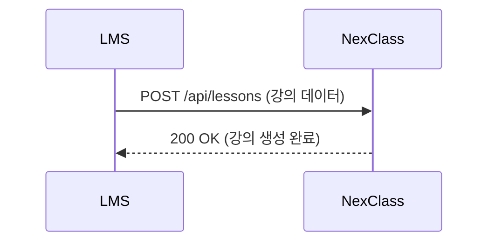

# 01. API 호출이 뭐야 - Alpha

---

## 1. 전화하는 거야 - "이게 뭐야?"

Webhook을 이해하려면 먼저 **API 호출**이 뭔지 정확히 알아야 해.

API 호출은 **한 서버가 다른 서버한테 뭔가를 요청하는 것**이야.

!!! example "실생활 비유"
    전화로 치킨 주문하는 거야.

    - **내가** 치킨집 번호를 **알고 있고**
    - **내가** 필요할 때 **직접 전화**하고
    - **내가** "치킨 하나 주세요"라고 **요청**한다

이 비유에서 핵심은 세 가지:

| 요소 | 치킨 주문 | API 호출 |
|------|-----------|----------|
| 누가 | 내가 | 클라이언트 서버가 |
| 어떻게 | 전화번호로 전화 | URL로 HTTP 요청 |
| 뭘 | "치킨 주세요" | "데이터 주세요" 또는 "이거 처리해줘" |

!!! abstract "한 줄 정의"
    **API 호출 = 한 서버가 다른 서버의 URL을 알고 있고, 필요할 때 직접 HTTP 요청을 보내는 것**

---

## 2. 실제로 어떻게 생겼어? - "코드로 보자"

우리 NexClass 프로젝트에서 실제로 하는 API 호출을 보자.

LMS가 NexClass한테 강의실 생성을 요청할 때:



LMS 코드 어딘가에 이런 게 있어:

```java
// LMS 서버의 코드 (LMS 개발자가 작성)
// NexClass URL을 알고 있고, 직접 호출한다
HttpResponse response = httpClient.post(
    "https://nc-server:8082/api/lessons",  // 호출할 URL
    lessonData                              // 보낼 데이터
);
```

핵심: **LMS 개발자가 이 코드를 직접 짰다.** 언제 호출할지, 어디로 보낼지, 뭘 보낼지 전부 코드에 있어.

---

## 3. API 호출의 3요소 - "이걸 왜 알아야 해?"

API 호출에는 반드시 3가지가 있어:

| 요소 | 설명 | 예시 |
|------|------|------|
| **URL** | 어디로 보낼지 | `https://nc-server:8082/api/lessons` |
| **Method** | 뭘 할 건지 | GET(조회), POST(생성), PUT(수정), DELETE(삭제) |
| **Data** | 뭘 보낼지 | `{ "lessonNm": "소프트웨어공학", ... }` |

!!! warning "이거 왜 중요하냐면"
    Webhook도 이 3요소를 **똑같이** 쓴다. HTTP 요청이니까.

    나중에 "Webhook이랑 API 호출이랑 뭐가 다른데?"라는 질문이 나올 건데,
    **기술적으로는 같다**는 걸 여기서 먼저 박아둔다.

---

## 4. 누가 전화하냐가 핵심 - "방향"

API 호출에서 제일 중요한 건 **방향**이야. **누가 전화하냐.**

우리 프로젝트 예시:

| 상황 | 누가 전화 (요청) | 누가 받아 (응답) |
|------|------------------|------------------|
| 강의 생성 | LMS → | ← NexClass |
| 학사 동기화 | NexClass → | ← LMS |
| Zoom 미팅 생성 | NexClass → | ← Zoom API |

!!! tip "기억할 것"
    API 호출에서는 **호출하는 쪽이 코드를 짠다.**

    - LMS가 NC 호출 → LMS 개발자가 호출 코드 짬
    - NC가 LMS 호출 → NC 개발자(우리)가 호출 코드 짬
    - NC가 Zoom 호출 → NC 개발자(우리)가 호출 코드 짬

이게 다음 챕터에서 Webhook이랑 비교할 때 핵심이 되니까 **확실히** 기억해.

---

## 5. 정리

| 항목 | 내용 |
|------|------|
| API 호출이란 | 서버가 다른 서버 URL로 HTTP 요청 보내는 것 |
| 누가 코드 짜냐 | **호출하는 쪽**이 짠다 |
| 핵심 3요소 | URL, Method, Data |
| 기술 | HTTP 요청 (GET, POST, PUT, DELETE) |

!!! abstract "이 챕터에서 반드시 기억할 것"
    **API 호출 = 내가 필요할 때, 상대 URL을 알고, 직접 코드 짜서 요청하는 것.**

    다음 챕터에서 Webhook이 이거랑 뭐가 다른지 본다.

---

### 확인 문제 (3문제)

!!! question "다음 문제를 풀어봐. 답 못 하면 위에서 다시 읽어."

**Q1.** LMS가 NexClass한테 강의실 생성을 요청한다. 호출 코드를 짜는 건 누구야?

**Q2.** API 호출의 3요소는 뭐야?

**Q3.** NexClass가 Zoom API를 호출해서 미팅을 생성한다. 이때 호출 코드를 짜는 건 누구야?

??? success "정답 보기"
    **A1.** LMS 개발자. 호출하는 쪽이 코드를 짠다.

    **A2.** URL (어디로), Method (뭘 할 건지), Data (뭘 보낼지)

    **A3.** NexClass 개발자(우리). NexClass가 호출하는 쪽이니까 우리가 짠다.
