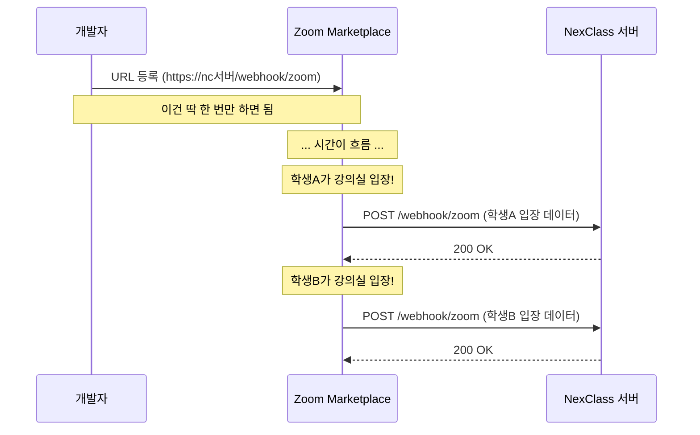

# 02. Webhook이 뭐야 - Alpha

---

## 1. 전화가 오는 거야 - "이게 뭐야?"

지난 챕터에서 API 호출은 **"내가 전화하는 것"**이라고 했지?

Webhook은 반대야. **"전화가 오는 것"**이야.

!!! example "실생활 비유"
    치킨 주문할 때 내 전화번호를 알려줬어.

    - 치킨 다 되면 **치킨집이 알아서** 전화해
    - **내가 전화 안 해도** 알려줘
    - 단, **내 번호를 미리 알려줬어야** 가능해

| 구분 | 치킨 주문 (API 호출) | 치킨 완성 알림 (Webhook) |
|------|---------------------|--------------------------|
| 누가 전화 | 내가 | 치킨집이 |
| 언제 | 내가 원할 때 | 치킨 다 됐을 때 |
| 전제 조건 | 치킨집 번호 알기 | 내 번호 알려주기 |

비유는 여기까지. 진짜 정의 간다.

!!! abstract "한 줄 정의"
    **Webhook = 외부 서비스에 내 URL을 등록해두면, 이벤트 발생 시 그 서비스가 내 URL로 자동으로 HTTP 요청을 보내주는 것**

---

## 2. 핵심은 "URL 등록" - "이게 왜 중요해?"

Webhook의 핵심을 한 단어로 말하면 **"등록"**이야.



**등록은 한 번.** 그 다음부터는 이벤트 생길 때마다 **Zoom이 알아서 보내줘.**

!!! warning "이거 못 잡으면 영원히 헷갈려"
    Webhook에서 **"보내는 코드"는 Zoom이 만든 거야.** 우리가 안 짰어.

    우리가 짜는 건 **"받는 코드"**뿐이야.

---

## 3. Webhook이라는 이름의 뜻 - "왜 이런 이름이야?"

| 단어 | 의미 |
|------|------|
| **Web** | 웹, HTTP 통신 |
| **Hook** | 갈고리, 걸어두다 |

**"웹에 갈고리를 걸어둔다"** = 이벤트가 발생하는 곳에 내 URL을 걸어두면, 이벤트가 지나갈 때 갈고리에 걸려서 나한테 알려준다.

프로그래밍에서 "Hook"은 **"특정 이벤트가 발생할 때 실행되는 콜백"**이라는 뜻으로 쓰여. Git Hook, React Hook 다 같은 맥락이야.

---

## 4. Webhook을 쓰는 서비스들 - "어디서 쓰는 건데?"

Webhook은 우리 프로젝트에서만 쓰는 게 아니야. 업계 표준이야.

| 서비스 | Webhook 이벤트 예시 | 용도 |
|--------|---------------------|------|
| **Zoom** | 학생 입장, 퇴장, 강의 종료 | 출결 관리 (우리 프로젝트!) |
| **GitHub** | Push, PR 생성, Issue 생성 | CI/CD 자동화 |
| **Stripe** | 결제 완료, 환불 | 결제 처리 |
| **Slack** | 메시지 수신 | 봇 자동 응답 |
| **카카오페이** | 결제 승인, 취소 | 결제 연동 |

!!! tip "공통점 보여?"
    전부 **"외부 플랫폼에서 이벤트가 발생하면 내 서버로 알려주는 것"**이야.

    이 플랫폼들은 전부 **Webhook 설정 페이지**가 있어. URL 등록하는 곳.

---

## 5. 왜 Webhook을 써야 해? - "그냥 API 호출하면 안 돼?"

Zoom에서 학생이 입장했는지 알고 싶어. 방법이 두 가지야:

=== "방법1: Polling (직접 물어보기)"
    ```
    NC: "Zoom아 누구 들어왔어?" → "없어"
    NC: "Zoom아 누구 들어왔어?" → "없어"
    NC: "Zoom아 누구 들어왔어?" → "학생A 들어왔어"
    NC: "Zoom아 누구 들어왔어?" → "학생A 들어왔어"
    ... 무한반복 ...
    ```

    문제점:

    - 매번 물어봐야 해 (서버 부하)
    - 물어보는 사이에 이벤트 놓칠 수 있어 (실시간성 부족)
    - Zoom이 "너 너무 자주 물어봐, 차단!" (Rate Limit)

=== "방법2: Webhook (알려달라고 등록)"
    ```
    NC: (가만히 있음)
    Zoom: "학생A 들어왔어" (즉시 알려줌)
    NC: (가만히 있음)
    Zoom: "학생B 들어왔어" (즉시 알려줌)
    ```

    장점:

    - 물어볼 필요 없어 (서버 부하 없음)
    - 즉시 알려줘 (실시간)
    - Zoom이 차단할 이유 없어

| 비교 | Polling | Webhook |
|------|---------|---------|
| 방식 | 내가 계속 물어봄 | 상대가 알아서 알려줌 |
| 실시간성 | 낮음 (주기에 따라) | 높음 (즉시) |
| 서버 부하 | 높음 (불필요한 요청) | 낮음 (필요할 때만) |
| Rate Limit | 위험 | 안전 |

!!! danger "근본적인 이유"
    **Zoom 서버는 우리 거가 아니야.** 우리 코드를 Zoom 안에 심을 수 없어.

    학생이 Zoom에 들어가는 건 **Zoom 안에서 일어나는 일**이야.
    NC는 그걸 알 방법이 없어. Zoom이 알려줘야만 알 수 있어.

    그래서 Webhook이 필요한 거야.

---

## 6. 정리

| 항목 | 내용 |
|------|------|
| Webhook이란 | 외부 서비스에 URL 등록 → 이벤트 시 자동 HTTP 요청 |
| 이름 뜻 | Web + Hook = 이벤트에 갈고리 걸기 |
| 왜 쓰냐 | 외부 서비스 내부 이벤트를 알 방법이 이것뿐 |
| Polling과 차이 | Polling=내가 물어봄, Webhook=상대가 알려줌 |
| 우리가 짜는 코드 | **받는 코드**만 짠다 |

!!! abstract "이 챕터에서 반드시 기억할 것"
    **Webhook = 외부 서비스가 이벤트 발생 시 내 URL로 알아서 알려주는 것.**

    보내는 코드는 상대가 만든 거. 우리는 받는 코드만 짠다.

---

### 확인 문제 (4문제)

!!! question "다음 문제를 풀어봐. 답 못 하면 위에서 다시 읽어."

**Q1.** Webhook에서 "Hook"의 의미는 뭐야?

**Q2.** Webhook을 사용하려면 반드시 먼저 해야 하는 것은?

**Q3.** Polling 대신 Webhook을 쓰는 이유 3가지를 말해봐.

**Q4.** Zoom → NexClass Webhook에서, 보내는 코드를 짜는 건 누구야?

??? success "정답 보기"
    **A1.** 갈고리. 이벤트가 발생하는 곳에 내 URL을 걸어두는 것. 이벤트가 지나갈 때 갈고리에 걸려서 알림이 온다.

    **A2.** 외부 서비스(Zoom 등)에 내 서버 URL을 등록해야 한다.

    **A3.** (1) 실시간성 - 즉시 알려줌 (2) 서버 부하 감소 - 불필요한 요청 없음 (3) Rate Limit 안전 - 반복 호출 안 해도 됨. + 외부 서버에 우리 코드를 심을 수 없으니까.

    **A4.** Zoom 개발자. Webhook에서 보내는 코드는 플랫폼(Zoom)이 만든 것이고, 우리는 받는 코드만 짠다.
