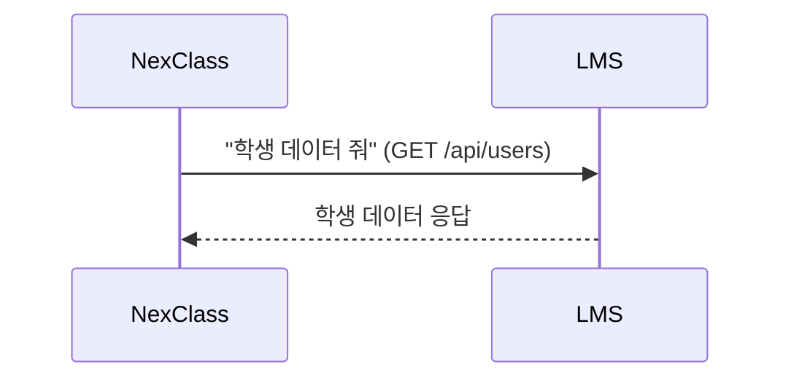
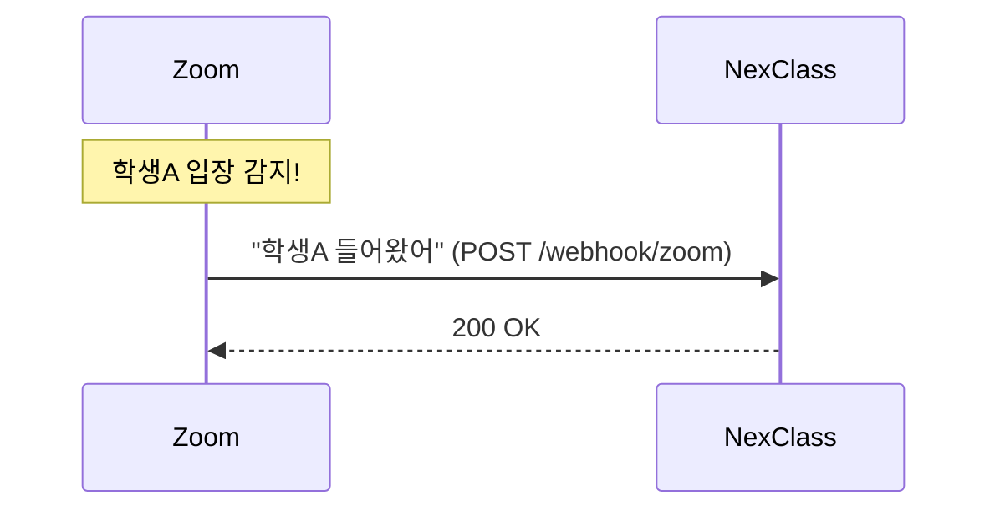
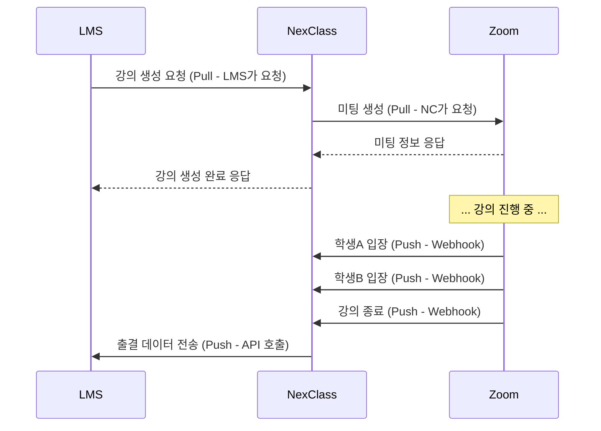

# 03. Push와 Pull - Beta

---

## 1. 두 가지 통신 방식 - "이게 뭐야?"

서버 간 데이터를 주고받는 방식은 크게 두 가지야:

!!! example "실생활 비유"
    **Pull**: 내가 냉장고 열어서 음식 꺼내는 거. 내가 필요할 때 내가 가져와.

    **Push**: 배달원이 문 앞에 택배 놓고 가는 거. 상대가 알아서 보내줘.

| 방식 | 누가 주도 | 언제 | 비유 |
|------|-----------|------|------|
| **Pull** | 데이터가 **필요한 쪽**이 요청 | 내가 원할 때 | 냉장고에서 꺼내기 |
| **Push** | 데이터가 **있는 쪽**이 전송 | 상대가 보낼 때 | 택배 배달 |

비유는 입구일 뿐. 본질 간다.

---

## 2. Pull - "내가 가져오는 것"

**NexClass가 필요해서 NexClass가 요청**한 거야. 이게 Pull.

우리 프로젝트 실전 예시:

| Pull 사례 | 요청하는 쪽 | 데이터 주는 쪽 |
|-----------|------------|---------------|
| LMS 학사 동기화 | NC가 요청 | LMS가 응답 |
| Zoom 미팅 생성 | NC가 요청 | Zoom API가 응답 |

!!! note "Pull의 특징"
    - **호출하는 쪽이 타이밍을 정한다** (내가 원할 때 요청)
    - **호출하는 쪽이 코드를 짠다** (요청 코드 작성)
    - 일반적인 **API 호출**이 Pull 방식이야

---

## 3. Push - "상대가 보내주는 것"

**Zoom이 알아서 NexClass한테 보내준** 거야. 이게 Push.

우리 프로젝트 실전 예시:

| Push 사례 | 보내는 쪽 | 받는 쪽 |
|-----------|----------|---------|
| Zoom Webhook (학생 입장) | Zoom이 보냄 | NC가 받음 |
| Zoom Webhook (강의 종료) | Zoom이 보냄 | NC가 받음 |

!!! note "Push의 특징"
    - **보내는 쪽이 타이밍을 정한다** (이벤트 발생할 때)
    - **보내는 쪽이 코드를 짠다** (알림 코드 작성)
    - **Webhook**이 Push 방식이야

---

## 4. 헷갈리는 포인트 - "NC → LMS 출결 전송은?"

!!! danger "이거 진짜 많이 헷갈린다"
    강의 끝나면 NC가 LMS한테 출결 데이터를 보내잖아.
    LMS가 달라고 안 했는데 NC가 보내는 거잖아.

    **이거 Push 아니야?**

**보는 입장에 따라 다르다.**

| 관점 | NC 입장 | LMS 입장 |
|------|---------|----------|
| NC → LMS | NC가 **보내는** 거 (Push) | LMS가 **받는** 거 (Push) |

맞아. **방향만 보면 Push야.** NC가 LMS한테 보내는 거니까.

**근데 이게 Webhook이냐는 다른 질문이야.** Push라고 다 Webhook은 아니거든.

이 차이는 05번 챕터(Webhook vs API 호출)에서 빡세게 다룬다. 지금은 이것만 기억해:

!!! warning "핵심 구분"
    **Push/Pull은 방향**이야. 누가 보내냐.

    **Webhook/API호출은 방식**이야. 어떻게 보내냐.

    방향이 Push라고 해서 자동으로 Webhook이 되는 건 아니야.

---

## 5. 우리 프로젝트 전체 흐름

| 구간 | 방향 | 방식 | Push/Pull |
|------|------|------|-----------|
| LMS → NC 강의 생성 | LMS가 요청 | API 호출 | Pull |
| NC → Zoom 미팅 생성 | NC가 요청 | API 호출 | Pull |
| Zoom → NC 학생 입장 | Zoom이 알림 | **Webhook** | Push |
| Zoom → NC 강의 종료 | Zoom이 알림 | **Webhook** | Push |
| NC → LMS 출결 전송 | NC가 전송 | API 호출 | Push |

!!! tip "마지막 줄 봐"
    NC → LMS 출결 전송은 **Push이면서 API 호출**이야.

    Push라고 다 Webhook이 아니야. 이게 핵심이야.

---

## 6. 정리

| 항목 | Pull | Push |
|------|------|------|
| 누가 주도 | 데이터 필요한 쪽 | 데이터 있는 쪽 |
| 타이밍 | 내가 정함 | 상대가 정함 |
| 예시 | API 호출로 데이터 조회 | Webhook, 알림 전송 |
| Webhook? | ❌ Pull은 Webhook 아님 | Push라고 다 Webhook은 아님 |

!!! abstract "이 챕터에서 반드시 기억할 것"
    **Push/Pull은 방향. Webhook/API호출은 방식.**

    이 둘은 다른 축이야. 섞어서 생각하면 헷갈려.

---

### 확인 문제 (4문제)

!!! question "다음 문제를 풀어봐. 답 못 하면 위에서 다시 읽어."

**Q1.** NexClass가 LMS의 학생 데이터를 가져오는 것은 Push야 Pull이야?

**Q2.** Zoom이 NexClass한테 학생 입장 정보를 보내는 것은 Push야 Pull이야?

**Q3.** NC가 LMS한테 출결 데이터를 보내는 것은 Push야 Pull이야? 그리고 Webhook이야 API 호출이야?

**Q4.** "Push이면 무조건 Webhook이다" - 맞아 틀려?

??? success "정답 보기"
    **A1.** Pull. NexClass가 필요해서 직접 요청한 거니까.

    **A2.** Push. Zoom이 알아서 보내주는 거니까.

    **A3.** Push이면서 API 호출. NC가 LMS한테 보내는 거니까 Push는 맞지만, NC가 직접 코드 짜서 호출하는 거니까 Webhook이 아니라 API 호출이야.

    **A4.** 틀려. Push는 방향이고 Webhook은 방식이야. Push이면서 API 호출인 경우도 있다 (NC → LMS 출결 전송).
