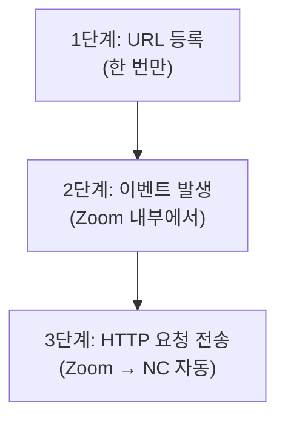
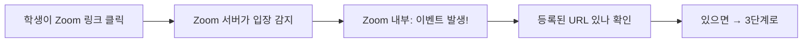
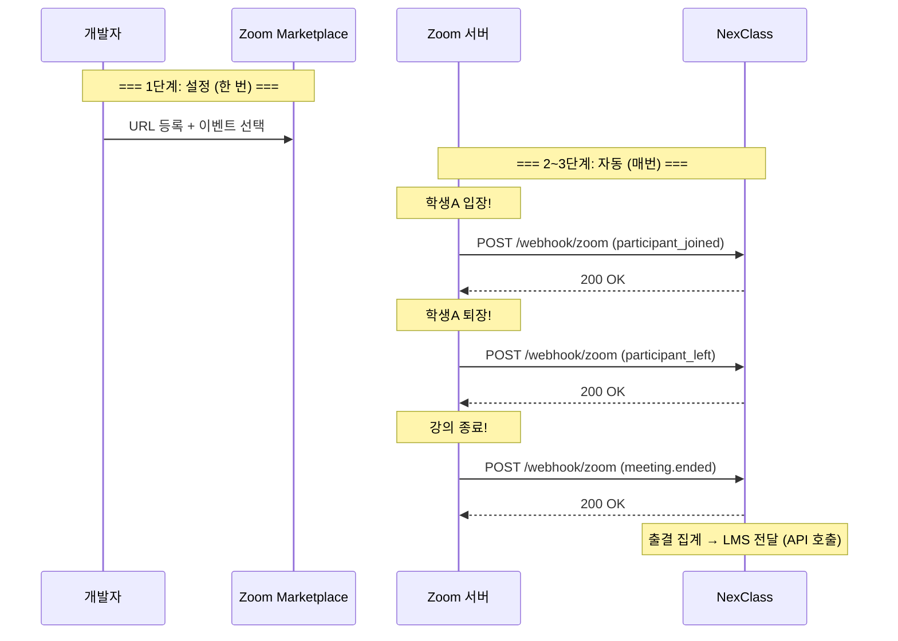

# 04. Webhook 동작 원리 - Beta

---

## 1. 3단계로 끝나 - "어떻게 돌아가?"

Webhook은 딱 3단계야:



!!! note "핵심"
    1단계는 **사람(개발자)**이 한다. 한 번만.

    2~3단계는 **Zoom이 알아서** 한다. 매번 자동으로.

---

## 2. 1단계: URL 등록 - "전화번호 알려주기"

Zoom Marketplace에 로그인하면 Webhook 설정 화면이 있어.

거기에 이렇게 입력해:

| 설정 항목 | 입력값 |
|-----------|--------|
| **Event notification endpoint URL** | `https://nc서버/webhook/zoom` |
| **Events to subscribe** | participant_joined, participant_left, meeting_ended |
| **Secret Token** | `abc123xyz` (서명 검증용) |

이게 끝이야. **코드 한 줄 안 짜도** Zoom이 보내주는 건 여기서 결정됨.

!!! warning "이게 Webhook의 핵심이야"
    URL을 등록하는 건 **Zoom의 설정 페이지**에서 한다.

    우리 NC 코드에서 하는 게 아니야. Zoom 웹사이트에서 하는 거야.

    이 "등록 시스템"이 있기 때문에 Webhook이라고 부르는 거야.

---

## 3. 2단계: 이벤트 발생 - "Zoom 안에서 뭔가 일어남"

학생이 Zoom 강의실에 들어가면, **Zoom 시스템 내부에서** 이걸 감지해.



이 과정은 전부 **Zoom 내부**에서 일어나. NC는 아무것도 모르는 상태야.

---

## 4. 3단계: HTTP 요청 전송 - "알아서 보내줌"

Zoom이 등록된 URL로 HTTP POST 요청을 보내.

```java
// 이건 Zoom이 보내는 데이터 예시 (Zoom 개발자가 만든 것)
// 우리가 짠 게 아니야!
POST https://nc서버/webhook/zoom
Content-Type: application/json

{
    "event": "meeting.participant_joined",
    "payload": {
        "object": {
            "id": "95204914252",
            "topic": "소프트웨어공학 3주차",
            "participant": {
                "user_name": "김철수",
                "join_time": "2026-03-12T09:03:00Z"
            }
        }
    }
}
```

!!! tip "잘 봐"
    이 JSON 구조는 **Zoom이 정해놓은 거야.** 우리가 정한 게 아니야.

    Zoom 공식 문서에 "participant_joined 이벤트 보내면 이런 형식이야"라고 다 명시돼 있어.

    우리는 이 형식에 맞춰서 **받는 코드만 짜면 돼.**

---

## 5. 우리가 짜는 코드 - "받는 쪽"

Zoom이 보내는 걸 받으려면 NC에 **Controller 엔드포인트**가 필요해.

```java
// NexClass 코드 - 우리가 짜는 것
// Zoom이 POST /webhook/zoom으로 보내니까, 이걸 받는 코드
@RestController
public class WebhookController {

    @PostMapping("/webhook/zoom")  // Zoom이 이 URL로 보냄
    public ResponseEntity<String> handleZoomWebhook(
            @RequestBody Map<String, Object> payload) {  // Zoom이 보낸 데이터

        String event = (String) payload.get("event");  // 어떤 이벤트인지

        if ("meeting.participant_joined".equals(event)) {
            // 학생 입장 → DB에 기록
        } else if ("meeting.participant_left".equals(event)) {
            // 학생 퇴장 → 참여 시간 계산
        } else if ("meeting.ended".equals(event)) {
            // 강의 종료 → 출결 집계 → LMS 전달
        }

        return ResponseEntity.ok("OK");  // Zoom한테 "잘 받았어" 응답
    }
}
```

!!! danger "주의"
    이 코드에서 Zoom을 호출하는 부분이 **하나도 없어.**

    `httpClient.post(...)` 같은 거 없지? 우리는 **받기만** 하니까.

    **이게 API 호출과 Webhook의 코드 레벨 차이야.**

---

## 6. API 호출 코드 vs Webhook 코드 비교

=== "API 호출 (NC가 Zoom 호출)"
    ```java
    // 우리가 Zoom한테 보내는 코드 (API 호출)
    // 미팅 생성할 때 쓰는 코드
    HttpResponse response = httpClient.post(
        "https://api.zoom.us/v2/users/me/meetings",  // Zoom URL
        meetingData  // 보낼 데이터
    );
    ```

    - 우리가 **보내는** 코드를 짬
    - URL은 **Zoom 것** (api.zoom.us)
    - **우리가 원할 때** 호출

=== "Webhook (Zoom이 NC 호출)"
    ```java
    // Zoom한테서 받는 코드 (Webhook)
    @PostMapping("/webhook/zoom")
    public ResponseEntity<String> handleWebhook(
            @RequestBody Map<String, Object> payload) {
        // 받은 데이터 처리
        return ResponseEntity.ok("OK");
    }
    ```

    - 우리가 **받는** 코드를 짬
    - URL은 **우리 것** (/webhook/zoom)
    - **Zoom이 보낼 때** 받음

!!! abstract "차이 요약"
    | | API 호출 | Webhook |
    |---|---------|---------|
    | 우리가 짜는 코드 | 보내는 코드 (`httpClient.post`) | 받는 코드 (`@PostMapping`) |
    | URL | 상대 URL을 코드에 작성 | 내 URL을 상대 설정에 등록 |
    | 타이밍 | 우리가 결정 | 상대가 결정 |

---

## 7. 전체 흐름 한눈에



---

## 8. 정리

| 단계 | 누가 | 뭘 | 언제 |
|------|------|-----|------|
| 1단계 URL 등록 | 개발자 | Zoom 설정에 NC URL 입력 | 한 번만 |
| 2단계 이벤트 감지 | Zoom | 학생 입장/퇴장/종료 감지 | 매번 자동 |
| 3단계 HTTP 전송 | Zoom | NC URL로 POST 요청 | 매번 자동 |

!!! abstract "이 챕터에서 반드시 기억할 것"
    Webhook 동작: **등록(한 번) → 감지(Zoom) → 전송(자동)**

    우리가 짜는 건 **@PostMapping으로 받는 코드**뿐이야.

---

### 확인 문제 (5문제)

!!! question "다음 문제를 풀어봐. 답 못 하면 위에서 다시 읽어."

**Q1.** Webhook의 3단계를 순서대로 말해봐.

**Q2.** URL 등록은 어디에서 하는 거야? NC 코드? Zoom 설정 페이지?

**Q3.** Zoom이 NC한테 보내는 데이터 형식(JSON 구조)을 정하는 건 누구야?

**Q4.** NC에서 Webhook을 받으려면 Spring Boot에서 뭘 만들어야 해?

**Q5.** Webhook 받는 코드에 `httpClient.post(...)` 같은 게 있어야 해?

??? success "정답 보기"
    **A1.** 1) URL 등록 (한 번, 개발자가) 2) 이벤트 발생 (Zoom 내부) 3) HTTP 요청 전송 (Zoom → NC 자동)

    **A2.** Zoom Marketplace 설정 페이지에서. NC 코드가 아니라 Zoom 웹사이트에서 한다.

    **A3.** Zoom이 정한다. Zoom 공식 문서에 명시돼 있고, 우리는 그 형식에 맞춰서 받는 코드를 짠다.

    **A4.** Controller에 `@PostMapping("/webhook/zoom")` 엔드포인트를 만들어야 한다.

    **A5.** 없어야 해. Webhook은 받는 코드만 짜면 된다. `httpClient.post`는 우리가 상대를 호출할 때(API 호출) 쓰는 거다.
