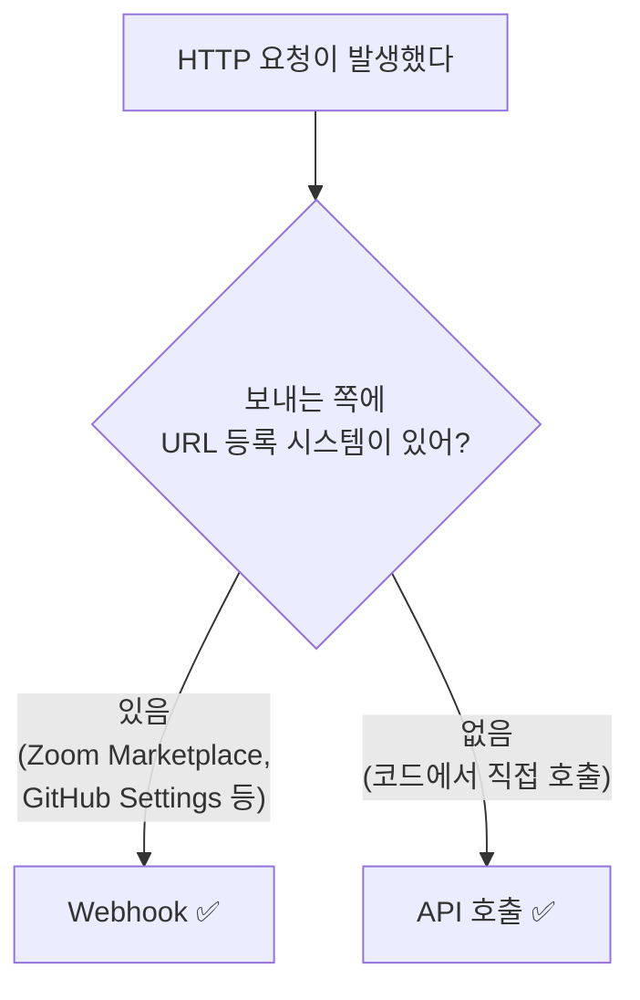

# 05. Webhook vs API 호출 - 진짜 차이 - Gamma

---

!!! danger "이 챕터가 제일 중요해"
    실제 멘토링에서 **12번 넘게** 같은 질문이 반복됐어.

    "이것도 API 호출이잖아" "왜 이건 Webhook이 아닌데" "다 같은 거 아니야?"

    여기서 전부 정리한다. 이 챕터 다 읽고도 헷갈리면 처음부터 다시 읽어.

---

## 1. 먼저 인정하자 - "기술적으로 같다"

Webhook과 API 호출은 **기술적으로 같아.** 둘 다 HTTP 요청이야.

| 항목 | API 호출 | Webhook |
|------|---------|---------|
| 프로토콜 | HTTP | HTTP |
| 메서드 | POST, GET 등 | POST |
| 데이터 형식 | JSON | JSON |
| 통신 방식 | 요청 → 응답 | 요청 → 응답 |

**차이는 기술이 아니라 "패턴"이야.** 어떤 구조로 쓰느냐가 다른 거지.

농구로 치면:

| 구분 | 설명 |
|------|------|
| 슛 | 공을 골대에 넣는 행위 (= HTTP 요청) |
| 레이업 | 슛의 한 종류 (= API 호출) |
| 덩크 | 슛의 한 종류 (= Webhook) |

덩크도 슛이야. 근데 이름이 따로 있어. 방식이 다르니까.

---

## 2. 진짜 차이 - "URL 등록 시스템"

!!! note "핵심 한 줄"
    **플랫폼이 제공하는 URL 등록 시스템을 통해 호출되면 Webhook.**

    **개발자가 코드에서 직접 호출하면 API 호출.**

=== "Webhook (Zoom → NC)"
    ```mermaid
    graph TD
        A[Zoom Marketplace 설정 페이지] -->|개발자가 URL 입력| B[URL 등록 완료]
        B --> C[이벤트 발생 시]
        C --> D[Zoom이 등록된 URL로 자동 전송]
    ```

    - Zoom에 **URL 등록 시스템(설정 페이지)**이 있음
    - 개발자가 거기에 NC URL을 등록
    - Zoom 개발자가 만든 코드가 자동으로 호출
    - **→ Webhook**

=== "API 호출 (NC → LMS)"
    ```mermaid
    graph TD
        A[NC 개발자가 코드 작성] -->|LMS URL을 코드에 직접 작성| B[코드 완성]
        B --> C[특정 시점에]
        C --> D[NC 코드가 LMS URL 직접 호출]
    ```

    - URL 등록 시스템 **없음**
    - 개발자가 코드에 LMS URL을 **직접 작성**
    - 우리가 짠 코드가 직접 호출
    - **→ API 호출**

---

## 3. 헷갈리는 질문 7가지 - "전부 답한다"

### Q1: "둘 다 URL 쓰잖아. 뭐가 달라?"

!!! tip "답"
    URL을 **어디에** 쓰느냐가 달라.

    | Webhook | API 호출 |
    |---------|---------|
    | Zoom **설정 페이지**에 URL 입력 | **코드**에 URL 작성 |
    | 설정 한 번이면 끝 | 코드에 박혀있음 |

### Q2: "NC → LMS도 이벤트(강의 종료) 때문에 자동으로 보내는 건데, 왜 Webhook 아니야?"

!!! tip "답"
    **자동이라고 다 Webhook이 아니야.**

    NC → LMS: 우리 코드에서 `http.post(lmsUrl, data)` 직접 짬 → API 호출

    Zoom → NC: Zoom 설정에 URL 등록, Zoom이 알아서 보냄 → Webhook

    **자동화의 주체가 다르다:**

    | 자동화 주체 | 방식 |
    |------------|------|
    | **우리 코드**가 자동화 | API 호출 |
    | **플랫폼 시스템**이 자동화 | Webhook |

### Q3: "보내는 코드 안 짜도 되면 Webhook이라며? LMS가 NC 강의 생성 호출할 때도 NC는 받기만 하잖아?"

!!! tip "답"
    여기서 Webhook이냐 아니냐는 **받는 쪽**이 아니라 **보내는 쪽**을 봐야 해.

    - LMS → NC 강의 생성: **LMS 개발자가 호출 코드를 직접 짬** → API 호출
    - Zoom → NC Webhook: **Zoom 플랫폼의 Webhook 시스템**이 호출 → Webhook

    NC 입장에서는 둘 다 받기만 해. 근데 **보내는 쪽의 방식**이 다른 거야.

### Q4: "Webhook도 결국 API 호출이잖아?"

!!! tip "답"
    **맞아. Webhook은 API 호출의 한 종류야.**

    ```mermaid
    graph TD
        A[API 호출] --> B[일반 API 호출<br/>개발자가 코드로 직접 호출]
        A --> C[Webhook<br/>플랫폼 시스템이 자동 호출]
    ```

    덩크도 슛이듯, Webhook도 API 호출이야. 근데 패턴이 달라서 이름이 따로 있어.

### Q5: "내부 서비스끼리도 Webhook 된다며? 그럼 NC → LMS도 Webhook 아니야?"

!!! tip "답"
    내부든 외부든 **기준은 같아:**

    - URL 등록 시스템 만들었으면 → Webhook
    - 코드에서 직접 호출하면 → API 호출

    NC가 URL 등록 시스템 만들어서 LMS가 거기 등록하게 했으면? 그건 Webhook.

    우리는 그런 거 안 만들고 코드에서 직접 호출해. 그래서 API 호출.

### Q6: "소셜 로그인(네이버 로그인)도 Webhook이야?"

!!! tip "답"
    **아니야.** 소셜 로그인은 **OAuth**라는 다른 패턴이야.

    | 구분 | Webhook | 소셜 로그인 |
    |------|---------|------------|
    | 통신 | 서버 → 서버 | 브라우저 리다이렉트 |
    | 트리거 | 시스템 이벤트 | 사용자 클릭 |
    | 목적 | 이벤트 알림 | 인증/인가 |

### Q7: "스케줄링 API 호출은?"

!!! tip "답"
    **일반 API 호출이야.** 우리가 "매일 9시에 호출해라"고 코드 짠 거니까.

    - 스케줄링: **우리가** 타이밍 정하고 **우리 코드**가 호출 → API 호출
    - Webhook: **상대가** 이벤트 감지하고 **상대 시스템**이 호출 → Webhook

---

## 4. 판별 플로우차트 - "이거 Webhook이야 API 호출이야?"

헷갈릴 때 이 순서대로 물어봐:



!!! abstract "외우기 쉬운 버전"
    **"보내는 쪽에 URL 등록하는 설정 페이지가 있어?"**

    - 있으면 → Webhook
    - 없으면 → API 호출

---

## 5. 실전 판별 연습

| 상황 | URL 등록 시스템 있어? | 결론 |
|------|----------------------|------|
| Zoom → NC 학생 입장 | Zoom Marketplace에 있음 | **Webhook** |
| NC → LMS 출결 전송 | 없음. 코드에서 직접 호출 | **API 호출** |
| GitHub → Jenkins 빌드 | GitHub Settings에 있음 | **Webhook** |
| 크론잡으로 API 호출 | 없음. 스케줄러가 직접 호출 | **API 호출** |
| Stripe → 내 서버 결제 알림 | Stripe Dashboard에 있음 | **Webhook** |
| LMS → NC 강의 생성 | 없음. LMS 코드에서 직접 호출 | **API 호출** |

---

## 6. 왜 이름을 따로 붙였을까?

!!! question "생각해봐"
    기술적으로 같은데 왜 굳이 다른 이름을 붙였을까?

**설계 패턴이 다르기 때문이야.**

| 항목 | 일반 API 호출 | Webhook |
|------|-------------|---------|
| 결합도 | 높음 (URL이 코드에 박힘) | 낮음 (URL을 등록/해제 가능) |
| 유연성 | 코드 수정해야 URL 변경 | 설정에서 URL 변경 가능 |
| 확장성 | 새 대상 추가 = 코드 수정 | 새 대상 = URL 등록만 |
| 주체 | 호출자가 제어 | 이벤트 발생자가 제어 |

Webhook은 **이벤트 기반 아키텍처**에서 핵심 패턴이야. 마이크로서비스, 실시간 알림, 외부 연동에서 표준으로 쓰여.

---

## 7. 정리

| 항목 | API 호출 | Webhook |
|------|---------|---------|
| URL 위치 | 코드에 작성 | 설정 페이지에 등록 |
| 호출 코드 | 내가 짬 | 플랫폼이 만든 거 |
| 타이밍 | 내가 정함 | 이벤트 발생 시 자동 |
| 기술 | HTTP 요청 | HTTP 요청 (같음) |
| 관계 | 상위 개념 | API 호출의 한 종류 |

!!! abstract "이 챕터에서 반드시 기억할 것"
    **Webhook과 API 호출은 기술적으로 같아. 둘 다 HTTP 요청이야.**

    **차이는 패턴이야: URL 등록 시스템을 통한 자동 호출이면 Webhook, 코드에서 직접 호출하면 API 호출.**

    헷갈리면 딱 하나만 물어봐: **"보내는 쪽에 URL 등록하는 설정 페이지가 있어?"**

---

### 확인 문제 (5문제)

!!! question "다음 문제를 풀어봐. 답 못 하면 위에서 다시 읽어."

**Q1.** Webhook과 API 호출의 기술적 차이는 뭐야?

**Q2.** NC가 강의 종료 후 LMS에 출결 데이터를 자동 전송한다. 이건 Webhook이야 API 호출이야? 이유는?

**Q3.** Webhook인지 API 호출인지 판별하는 질문 한 가지는?

**Q4.** "Webhook은 API 호출이다" - 맞아 틀려?

**Q5.** GitHub에서 코드를 Push하면 Jenkins가 자동 빌드된다. GitHub → Jenkins 통신은 Webhook이야 API 호출이야? 이유는?

??? success "정답 보기"
    **A1.** 기술적 차이는 없다. 둘 다 HTTP 요청. 차이는 패턴(URL 등록 시스템 유무)이다.

    **A2.** API 호출. NC 코드에서 LMS URL을 직접 호출하는 거지, URL 등록 시스템을 통한 게 아니니까.

    **A3.** "보내는 쪽에 URL 등록하는 설정 페이지가 있어?"

    **A4.** 맞다. Webhook은 API 호출의 한 종류(하위 개념)다. 덩크가 슛의 한 종류이듯.

    **A5.** Webhook. GitHub Settings에 URL 등록하는 Webhook 설정 페이지가 있고, Push 이벤트 발생 시 GitHub이 등록된 URL(Jenkins)로 자동 호출하니까.
