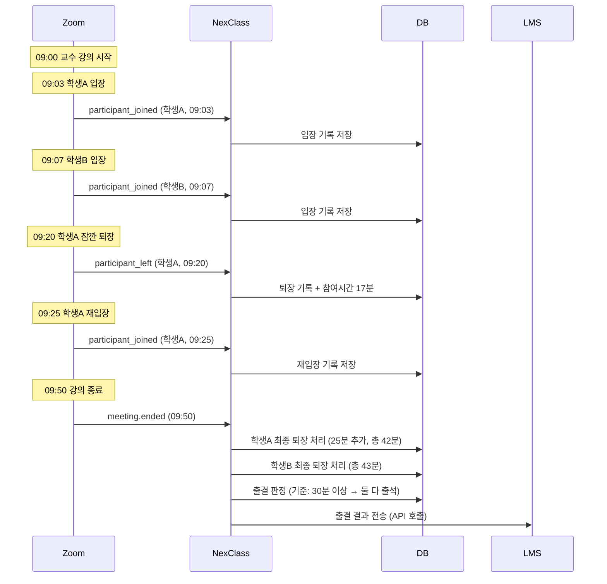

# 06. Zoom Webhook 이벤트 - Gamma

---

## 1. Zoom이 보내주는 이벤트 - "뭘 알려주는 건데?"

Zoom Webhook은 이벤트 종류가 많아. 근데 우리 NexClass에서 쓸 건 **3개**야.

| 이벤트 | 언제 발생 | 우리한테 필요한 이유 |
|--------|-----------|---------------------|
| `meeting.participant_joined` | 학생이 강의실 **입장** | 입장 시간 기록 |
| `meeting.participant_left` | 학생이 강의실 **퇴장** | 퇴장 시간 기록 → 참여 시간 계산 |
| `meeting.ended` | 강의가 **종료** | 출결 집계 → LMS 전달 |

!!! warning "왜 이 3개만?"
    YAGNI (You Ain't Gonna Need It). 필요 없는 거 구현하지 마.

    Zoom Webhook 이벤트는 수십 가지지만, 출결 관리에 필요한 건 이 3개뿐이야.

---

## 2. participant_joined - "학생 입장"

학생이 Zoom 강의실에 들어오면 Zoom이 이 데이터를 보내:

```json
{
    "event": "meeting.participant_joined",
    "event_ts": 1710223380000,
    "payload": {
        "account_id": "dyrvQZrBQjqqViaPYcOWFw",
        "object": {
            "id": "95204914252",
            "uuid": "abc123==",
            "topic": "소프트웨어공학 3주차",
            "host_id": "kren3@knu10.or.kr",
            "participant": {
                "user_id": "16778240",
                "user_name": "김철수",
                "email": "",
                "join_time": "2026-03-12T09:03:00Z",
                "participant_user_id": ""
            }
        }
    }
}
```

!!! tip "우리가 여기서 꺼내야 하는 것"
    | 필드 | 용도 |
    |------|------|
    | `object.id` | 어느 미팅인지 (lessonCd 매핑) |
    | `participant.user_name` | 학생 이름 (Zoom에서 &uname으로 설정한 값) |
    | `participant.join_time` | 입장 시간 |

!!! warning "주의: user_name의 정체"
    우리 NexClass에서 join-url 생성할 때 `&uname=학생이름` 파라미터를 붙여.

    이 uname이 Zoom에서 `user_name`으로 들어와. 근데 학생이 직접 바꿀 수도 있어서
    100% 신뢰하면 안 돼. 추후 userCd 매칭 로직이 필요해.

---

## 3. participant_left - "학생 퇴장"

학생이 강의실에서 나가면:

```json
{
    "event": "meeting.participant_left",
    "event_ts": 1710226980000,
    "payload": {
        "account_id": "dyrvQZrBQjqqViaPYcOWFw",
        "object": {
            "id": "95204914252",
            "uuid": "abc123==",
            "topic": "소프트웨어공학 3주차",
            "host_id": "kren3@knu10.or.kr",
            "participant": {
                "user_id": "16778240",
                "user_name": "김철수",
                "email": "",
                "join_time": "2026-03-12T09:03:00Z",
                "leave_time": "2026-03-12T09:50:00Z"
            }
        }
    }
}
```

!!! tip "핵심: 참여 시간 계산"
    ```
    참여 시간 = leave_time - join_time
             = 09:50 - 09:03
             = 47분
    ```

    이 47분을 DB에 저장해야 해. 출결 판정 기준(예: 50분 중 30분 이상)과 비교할 거니까.

!!! danger "엣지 케이스"
    학생이 들어갔다 나갔다 반복하면?

    ```
    09:03 입장 → 09:20 퇴장 (17분)
    09:25 입장 → 09:50 퇴장 (25분)
    총 참여 시간 = 42분
    ```

    `participant_joined`와 `participant_left`가 **쌍으로** 올 수 있어.
    각 세션별로 기록하고, 나중에 합산해야 해.

---

## 4. meeting.ended - "강의 종료"

교수가 강의를 끝내면:

```json
{
    "event": "meeting.ended",
    "event_ts": 1710227400000,
    "payload": {
        "account_id": "dyrvQZrBQjqqViaPYcOWFw",
        "object": {
            "id": "95204914252",
            "uuid": "abc123==",
            "topic": "소프트웨어공학 3주차",
            "host_id": "kren3@knu10.or.kr",
            "start_time": "2026-03-12T09:00:00Z",
            "end_time": "2026-03-12T09:50:00Z",
            "duration": 50
        }
    }
}
```

!!! note "이 이벤트가 오면 해야 할 것"
    1. 아직 `participant_left`가 안 온 학생들 → 종료 시간으로 퇴장 처리
    2. 모든 학생의 참여 시간 합산
    3. 출결 판정 (기준 시간 이상이면 출석)
    4. **LMS에 출결 결과 전송** (이건 API 호출)

---

## 5. 이벤트 흐름 시나리오 - "실제로 어떻게 날아와?"

소프트웨어공학 3주차 강의 시나리오:



---

## 6. 우리 프로젝트에서의 매핑 - "어떤 테이블에 저장해?"

| 이벤트 | 테이블 | 저장 내용 |
|--------|--------|-----------|
| participant_joined | TB_NEXCLASS_JOIN_LOG (미생성) | meeting_id, user_name, join_time |
| participant_left | TB_NEXCLASS_JOIN_LOG (미생성) | leave_time, duration 업데이트 |
| meeting.ended | TB_NEXCLASS_ATTENDANCE | 출결 판정 결과 |

!!! warning "JOIN_LOG 테이블이 아직 없어"
    CLAUDE.md에도 "미생성"으로 돼 있어. Phase 4-B에서 만들어야 해.

    이 테이블은 **학생별 입장/퇴장 로그**를 저장하는 곳이야.
    한 학생이 여러 번 들어갔다 나갈 수 있으니까 **1:N 관계**야.

---

## 7. 정리

| 이벤트 | 발생 시점 | NC가 할 일 | 저장 위치 |
|--------|-----------|-----------|-----------|
| participant_joined | 학생 입장 | 입장 시간 기록 | JOIN_LOG |
| participant_left | 학생 퇴장 | 퇴장 시간 + 참여시간 계산 | JOIN_LOG |
| meeting.ended | 강의 종료 | 집계 + 출결 판정 + LMS 전달 | ATTENDANCE |

!!! abstract "이 챕터에서 반드시 기억할 것"
    우리한테 필요한 Zoom Webhook 이벤트는 **3개**: joined, left, ended.

    joined/left는 **쌍으로** 온다. 학생이 여러 번 드나들 수 있다.

    ended가 오면 **최종 집계 + LMS 전달**한다.

---

### 확인 문제 (5문제)

!!! question "다음 문제를 풀어봐. 답 못 하면 위에서 다시 읽어."

**Q1.** NexClass에서 쓰는 Zoom Webhook 이벤트 3가지는?

**Q2.** 학생이 09:10에 입장하고 09:45에 퇴장했다. 참여 시간은?

**Q3.** 학생이 09:10 입장 → 09:30 퇴장 → 09:35 재입장 → 09:50 퇴장. 총 참여 시간은?

**Q4.** meeting.ended 이벤트가 오면 NC가 해야 할 일 4가지는?

**Q5.** participant_joined 데이터에서 `user_name`을 100% 신뢰하면 안 되는 이유는?

??? success "정답 보기"
    **A1.** meeting.participant_joined, meeting.participant_left, meeting.ended

    **A2.** 35분 (09:45 - 09:10)

    **A3.** 20분(09:30-09:10) + 15분(09:50-09:35) = 35분. 세션별로 계산 후 합산.

    **A4.** (1) 아직 퇴장 안 한 학생 종료시간으로 퇴장 처리 (2) 전체 참여시간 합산 (3) 출결 판정 (4) LMS에 출결 결과 전송 (API 호출)

    **A5.** join-url에서 &uname 파라미터로 설정하지만, 학생이 Zoom에서 직접 이름을 바꿀 수 있기 때문. 추후 userCd 매칭 로직이 필요하다.
