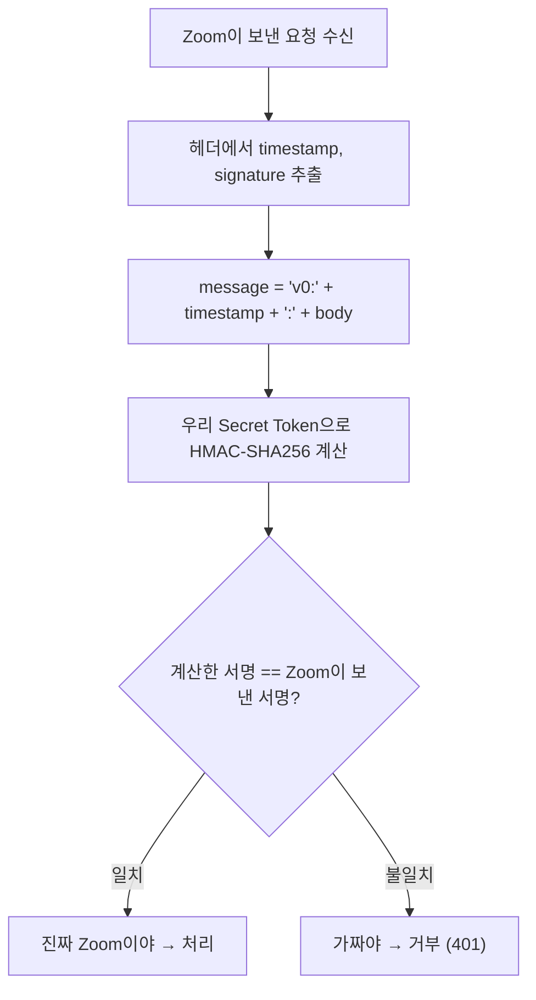

# 07. Webhook 보안과 설계 - Delta

---

## 1. 왜 보안이 필요해? - "누가 보낸 건지 어떻게 알아?"

NC 서버에 `/webhook/zoom` 엔드포인트를 만들었어. 근데 이 URL을 아는 사람이 누구야?

!!! danger "문제"
    URL만 알면 **아무나 가짜 데이터를 보낼 수 있어.**

    ```
    해커: POST /webhook/zoom
    {
        "event": "meeting.participant_joined",
        "participant": { "user_name": "가짜학생" }
    }
    ```

    이걸 그대로 DB에 저장하면? 없는 학생이 출석 처리돼.

그래서 **"이거 진짜 Zoom이 보낸 거 맞아?"**를 확인해야 해. 이걸 **서명 검증**이라고 해.

---

## 2. 서명 검증 (HMAC-SHA256) - "진짜인지 확인하는 법"

Zoom은 Webhook 보낼 때 HTTP 헤더에 **서명값**을 같이 보내.

| 헤더 | 내용 |
|------|------|
| `x-zm-request-timestamp` | 요청 시간 |
| `x-zm-signature` | 서명값 (HMAC-SHA256) |

검증 방법:



```java
// 서명 검증 코드 예시
public boolean verifyWebhookSignature(
        String requestBody,      // Zoom이 보낸 JSON 원문
        String timestamp,        // x-zm-request-timestamp 헤더
        String signature) {      // x-zm-signature 헤더

    // 1. 검증할 메시지 조합
    String message = "v0:" + timestamp + ":" + requestBody;

    // 2. Secret Token으로 HMAC-SHA256 계산
    Mac mac = Mac.getInstance("HmacSHA256");
    mac.init(new SecretKeySpec(
        secretToken.getBytes(), "HmacSHA256"  // Zoom에서 발급받은 Secret Token
    ));
    String computedHash = "v0=" + Hex.encodeHexString(
        mac.doFinal(message.getBytes(StandardCharsets.UTF_8))
    );

    // 3. 비교
    return computedHash.equals(signature);  // 일치하면 진짜
}
```

!!! note "Secret Token은 어디서 나와?"
    Zoom Marketplace에서 Webhook App 만들 때 **Zoom이 발급해줘.**

    이걸 NC 서버의 설정 파일(application.yml)에 저장해둬야 해.

    **Zoom과 NC만 아는 비밀 키**라서, 이걸로 검증하면 진위 판별 가능.

---

## 3. 재시도 (Retry) - "NC가 죽어있으면?"

NC 서버가 잠깐 죽어있을 때 Zoom이 Webhook을 보내면? 응답이 안 가겠지.

!!! note "Zoom의 재시도 정책"
    Zoom은 응답을 못 받으면 **자동으로 재시도**해.

    | 재시도 횟수 | 간격 |
    |------------|------|
    | 1차 | 약 5분 후 |
    | 2차 | 약 15분 후 |
    | 3차 | 약 30분 후 |

    3번까지 재시도하고, 그래도 실패하면 **알림 비활성화** 될 수 있어.

**우리가 해야 할 것:**

- 200 응답을 **빨리** 반환하기 (3초 이내 권장)
- 무거운 처리(DB 저장, LMS 전달)는 **비동기**로 하기

```java
// 좋은 예: 빨리 응답하고 나중에 처리
@PostMapping("/webhook/zoom")
public ResponseEntity<String> handleWebhook(@RequestBody String body) {
    // 1. 서명 검증 (빠름)
    if (!verifySignature(body)) {
        return ResponseEntity.status(401).body("Unauthorized");
    }

    // 2. 일단 200 응답 (Zoom한테 "잘 받았어")
    // 3. 비동기로 실제 처리
    asyncProcessor.process(body);  // 별도 스레드에서 DB 저장 등

    return ResponseEntity.ok("OK");
}
```

---

## 4. 멱등성 (Idempotency) - "같은 거 두 번 오면?"

Zoom이 재시도해서 **같은 이벤트가 두 번** 올 수 있어.

!!! danger "이러면 안 돼"
    ```
    participant_joined (학생A, 09:03) → DB에 기록 ✅
    participant_joined (학생A, 09:03) → DB에 또 기록 ❌ (중복!)
    ```

**멱등성**: 같은 요청을 여러 번 처리해도 결과가 같아야 한다.

```java
// 멱등성 보장 방법: 중복 체크
public void handleParticipantJoined(WebhookPayload payload) {
    String meetingId = payload.getMeetingId();
    String userName = payload.getUserName();
    String joinTime = payload.getJoinTime();

    // 이미 같은 기록이 있는지 확인
    boolean exists = joinLogRepository.existsByMeetingIdAndUserNameAndJoinTime(
        meetingId, userName, joinTime
    );

    if (!exists) {
        joinLogRepository.save(new JoinLog(meetingId, userName, joinTime));
    }
    // 이미 있으면 무시 (멱등성 보장)
}
```

---

## 5. Webhook App 종류 - "Zoom에서 뭘 만들어야 해?"

Zoom Marketplace에서 App을 만들어야 Webhook을 받을 수 있어.

| App 종류 | 설명 | 우리한테 맞는 거 |
|----------|------|-----------------|
| **Server-to-Server OAuth** | 서버 간 통신 (이미 사용 중) | ⚠️ Webhook 추가 가능 |
| **Webhook Only** | Webhook만 받는 앱 | ✅ 가장 간단 |
| **General App** | OAuth + API + Webhook 전부 | 오버스펙 |

!!! tip "우리 상황"
    우리는 이미 **S2S OAuth App**이 있어 (미팅 생성용).

    여기에 Webhook 이벤트를 추가 등록하면 돼. 새로 만들 필요 없어.

---

## 6. URL Validation - "Zoom이 진짜 우리 서버인지 확인"

Zoom이 Webhook URL을 등록할 때, **"이 URL이 진짜 살아있는 서버야?"** 확인해.

방법: Zoom이 `challenge` 값을 보내면 우리가 그걸 암호화해서 돌려보내야 해.

```java
// URL Validation 처리 (최초 등록 시 한 번만)
@PostMapping("/webhook/zoom")
public ResponseEntity<?> handleWebhook(@RequestBody Map<String, Object> body) {

    // URL Validation 요청인지 확인
    if (body.containsKey("event") &&
        "endpoint.url_validation".equals(body.get("event"))) {

        Map<String, Object> payload = (Map<String, Object>) body.get("payload");
        String plainToken = (String) payload.get("plainToken");

        // plainToken을 Secret Token으로 HMAC-SHA256 암호화
        String encryptedToken = hmacSha256(plainToken, secretToken);

        // Zoom한테 돌려보냄
        Map<String, String> response = new HashMap<>();
        response.put("plainToken", plainToken);
        response.put("encryptedToken", encryptedToken);
        return ResponseEntity.ok(response);
    }

    // 일반 Webhook 이벤트 처리
    // ...
}
```

!!! note "이건 언제 발생해?"
    Zoom Marketplace에서 URL 등록하고 **Validate 버튼** 누를 때 한 번만.

    이걸 통과해야 Webhook이 활성화돼.

---

## 7. 설계 체크리스트

Webhook 구현할 때 반드시 챙겨야 할 것들:

| 항목 | 설명 | 구현 방법 |
|------|------|-----------|
| **서명 검증** | 진짜 Zoom인지 확인 | HMAC-SHA256 |
| **빠른 응답** | 3초 이내 200 반환 | 비동기 처리 |
| **멱등성** | 중복 처리 방지 | DB 중복 체크 |
| **URL Validation** | 최초 등록 시 검증 | challenge-response |
| **에러 처리** | 잘못된 데이터 대응 | try-catch + 로그 |
| **로깅** | 모든 Webhook 요청 기록 | 디버깅용 |

---

## 8. 정리

| 보안 요소 | 왜 필요해? | 어떻게? |
|-----------|-----------|---------|
| 서명 검증 | 가짜 요청 차단 | HMAC-SHA256으로 진위 확인 |
| 재시도 대응 | 서버 다운 시 데이터 유실 방지 | 빠른 응답 + 비동기 처리 |
| 멱등성 | 중복 데이터 방지 | DB 중복 체크 |
| URL Validation | Zoom이 우리 서버 확인 | challenge-response |

!!! abstract "이 챕터에서 반드시 기억할 것"
    Webhook은 **URL이 공개되니까 보안이 필수**야.

    서명 검증(HMAC-SHA256)으로 진짜 Zoom인지 확인하고,
    멱등성으로 중복 처리를 막아야 해.

---

### 확인 문제 (5문제)

!!! question "다음 문제를 풀어봐. 답 못 하면 위에서 다시 읽어."

**Q1.** Webhook URL을 아는 해커가 가짜 데이터를 보내면 어떻게 막아?

**Q2.** HMAC-SHA256 서명 검증에 필요한 것 3가지는?

**Q3.** Zoom이 Webhook을 보냈는데 NC가 응답을 못 하면 어떻게 돼?

**Q4.** 멱등성이 왜 필요해?

**Q5.** Zoom이 Webhook URL 등록할 때 보내는 `endpoint.url_validation` 이벤트에서 NC가 해야 할 것은?

??? success "정답 보기"
    **A1.** 서명 검증(HMAC-SHA256). Zoom이 보낸 서명값과 우리가 계산한 서명값을 비교해서 일치하지 않으면 401로 거부.

    **A2.** (1) 요청 본문(body) (2) 타임스탬프(x-zm-request-timestamp) (3) Secret Token(Zoom에서 발급받은 비밀 키)

    **A3.** Zoom이 자동으로 재시도한다. 약 5분, 15분, 30분 간격으로 3번. 계속 실패하면 Webhook이 비활성화될 수 있다.

    **A4.** Zoom이 재시도해서 같은 이벤트가 두 번 올 수 있기 때문. 멱등성이 없으면 학생 입장 기록이 중복으로 저장된다.

    **A5.** Zoom이 보낸 plainToken을 Secret Token으로 HMAC-SHA256 암호화해서 encryptedToken과 함께 응답으로 돌려보내야 한다.
