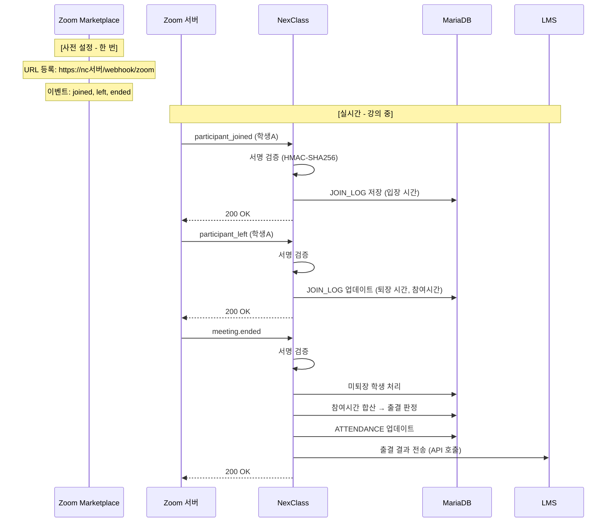
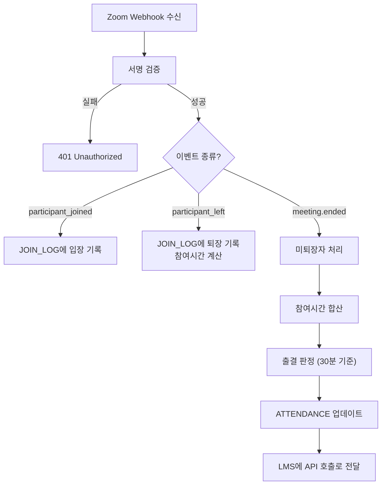

# 08. NexClass 실전 구현 - Omega

---

!!! danger "이 챕터는 실전이야"
    지금까지 배운 거 전부 합쳐서 **NexClass에서 실제로 Webhook을 받는 구조**를 설계한다.

    개념만 알면 Lv2. 실전에 적용해야 Lv3.

---

## 1. 전체 아키텍처 - "큰 그림부터"



---

## 2. 필요한 테이블 - "JOIN_LOG"

기존 테이블(TB_NEXCLASS_ATTENDANCE)은 **최종 출결 결과**를 저장해.

새로 만들 테이블(TB_NEXCLASS_JOIN_LOG)은 **입장/퇴장 로그**를 저장해.

```sql
CREATE TABLE TB_NEXCLASS_JOIN_LOG (
    log_id        BIGINT AUTO_INCREMENT PRIMARY KEY,
    meeting_id    VARCHAR(20) NOT NULL COMMENT 'Zoom 미팅 ID',
    lesson_cd     VARCHAR(50) COMMENT 'NexClass 강의 코드 (매핑)',
    user_name     VARCHAR(100) COMMENT 'Zoom 참여자 이름',
    user_cd       VARCHAR(50) COMMENT '학생 학번 (매핑 후)',
    join_time     DATETIME NOT NULL COMMENT '입장 시간',
    leave_time    DATETIME COMMENT '퇴장 시간',
    duration      INT DEFAULT 0 COMMENT '참여 시간(분)',
    event_id      VARCHAR(100) COMMENT 'Zoom 이벤트 고유ID (멱등성)',
    created_at    DATETIME DEFAULT CURRENT_TIMESTAMP,
    INDEX idx_meeting_id (meeting_id),
    INDEX idx_lesson_cd (lesson_cd),
    INDEX idx_user_cd (user_cd)
) ENGINE=InnoDB DEFAULT CHARSET=utf8mb4 COMMENT='Zoom 참여 로그';
```

!!! tip "왜 ATTENDANCE와 분리해?"
    | 테이블 | 역할 | 데이터 성격 |
    |--------|------|-------------|
    | JOIN_LOG | 입장/퇴장 매 건 기록 | 로그 (여러 건) |
    | ATTENDANCE | 최종 출결 결과 | 결과 (학생당 1건) |

    학생이 3번 들어갔다 나가면 JOIN_LOG에 3건, ATTENDANCE에 1건.

---

## 3. Controller - "받는 코드"

```java
@RestController
@RequestMapping("/webhook")
@Slf4j
public class WebhookController {

    private final WebhookService webhookService;

    @Value("${zoom.webhook.secret-token}")
    private String secretToken;  // application.yml에서 주입

    public WebhookController(WebhookService webhookService) {
        this.webhookService = webhookService;
    }

    @PostMapping("/zoom")
    public ResponseEntity<?> handleZoomWebhook(
            @RequestBody String rawBody,  // 서명 검증용 원문
            @RequestHeader(value = "x-zm-request-timestamp", required = false) String timestamp,
            @RequestHeader(value = "x-zm-signature", required = false) String signature) {

        // JSON 파싱
        Map<String, Object> body = parseJson(rawBody);
        String event = (String) body.get("event");

        // 1. URL Validation (최초 등록 시)
        if ("endpoint.url_validation".equals(event)) {
            return handleUrlValidation(body);
        }

        // 2. 서명 검증
        if (!verifySignature(rawBody, timestamp, signature)) {
            log.warn("Webhook 서명 검증 실패");
            return ResponseEntity.status(401).body("Unauthorized");
        }

        // 3. 이벤트 처리 (비동기)
        log.info("Zoom Webhook 수신: {}", event);
        webhookService.processEventAsync(body);

        // 4. 빠르게 200 응답
        return ResponseEntity.ok("OK");
    }
}
```

!!! note "코드 포인트"
    - `@RequestBody String rawBody`: JSON을 String으로 받는 이유는 **서명 검증**할 때 원문이 필요하니까
    - `processEventAsync`: 비동기로 처리해서 **3초 이내 응답** 보장
    - URL Validation은 서명 검증 **전에** 처리 (최초 등록 시에는 서명이 없을 수 있음)

---

## 4. Service - "처리 로직"

```java
@Service
@Slf4j
public class WebhookService {

    private final JoinLogRepository joinLogRepository;
    private final AttendanceRepository attendanceRepository;
    private final LessonRepository lessonRepository;

    // 비동기 처리
    @Async
    public void processEventAsync(Map<String, Object> body) {
        String event = (String) body.get("event");
        Map<String, Object> payload = getPayload(body);

        switch (event) {
            case "meeting.participant_joined":
                handleParticipantJoined(payload);
                break;
            case "meeting.participant_left":
                handleParticipantLeft(payload);
                break;
            case "meeting.ended":
                handleMeetingEnded(payload);
                break;
            default:
                log.info("처리하지 않는 이벤트: {}", event);
        }
    }

    private void handleParticipantJoined(Map<String, Object> payload) {
        // 1. 데이터 추출
        String meetingId = extractMeetingId(payload);
        String userName = extractUserName(payload);
        String joinTime = extractJoinTime(payload);

        // 2. 멱등성 체크 (중복 방지)
        if (joinLogRepository.existsByMeetingIdAndUserNameAndJoinTime(
                meetingId, userName, joinTime)) {
            log.info("중복 이벤트 무시: {} {} {}", meetingId, userName, joinTime);
            return;
        }

        // 3. JOIN_LOG 저장
        JoinLog joinLog = new JoinLog();
        joinLog.setMeetingId(meetingId);
        joinLog.setUserName(userName);
        joinLog.setJoinTime(parseDateTime(joinTime));
        joinLog.setLessonCd(findLessonCdByMeetingId(meetingId));

        joinLogRepository.save(joinLog);
        log.info("학생 입장 기록: {} - {}", meetingId, userName);
    }

    private void handleParticipantLeft(Map<String, Object> payload) {
        // 1. 데이터 추출
        String meetingId = extractMeetingId(payload);
        String userName = extractUserName(payload);
        String leaveTime = extractLeaveTime(payload);

        // 2. 가장 최근 입장 기록 찾기 (퇴장 시간이 없는 것)
        JoinLog joinLog = joinLogRepository
            .findTopByMeetingIdAndUserNameAndLeaveTimeIsNull(
                meetingId, userName);

        if (joinLog != null) {
            // 3. 퇴장 시간 + 참여 시간 계산
            joinLog.setLeaveTime(parseDateTime(leaveTime));
            joinLog.setDuration(calculateMinutes(
                joinLog.getJoinTime(), joinLog.getLeaveTime()));

            joinLogRepository.save(joinLog);
            log.info("학생 퇴장 기록: {} - {} ({}분)",
                meetingId, userName, joinLog.getDuration());
        }
    }

    private void handleMeetingEnded(Map<String, Object> payload) {
        String meetingId = extractMeetingId(payload);
        String endTime = extractEndTime(payload);

        // 1. 아직 퇴장 안 한 학생들 → 종료 시간으로 퇴장 처리
        List<JoinLog> openLogs = joinLogRepository
            .findByMeetingIdAndLeaveTimeIsNull(meetingId);
        for (JoinLog log : openLogs) {
            log.setLeaveTime(parseDateTime(endTime));
            log.setDuration(calculateMinutes(log.getJoinTime(), log.getLeaveTime()));
            joinLogRepository.save(log);
        }

        // 2. 학생별 총 참여 시간 합산
        String lessonCd = findLessonCdByMeetingId(meetingId);
        Map<String, Integer> totalDurations = joinLogRepository
            .findByMeetingId(meetingId).stream()
            .collect(Collectors.groupingBy(
                JoinLog::getUserName,
                Collectors.summingInt(JoinLog::getDuration)));

        // 3. 출결 판정 + ATTENDANCE 업데이트
        for (Map.Entry<String, Integer> entry : totalDurations.entrySet()) {
            String userName = entry.getKey();
            int totalMinutes = entry.getValue();
            String status = totalMinutes >= 30 ? "P" : "A";  // 30분 기준

            updateAttendance(lessonCd, userName, totalMinutes, status);
        }

        // 4. LMS에 출결 결과 전송 (API 호출)
        sendAttendanceToLms(lessonCd);

        log.info("강의 종료 처리 완료: {}", meetingId);
    }
}
```

---

## 5. 데이터 흐름 요약



---

## 6. application.yml 설정

```yaml
# Zoom Webhook 설정
zoom:
  webhook:
    secret-token: ${ZOOM_WEBHOOK_SECRET_TOKEN}  # 환경변수로 관리
  s2s:
    account-id: dyrvQZrBQjqqViaPYcOWFw
    client-id: ${ZOOM_CLIENT_ID}
    client-secret: ${ZOOM_CLIENT_SECRET}

# LMS 출결 전달 설정
lms:
  api:
    base-url: https://lms-server
    attendance-endpoint: /vc/api/sync/attendance
```

!!! danger "Secret Token은 절대 코드에 하드코딩하지 마"
    환경변수(`${ZOOM_WEBHOOK_SECRET_TOKEN}`)로 관리해야 해.

    Git에 올라가면 해커가 가짜 Webhook 보낼 수 있어.

---

## 7. 남은 구현 체크리스트

| 순서 | 작업 | 상태 |
|------|------|------|
| 1 | Zoom Marketplace에서 Webhook 이벤트 등록 | 미완 |
| 2 | TB_NEXCLASS_JOIN_LOG 테이블 생성 | 미완 |
| 3 | JoinLog Entity + Repository | 미완 |
| 4 | WebhookController (서명 검증 + URL Validation) | 미완 |
| 5 | WebhookService (이벤트별 처리 로직) | 미완 |
| 6 | AttendanceService (출결 집계) | 미완 |
| 7 | LMS 출결 전달 API 호출 | 미완 |
| 8 | 수동 갱신 API (교수용) | 미완 |

---

## 8. 정리

| 구성 요소 | 역할 |
|-----------|------|
| WebhookController | Zoom 요청 수신 + 서명 검증 + 빠른 응답 |
| WebhookService | 이벤트별 비동기 처리 |
| JoinLog | 입장/퇴장 로그 (세션 단위) |
| Attendance | 최종 출결 결과 (학생 단위) |
| LMS API 호출 | 출결 결과 전달 (meeting.ended 시) |

!!! abstract "이 챕터에서 반드시 기억할 것"
    Webhook 수신 → 서명 검증 → 이벤트 분기 → DB 저장 → 출결 집계 → LMS 전달

    이 흐름이 **Phase 4-B의 전부**야.

---

### 확인 문제 (5문제)

!!! question "다음 문제를 풀어봐. 답 못 하면 위에서 다시 읽어."

**Q1.** JOIN_LOG와 ATTENDANCE 테이블을 분리하는 이유는?

**Q2.** WebhookController에서 `@RequestBody`를 `String`으로 받는 이유는?

**Q3.** Webhook 처리를 비동기(@Async)로 하는 이유는?

**Q4.** meeting.ended가 왔을 때 해야 할 일 4가지를 순서대로 말해봐.

**Q5.** NC → LMS 출결 전달은 Webhook이야 API 호출이야? 이유는?

??? success "정답 보기"
    **A1.** JOIN_LOG는 입장/퇴장 매 건의 로그(학생당 여러 건), ATTENDANCE는 최종 출결 결과(학생당 1건). 성격이 다르니까 분리.

    **A2.** 서명 검증(HMAC-SHA256)할 때 HTTP 요청 원문(raw body)이 필요하기 때문. JSON 객체로 파싱하면 원문이 변할 수 있어.

    **A3.** Zoom한테 3초 이내로 200 응답을 보내야 하기 때문. DB 저장, LMS 전달 같은 무거운 처리를 동기로 하면 응답이 늦어져서 Zoom이 타임아웃 + 재시도한다.

    **A4.** (1) 미퇴장 학생 종료시간으로 퇴장 처리 (2) 학생별 참여시간 합산 (3) 출결 판정 (기준 시간 비교) (4) LMS에 출결 결과 API 호출로 전달

    **A5.** API 호출. NC 코드에서 LMS URL을 직접 호출하는 거지, URL 등록 시스템을 통한 게 아니니까.
