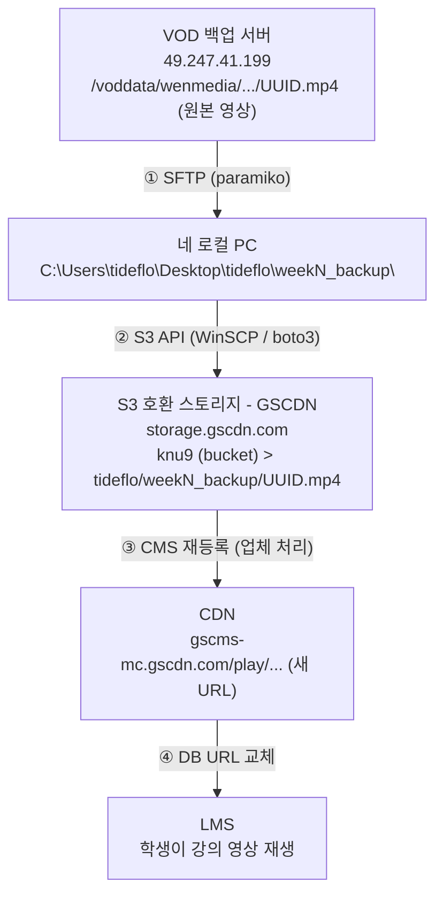

# 01. 전체 구조도 - 네가 오늘 한 걸 뜯어보자

> 👹 "야, 오늘 삽질 많이 했지? 근데 그 삽질 하나하나가 다 네트워크 개념이야.
> 그냥 '됐다 안됐다'로 넘기면 Lv1 병아리야. 왜 됐고 왜 안 됐는지 설명할 수 있어야 Lv2."

---

## 오늘 네가 만진 시스템 전체 그림

---

## 각 구간에서 사용한 프로토콜

| 구간 | 프로토콜 | 포트 | 인증 방식 | 사용한 도구 |
|------|----------|------|-----------|-------------|
| VOD서버 → 로컬 | **SSH/SFTP** | 22 | ID/PW | paramiko (Python) |
| 로컬 → S3 | **HTTPS (S3 API)** | 443 | Access Key/Secret Key | WinSCP, boto3 |
| S3 → CDN | **내부** (업체) | - | - | 업체 CMS |
| CDN → 사용자 | **HTTPS** | 443 | 없음 (공개) | 브라우저 |

---

## 👹 형님 질문

> **Q1. 왜 구간마다 프로토콜이 다른 거야?**
>
> "그냥 다르니까요" → 불합격. 다시.
>
> 각 구간의 **목적**이 다르기 때문이야:
> - VOD서버 → 로컬: **파일 전송** (대용량, 보안 필요) → SSH/SFTP
> - 로컬 → S3: **오브젝트 저장** (클라우드 스토리지 표준) → S3 API
> - CDN → 사용자: **콘텐츠 배포** (빠른 전송, 캐싱) → HTTPS

> **Q2. 그러면 전부 HTTPS로 하면 안 돼?**
>
> 가능은 해. 근데 **트레이드오프**가 있어:
> - SFTP: 파일 시스템 직접 접근, 대용량 안정적
> - S3 API: 오브젝트 단위 관리, 확장성
> - 각 프로토콜은 각자의 **문제 도메인에 최적화**된 거야
