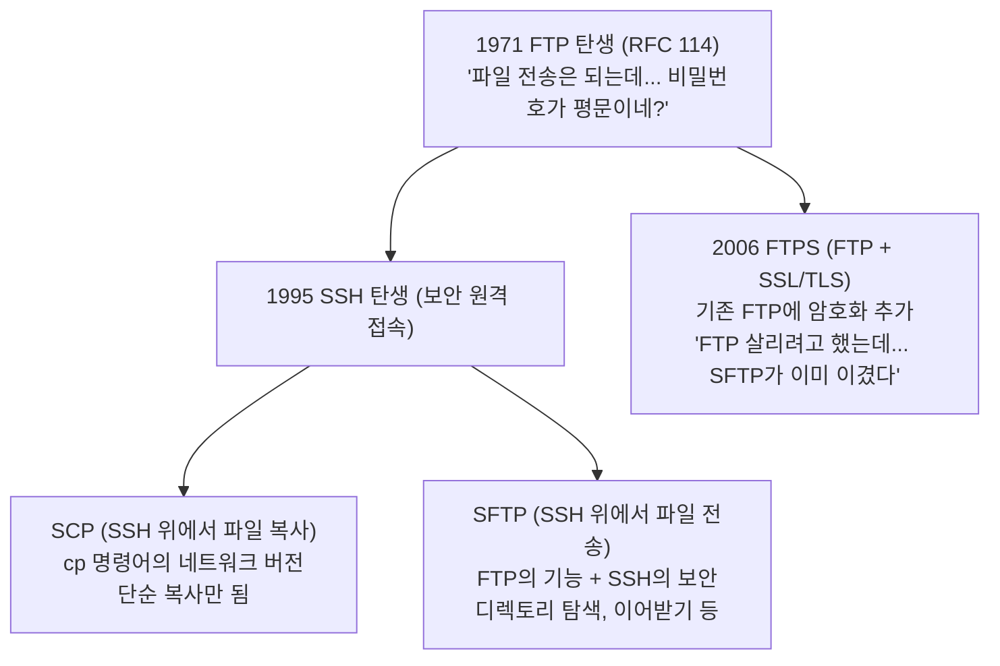

# 02. 프로토콜 비교 - FTP vs SFTP vs SCP vs SSH

> 👹 "네가 오늘 FTP, SFTP, SSH 다 썼어. 차이 말해봐."
> "다 비슷한 거 아닌가요?" → 🔥 5 Whys 발동

---

## 프로토콜 계보



---

## 핵심 비교표

| 항목 | FTP | SFTP | SCP | SSH |
|------|-----|------|-----|-----|
| **목적** | 파일 전송 | 파일 전송 | 파일 복사 | 원격 명령 실행 |
| **암호화** | ❌ 없음 (평문) | ✅ SSH 암호화 | ✅ SSH 암호화 | ✅ SSH 암호화 |
| **포트** | 21 (+ 데이터 포트) | 22 | 22 | 22 |
| **디렉토리 탐색** | ✅ | ✅ | ❌ | ✅ (ls 명령) |
| **이어받기** | ✅ | ✅ | ❌ | - |
| **방화벽 문제** | 많음 (액티브/패시브) | 적음 (단일 포트) | 적음 | 적음 |
| **속도** | 빠름 (암호화 없음) | 보통 | 보통 | - |

---

## 오늘 네가 쓴 것들

### 1. FTP (파일질라로 서버에 스크립트 올릴 때)
```
네 PC ──FTP(21)──→ VOD 서버
         평문 전송
         파일 업로드용
```
- paths 파일들, upload_to_s3.sh 올릴 때 사용
- **왜 FTP?** 이미 세팅돼 있으니까. 보안? 내부망이라 괜찮음.

### 2. SSH (서버에서 명령어 실행할 때)
```
네 PC ──SSH(22)──→ VOD 서버
         암호화 터널
         bash download.sh 실행
```
- PuTTY 또는 터미널로 접속
- curl, bash 등 명령어 실행

### 3. SFTP (paramiko로 파일 다운로드할 때)
```
네 PC ←──SFTP(22)──→ VOD 서버
          SSH 암호화 터널
          mp4 파일 다운로드
```
- Python paramiko가 내부적으로 SFTP 사용
- SSH 연결 위에서 파일 전송

---

## 👹 형님의 핵심 질문

### Q1. FTP로 올리고 SFTP로 내려받았는데, 왜 달라?

> FTP: 이미 설정돼있고, 소수 파일 올리는 거라 간편하게 씀
> SFTP: Python에서 자동화하려면 paramiko(SFTP) 쓰는 게 표준
>
> 핵심: **도구의 선택은 상황에 따른 트레이드오프**

### Q2. SCP 안 쓰고 SFTP 쓴 이유?

> SCP: 단순 복사 (cp의 네트워크 버전). 한 파일씩만 복사.
> SFTP: 디렉토리 조회, 이어받기, 자동화 가능.
>
> 430개 넘는 파일을 주차별로 자동 분류해야 하니까 → **SFTP가 맞음**

### Q3. 그러면 SSH랑 SFTP는 같은 거야 다른 거야?

```
SSH = 터널 (암호화된 통로)
  ├── 원격 명령 실행 (ssh user@host "ls -la")
  ├── SFTP (파일 전송)
  └── SCP (파일 복사)
```

> **SSH는 터널이고, SFTP/SCP는 그 터널 위에서 돌아가는 서비스.**
> 포트도 같고(22), 인증도 같고, 암호화도 같아.
> 차이는 터널 위에서 **뭘 하느냐**야.

---

## 🔥 포트 번호의 의미

```
포트 = 아파트 호수

IP 주소: 49.247.41.199  ← 아파트 건물 주소
포트 22: SSH/SFTP        ← 22호
포트 21: FTP             ← 21호
포트 443: HTTPS          ← 443호
포트 80: HTTP            ← 80호

하나의 서버(건물)에 여러 서비스(세입자)가 각각의 포트(호수)에서 대기
```

| 포트 | 서비스 | 오늘 어디서 썼는지 |
|------|--------|-------------------|
| 21 | FTP | 서버에 스크립트 업로드 |
| 22 | SSH/SFTP | 서버 명령 실행 + paramiko 다운로드 |
| 443 | HTTPS | S3 스토리지 접속, CDN URL 체크 |
