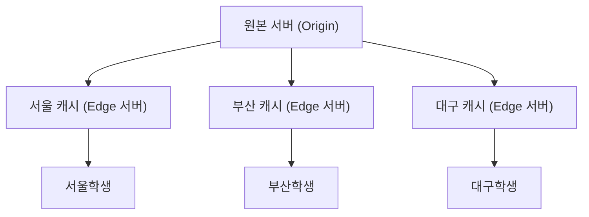
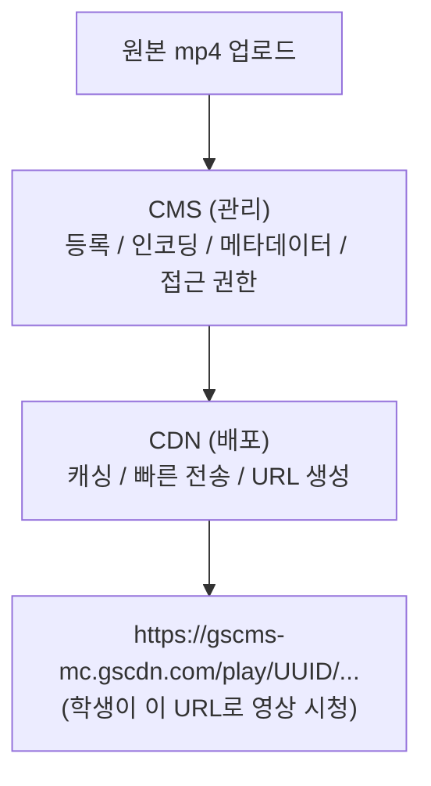

# 05. CDN & CMS - 이 프로젝트의 근본 이해

> 👹 "영상이 왜 안 나오는지 근본 원인 말해봐."
> "CMS에 안 올라가서요" → "왜 CMS에 안 올라갔는데?"
> → 5 Whys 시작

---

## CDN이란

```
CDN = Content Delivery Network (콘텐츠 배포 네트워크)

문제: 서울에 서버 하나 → 부산 학생이 접속하면 느림
해결: 전국 (또는 전세계)에 캐시 서버 배치
```



> 가까운 서버에서 빠르게 다운로드

---

## CMS란

```
CMS = Content Management System (콘텐츠 관리 시스템)

영상 업로드 → 인코딩 → CDN 배포를 관리하는 시스템
```



---

## 이 프로젝트의 근본 문제 (5 Whys)

```
Q1: 왜 영상이 안 나와?
A1: CDN URL이 404야.

Q2: 왜 404야?
A2: CMS에서 해당 영상을 못 찾아.

Q3: 왜 CMS에서 못 찾아?
A3: CMS에 등록이 안 돼있어.

Q4: 왜 등록 안 돼있어?
A4: KNU9→KNU10 이관 당시, 인코딩 시간 절약하려고
    CMS 안 거치고 CDN에 직접 파일을 올렸어.

Q5: 왜 그때는 됐는데 지금은 안 돼?
A5: CMS 업데이트 이후, CDN이 "CMS에 등록된 영상만"
    서빙하도록 정책이 바뀌었어.
    미등록 영상 → 404
```

```
[이전 (CMS 업데이트 전)]
mp4 → CDN에 직접 업로드 → URL 발급 → 재생 OK
      (CMS 안 거침)        (CMS 체크 안 함)

[현재 (CMS 업데이트 후)]
mp4 → CDN에 직접 업로드 → URL 요청 → CMS 체크 → 미등록 → 404!
                                      ↑ 새로 추가된 체크
```

---

## 복구 흐름 (네가 하고 있는 것)

```
Step 1: VOD 백업 서버에서 원본 mp4 확보
        ↓
Step 2: S3 스토리지 (knu9 bucket)에 업로드
        ↓
Step 3: 업체가 CMS에 재등록 (인코딩 + 메타데이터)
        ↓
Step 4: 새 CDN URL 발급
        ↓
Step 5: DB에서 기존 URL → 새 URL로 교체
        ↓
Step 6: 학생이 영상 정상 재생 ✅
```

---

## CDN URL 구조 분석

```
https://gscms-mc.gscdn.com/play/61df93c2-74f6-4d8c-afcb-f3c5ec03c326/b7QdiAuIWNnYncVYBNEVwfDRtqJvZCgbWaE1PfTWJLdaWFXpNP62Sw%3D%3D
        ├─────────────────┤ ├──┤ ├──────────────────────────────────┤ ├──────────────────────────────────────────────────────────┤
        │                   │    │                                    │
        호스트              │    UUID (콘텐츠 식별자)                 JWT 토큰 (접근 권한)
                           │
                         play (재생 API)

- UUID: CMS에 등록된 콘텐츠의 고유 식별자
- JWT: 시간 제한이 있는 인증 토큰 (만료되면 재생 불가)
- 이 UUID가 CMS에 없으면 → 404
```

---

## 👹 빠싺 검증 질문

- [ ] CDN이 왜 필요한지 한 문장으로 설명 가능
- [ ] CMS가 하는 역할 3가지를 말할 수 있다
- [ ] 영상이 404인 근본 원인을 5 Whys로 설명 가능
- [ ] CDN URL의 각 부분이 뭘 의미하는지 설명 가능
- [ ] 복구 흐름 6단계를 순서대로 말할 수 있다
