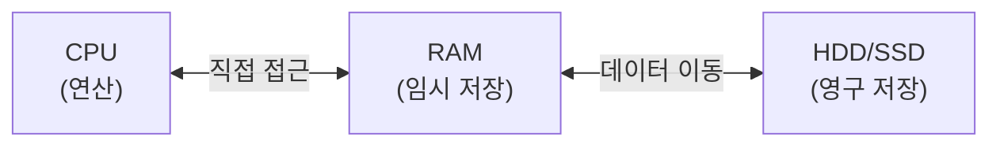
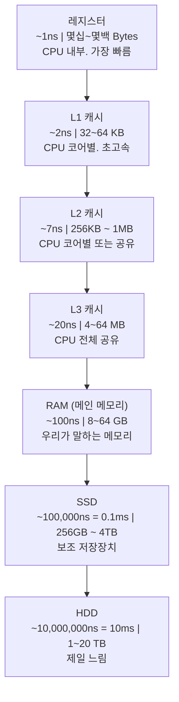
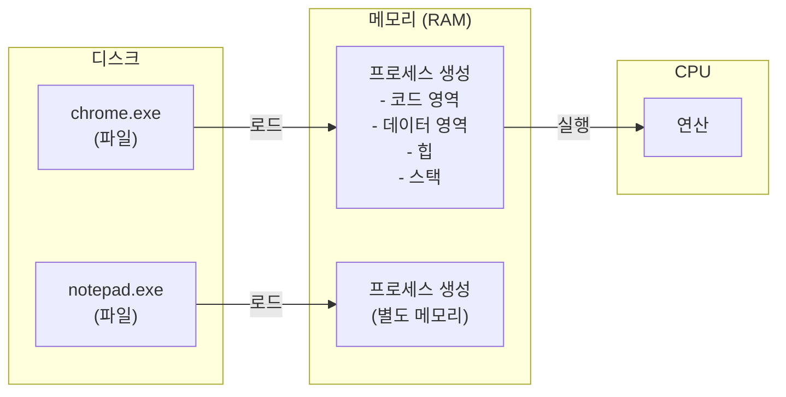
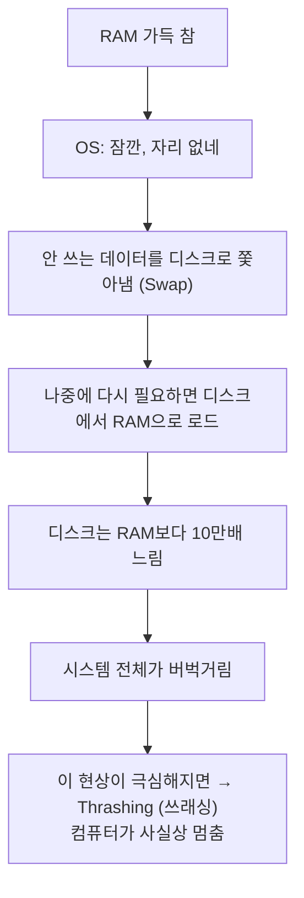

# 01. 메모리란 무엇인가 - Alpha

---

## 1. 메모리가 뭐야? - "이게 뭐야?"

### 비유부터 가자

너 공부할 때 어떻게 해? 책장에서 책 꺼내서 **책상 위에** 올려놓고 펴서 읽지?
책장에 꽂혀있는 책을 책장에서 바로 읽진 않잖아. 꺼내서 책상 위에 놓아야 작업이 가능해.

| | 책장 (HDD/SSD) | 책상 (메모리/RAM) |
|---|---|---|
| **역할** | 저장 공간 | 작업 공간 |
| **데이터 흐름** | 꺼내서 올린다 / 다 쓰면 다시 넣음 | 여기서만 작업 가능하다! |
| **용량** | 큼 | 작음 |
| **속도** | 느림 | 빠름 |
| **전원** | 전원 꺼도 유지 | 전원 끄면 날아감 |

비유는 여기까지. **진짜는 이거야.**

### 정확한 정의

> **메모리(Memory) = CPU가 직접 접근할 수 있는 고속 저장 공간**

CPU는 연산을 하는 놈이야. 근데 연산하려면 데이터가 필요하잖아?
그 데이터를 **어디서 가져오느냐**가 핵심이야.

CPU가 HDD/SSD에서 직접 데이터를 읽을 수 있을까? **못해.** 너무 느려.
HDD는 기계식 디스크가 돌아가면서 헤드가 움직이는 거야. SSD도 빠르긴 하지만 CPU 속도에 비하면 거북이 수준이야.

그래서 **중간에 빠른 저장 공간**이 필요해. 그게 **RAM(Random Access Memory)**이야.



| | CPU | RAM | HDD/SSD |
|---|---|---|---|
| **속도** | 최고 | 빠름 | 느림 |
| **용량** | 극소 | 보통 | 큼 |
| **휘발** | - | 휘발성 | 비휘발성 |

**핵심 포인트**: CPU는 RAM하고만 직접 대화한다. HDD/SSD의 데이터가 필요하면 먼저 RAM으로 올린 다음에 CPU가 읽는 거야.

---

## 2. 메모리 계층 구조 - "어떻게 돌아가?"

### 왜 계층이 있어?

이상적으로는 CPU 바로 옆에 테라바이트짜리 초고속 메모리 하나 붙이면 끝이야.
근데 현실은? **빠르면 비싸고, 비싸면 작게 만들 수밖에 없어.**

이게 컴퓨터 공학의 근본 트레이드오프야:

> **속도 ↔ 용량 ↔ 가격**
> 세 개를 동시에 만족시키는 건 불가능하다.

그래서 **계층 구조**로 해결한 거야. 빠른 건 작게, 느린 건 크게.



!!! info "메모리 계층 구조 핵심"
    위로 갈수록: 빠르다 / 비싸다 / 용량 작다

    아래로 갈수록: 느리다 / 싸다 / 용량 크다

### 속도 차이가 얼마나 나는지 체감시켜줄게

숫자만 보면 감 안 오지? 인간 시간으로 환산해볼게.

!!! example "속도 차이를 인간 시간으로 환산"
    레지스터 접근 = 1초라고 치면...

    | 메모리 계층 | 인간 시간 환산 |
    |---|---|
    | L1 캐시 접근 | 약 2초 |
    | L2 캐시 접근 | 약 7초 |
    | L3 캐시 접근 | 약 20초 |
    | RAM 접근 | 약 1분 40초 |
    | SSD 접근 | 약 1일 3시간 |
    | HDD 접근 | 약 115일 (거의 4개월) |

    CPU한테 HDD에서 데이터 가져오라는 건
    "1초면 끝나는 일을 4개월 기다려" 하는 거야.
    그러니까 RAM이 필요한 거지.

이 차이가 **왜 메모리가 존재하는지**에 대한 완벽한 답이야.
CPU가 HDD에서 직접 읽으면 4개월 걸리는 걸 RAM 통해서 1분 40초로 줄이는 거야.
캐시를 쓰면 2~20초로 더 줄이고.

### 계층 간 데이터 흐름

데이터는 아래에서 위로 올라간다. 자동으로? 아니. **필요할 때** 올라가.


1. 프로그램(exe, jar 등)은 **디스크에 파일로** 존재한다
2. 실행하면 OS가 디스크에서 **RAM으로 올린다** (로딩)
3. CPU가 필요한 데이터를 RAM에서 **캐시로** 가져온다
4. 캐시에서 **레지스터로** 가져와서 연산한다

이 흐름을 이해 못 하면 뒤에 나오는 모든 내용이 공중분해돼.

---

## 3. RAM의 특성 - "코드로 보자"

### RAM = Random Access Memory

"Random Access"가 뭐냐. **아무 위치나 바로 접근 가능**하다는 뜻이야.

테이프(카세트테이프 알지?)는 순차 접근이야. 3번째 노래 들으려면 1번, 2번을 빨리감기 해야 해.
RAM은 그런 거 없어. 1번이든 100만번이든 바로 접근. 접근 시간 동일.

| | 순차 접근 (테이프, HDD) | 랜덤 접근 (RAM) |
|---|---|---|
| **접근 방식** | 1 → 2 → 3 순서대로 | 3번을 바로 접근 |
| **3번 가려면** | 1, 2를 거쳐야 함 | 바로 접근 가능 |
| **접근 시간** | 위치에 따라 다름 | 어디든 동일 |

### 휘발성 (Volatile)

RAM의 가장 중요한 특성. **전원 끄면 데이터가 전부 날아간다.**

왜? RAM은 전기 신호(전하)로 데이터를 저장하거든.
정확히 말하면, DRAM(Dynamic RAM)은 **콘덴서(capacitor)에 전하를 충전**해서 1과 0을 표현해.
전원이 꺼지면 전하가 사라지니까 데이터도 사라져.

```
DRAM 셀 하나의 원리:

   전하 있음 = 1 (ON)
   전하 없음 = 0 (OFF)

   ┌──────────┐
   │ 트랜지스터 │──── 비트 라인 (읽기/쓰기)
   └─────┬────┘
         │
   ┌─────┴────┐
   │ 콘덴서   │  ← 여기에 전하를 저장
   │ (전하)   │     전원 꺼지면 방전 → 데이터 손실
   └──────────┘
```

이게 왜 중요하냐고?

```
시나리오:

1. 워드 문서 열심히 작성 중 (데이터는 RAM에 있음)
2. 갑자기 정전
3. RAM의 데이터 전부 소멸
4. 저장 안 했으면? 전부 날아감.

→ 그래서 Ctrl+S를 누르는 거야.
→ 저장 = RAM에서 디스크(HDD/SSD)로 쓰기
→ 디스크는 비휘발성이니까 전원 꺼져도 유지
```

### 바이트 단위 체계

메모리 크기를 이야기하려면 단위를 알아야 해.

!!! note "메모리 크기 단위"
    | 단위 | 크기 | 비유 |
    |---|---|---|
    | 1 bit (비트) | 0 또는 1 | 최소 단위 |
    | 1 Byte (바이트) | 8 bits | 문자 하나 저장 |
    | 1 KB (킬로바이트) | 1,024 Bytes | 짧은 텍스트 파일 |
    | 1 MB (메가바이트) | 1,024 KB | MP3 한 곡 |
    | 1 GB (기가바이트) | 1,024 MB | 영화 한 편 |
    | 1 TB (테라바이트) | 1,024 GB | 대용량 HDD |

    **왜 1000이 아니라 1024?**

    - 컴퓨터는 2진법이니까. 2^10 = 1024
    - 하드 제조사는 1000 기준(마케팅용), OS는 1024 기준
    - 그래서 1TB HDD 사서 꽂으면 약 931GB로 뜨는 거야

    **일반적인 RAM 용량:**

    | 기기 | RAM 용량 |
    |---|---|
    | 보통 PC | 8GB ~ 32GB |
    | 서버 | 64GB ~ 512GB |
    | 스마트폰 | 6GB ~ 16GB |

---

## 4. "프로그램 실행한다" = 메모리에 올린다 - "코드로 보자"

이거 진짜 중요해. **프로그램과 프로세스의 차이**를 모르면 뒤에서 전부 무너져.

| | 프로그램 (Program) | 프로세스 (Process) |
|---|---|---|
| **정의** | 디스크에 저장된 파일 | 메모리에 올라간 실행 중인 프로그램 |
| **상태** | 정적 (가만히 있음) | 동적 (CPU가 실행 중) |
| **형태** | .exe, .jar, .class 등 | RAM에 적재된 상태 |
| **비유** | 레시피 책 (냉장고에 있음) | 실제로 요리하는 중 (재료 꺼내서 조리대 위) |

**프로그램** = 디스크에 있는 파일. 아무것도 안 하고 있음.
**프로세스** = 그 프로그램을 메모리에 올려서 실행 중인 상태.



너 크롬 열 때 "더블클릭" 하잖아. 그 순간 일어나는 일:

1. OS가 디스크에서 `chrome.exe` 파일을 찾는다
2. 이 파일의 코드와 데이터를 **RAM에 복사**한다
3. RAM에 올라간 상태가 **프로세스**야
4. CPU가 RAM에 있는 코드를 읽어서 한 줄씩 **실행**한다

**크롬을 10개 열면?** 프로세스 10개가 RAM에 올라가. 같은 프로그램인데 별도의 메모리 공간을 가져.
그래서 크롬 탭 많이 열면 RAM이 부족해지는 거야.

### 실제로 확인해보자

윈도우 작업 관리자(Ctrl+Shift+Esc)를 열어봐.

!!! example "작업 관리자"
    | 이름 | 메모리 (MB) | 비고 |
    |---|---|---|
    | Google Chrome | 1,200 MB | RAM을 이만큼 먹고 있음 |
    | IntelliJ IDEA | 2,400 MB | IDE는 메모리 괴물 |
    | Discord | 350 MB | |
    | Windows Explorer | 150 MB | |
    | ... | | |

    **총 메모리 사용량: 12.5 / 16.0 GB**

    이게 의미하는 것:

    - 16GB RAM 중 12.5GB를 프로세스들이 나눠 쓰고 있음
    - 3.5GB 남음. 더 열면 느려질 수 있음

---

## 5. 왜 메모리가 중요해? - "이거 왜 알아야 하냐면"

### 이유 1: 메모리 = 성능의 병목

CPU가 아무리 빨라도 **RAM이 부족하면 느려진다.**



### 이유 2: 개발자가 메모리를 이해 못 하면 벌어지는 일

!!! danger "Java 예시: 메모리 오류"
    이런 코드 짜면:

    ```java
    List<byte[]> list = new ArrayList<>();
    while (true) {
        list.add(new byte[1024 * 1024]);  // 1MB씩 계속 추가
    }
    ```
    → OutOfMemoryError: Java heap space → 프로그램 터짐

    이런 것도:

    ```java
    public void recursive() {
        recursive();  // 무한 재귀
    }
    ```
    → StackOverflowError → 스택 메모리 폭발

    이게 왜 터지는지 이해하려면 메모리 구조를 알아야 해.
    03장(프로세스 메모리 구조)에서 자세히 다룬다.

### 이유 3: 면접에서 물어본다

신입이든 경력이든 이런 질문 나와:

- "프로그램과 프로세스의 차이가 뭔가요?"
- "Stack과 Heap의 차이를 설명해주세요"
- "가상 메모리가 왜 필요한가요?"
- "메모리 누수(Memory Leak)를 경험해본 적 있나요?"

이 시리즈 전부 읽으면 이 질문들에 근거 있게 답할 수 있어.

---

## 6. 주의사항 / 함정

### 함정 1: "메모리 = RAM"이라고만 생각하기

넓은 의미에서 메모리는 레지스터, 캐시, RAM 전부 포함해.
일상에서 "메모리 16기가"라고 하면 RAM을 말하는 거지만,
컴퓨터 구조 이야기할 때는 맥락에 따라 다르다는 거 기억해.

### 함정 2: "RAM 크면 무조건 빠르다"

아니야. RAM이 16GB인데 프로그램이 4GB만 쓰면 32GB로 올려봤자 차이 없어.
**병목이 어디인지**가 중요해. CPU가 병목이면 RAM 올려봤자 소용없고,
디스크 I/O가 병목이면 SSD로 바꿔야 하고.

### 함정 3: "메모리 관리는 OS가 알아서 해주니까 몰라도 돼"

Java나 Python 같은 고급 언어는 가비지 컬렉터(GC)가 메모리 해제를 해주지만,
**메모리 할당은 개발자가 하는 거야.** 쓸데없이 큰 객체 만들고, 참조 안 끊고,
캐시 안 비우면 GC도 못 해제해. 그게 **메모리 누수(Memory Leak)**야.

### 함정 4: 용량 단위 혼동

```
흔한 실수:

"서버 메모리 4GB인데 충분하지 않나요?"

→ JVM에 2GB 할당하면 OS + 기타 프로세스는 2GB로 버텨야 해
→ Linux는 커널이 최소 수백 MB 먹고
→ 모니터링 에이전트, 로그 수집기 등도 메모리 먹고
→ 4GB면 빡빡해. 프로덕션 서버는 최소 8GB 이상.
```

---

## 7. 정리

| 항목 | 내용 |
|------|------|
| **메모리란** | CPU가 직접 접근하는 고속 저장 공간 |
| **메모리 계층** | 레지스터 → L1/L2/L3 캐시 → RAM → SSD → HDD |
| **트레이드오프** | 빠를수록 비싸고 작다 / 느릴수록 싸고 크다 |
| **RAM 특성** | 랜덤 접근, 휘발성 (전원 끄면 날아감) |
| **프로그램 vs 프로세스** | 디스크의 파일 vs 메모리에 올라간 실행 중인 상태 |
| **프로그램 실행** | 디스크 → RAM으로 로드 → CPU가 실행 |
| **왜 중요** | 성능 병목, 메모리 오류, 면접 빈출 |

### 한 줄 정리

> **"프로그램을 실행한다 = 디스크에서 RAM으로 올린다. CPU는 RAM에서만 일한다."**

### 이 챕터에서 반드시 기억할 것

1. CPU는 디스크(HDD/SSD)에서 직접 데이터를 못 읽는다. RAM을 거쳐야 한다.
2. RAM은 휘발성이다. 전원 끄면 전부 사라진다.
3. 메모리 계층 구조는 속도-용량-가격의 트레이드오프로 존재한다.
4. 프로그램(파일) != 프로세스(실행 중인 프로그램). 이 구분 못 하면 다음 장 이해 못 해.

---

### 확인 문제 (5문제)

> 다음 문제를 풀어봐. 답 못 하면 위에서 다시 읽어.

**Q1.** CPU가 데이터를 연산하려면 그 데이터가 어디에 있어야 하는가? HDD에서 직접 읽을 수 있는가?

**Q2.** RAM은 왜 "휘발성"이라고 하는가? 그리고 이것 때문에 실생활에서 어떤 행동을 해야 하는가?

**Q3.** 메모리 계층 구조가 존재하는 근본 이유는 무엇인가? "빠르고 크고 싼 메모리" 하나로 안 되는 이유를 설명해봐.

**Q4.** 프로그램과 프로세스의 차이를 한 문장씩으로 설명해봐. 같은 프로그램을 3번 실행하면 프로세스는 몇 개인가?

**Q5.** L1 캐시 접근 시간이 약 2ns이고 HDD 접근 시간이 약 10ms일 때, HDD는 L1 캐시보다 대략 몇 배 느린가?

??? success "정답 보기"
    **A1.** CPU가 데이터를 연산하려면 데이터가 **레지스터**(또는 캐시/RAM)에 있어야 한다. CPU는 HDD/SSD에서 직접 데이터를 읽을 수 없다. 반드시 RAM으로 먼저 올린 후 CPU가 접근한다. 이것이 메모리가 존재하는 이유다.

    **A2.** RAM은 전하(전기 신호)로 데이터를 저장하기 때문에, 전원이 꺼지면 전하가 사라지고 데이터도 전부 손실된다. 그래서 "휘발성"이라 한다. 실생활에서는 **작업 중 수시로 저장(Ctrl+S)**해야 한다. 저장 = RAM의 데이터를 비휘발성 디스크(HDD/SSD)에 쓰는 행위.

    **A3.** 빠르면서 용량 크고 가격까지 싼 메모리는 물리적으로 만들 수 없다. **속도, 용량, 가격** 세 가지를 동시에 만족시키는 것이 불가능하기 때문에, 빠른 건 작고 비싸게(레지스터, 캐시), 느린 건 크고 싸게(HDD) 만들어서 계층적으로 조합한 것이다.

    **A4.** **프로그램** = 디스크에 저장된 정적인 실행 파일. **프로세스** = 그 프로그램이 메모리(RAM)에 올라가 CPU에 의해 실행되고 있는 동적인 상태. 같은 프로그램을 3번 실행하면 프로세스는 **3개** 생성된다. 각각 독립된 메모리 공간을 가진다.

    **A5.** L1 캐시: 2ns, HDD: 10ms = 10,000,000ns. 10,000,000 / 2 = **약 500만 배** 느리다. 이 엄청난 차이 때문에 메모리 계층 구조가 필요한 것이다.
