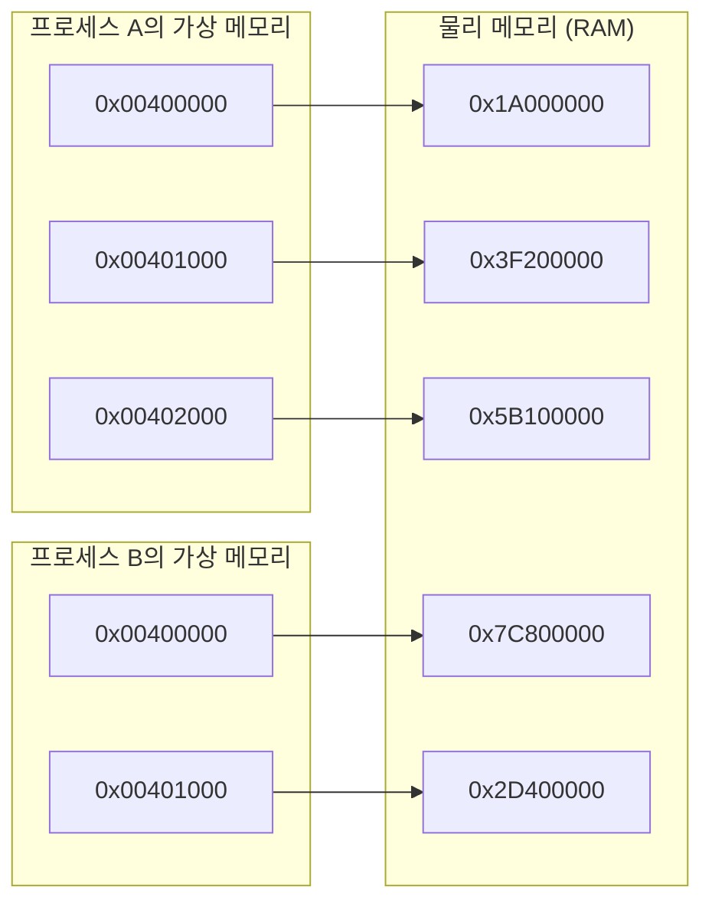
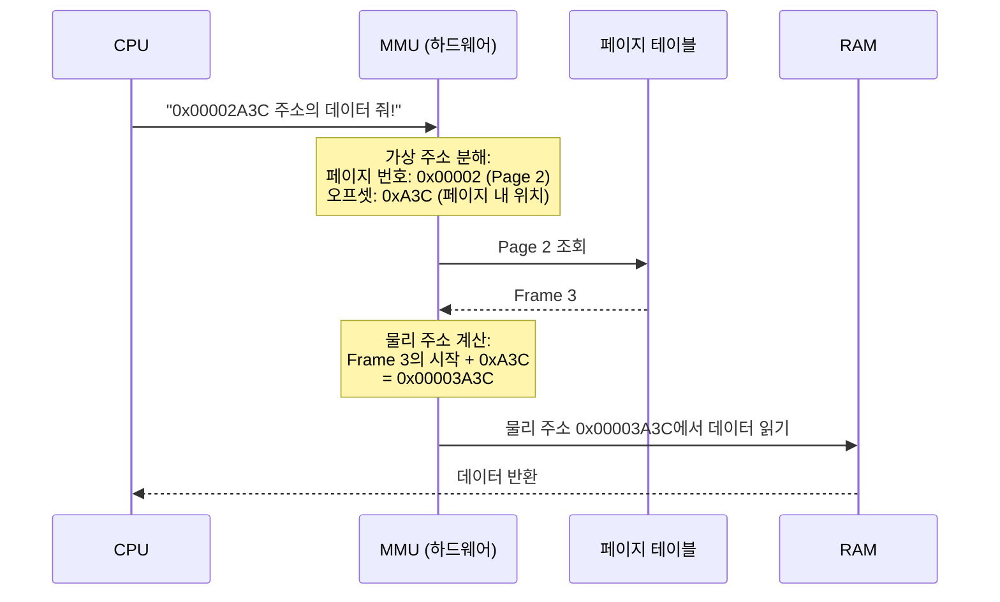
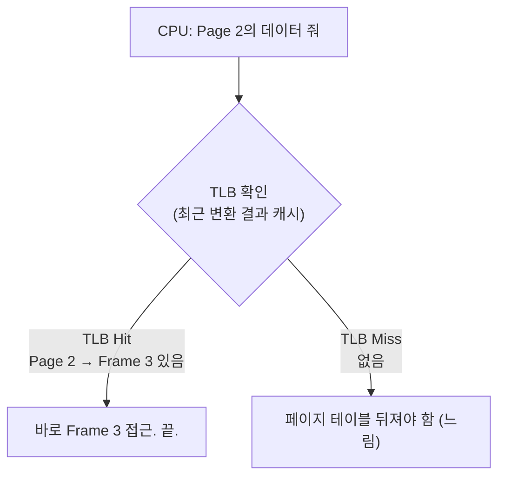
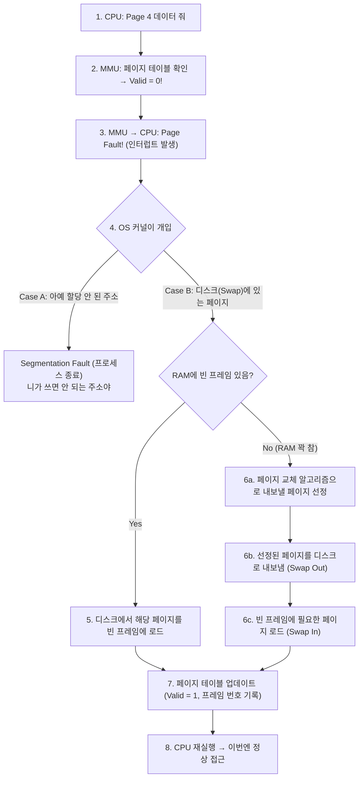
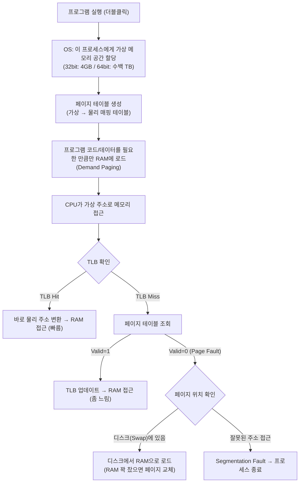

# 02. 가상 메모리와 페이징 - Alpha

---

## 1. 물리 메모리 vs 가상 메모리 - "이게 뭐야?"

### 비유부터 가자

아파트를 생각해봐.

너 집 주소가 "101동 301호"야. 근데 실제로 그 아파트 건물이 지구 위 어디에 있는지 위도/경도로 말할 수 있어? 못 하잖아. 근데 "101동 301호"라고 하면 우체부가 찾아와. 왜? **주소 체계가 실제 위치로 변환해주니까.**

메모리도 똑같아.

| | 가상 주소 (논리 주소) | 물리 주소 (실제 RAM 위치) |
|---|---|---|
| **비유** | "101동 301호" | "북위 37.5도, 동경 127.0도" |
| **정의** | 프로그램이 보는 주소 | 실제 RAM 칩에서의 위치 |
| **예시** | 0x00400000, 0x00401000, 0x00402000 | 0x7F3A2000, 0x1BC05000, 0x5E910000 |
| **특성** | 연속적으로 보임 (깔끔한 번호) | 실제로는 뒤죽박죽 (여기저기 흩어져 있음) |

!!! info ""
    프로그램은 가상 주소만 안다.
    실제 RAM 어디에 있는지는 OS + MMU가 알아서 변환해준다.

비유는 여기까지. **진짜는 이거야.**

### 정확한 정의

> **물리 메모리 (Physical Memory)** = 실제 RAM 하드웨어. 용량이 정해져 있다. 8GB면 8GB.
>
> **가상 메모리 (Virtual Memory)** = OS가 각 프로세스에게 제공하는 **가짜 메모리 공간**. 프로세스는 자기가 메모리를 독점하고 있다고 **착각**한다.

핵심을 파자.

프로세스 A가 주소 `0x00400000`을 쓰고, 프로세스 B도 주소 `0x00400000`을 쓴다.
같은 주소인데 충돌 안 해. 왜? **가상 주소**니까.
A의 `0x00400000`과 B의 `0x00400000`은 **서로 다른 물리 주소**로 매핑돼.



!!! info ""
    같은 가상 주소 0x00400000이지만
    A는 물리 0x1A000000으로, B는 물리 0x7C800000으로 매핑
    → 서로 간섭 불가

---

## 2. 왜 가상 메모리가 필요해? - "어떻게 돌아가?"

가상 메모리 없이 직접 물리 주소를 쓰면 어떻게 되는지 보자.

### 문제 1: 프로세스 격리 불가능

```
가상 메모리 없는 세상:

   프로세스 A: 물리 주소 0x1000 ~ 0x5000 사용
   프로세스 B: 물리 주소 0x4000 ~ 0x8000 사용

   !!!! 0x4000 ~ 0x5000 겹침 !!!!

   → A가 0x4500에 쓰면 B의 데이터 덮어씀
   → B가 0x4500에 쓰면 A의 데이터 덮어씀
   → 둘 다 터짐
   → 보안? 망함. A가 B의 비밀번호 읽을 수도 있음.
```

가상 메모리가 있으면? 각 프로세스가 **독립된 가상 주소 공간**을 가지니까 절대 겹칠 수 없어.
A가 B의 메모리에 접근하려고 하면 OS가 **"권한 없음"** 하고 막아버려 (Segmentation Fault).

### 문제 2: 물리 메모리 부족

```
RAM이 8GB인데:

   크롬:     2GB
   IntelliJ: 3GB
   서버:     2GB
   기타:     2GB
   ─────────────
   합계:     9GB   ← 8GB 초과!

   가상 메모리 없으면? → "메모리 부족, 프로그램 실행 불가"

   가상 메모리 있으면?
   → 당장 안 쓰는 부분을 디스크(Swap)로 내보냄
   → 필요할 때 다시 RAM으로 가져옴
   → 8GB RAM으로도 9GB+ 분량 프로그램 실행 가능
```

### 문제 3: 메모리 단편화

```
물리 메모리 직접 사용 시:

   [A][A][A][  ][B][B][  ][C][C][C][  ][  ]

   A 종료 후:
   [  ][  ][  ][  ][B][B][  ][C][C][C][  ][  ]

   3칸 비었는데 연속이 아님. 4칸짜리 프로그램 D를 못 올림.
   이게 "외부 단편화 (External Fragmentation)"

   가상 메모리 + 페이징이면?
   → 연속일 필요 없음. 흩어진 빈 공간 조합해서 사용 가능
```

### 정리: 가상 메모리가 해결하는 3가지

| 문제 | 가상 메모리의 해결 |
|------|---------------------|
| **프로세스 격리** | 각 프로세스가 독립 주소 공간을 가짐. 서로 접근 불가. |
| **메모리 부족** | 디스크를 확장 메모리로 활용 (Swap). 물리 RAM 이상 사용 가능. |
| **단편화** | 페이징으로 비연속 물리 메모리를 연속처럼 보이게 매핑. |

---

## 3. 페이지와 페이지 테이블 - "코드로 보자"

### 페이지(Page)란?

가상 메모리를 **고정 크기 블록으로 잘라놓은 것**이 페이지야.

!!! note "가상 메모리 공간을 4KB씩 자른다"
    | 가상 메모리 | 크기 | 물리 메모리 | 크기 |
    |---|---|---|---|
    | Page 0 | 4KB | Frame 0 | 4KB |
    | Page 1 | 4KB | Frame 1 | 4KB |
    | Page 2 | 4KB | Frame 2 | 4KB |
    | Page 3 | 4KB | Frame 3 | 4KB |
    | ... | | ... | |

    - 가상 메모리 블록 = **페이지 (Page)**
    - 물리 메모리 블록 = **프레임 (Frame)**
    - 보통 둘 다 4KB (4096 bytes)

**왜 4KB?** 너무 작으면 페이지 수가 폭발해서 관리 비용 증가. 너무 크면 내부 단편화 증가(쓰지도 않는 공간 낭비). 4KB가 그 균형점이야. OS에 따라 2MB, 1GB 같은 "대형 페이지"도 쓸 수 있긴 해.

### 페이지 테이블 (Page Table)

페이지 테이블 = **가상 주소 → 물리 주소 변환 표**

각 프로세스마다 자기만의 페이지 테이블이 있어.

!!! example "프로세스 A의 페이지 테이블"
    | 가상 페이지 | 물리 프레임 | Valid (유효) | 권한 (R/W/X) | 설명 |
    |---|---|---|---|---|
    | Page 0 | Frame 5 | 1 | R-X | 코드 영역 (읽기+실행) |
    | Page 1 | Frame 12 | 1 | RW- | 데이터 (읽기+쓰기) |
    | Page 2 | Frame 3 | 1 | RW- | 힙 |
    | Page 3 | - | 0 | - | 아직 안 씀 |
    | Page 4 | [Disk] | 0 | RW- | Swap에 있음 |
    | Page 5 | Frame 27 | 1 | RW- | 스택 |

    - Valid = 1: 물리 메모리(RAM)에 있음
    - Valid = 0: RAM에 없음 (아직 할당 안 됨 또는 디스크로 내려감)

### 주소 변환 과정 (MMU)

CPU가 가상 주소를 쓰면, **MMU(Memory Management Unit)**가 페이지 테이블을 보고 물리 주소로 변환해.



이 과정이 **프로그램이 메모리에 접근할 때마다** 일어나. 엄청 자주 일어나니까 하드웨어(MMU)가 처리하는 거야. 소프트웨어로 하면 느려서 못 써.

### TLB (Translation Lookaside Buffer)

매번 페이지 테이블 전체를 뒤지면 느려. 그래서 **최근 변환 결과를 캐싱**하는 게 TLB야.



!!! tip ""
    - TLB Hit율이 높을수록 성능 좋음 (보통 95%+)
    - TLB는 보통 64~1024개 항목만 저장 (아주 작음, 아주 빠름)

---

## 4. Page Fault - "디스크에서 RAM으로 가져오기"

### Page Fault란?

CPU가 어떤 가상 주소에 접근했는데, 그 페이지가 **RAM에 없을 때** 발생하는 이벤트.

페이지 테이블에서 Valid = 0인 페이지에 접근하면 → **Page Fault 발생.**



!!! example "시각적으로 보면"
    **Before Page Fault:**

    | RAM | Disk (Swap) |
    |---|---|
    | Page 0 | **Page 4** (여기 있음!) |
    | Page 1 | |
    | Page 2 | |
    | Page 5 | |

    **After Page Fault 처리:**

    | RAM | Disk (Swap) |
    |---|---|
    | Page 0 | |
    | Page 1 | **Page 2** (얘가 내보내짐, 교체됨) |
    | **Page 4** (올라옴) | |
    | Page 5 | |

### Page Fault의 비용

Page Fault가 발생하면 **디스크 I/O**가 발생해. 01장에서 봤지? 디스크는 RAM보다 10만 배 느려.

```
정상 메모리 접근: ~100ns
Page Fault 발생 시: ~10ms (HDD 기준)

비율: 10ms / 100ns = 100,000배 느림

→ Page Fault 1000번 = 10초 허비
→ 그래서 Page Fault를 최소화하는 게 OS 성능의 핵심이야
```

---

## 5. Swap 영역 - "디스크를 RAM처럼 쓰기"

### Swap이란?

> **Swap = 디스크의 일부를 RAM의 확장으로 사용하는 것**

RAM이 8GB인데 프로세스들이 10GB 필요하면? 당장 안 쓰는 페이지를 디스크(Swap 영역)로 내보내서 RAM 공간을 확보해.

| RAM - 8GB | Disk - Swap 영역 |
|---|---|
| 크롬 (활성 탭들) | 메모장 (최소화됨) |
| IntelliJ (현재 편집) | 크롬 (안 보는 탭) |
| 서버 (요청 처리 중) | 안 쓰는 서비스들 |
| OS 커널 | |

!!! info ""
    - 활발히 사용 중인 것 = RAM에 유지
    - 한동안 안 쓰는 것 = Swap으로 내보냄
    - 다시 필요하면 = Swap에서 RAM으로 다시 올림 (Page Fault)
    - Linux: swap 파티션 또는 swapfile
    - Windows: pagefile.sys

### 페이지 교체 알고리즘

RAM이 꽉 찼는데 새 페이지를 올려야 하면, **누굴 내보낼지** 결정해야 해.

!!! note "주요 페이지 교체 알고리즘"
    | 알고리즘 | 원리 | 특징 |
    |---|---|---|
    | **FIFO** (First In, First Out) | 가장 오래 전에 들어온 페이지를 내보냄 | 단순하지만 성능 별로. 오래됐어도 자주 쓸 수 있잖아. |
    | **LRU** (Least Recently Used) | 가장 오래 안 쓴 페이지를 내보냄 | "최근에 안 쓴 건 앞으로도 안 쓸 확률 높다" (시간적 지역성). 가장 많이 쓰이는 알고리즘. 현실적으로 좋은 성능. |
    | **OPT** (Optimal) | 앞으로 가장 오래 안 쓸 페이지를 내보냄 | 이론적 최적이지만, 미래를 알 수 없으므로 구현 불가. 성능 비교 기준으로만 사용. |
    | **Clock** (Second Chance) | FIFO 변형. 참조 비트 확인 후 한 번 기회를 줌 | LRU 근사치. 구현 쉽고 성능 괜찮음. 실제 OS에서 많이 씀. |

---

## 6. Thrashing - "Swap 과도 사용 = 성능 폭망"

### Thrashing이란?

> **Thrashing = Page Fault가 너무 자주 발생해서 CPU가 실제 작업 대신 페이지 교체만 반복하는 상태**

```
정상 상태:
   CPU: [작업][작업][작업][작업][PF][작업][작업][작업][PF][작업]
   → 대부분 실제 작업. Page Fault 가끔.
   → CPU 사용률 높음 (일을 하고 있음)

Thrashing 상태:
   CPU: [PF][PF][PF][작업][PF][PF][PF][PF][작업][PF][PF]
   → 대부분 Page Fault 처리 (디스크 I/O 대기)
   → CPU 사용률 낮음 (대기만 하고 있음)
   → 디스크 사용률 100% (미친 듯이 읽고 쓰기)
   → 체감상 컴퓨터 멈춤
```

!!! danger "Thrashing 발생 과정"
    1. RAM 부족 → Swap 사용 시작
    2. 프로세스 A의 페이지를 Swap으로 내보냄
    3. 곧바로 A가 그 페이지 필요 → Page Fault → 다시 RAM으로
    4. 근데 RAM 꽉 참 → B의 페이지를 Swap으로 내보냄
    5. 곧바로 B가 그 페이지 필요 → Page Fault → 다시 RAM으로
    6. 근데 RAM 꽉 참 → A의 페이지를 또 내보냄
    7. 무한 반복... CPU는 놀고 디스크만 죽어남

    ```
    CPU 사용률
    100%│    /\
        │   /  \
        │  /    \_____ Thrashing!
        │ /            \
      0%│/              \______
        └──────────────────────→
          프로세스 수 증가
    ```

    프로세스가 늘어나면 CPU 사용률이 올라가다가
    어느 순간 Thrashing 시작되면 CPU 사용률이 곤두박질

### Thrashing 경험해봤을 거야

크롬 탭 30개 열고, IntelliJ 띄우고, Docker 올리고... 갑자기 컴퓨터가 **미친 듯이 느려지면서 디스크 LED가 계속 깜빡이는** 거 경험해봤지? 그게 Thrashing이야.

### Thrashing 해결법

```
1. RAM 추가      → 근본 해결. 돈으로 해결.
2. 프로세스 줄임  → 안 쓰는 프로그램 종료
3. Swap 크기 조절 → 너무 크면 Thrashing 오래 지속, 차라리 작게
4. Working Set    → OS가 프로세스별 최소 필요 페이지 수 보장
```

---

## 7. 전체 흐름 정리 - "처음부터 끝까지"



---

## 8. 주의사항 / 함정

### 함정 1: "가상 메모리 = Swap"이라는 오해

아니야. **가상 메모리는 개념(주소 변환 체계)**이고, **Swap은 가상 메모리의 한 기능(디스크를 RAM 확장으로 쓰기)**이야. Swap 없이도 가상 메모리는 존재해. 프로세스 격리, 주소 변환은 Swap과 무관하게 동작하거든.

### 함정 2: "Swap이 많으면 좋다"는 오해

Swap이 자주 사용된다는 건 **RAM이 부족하다는 신호**야. Swap은 비상용이지 상시용이 아니야. Swap에 의존하면 성능 수십~수백 배 저하. 서버에서 Swap 사용률 높으면 RAM 추가가 정답이야.

### 함정 3: "32bit는 4GB까지"

32bit 시스템의 가상 주소 공간은 2^32 = 4GB야. 이 중 OS 커널이 절반(또는 1GB~2GB)을 가져가. 그래서 프로세스가 실제로 쓸 수 있는 건 2~3GB. 이게 옛날 32bit Windows에서 RAM 4GB 이상 인식 못 하던 이유야. 64bit는 2^64 = 16EB(엑사바이트). 사실상 무제한.

### 함정 4: 메모리 할당 != 실제 사용

```
Java에서 -Xmx4g 하면 4GB 할당?

→ 아니야. 4GB는 "최대 이만큼 쓸 수 있다"는 상한선이야.
→ 실제로 객체를 만들어야 물리 메모리를 차지해.
→ OS는 Demand Paging으로 "진짜 쓸 때" 물리 메모리를 할당해.
→ malloc(1GB)해도 당장 물리 RAM 1GB를 먹진 않아.
→ 그 메모리에 실제로 쓰기 시작할 때 Page Fault가 나면서 물리 프레임이 할당돼.
```

---

## 9. 정리

| 항목 | 내용 |
|------|------|
| **물리 메모리** | 실제 RAM 하드웨어 |
| **가상 메모리** | OS가 프로세스에게 제공하는 가상의 독립 주소 공간 |
| **필요한 이유** | 프로세스 격리, 메모리 부족 해결, 단편화 해결 |
| **페이지** | 가상 메모리의 고정 크기 블록 (보통 4KB) |
| **프레임** | 물리 메모리의 고정 크기 블록 (페이지와 같은 크기) |
| **페이지 테이블** | 가상 페이지 → 물리 프레임 매핑 테이블 (프로세스별 존재) |
| **MMU** | 주소 변환 하드웨어 (CPU 내부) |
| **TLB** | 페이지 테이블 캐시 (빠른 주소 변환) |
| **Page Fault** | 접근한 페이지가 RAM에 없을 때 발생. 디스크에서 로드. |
| **Swap** | 디스크를 RAM 확장으로 사용. 비상용이지 상시용 아님. |
| **Thrashing** | Page Fault 폭발 → CPU가 일 못 하고 페이지 교체만 반복 |

### 한 줄 정리

> **"가상 메모리는 각 프로세스에게 독립적이고 연속적인 메모리 공간이 있다는 환상을 제공하고, 페이지 테이블이 그 환상을 현실(물리 RAM)로 변환한다."**

### 이 챕터에서 반드시 기억할 것

1. 프로세스는 **가상 주소**만 안다. 물리 주소는 모른다. MMU가 변환해준다.
2. 페이지 테이블은 **프로세스마다** 따로 있다. 그래서 프로세스 간 메모리가 격리된다.
3. Page Fault는 나쁜 게 아니야. **정상적인 메커니즘**이야. 다만 너무 많으면 Thrashing.
4. Swap은 비상용이다. 상시 사용되고 있으면 RAM 추가가 답이야.

---

### 확인 문제 (5문제)

> 다음 문제를 풀어봐. 답 못 하면 위에서 다시 읽어.

**Q1.** 프로세스 A와 프로세스 B가 둘 다 가상 주소 `0x00400000`을 사용하고 있다. 이게 충돌하지 않는 이유를 설명해봐.

**Q2.** Page Fault가 발생했을 때 OS가 수행하는 작업을 순서대로 3단계로 설명해봐. (RAM에 빈 공간이 없는 경우 기준)

**Q3.** "가상 메모리 = Swap"이라는 설명이 왜 틀렸는지 설명해봐.

**Q4.** LRU 페이지 교체 알고리즘의 원리를 한 문장으로 설명하고, 이것이 FIFO보다 나은 이유를 말해봐.

**Q5.** 서버 모니터링 중 CPU 사용률은 5%인데 디스크 사용률이 100%이고, 시스템이 극도로 느리다. 이 현상의 이름은 무엇이고 원인은 뭐야?

??? success "정답 보기"
    **A1.** 각 프로세스는 **자기만의 페이지 테이블**을 가지고 있기 때문이다. A의 `0x00400000`은 A의 페이지 테이블에 의해 물리 프레임 X로, B의 `0x00400000`은 B의 페이지 테이블에 의해 물리 프레임 Y로 매핑된다. 같은 가상 주소지만 서로 다른 물리 주소를 가리키므로 충돌하지 않는다. 이것이 가상 메모리가 프로세스 격리를 제공하는 원리다.

    **A2.** (1) 페이지 교체 알고리즘(LRU 등)으로 내보낼 페이지를 선정한다. (2) 선정된 페이지를 디스크(Swap 영역)로 내보낸다 (Swap Out). 수정된 페이지(dirty page)면 디스크에 쓰고, 안 수정됐으면 그냥 버린다. (3) 빈 프레임에 필요한 페이지를 디스크에서 로드(Swap In)하고, 페이지 테이블을 업데이트(Valid=1, 프레임 번호 기록)한다.

    **A3.** 가상 메모리는 **주소 변환 체계 전체**를 가리키는 개념이다. 프로세스 격리, 주소 공간 추상화, 페이지 테이블 기반 매핑이 모두 가상 메모리에 포함된다. Swap은 가상 메모리가 제공하는 여러 기능 중 하나(디스크를 RAM 확장으로 사용)에 불과하다. Swap 없이도 가상 메모리는 동작한다.

    **A4.** LRU는 "**가장 오래 사용되지 않은 페이지**를 내보내는" 알고리즘이다. FIFO보다 나은 이유: FIFO는 단순히 "먼저 들어온 순서"로 내보내기 때문에, 오래 전에 들어왔지만 **지금도 자주 쓰는** 페이지를 내보낼 수 있다. LRU는 "최근에 사용되지 않은" 기준이므로, 자주 쓰는 페이지는 보존되고 안 쓰는 페이지가 교체된다 (시간적 지역성 활용).

    **A5.** **Thrashing**이다. 원인: RAM이 심각하게 부족해서 프로세스들이 필요한 페이지를 RAM에 유지하지 못하고, 끊임없이 Page Fault가 발생하며 디스크(Swap)에서 읽기/쓰기를 반복하는 상태. CPU는 Page Fault 처리를 기다리며 놀고 있고, 디스크만 과부하. 해결: RAM 추가, 프로세스 수 줄이기, 불필요한 프로그램 종료.
