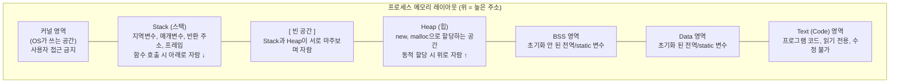
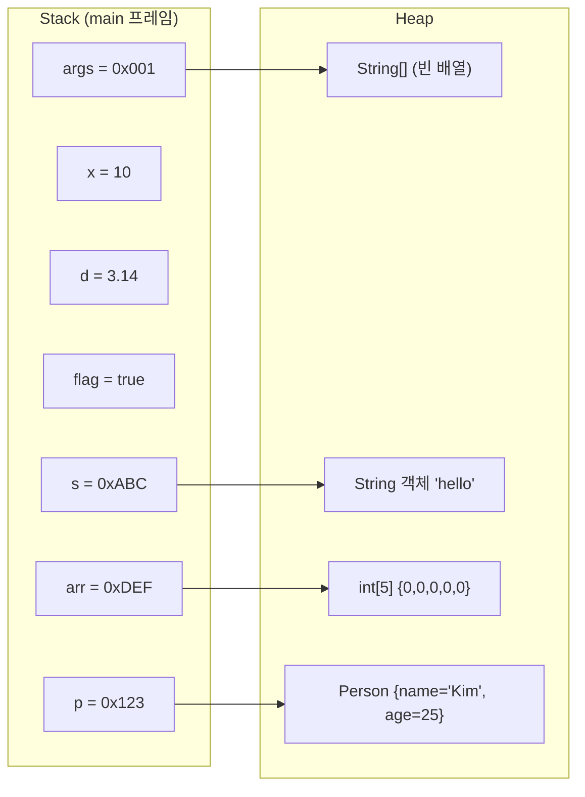

# 03. 프로세스 메모리 구조 - Beta

---

## 1. 프로세스 메모리 레이아웃 - "이게 뭐야?"

### 비유부터 가자

회사 사무실을 생각해봐.

사무실 안에 구역이 나뉘어 있잖아. 회의실, 개인 책상, 공용 창고, 안내 데스크.
각 구역마다 용도가 다르고, 쓰는 방식도 다르고, 누가 관리하는지도 달라.

프로세스의 메모리도 **구역이 나뉘어 있어.** 각 구역마다 저장하는 데이터가 다르고, 관리 방식이 다르고, 크기가 변하는 방식도 달라.

비유는 여기까지. **진짜는 이거야.**

### 프로세스 메모리 레이아웃

프로세스가 OS로부터 할당받은 가상 메모리 공간은 이렇게 생겼어:



### 각 영역 간단 설명

| 영역 | 저장하는 것 | 특징 |
|------|------------|------|
| **Text (Code)** | 컴파일된 기계어 코드 | 읽기 전용. 실행 중 변경 불가. |
| **Data** | 초기화된 전역/static 변수 | `static int x = 10;` |
| **BSS** | 초기화 안 된 전역/static 변수 | `static int y;` (0으로 초기화) |
| **Heap** | 동적 할당된 객체 | `new`, `malloc`. 위로 자람 (↑) |
| **Stack** | 지역변수, 매개변수, 반환주소 | 함수 호출마다 프레임 추가. 아래로 자람 (↓) |

---

## 2. Text / Data / BSS 영역 - "간단히 짚고 넘어가자"

이 세 영역은 **프로그램 시작 시 크기가 결정**되고 실행 중에 변하지 않아.

!!! example "C 코드 예시로 각 영역 구분"
    ```c
    int global_init = 42;         // Data 영역 (초기화된 전역 변수)
    int global_noinit;            // BSS 영역 (초기화 안 된 전역 변수)
    static int static_init = 7;   // Data 영역 (초기화된 static)
    static int static_noinit;     // BSS 영역 (초기화 안 된 static)
    const char* msg = "hello";    // Data 영역 (문자열 리터럴)

    void main() {                 // ← 이 함수의 기계어 코드 = Text 영역
        int local = 5;            // ← Stack
        int* p = malloc(100);     // ← p는 Stack, 100바이트는 Heap
    }
    ```

**BSS vs Data 왜 분리?**
BSS는 전부 0이야. 파일에 0을 잔뜩 저장할 필요 없이 "이 영역은 X바이트이고 전부 0이야"라는 정보만 있으면 돼. 실행 파일 크기를 줄이는 거야.

---

## 3. Stack 상세 - "핵심 중의 핵심"

### Stack이란?

> **Stack = 함수 호출과 관련된 데이터를 저장하는 LIFO(Last In, First Out) 구조의 메모리 영역**

LIFO가 뭐냐? 접시 쌓기야. 마지막에 올린 접시를 먼저 꺼내잖아. 함수도 마찬가지야. 마지막에 호출된 함수가 먼저 끝나.

### Stack Frame (스택 프레임)

함수가 호출될 때마다 **스택 프레임(Stack Frame)**이 하나씩 쌓여.
함수가 끝나면(return) 그 프레임이 사라져.

!!! example "함수 호출 시 Stack 변화"
    ```c
    void c() { int z = 30; }
    void b() { int y = 20; c(); }
    void a() { int x = 10; b(); }
    void main() { a(); }
    ```

    - 실행 순서: main → a → b → c
    - 종료 순서: c → b → a → main (LIFO!)

    ```
    main() 호출     a() 호출        b() 호출        c() 호출

    ┌──────────┐   ┌──────────┐   ┌──────────┐   ┌──────────┐
    │          │   │          │   │          │   │ c()      │  ← 꼭대기
    │          │   │          │   │ b()      │   │ z = 30   │
    │          │   │ a()      │   │ y = 20   │   ├──────────┤
    │ main()   │   │ x = 10   │   ├──────────┤   │ b()      │
    │          │   ├──────────┤   │ a()      │   │ y = 20   │
    │          │   │ main()   │   │ x = 10   │   ├──────────┤
    └──────────┘   └──────────┘   ├──────────┤   │ a()      │
                                   │ main()   │   │ x = 10   │
                                   └──────────┘   ├──────────┤
                                                   │ main()   │
                                                   └──────────┘

    c() return 후   b() return 후   a() return 후

    ┌──────────┐   ┌──────────┐   ┌──────────┐
    │ b()      │   │ a()      │   │ main()   │  ← 하나씩 사라짐
    │ y = 20   │   │ x = 10   │   │          │
    ├──────────┤   ├──────────┤   └──────────┘
    │ a()      │   │ main()   │
    │ x = 10   │   └──────────┘
    ├──────────┤
    │ main()   │
    └──────────┘
    ```

### 스택 프레임 내부 구조

하나의 스택 프레임 안에 뭐가 들어있는지 뜯어보자.

!!! note "하나의 스택 프레임 내부 (높은 주소 → 낮은 주소)"
    | 영역 | 설명 |
    |---|---|
    | 매개변수 (Parameters) | 호출자(caller)가 전달한 인자 값 |
    | 반환 주소 (Return Addr) | 이 함수 끝나면 어디로 돌아갈지 |
    | 이전 프레임 포인터 (FP) | 이전 스택 프레임의 위치 (복원용) |
    | 지역변수 (Local Vars) | 이 함수 안에서 선언한 변수들 |
    | 임시 저장소 | 연산 중간 결과 등 |

    **예시:** `void add(int a, int b) { int result = a + b; return result; }`

    | 영역 | 값 | 설명 |
    |---|---|---|
    | 매개변수 | a = 3, b = 5 | 매개변수 |
    | 반환 주소 | 0x00401234 | caller의 다음 명령 위치 |
    | 이전 FP | 이전 FP 값 | 호출자의 프레임 포인터 |
    | 지역변수 | result = 8 | 지역변수 |

### Stack의 핵심 특성

!!! tip "Stack의 핵심 특성"
    1. **자동 관리**: 함수 호출 → 프레임 자동 생성 / 함수 return → 프레임 자동 제거. 개발자가 할당/해제 신경 쓸 필요 없음
    2. **빠름**: Stack Pointer만 이동하면 끝 (O(1)). 힙처럼 빈 공간 찾을 필요 없음
    3. **크기 제한**: 보통 1~8MB (OS/언어마다 다름). 무한히 쌓으면 → Stack Overflow
    4. **LIFO**: 마지막에 호출된 함수가 먼저 종료. 호출 순서의 역순으로 정리
    5. **스레드별**: 각 스레드가 자기만의 Stack을 가짐. 다른 스레드의 Stack에 접근 불가

---

## 4. Heap 상세 - "동적 할당의 세계"

### Heap이란?

> **Heap = 프로그램 실행 중에 동적으로 할당/해제하는 메모리 영역**

Stack은 함수 호출 시 자동으로 관리되지만, Heap은 **개발자가 명시적으로 요청**해야 해.

```
C/C++:   malloc() / free()          ← 수동 관리
Java:    new 키워드 / GC가 해제     ← GC가 해제 담당
Python:  객체 생성 / GC가 해제      ← GC가 해제 담당
```

### 왜 Heap이 필요해?

Stack만으로 충분하지 않은 상황이 있어:

!!! note "왜 Heap이 필요해?"
    | 상황 | Stack | Heap |
    |---|---|---|
    | **1. 함수가 끝나도 데이터가 살아있어야 할 때** | 함수 return하면 지역변수 소멸 | 함수 끝나도 객체가 살아있음 |
    | **2. 크기를 미리 모를 때** | 컴파일 시 크기 결정 | 런타임에 크기 결정 가능 |
    | **3. 큰 데이터** | 1~8MB 제한 | GB 단위 할당 가능 |
    | **4. 여러 스레드가 공유해야 할 때** | 스레드별 독립 | 모든 스레드가 같은 Heap 공유 |

### Heap의 핵심 특성

!!! tip "Heap의 핵심 특성"
    1. **수동 관리 (C/C++) 또는 GC 관리 (Java/Python)**: C에서 free() 안 하면 메모리 누수. Java에서 참조 안 끊으면 GC가 해제 못 함
    2. **느림**: 빈 공간 찾아야 함 (메모리 할당 알고리즘). 단편화 발생 가능
    3. **크기 유연**: 런타임에 크기 결정. 필요한 만큼 요청. GB 단위도 가능 (RAM 허용 범위 내)
    4. **스레드 공유**: 같은 프로세스의 모든 스레드가 Heap 공유 → 동시 접근 시 동기화 필요 (synchronized 등)
    5. **단편화 문제**: 할당/해제 반복하면 빈 공간이 조각남
        ```
        [사용][  ][사용][사용][  ][  ][사용][  ]
              빈      빈 빈      빈
        → 연속 3칸 빈 공간 없음. 3칸짜리 할당 불가.
        ```

---

## 5. Stack vs Heap 비교 - "이거 면접에 나온다"

| 항목 | Stack | Heap |
|---|---|---|
| **저장 대상** | 지역변수, 매개변수, 반환 주소 | 동적 할당 객체 (new, malloc) |
| **할당 속도** | 매우 빠름 (O(1)), SP 이동만 하면 끝 | 느림 (빈 공간 탐색), 할당 알고리즘 실행 |
| **해제 방식** | 자동 (함수 종료) | 수동 (free) / GC |
| **크기** | 작음 (1~8MB) | 큼 (수 GB 가능) |
| **성장 방향** | 높은 주소 → 낮은 주소 (아래로) | 낮은 주소 → 높은 주소 (위로) |
| **스레드 공유** | 공유 안 함 (스레드별 독립) | 공유함 (동기화 필요) |
| **수명** | 함수 스코프 | 참조가 있는 동안 유지 |
| **단편화** | 없음 | 발생 가능 |
| **오버플로우 시** | StackOverflowError | OutOfMemoryError |
| **관리 주체** | 컴파일러/OS | 개발자/GC |

---

## 6. 왜 Stack과 Heap을 분리했는가? - "5 Whys"

이건 그냥 넘어가면 안 돼. **근본까지 파야 해.**

```
Q1: "왜 Stack과 Heap을 분리했어?"
A1: "용도가 다르니까요."

Q2: "용도가 다르다는 게 구체적으로 뭐야?"
A2: "Stack은 함수 호출 관리, Heap은 동적 데이터 관리요."

Q3: "왜 같은 영역에서 둘 다 못 해?"
A3: "Stack은 LIFO 순서로 반드시 정리되어야 하는데,
     Heap의 데이터는 순서 없이 생성/소멸돼요.
     둘의 생명주기 관리 방식이 근본적으로 다릅니다."

Q4: "생명주기 관리 방식이 다르면 왜 같이 못 해?"
A4: "Stack은 SP(Stack Pointer) 하나만 움직이면 O(1)로 관리 가능한데,
     Heap처럼 아무 순서로 할당/해제하면 단편화가 생기고
     빈 공간 탐색에 오버헤드가 생겨요.
     Stack의 O(1) 성능을 유지하려면 분리해야 합니다."

Q5: "그래서 근본 원칙이 뭐야?"
A5: "생명주기(lifetime)와 할당 패턴(allocation pattern)이
     다른 데이터는 별도 영역에서 관리해야
     각 영역의 최적 관리 전략을 적용할 수 있다.

     Stack: 예측 가능한 LIFO → 포인터 이동만으로 초고속 관리
     Heap: 예측 불가능한 랜덤 패턴 → 복잡한 할당자 필요

     이걸 섞으면 둘 다 느려진다. 분리해야 각자 최적화 가능."
```

---

## 7. Stack Overflow vs OutOfMemoryError - "코드로 보자"

### Stack Overflow

```java
// ❌ 이러면 터진다
public class StackOverflowDemo {

    public static void infinite() {
        infinite();  // 자기 자신을 계속 호출 (무한 재귀)
    }
    // 호출할 때마다 Stack에 프레임이 쌓임
    // Stack 크기 제한 (보통 512KB ~ 1MB) 초과
    // → java.lang.StackOverflowError

    public static void main(String[] args) {
        infinite();
        // 실행 결과: Exception in thread "main"
        //           java.lang.StackOverflowError
    }
}
```

```
Stack 상태 시각화:

   ┌──────────┐
   │ infinite │  ← 10,000번째 호출... Stack 터짐!
   ├──────────┤
   │ infinite │  ← 9,999번째
   ├──────────┤
   │ ...      │  ← 수천 개...
   ├──────────┤
   │ infinite │  ← 2번째
   ├──────────┤
   │ infinite │  ← 1번째
   ├──────────┤
   │ main     │
   └──────────┘

   Stack 크기 한계 도달 → StackOverflowError
```

**흔한 StackOverflow 원인들:**

```
1. 무한 재귀 (재귀 탈출 조건 빠뜨림)
2. 재귀 깊이가 너무 깊음 (데이터 양이 많을 때)
3. 너무 큰 지역 변수 (C에서 int arr[1000000]; 같은 짓)
```

### OutOfMemoryError

```java
// ❌ 이러면 터진다
import java.util.ArrayList;
import java.util.List;

public class OOMDemo {

    public static void main(String[] args) {
        List<byte[]> list = new ArrayList<>();

        while (true) {
            list.add(new byte[1024 * 1024]);  // 1MB 배열을 Heap에 계속 할당
            // list가 참조를 유지하고 있으므로 GC가 해제 못 함
            // Heap 크기 한계 도달
            // → java.lang.OutOfMemoryError: Java heap space
        }
    }
}
```

```
Heap 상태 시각화:

   ┌────────────────────────────────────────────────┐
   │ Heap (예: -Xmx256m = 256MB 제한)               │
   │                                                │
   │ [1MB][1MB][1MB][1MB][1MB][1MB]...[1MB][1MB]    │
   │  ↑                                        ↑    │
   │  list.get(0)                    list.get(255)  │
   │                                                │
   │  256개 채움 → 더 이상 공간 없음                │
   │  → OutOfMemoryError: Java heap space           │
   └────────────────────────────────────────────────┘
```

**흔한 OOM 원인들:**

```
1. 메모리 누수 (객체 참조를 안 끊어서 GC가 해제 못 함)
2. 한 번에 너무 큰 데이터 로드 (DB에서 100만 건 List로 가져오기)
3. 캐시를 무한히 쌓기 (만료 정책 없이)
4. -Xmx 설정이 너무 작음
```

---

## 8. Java에서 Stack과 Heap 구분 - "코드로 보자"

이게 가장 중요해. **뭐가 Stack에 가고 뭐가 Heap에 가는지** 확실히 구분해야 해.

```java
public class MemoryDemo {

    // static 변수 → Method Area (Data 영역의 일종)
    static int classVar = 100;

    public static void main(String[] args) {    // args → Stack (main 프레임)

        // 기본형(Primitive) → Stack
        int x = 10;                             // Stack: x = 10
        double d = 3.14;                        // Stack: d = 3.14
        boolean flag = true;                    // Stack: flag = true

        // 참조형(Reference) → 참조는 Stack, 객체는 Heap
        String s = new String("hello");         // Stack: s = 0xABC (참조/주소)
                                                // Heap:  0xABC → "hello" 객체

        int[] arr = new int[5];                 // Stack: arr = 0xDEF (참조)
                                                // Heap:  0xDEF → [0,0,0,0,0]

        Person p = new Person("Kim", 25);       // Stack: p = 0x123 (참조)
                                                // Heap:  0x123 → Person 객체
    }
}
```

시각적으로 보자:



!!! info ""
    - 기본형 값: Stack에 직접 저장
    - 참조형: 참조(주소)는 Stack, 실제 객체는 Heap

### 핵심 규칙

!!! warning "Java 메모리 배치 규칙"
    1. **기본형** (int, double, boolean, char, long, float, byte, short) → 값 자체가 Stack에 저장
    2. **참조형** (클래스, 배열, 인터페이스, String 등) → 참조(주소)는 Stack에 저장, 실제 객체는 Heap에 저장
    3. **static 변수** → Method Area에 저장 (JVM의 특수 영역)
    4. **문자열 리터럴** ("hello") → String Constant Pool (Heap 내부의 특수 영역)

### 메서드 호출 시 Stack 변화

```java
public class CallDemo {

    public static int add(int a, int b) {   // a, b → 새 Stack 프레임
        int result = a + b;                  // result → 같은 프레임
        return result;                       // return 후 프레임 소멸
    }

    public static void main(String[] args) {
        int x = 3;                           // main 프레임
        int y = 5;                           // main 프레임
        int sum = add(x, y);                 // add 호출 → 새 프레임 생성
        // add return 후 → add 프레임 소멸
        // sum = 8 (main 프레임에 저장)
    }
}
```

```
시간 순서대로 Stack 변화:

   (1) main 시작          (2) add 호출           (3) add return
                                                      add 프레임 소멸
   ┌──────────────┐      ┌──────────────┐       ┌──────────────┐
   │              │      │ add 프레임   │       │              │
   │              │      │  a = 3       │       │              │
   │              │      │  b = 5       │       │              │
   │              │      │  result = 8  │       │              │
   │              │      ├──────────────┤       │              │
   │ main 프레임  │      │ main 프레임  │       │ main 프레임  │
   │  x = 3       │      │  x = 3       │       │  x = 3       │
   │  y = 5       │      │  y = 5       │       │  y = 5       │
   │  sum = ?     │      │  sum = ?     │       │  sum = 8     │ ← 반환값
   └──────────────┘      └──────────────┘       └──────────────┘
```

---

## 9. 주의사항 / 함정

### 함정 1: "Java니까 메모리 관리 안 해도 돼"

GC가 해제를 해줄 뿐이지, **할당은 개발자가 한다.** 그리고 GC도 만능이 아니야.

```java
// ❌ 메모리 누수 (Memory Leak) - GC가 해제 못 함
public class LeakExample {
    private static List<Object> cache = new ArrayList<>();  // static이라 안 죽음

    public void process() {
        Object data = loadHugeData();   // 큰 데이터 로드
        cache.add(data);                // static 리스트에 추가
        // 이 메서드 끝나도 cache가 data 참조를 유지
        // GC는 참조가 있으면 해제 안 함
        // → 메모리 계속 쌓임 → 결국 OOM
    }
}
```

### 함정 2: "Stack이 빠르니까 전부 Stack에 넣으면 되지"

Stack은 **1~8MB**가 한계야. 1MB짜리 배열도 Stack에 넣으면 터져.
그리고 Stack은 함수 끝나면 사라지니까, 함수 밖에서도 써야 하는 데이터는 Heap에 넣어야 해.

### 함정 3: "String은 기본형이다"

아니야. **String은 참조형**이야. Java에서 기본형은 딱 8개(int, long, double, float, boolean, char, byte, short)뿐이야. String은 클래스고, 참조가 Stack에, 객체가 Heap에 저장돼.

```java
// 이 둘의 차이를 구분 못 하면 안 돼
String s1 = "hello";             // String Constant Pool에서 가져옴
String s2 = new String("hello"); // 새 객체를 Heap에 생성

System.out.println(s1 == s2);    // false (다른 주소)
System.out.println(s1.equals(s2)); // true (같은 값)
```

### 함정 4: Stack 크기 변경 가능한 거 모름

```
Java: -Xss 옵션으로 스레드당 Stack 크기 설정
      java -Xss2m MyApp  → 스레드당 Stack 2MB

      근데 크게 하면?
      → 스레드 수 * Stack 크기 = 전체 메모리 소모
      → 스레드 1000개 * 2MB = 2GB가 Stack만으로 사라짐
      → 트레이드오프야. 필요한 만큼만.
```

---

## 10. 정리

| 항목 | 내용 |
|------|------|
| **Text** | 기계어 코드. 읽기 전용. |
| **Data** | 초기화된 전역/static 변수 |
| **BSS** | 초기화 안 된 전역/static 변수 (0으로 세팅) |
| **Heap** | 동적 할당 (new/malloc). 위로 자람. 수동 관리 or GC. |
| **Stack** | 함수 호출 프레임. LIFO. 아래로 자람. 자동 관리. |
| **기본형** | 값이 Stack에 직접 저장 |
| **참조형** | 참조(주소)는 Stack, 객체는 Heap |
| **분리 이유** | 생명주기와 할당 패턴이 다르므로 분리해야 각각 최적화 가능 |
| **Stack Overflow** | Stack 크기 초과. 주로 무한 재귀. |
| **OOM** | Heap 크기 초과. 주로 메모리 누수, 과다 할당. |

### 한 줄 정리

> **"Stack은 함수 호출의 자동 관리자, Heap은 개발자가 요청한 데이터의 저장소. 둘의 생명주기가 다르니까 분리한 거고, 각각의 위험(StackOverflow/OOM)도 다르다."**

### 이 챕터에서 반드시 기억할 것

1. 기본형 값은 Stack에, 참조형 객체는 Heap에, 참조(주소)는 Stack에. 이거 헷갈리면 안 돼.
2. Stack은 자동 관리 + 빠름 + 작음. Heap은 수동(GC) 관리 + 느림 + 큼.
3. Stack과 Heap을 분리한 이유를 5 Whys로 설명할 수 있어야 해.
4. StackOverflowError와 OutOfMemoryError의 원인과 발생 영역을 구분할 수 있어야 해.

---

### 확인 문제 (5문제)

> 다음 문제를 풀어봐. 답 못 하면 위에서 다시 읽어.

**Q1.** 다음 Java 코드에서 Stack에 저장되는 것과 Heap에 저장되는 것을 각각 구분해봐.
```java
int age = 25;
String name = new String("Kim");
int[] scores = {90, 85, 100};
```

**Q2.** Stack과 Heap의 성장 방향이 서로 반대인 이유는 뭐야? (힌트: 메모리 레이아웃 다이어그램 참고)

**Q3.** StackOverflowError가 발생하는 가장 흔한 원인을 코드 예시와 함께 설명해봐.

**Q4.** Java에서 GC(가비지 컬렉터)가 있는데도 OutOfMemoryError가 발생할 수 있는 이유를 설명해봐. 코드 예시로 보여줘.

**Q5.** Stack과 Heap을 하나의 영역으로 합치면 안 되는 근본적인 이유를 "생명주기"와 "할당 패턴" 관점에서 설명해봐.

??? success "정답 보기"
    **A1.**

    - **Stack**: `age = 25` (기본형 값), `name = 0x주소` (String 참조), `scores = 0x주소` (배열 참조)
    - **Heap**: `"Kim"` String 객체 (0x주소가 가리키는 실체), `{90, 85, 100}` int 배열 객체 (0x주소가 가리키는 실체)
    - 핵심: **기본형의 값**은 Stack에 직접, **참조형의 참조(주소)**는 Stack에, **참조형의 실제 객체**는 Heap에 저장된다.

    **A2.** Stack(높은 주소에서 낮은 주소로)과 Heap(낮은 주소에서 높은 주소로)이 서로 마주보며 자라도록 설계한 이유는, **가용 공간을 최대한 효율적으로 사용**하기 위해서다. 중간의 빈 공간을 둘이 공유하므로, Stack이 적게 쓰면 Heap이 많이 쓸 수 있고 그 반대도 가능하다. 같은 방향으로 자라면 한쪽이 고정 크기를 차지해서 다른 쪽이 쓸 수 있는 공간이 줄어든다.

    **A3.** 가장 흔한 원인은 **무한 재귀**다.

    ```java
    public static void infinite() {
        infinite(); // 탈출 조건 없이 자기 자신을 호출
    }
    ```

    호출할 때마다 Stack에 프레임이 쌓이고, Stack 크기 제한(보통 512KB~1MB)을 초과하면 StackOverflowError가 발생한다. 재귀 함수에는 반드시 탈출 조건(base case)이 있어야 한다.

    **A4.** GC는 **참조가 없는 객체만** 해제할 수 있다. 참조가 남아있으면 GC도 손 못 댄다.

    ```java
    static List<Object> cache = new ArrayList<>();
    public void process() {
        cache.add(loadHugeData()); // static 리스트가 계속 참조 유지
    }
    ```

    `cache`가 static이라 프로그램 종료까지 살아있고, 그 안의 객체들을 계속 참조하니까 GC가 해제 불가. 결국 Heap이 가득 차서 OOM 발생. 이것이 **메모리 누수(Memory Leak)**다.

    **A5.** Stack은 **LIFO 순서**로 할당/해제가 일어나며, 함수 종료 시 자동으로 정리된다. 이 예측 가능한 패턴 덕분에 Stack Pointer 하나만 이동시키는 O(1) 관리가 가능하다. 반면 Heap은 **임의 순서**로 할당/해제가 일어나며, 생명주기가 함수 스코프와 무관하다. 이 두 가지를 같은 영역에 섞으면, Stack의 O(1) 관리가 불가능해지고(LIFO 패턴이 깨지므로), Heap의 유연한 할당도 Stack 프레임에 의해 제약된다. **각각의 최적 관리 전략이 근본적으로 다르기 때문에 분리해야** 둘 다 효율적으로 운영할 수 있다.
