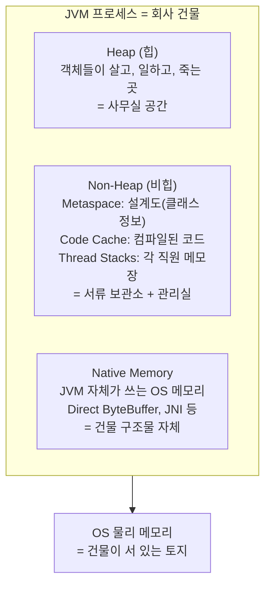
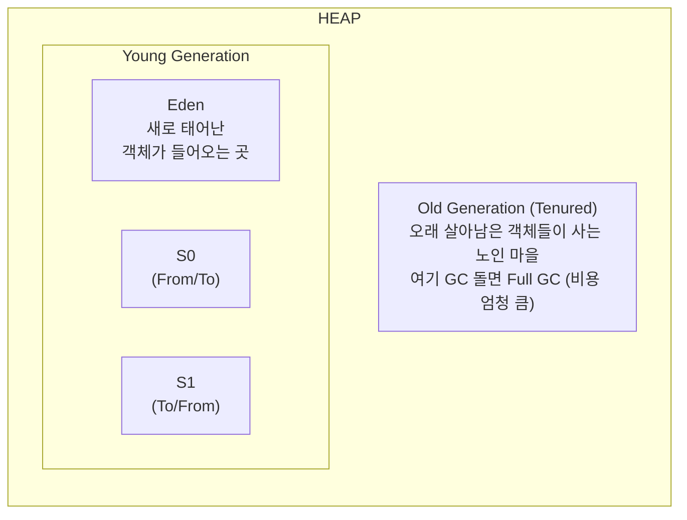
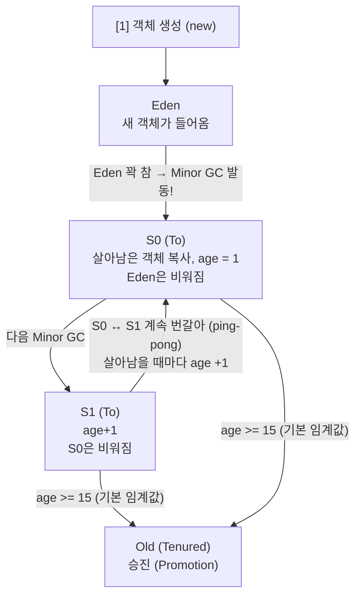
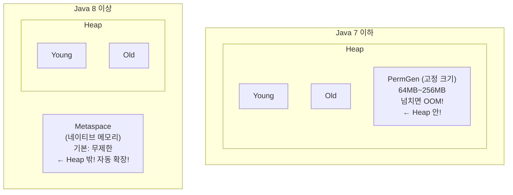
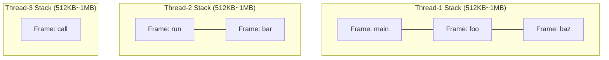

# 04. JVM 메모리 구조 - Beta

---

## 이 챕터를 왜 알아야 하냐면

03장에서 프로세스 메모리 구조(Stack, Heap, Data, Code)를 배웠지?
그건 **OS가 보는** 메모리 구조야. C/C++ 같은 네이티브 언어가 그 위에서 직접 돈다.

근데 Java는 다르다. Java는 OS 위에 **JVM이라는 가상 머신**이 하나 더 올라가.
JVM이 OS한테 메모리를 한 뭉텅이 받아와서, **자기만의 규칙으로 재분배**한다.

이걸 모르면? GC가 왜 도는지 모르고, OutOfMemoryError 떴을 때 "힙 늘려주세요"밖에 못 해.
그건 개발자가 아니라 버튼 누르는 사람이야.

---

## 1. JVM 메모리 전체 구조 - "회사 건물"

### 비유: 회사 건물

JVM 프로세스 하나를 **회사 건물 하나**라고 생각해봐.



비유는 이해 돕기용이고, 진짜는 이거야:

| 영역 | 뭐가 들어가나 | 누가 관리하나 | 크기 제한 |
|------|---------------|---------------|-----------|
| **Heap** | 모든 객체 인스턴스, 배열 | GC가 관리 | `-Xms` / `-Xmx`로 설정 |
| **Metaspace** | 클래스 메타데이터, 상수풀 | JVM (Java 8+) | `-XX:MaxMetaspaceSize` (기본: 무제한) |
| **Code Cache** | JIT 컴파일된 네이티브 코드 | JVM | `-XX:ReservedCodeCacheSize` |
| **Thread Stack** | 메서드 호출 스택 프레임 | 스레드별 독립 | `-Xss` (기본 512KB~1MB) |
| **Native** | Direct Buffer, JNI, JVM 내부 | OS | OS 메모리 한도까지 |

---

## 2. Heap 상세 - "객체가 태어나고 죽는 곳"

Heap은 JVM에서 가장 중요한 영역이야. **모든 객체**가 여기서 생성되고, **GC**가 여기를 청소한다.

근데 Heap을 그냥 한 덩어리로 쓰면 비효율적이야. 그래서 **세대별로 나눴다**.

### 2.1 Heap 내부 구조



!!! info ""
    - 비율: Eden:S0:S1 = 8:1:1 (기본)
    - Young : Old 비율 = 1 : 2 (기본, NewRatio=2)

| 영역 | 역할 | 크기 비율 (기본) |
|------|------|-----------------|
| **Eden** | 새 객체가 처음 생성되는 곳 | Young의 80% |
| **Survivor 0 (S0)** | Minor GC 후 살아남은 객체 임시 보관 | Young의 10% |
| **Survivor 1 (S1)** | S0과 번갈아 사용 (From/To) | Young의 10% |
| **Old (Tenured)** | 오래 살아남은 객체가 승진하는 곳 | 전체 Heap의 2/3 |

### 2.2 왜 Young/Old로 나눴나? - Weak Generational Hypothesis

이거 그냥 "그렇게 만들었으니까" 아니야. **관찰에 기반한 가설**이 있다.

!!! abstract "Weak Generational Hypothesis (세대 가설)"
    **가설 1: "대부분의 객체는 금방 죽는다" (infant mortality)**

    ```
    객체 수
     │
     │████
     │████
     │████ ██
     │████ ████
     │████ ████ ██
     │████ ████ ████ ██ ▁▁ ▁▁ ▁▁ ▁▁ ▁▁ ▁▁
     └──────────────────────────────────────── 수명
      짧다                                    길다
    ```

    - 80~90% 객체는 한 번 쓰고 버려진다
    - 메서드 안에서 만든 지역 객체, 임시 문자열 등

    **가설 2: "오래 살아남은 객체는 계속 살아남을 확률이 높다"**

    - 캐시, 싱글톤, 설정 객체 등
    - 이런 건 매번 검사할 필요 없다

**그래서 결론이 뭐냐?**

- 금방 죽는 놈들(Young) → 자주 + 빠르게 청소 (Minor GC)
- 오래 사는 놈들(Old) → 가끔 + 천천히 청소 (Major/Full GC)

이걸 분리 안 하고 한 덩어리로 GC 돌리면? 전체를 매번 스캔해야 하니까 **존나 느려진다**.
세대별로 나누면 Young 영역만 빠르게 훑으면 80~90%는 정리 끝.

---

## 3. 객체의 일생 - "Eden에서 Old까지"

### 3.1 단계별 흐름



### 3.2 Age Count와 임계값

| 항목 | 값 | 설명 |
|------|-----|------|
| 초기 age | 0 | Eden에서 처음 생성 |
| Minor GC 생존 시 | age + 1 | Survivor로 복사될 때마다 증가 |
| 기본 임계값 | 15 | `-XX:MaxTenuringThreshold=15` |
| 최대 가능 값 | 15 | Object Header의 age 필드가 4bit (0~15) |
| 임계값 도달 시 | Old로 승진 | Promotion |

**주의: 조기 승진 (Premature Promotion) 케이스**

age가 15 안 돼도 Old로 가는 경우가 있어:

1. **Survivor 공간 부족** → 넘치면 바로 Old로 보낸다
2. **큰 객체** → Eden에 안 들어가면 바로 Old로 간다 (`-XX:PretenureSizeThreshold`)
3. **동적 age 판단** → 같은 age의 객체 합계가 Survivor의 50% 넘으면 그 age 이상 전부 Old로

```
⚠️ 조기 승진이 많으면?
   → Old가 빠르게 차고
   → Full GC가 자주 발생하고
   → Stop-The-World 시간이 길어지고
   → 서비스 응답 시간 폭등
   → 장애
```

---

## 4. Non-Heap 영역 - "회사의 관리 인프라"

### 4.1 Metaspace (Java 8+)

!!! warning "Metaspace"
    **저장하는 것:**

    - 클래스 메타데이터 (클래스 구조, 메서드 정보, 필드 정보)
    - 상수풀 (Constant Pool)
    - 어노테이션 정보
    - 메서드 바이트코드

    **위치:** Heap 밖. OS 네이티브 메모리에 할당.

    **기본 크기 제한:** 없음 (무제한) -- 이게 함정이야!

### 4.2 PermGen vs Metaspace (Java 7 vs 8)

Java 8에서 PermGen을 없애고 Metaspace를 도입했다. 왜?



| 비교 항목 | PermGen (Java 7-) | Metaspace (Java 8+) |
|-----------|-------------------|---------------------|
| 위치 | JVM Heap 안 | OS 네이티브 메모리 |
| 기본 크기 | 64MB (조정 가능) | 무제한 |
| 크기 조절 | `-XX:MaxPermSize` | `-XX:MaxMetaspaceSize` |
| 넘치면? | `PermGen space` OOM | `Metaspace` OOM |
| GC 대상? | Full GC 때 같이 | 클래스 언로딩 시 |
| 문제점 | 크기 예측 어려움 | 무제한이라 OS 메모리 잡아먹음 |

### 4.3 Metaspace 무제한이 왜 위험한가?

이거 "무제한이니까 좋네~" 하면 안 돼.

```
무제한 = 제한 없이 OS 메모리를 계속 잡아먹는다

시나리오:
1. 동적 클래스 생성 라이브러리 사용 (CGLIB, Javassist, 리플렉션 프록시)
2. 클래스가 계속 생성되는데 언로딩이 안 됨
3. Metaspace가 계속 커짐
4. OS 물리 메모리 고갈
5. OS가 OOM Killer 발동
6. JVM 프로세스 강제 종료
7. 서비스 다운

→ Heap OOM은 "java.lang.OutOfMemoryError" 로그라도 남지만
→ OS OOM Killer는 SIGKILL이라 로그도 안 남을 수 있어
→ "갑자기 프로세스가 사라졌는데 왜인지 모르겠어요" = 이 케이스 의심
```

**실무 권장**: 반드시 `-XX:MaxMetaspaceSize` 설정해라.

```bash
# 프로덕션 권장 설정
java -XX:MaxMetaspaceSize=256m -jar app.jar
```

### 4.4 Code Cache

JIT(Just-In-Time) 컴파일러가 바이트코드를 네이티브 코드로 변환한 결과를 저장하는 곳.

| 항목 | 값 |
|------|-----|
| 기본 크기 | 240MB (Java 8+, Tiered) |
| 설정 | `-XX:ReservedCodeCacheSize` |
| 꽉 차면? | JIT 컴파일 중단, 성능 저하 |

### 4.5 Thread Stack

각 스레드마다 독립적으로 할당되는 스택 메모리.



스레드 수 x 스택 크기 = 전체 스택 메모리

- 스레드 200개 x 1MB = 200MB
- 스레드 1000개 x 1MB = **1GB** ← 스레드 많으면 이것만으로 무시 못 해

---

## 5. JVM 프로세스의 전체 메모리 사용량

이게 핵심이야. **`-Xmx` 설정한 게 JVM이 쓰는 메모리의 전부가 아니다.**

!!! danger "JVM 프로세스 총 메모리 사용량"
    | 영역 | 예시 |
    |---|---|
    | Heap (-Xmx) | 2GB |
    | + Metaspace | 200MB |
    | + Code Cache | 240MB |
    | + Thread Stacks (스레드수 x Xss) | 200MB |
    | + Direct ByteBuffer | 100MB |
    | + JVM 내부 구조체 | 100MB |
    | + GC 자체가 쓰는 메모리 | 50MB |
    | + JNI | 50MB |
    | **= 실제 OS 메모리 사용량** | **약 2.9GB** |

    **-Xmx=2g로 설정해도 실제로는 3GB 가까이 쓸 수 있다!**

**이게 왜 중요하냐?**

```
시나리오:
- 서버 물리 메모리: 4GB
- -Xmx=4g 설정  ← "메모리 4GB니까 힙도 4GB로!"
- 실제 JVM 사용량: 5~6GB
- OS가 Swap 쓰기 시작
- 성능 폭망
- 최악의 경우 OOM Killer에 의해 프로세스 사망

정답:
- 4GB 서버면 -Xmx=2g ~ 2.5g 정도가 현실적
- OS도 메모리 필요하고, Non-Heap도 메모리 쓰니까
```

---

## 6. 코드로 보자

### 6.1 현재 JVM 메모리 상태 확인

```java
public class JvmMemoryInfo {
    public static void main(String[] args) {
        Runtime rt = Runtime.getRuntime();

        // 힙 메모리 정보
        long maxMemory = rt.maxMemory();        // -Xmx 값 (최대 힙)
        long totalMemory = rt.totalMemory();    // 현재 할당된 힙
        long freeMemory = rt.freeMemory();      // 할당된 힙 중 남은 공간
        long usedMemory = totalMemory - freeMemory;  // 실제 사용 중

        System.out.println("=== JVM Heap Memory ===");
        System.out.println("Max   : " + toMB(maxMemory) + " MB");   // -Xmx
        System.out.println("Total : " + toMB(totalMemory) + " MB"); // 현재 확보
        System.out.println("Used  : " + toMB(usedMemory) + " MB");  // 실제 사용
        System.out.println("Free  : " + toMB(freeMemory) + " MB");  // 여유분

        // 힙 사용률
        double usage = (double) usedMemory / maxMemory * 100;
        System.out.println("Usage : " + String.format("%.1f", usage) + "%");
    }

    private static long toMB(long bytes) {
        return bytes / (1024 * 1024);
    }
}
```

### 6.2 객체가 어디에 생기는지 실험

```java
public class ObjectLifecycleDemo {
    // static 필드 → 객체는 Heap에, 참조는 Metaspace(클래스 메타데이터)에
    static List<byte[]> oldObjects = new ArrayList<>();

    public static void main(String[] args) {
        // 1. Eden에 객체 생성
        for (int i = 0; i < 100; i++) {
            byte[] temp = new byte[1024];  // 1KB 객체 → Eden
            // temp는 루프 끝나면 참조 끊김 → 다음 Minor GC에서 수거
        }

        // 2. 오래 살아남는 객체 (Old로 갈 후보)
        for (int i = 0; i < 10; i++) {
            oldObjects.add(new byte[1024 * 1024]);  // 1MB 객체
            // static List에 참조 유지 → GC 안 됨 → 계속 살아남음
            // age 쌓여서 결국 Old로 승진
        }

        // 3. 큰 객체 → 바로 Old로 갈 수 있음
        byte[] bigObject = new byte[10 * 1024 * 1024]; // 10MB
        // Eden/Survivor에 안 들어가면 바로 Old 직행
    }
}
```

### 6.3 JVM 옵션으로 메모리 구조 설정

```bash
java \
  -Xms512m \                        # 초기 힙 크기
  -Xmx2g \                          # 최대 힙 크기
  -Xmn512m \                        # Young Generation 크기
  -XX:SurvivorRatio=8 \              # Eden:S0:S1 = 8:1:1
  -XX:MaxTenuringThreshold=15 \      # Old 승진 임계값
  -XX:MaxMetaspaceSize=256m \        # Metaspace 최대 크기
  -Xss512k \                         # 스레드 스택 크기
  -XX:+PrintGCDetails \              # GC 로그 출력
  -jar app.jar
```

---

## 7. 주의사항 / 함정

### 함정 1: "-Xmx가 JVM 전체 메모리라고 생각하는 것"

```
❌ "Xmx=4g니까 JVM이 4GB 쓰겠지"
✅ "Xmx=4g에 Non-Heap, Native까지 합치면 5~6GB 쓸 수 있다"
```

### 함정 2: "Xms와 Xmx를 다르게 설정하는 것"

```
❌ -Xms256m -Xmx2g  → 힙이 256MB에서 시작, 부족하면 확장
                       확장할 때마다 오버헤드 발생
                       GC 패턴 예측 어려움

✅ -Xms2g -Xmx2g    → 힙을 시작부터 2GB 확보
                       프로덕션에서는 동일하게 설정하는 게 정석
```

### 함정 3: "Metaspace는 무제한이니까 신경 안 써도 된다"

```
❌ MaxMetaspaceSize 미설정 → 클래스 로딩 누수 시 OS 메모리 고갈
✅ 반드시 MaxMetaspaceSize 설정 → 최소한 한계선은 정해놓자
```

### 함정 4: "Young이 크면 무조건 좋다"

```
❌ Young을 너무 크게 → Minor GC 빈도는 줄지만 한 번 돌 때 시간 오래 걸림
❌ Young을 너무 작게 → Minor GC가 너무 자주 발생 + 조기 승진 빈번

✅ 워크로드에 맞게 튜닝. 정답은 없다. 측정하고 조절하는 것.
```

### 함정 5: "스레드 많으면 스택 메모리도 많이 먹는 거 모름"

```
Tomcat 기본 maxThreads = 200
200 x 1MB = 200MB ← 스택만으로!

스레드 풀 크기 정할 때 메모리도 같이 생각해야 해.
```

---

## 8. 정리

### 한 줄 정리

> **JVM 메모리 = Heap(Young+Old) + Non-Heap(Metaspace+CodeCache+Stack) + Native**
> **Xmx는 Heap만의 한도이고, 실제 JVM은 그보다 훨씬 많은 메모리를 쓴다.**

### 핵심 요약 표

| 항목 | 핵심 |
|------|------|
| Heap | 객체가 사는 곳. Young(Eden+S0+S1) + Old |
| 세대 가설 | "대부분 객체는 금방 죽는다" → Young/Old 분리 근거 |
| 객체 승진 | Eden → Survivor(age+1) → age>=15 → Old |
| Metaspace | 클래스 메타데이터. Java 8+에서 PermGen 대체. 네이티브 메모리 사용 |
| 실제 메모리 | -Xmx + Metaspace + CodeCache + Stack + Native = 실제 사용량 |
| 프로덕션 | Xms=Xmx, MaxMetaspaceSize 설정 필수 |

### 이 챕터에서 반드시 기억할 것

1. **Heap은 Young + Old로 나뉜다.** 세대 가설 때문에.
2. **객체는 Eden → Survivor → Old 순으로 이동한다.** age count 기반.
3. **-Xmx는 Heap만의 한도다.** 전체 JVM 메모리가 아니야.
4. **Metaspace는 무제한이 기본이다.** 반드시 MaxMetaspaceSize 설정해라.
5. **스레드 많으면 스택 메모리도 무시 못 한다.**

---

### 확인 문제 (5문제)

> 다음 문제를 풀어봐. 답 못 하면 위에서 다시 읽어.

**Q1.** JVM Heap이 Young과 Old로 나뉘는 이론적 근거는 뭐야? 이름과 핵심 내용 2가지를 말해봐.

**Q2.** Eden에서 생성된 객체가 Old Generation으로 승진하려면 기본적으로 Minor GC를 몇 번 살아남아야 해? 그리고 age가 15 안 돼도 Old로 가는 경우 2가지를 말해봐.

**Q3.** Java 7의 PermGen과 Java 8의 Metaspace의 차이를 3가지 이상 말해봐.

**Q4.** `-Xmx=4g`로 설정한 JVM이 실제로 4GB 이상의 OS 메모리를 사용할 수 있는 이유를 설명해봐.

**Q5.** 프로덕션 환경에서 `-Xms`와 `-Xmx`를 동일하게 설정하는 이유는 뭐야?

??? success "정답 보기"
    **A1.** Weak Generational Hypothesis (약한 세대 가설).
    (1) 대부분의 객체는 금방 죽는다 (infant mortality).
    (2) 오래 살아남은 객체는 계속 살아남을 확률이 높다.
    이 관찰에 기반해서 Young은 자주+빠르게, Old는 가끔+천천히 GC하도록 분리한 거야.

    **A2.** 기본 임계값 15 (MaxTenuringThreshold). Minor GC를 15번 살아남으면 Old로 승진.
    15 안 돼도 가는 경우:
    (1) Survivor 공간이 부족할 때 → 넘치는 객체가 Old로 직행
    (2) 큰 객체가 Eden/Survivor에 안 들어갈 때 → 바로 Old 할당
    (추가: 동적 age 판단 - 같은 age 합이 Survivor 50% 넘으면 그 age 이상 전부 Old)

    **A3.**
    (1) 위치: PermGen은 Heap 안, Metaspace는 Heap 밖 (네이티브 메모리)
    (2) 기본 크기: PermGen은 고정 (64~256MB), Metaspace는 무제한
    (3) 설정 옵션: PermGen은 -XX:MaxPermSize, Metaspace는 -XX:MaxMetaspaceSize
    (4) OOM 메시지: PermGen space vs Metaspace
    (5) 확장성: PermGen은 크기 예측 어려워 자주 OOM, Metaspace는 자동 확장

    **A4.** -Xmx는 Heap 영역만의 최대 크기야. JVM은 Heap 외에도 Metaspace, Code Cache, Thread Stack (스레드수 x Xss), Direct ByteBuffer, JVM 내부 구조체, GC 자체 메모리 등을 사용한다. 이것들을 합치면 Heap 크기를 상당히 초과할 수 있다. 그래서 4GB 서버에 Xmx=4g 잡으면 실제 5~6GB 필요해서 Swap 쓰거나 OOM Killer에 당할 수 있다.

    **A5.** Xms < Xmx이면 JVM이 시작할 때 Xms만큼만 확보하고, 부족하면 Xmx까지 점진적으로 확장한다. 확장할 때마다 OS에 메모리 요청 + 내부 구조 재조정이 일어나서 오버헤드가 발생한다. GC 패턴도 예측하기 어려워진다. Xms=Xmx로 동일하게 설정하면 시작부터 전체 힙을 확보해서 확장 오버헤드 없이 안정적으로 운영할 수 있다.

---

**"Heap이 뭔지도 모르면서 JVM 튜닝 한다고? Not quite my tempo."**
