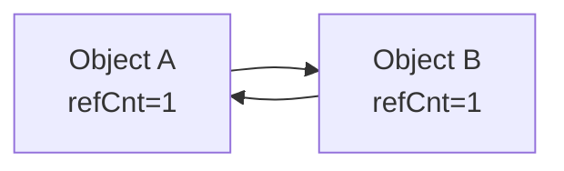
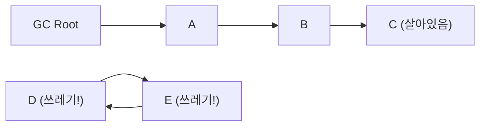
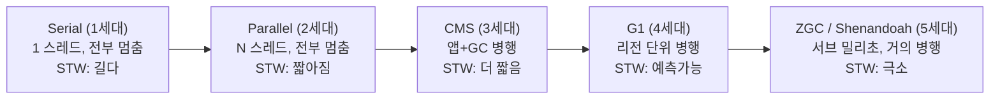

# 05. 가비지 컬렉션 기초 - Gamma

---

## 이 챕터를 왜 알아야 하냐면

04장에서 JVM 메모리 구조를 배웠지? Young, Old, Metaspace.
근데 객체가 계속 생기기만 하면 메모리가 꽉 차잖아. 누가 치워?

**GC(Garbage Collector)**가 치운다.

GC를 모르면?
- "왜 갑자기 응답이 느려졌어요?" → 모름
- "Full GC가 뜨는데 뭔가요?" → 모름
- "GC 로그 해석해봐" → 못 함

그건 운전하면서 엔진이 뭔지 모르는 거야. 평소엔 괜찮아. 엔진 터질 때까지.

---

## 1. GC가 뭔지 - "쓰레기 수거"

### 비유: 아파트 쓰레기 수거

!!! tip "비유: 아파트 = JVM 프로세스"
    - 주민(앱 스레드)이 일상생활하면서 쓰레기(객체)를 만든다.
    - 쓰레기가 쌓이면 수거원(GC)이 와서 치운다.
    - 근데 수거하려면 주민이 잠깐 밖에 나가야 해. → 이게 **Stop-The-World (STW)**
    - 이삿짐(참조 있는 객체)은 가져가면 안 돼. → 이게 **Reachability (도달 가능성)**
    - 수거원이 오래 일하면? 주민이 오래 못 들어가서 생활(서비스) 마비. → 이게 **GC Pause (STW 시간)**

비유는 입구고, 진짜 정의:

> **GC = 더 이상 사용되지 않는(도달 불가능한) 객체를 자동으로 탐지하고 메모리를 회수하는 JVM의 메커니즘**

### GC가 없으면 어떻게 되냐?

C/C++ 처럼 개발자가 직접 `malloc/free`, `new/delete` 해야 한다.

```
GC 없는 세계의 문제:
1. free 안 하면 → 메모리 누수 (Memory Leak)
2. 이미 free한 걸 또 쓰면 → Dangling Pointer (프로그램 폭발)
3. 같은 걸 두 번 free하면 → Double Free (프로그램 폭발)
4. 언제 free할지 판단하는 게 → 존나 어려움 (멀티스레드면 더)
```

Java가 GC를 도입한 이유: **개발자가 메모리 해제 실수하는 걸 막기 위해.**
대신 그 비용을 GC가 STW로 가져간다. 이것도 트레이드오프야.

---

## 2. 쓰레기를 어떻게 찾나? - "죽은 객체 판별법"

### 2.1 방법 1: Reference Counting (참조 카운팅)

```
원리: 객체마다 "나를 가리키는 참조 수"를 세다.
      참조 수가 0이 되면 → 쓰레기

Object A (refCount = 2)  ←── 변수 x가 참조
                          ←── 변수 y가 참조

x = null;  →  A.refCount = 1
y = null;  →  A.refCount = 0  →  쓰레기 확정!
```

**장점**: 간단하고 즉각적. refCount 0 되는 순간 바로 수거 가능.

**치명적 단점**: **순환 참조**를 못 잡는다.



!!! danger ""
    A가 B를 참조하고, B가 A를 참조.
    외부에서 아무도 A, B를 안 쓰는데 refCount는 둘 다 1.
    → 영원히 수거 안 됨 → 메모리 누수!

Python이 Reference Counting 쓰는데, 순환 참조 해결 위해 별도 cycle detector를 돌린다.
**JVM은 Reference Counting을 안 쓴다.** 대신 아래 방법을 쓴다.

### 2.2 방법 2: Reachability Analysis (도달 가능성 분석) ← JVM이 쓰는 방법



!!! info ""
    GC Root에서 시작해서 참조 체인을 따라가며 도달 가능한 객체를 찾는다.
    도달 불가능한 객체 → 쓰레기. 순환 참조여도 GC Root에서 안 닿으면 쓰레기.

**핵심**: GC Root에서 참조 체인을 따라갈 수 있으면 살림, 못 따라가면 죽임.
순환 참조? 상관없다. GC Root에서 안 닿으면 둘 다 쓰레기.

### 2.3 GC Root 4가지

"GC Root가 뭔데?" → **살아있다고 보장되는 참조의 시작점**.

!!! note "GC Root 4가지"
    1. **Stack 지역변수 (Local Variables)**: 현재 실행 중인 메서드의 지역변수, 매개변수. 메서드 끝나면 스택 프레임 사라지면서 참조도 사라짐
    2. **Static 변수 (Class Variables)**: 클래스에 속하는 static 필드. 클래스가 언로딩되지 않는 한 계속 살아있음. static 컬렉션에 계속 넣으면 = 누수
    3. **JNI 참조 (Native Method References)**: JNI로 네이티브 코드에서 참조하는 Java 객체. 네이티브 코드가 명시적으로 해제해야 함
    4. **실행 중인 스레드 (Active Threads)**: Thread 객체 자체 + 그 스레드의 스택에 있는 모든 참조. 스레드가 살아있으면 그 스레드가 참조하는 모든 객체도 살아있음

| GC Root | 예시 | 언제 참조 끊기냐 |
|---------|------|-----------------|
| Stack 지역변수 | `void foo() { Object o = new Object(); }` | 메서드 리턴 시 |
| Static 변수 | `static Map cache = new HashMap();` | 클래스 언로딩 시 (거의 안 됨) |
| JNI 참조 | 네이티브 코드에서 `NewGlobalRef()` | `DeleteGlobalRef()` 호출 시 |
| 활성 스레드 | `new Thread(() -> ...).start()` | 스레드 종료 시 |

---

## 3. Mark-Sweep-Compact - "GC의 기본 동작"

GC가 쓰레기를 수거하는 과정은 3단계야.

### 3.1 단계별 흐름

```
                         [BEFORE GC]
  ┌───┬───┬───┬───┬───┬───┬───┬───┬───┬───┐
  │ A │   │ B │ C │   │ D │   │ E │ F │   │
  │ ● │   │ ● │ ● │   │   │   │ ● │   │   │
  └───┴───┴───┴───┴───┴───┴───┴───┴───┴───┘
    ●=GC Root에서 도달 가능     빈칸=비어있음

  ──────────────────────────────────────────

  [STEP 1: MARK] - "살아있는 놈 표시"
  GC Root에서 출발, 참조 체인 따라가며 도달 가능한 객체에 마크

  ┌───┬───┬───┬───┬───┬───┬───┬───┬───┬───┐
  │ A │   │ B │ C │   │ D │   │ E │ F │   │
  │ ✓ │   │ ✓ │ ✓ │   │ ☠ │   │ ✓ │ ☠ │   │
  └───┴───┴───┴───┴───┴───┴───┴───┴───┴───┘
    ✓ = 살아있음 (마크됨)    ☠ = 쓰레기 (마크 안 됨)

  ──────────────────────────────────────────

  [STEP 2: SWEEP] - "쓰레기 치우기"
  마크 안 된 객체의 메모리를 해제

  ┌───┬───┬───┬───┬───┬───┬───┬───┬───┬───┐
  │ A │   │ B │ C │   │   │   │ E │   │   │
  │ ✓ │   │ ✓ │ ✓ │   │   │   │ ✓ │   │   │
  └───┴───┴───┴───┴───┴───┴───┴───┴───┴───┘
    D, F 사라짐. 근데 빈 공간이 띄엄띄엄 → 단편화!

  ──────────────────────────────────────────

  [STEP 3: COMPACT] - "앞으로 밀어서 정리"
  살아남은 객체를 한쪽으로 모아서 연속 공간 확보

  ┌───┬───┬───┬───┬───┬───┬───┬───┬───┬───┐
  │ A │ B │ C │ E │   │   │   │   │   │   │
  └───┴───┴───┴───┴───┴───┴───┴───┴───┴───┘
    앞쪽은 사용 중, 뒤쪽은 연속된 빈 공간 → 새 객체 할당 쉬움
```

| 단계 | 하는 일 | 비용 |
|------|---------|------|
| Mark | GC Root에서 참조 추적, 살아있는 객체 표시 | 살아있는 객체 수에 비례 |
| Sweep | 마크 안 된 객체 메모리 해제 | 죽은 객체 수에 비례 |
| Compact | 살아남은 객체를 앞으로 이동, 참조 갱신 | 살아있는 객체 수에 비례 (비쌈!) |

**Compact를 왜 하냐?**
- Sweep만 하면 메모리 단편화(Fragmentation) 발생
- 빈 공간이 여기저기 흩어져서 큰 객체 할당 불가
- Compact로 밀어야 연속 공간 확보 가능
- 대신 Compact는 객체 이동 + 참조 주소 갱신이라 **비용이 크다**

---

## 4. Minor GC vs Major/Full GC

### 4.1 비교

| 항목 | Minor GC | Major GC / Full GC |
|---|---|---|
| **영역** | Young Generation만 | Old Generation (Full GC는 Young+Old+Metaspace) |
| **빈도** | 자주 (초~분 단위) | 가끔 (분~시간 단위) |
| **속도** | 빠름 (수~수십 ms) | 느림 (수백 ms ~ 수 초) |
| **STW** | 짧음 | 김 |
| **트리거** | Eden 꽉 찼을 때 | Old 꽉 찼을 때 / Metaspace 꽉 찼을 때 / System.gc() 호출 시 |
| **동작** | Eden → Survivor 복사 + 승진 대상 → Old | Mark-Sweep-Compact (알고리즘에 따라 다름) |

### 4.2 왜 Minor GC가 빠른가?

```
Young Generation 특성:
1. 크기가 작다 (전체 Heap의 1/3 정도)
2. 대부분 객체가 죽어있다 (세대 가설!)
3. 살아남은 소수만 Survivor로 복사 → Mark-Copy 방식
4. 전체를 훑는 게 아니라 살아있는 놈만 복사

→ "대부분 죽었으니까 살아있는 소수만 건지면 끝"
→ 이게 세대 가설의 위력이야
```

### 4.3 Full GC가 위험한 이유

```
Full GC 시나리오:

1. Old Generation이 꽉 참
2. Full GC 시작 → Stop-The-World
3. 전체 Heap을 Mark-Sweep-Compact
4. Old가 크면 수 초 ~ 수십 초 멈춤
5. 그 동안 모든 요청 처리 불가
6. 앞단 로드밸런서가 타임아웃 판정
7. 사용자: "사이트가 안 돼요"

Full GC가 반복되면? → 장애야.
```

---

## 5. Stop-The-World (STW)

!!! warning "Stop-The-World (STW)"
    GC가 일할 때 모든 애플리케이션 스레드를 멈추는 것.

    ```
    시간 ──────────────────────────────────────────────────→

    앱 스레드: ████████████░░░░░░████████████░░████████████
                          ↑    ↑           ↑ ↑
                          STW  │           STW│
                               GC 작업         GC

    ████ = 앱 실행 중 (요청 처리)
    ░░░░ = STW (모든 앱 스레드 정지, GC만 일함)
    ```

**왜 멈춰야 하냐?**

GC가 객체 참조를 추적하고 있는데, 동시에 앱이 참조를 바꿔버리면?
- A → B 참조를 GC가 보고 있는 사이에
- 앱이 A → C로 바꿔버리면
- B가 살아있는데 GC가 죽은 줄 알고 수거 → 데이터 손실
- 또는 죽은 걸 살아있다고 판단 → 메모리 누수

그래서 "잠깐 다 멈춰. 내가 정리할 동안." 이게 STW야.

**STW 시간이 길면?**

| STW 시간 | 영향 |
|----------|------|
| ~10ms | 거의 인지 불가 |
| ~100ms | 민감한 서비스에서 체감 |
| ~1초 | 사용자 응답 지연 확실 |
| ~5초 | 타임아웃 발생 가능 |
| ~30초+ | 서비스 장애 수준 |

현대 GC 알고리즘의 목표: **STW 시간을 최소화하는 것.**

---

## 6. GC 알고리즘 비교

### 6.1 전체 비교표



### 6.2 각 알고리즘 상세

#### Serial GC

!!! note "Serial GC (`-XX:+UseSerialGC`)"
    | 항목 | 값 |
    |---|---|
    | GC 스레드 | 1개 |
    | 앱 중단 | Yes (전체 STW) |
    | Young | Mark-Copy |
    | Old | Mark-Sweep-Compact |
    | 적합 | 클라이언트 앱, 작은 힙 (수백 MB 이하) |
    | 장점 | 오버헤드 최소, 단순 |
    | 단점 | STW 길다, 서버에 부적합 |

    ```
    시간 ──────────────────→
    앱:  ████████░░░░░░░░██████
    GC:          ████████
         (GC 1개 스레드가 혼자 다 함)
    ```

#### Parallel GC (Throughput GC)

!!! note "Parallel GC (`-XX:+UseParallelGC`) - Java 8 기본 GC"
    | 항목 | 값 |
    |---|---|
    | GC 스레드 | 여러 개 (CPU 코어 수 기반) |
    | 앱 중단 | Yes (전체 STW) |
    | Young | Parallel Mark-Copy |
    | Old | Parallel Mark-Sweep-Compact |
    | 적합 | 처리량(Throughput) 중시 배치 작업, 큰 힙에서도 Serial보다 빠름 |
    | 장점 | 멀티코어 활용, 처리량 높음 |
    | 단점 | 여전히 전체 STW |

    ```
    시간 ──────────────────→
    앱:  ████████░░░░░██████
    GC1:         ██
    GC2:         ██   (여러 GC 스레드가
    GC3:         ██    동시에 → 빨리 끝남)
    GC4:         ██
    ```

#### CMS (Concurrent Mark Sweep)

!!! note "CMS (`-XX:+UseConcMarkSweepGC`) - Java 9에서 deprecated, Java 14에서 제거"
    핵심: Mark와 Sweep을 앱 스레드와 동시에(Concurrent)

    **4단계:**

    1. Initial Mark (STW, 짧음) - GC Root 직접 참조만
    2. Concurrent Mark (앱과 동시) - 전체 참조 추적
    3. Remark (STW, 짧음) - 변경된 참조 재확인
    4. Concurrent Sweep (앱과 동시) - 쓰레기 제거

    ```
    시간 ──────────────────────────────────→
    앱:  ████░████████████░██████████████████
    GC:      █            █
         STW짧음  동시마크  STW짧음  동시스윕
    ```

    - **장점**: STW 시간 극적 감소
    - **단점**: Compact 안 함 → 단편화, CPU 많이 씀, Concurrent Mode Failure 시 Serial로 폴백

#### G1 GC (Garbage First)

!!! note "G1 GC (`-XX:+UseG1GC`) - Java 9+ 기본 GC"
    핵심: Heap을 고정 크기 Region으로 쪼갠다

    ```
    ┌───┬───┬───┬───┬───┬───┬───┬───┐
    │ E │ E │ S │ O │ O │ E │ H │ O │  E=Eden
    ├───┼───┼───┼───┼───┼───┼───┼───┤  S=Survivor
    │ O │   │ E │ O │ O │   │ O │ E │  O=Old
    ├───┼───┼───┼───┼───┼───┼───┼───┤  H=Humongous
    │ E │ O │ O │   │ E │ S │ O │ O │    =비어있음
    └───┴───┴───┴───┴───┴───┴───┴───┘
    ```

    - Region 크기: 1MB ~ 32MB (힙 크기에 따라 자동)
    - Young/Old가 고정 영역이 아니라 Region 단위로 유동
    - 쓰레기 많은 Region부터 수거 → "Garbage First"
    - STW 목표: `-XX:MaxGCPauseMillis=200` (기본 200ms) → GC가 이 시간 안에 끝나도록 Region 수 조절
    - **장점**: 예측 가능한 STW, 대용량 힙(4GB+) 적합
    - **단점**: CPU/메모리 오버헤드 있음, 작은 힙에선 Parallel보다 나을 게 없음

#### ZGC & Shenandoah

!!! note "ZGC (`-XX:+UseZGC`, Java 15+) & Shenandoah (`-XX:+UseShenandoahGC`, Java 12+)"
    **목표**: STW를 10ms 이하로! (힙 크기 무관). TB급 힙에서도 서브밀리초 pause 가능

    **ZGC 핵심:**

    - Colored Pointers (참조에 메타데이터 내장)
    - Load Barrier (읽을 때 참조 갱신)
    - 거의 모든 작업을 Concurrent로

    **Shenandoah 핵심:**

    - Brooks Pointer (포워딩 포인터)
    - Concurrent Compaction (압축도 동시에!)
    - 읽기 장벽 + 쓰기 장벽

    - **장점**: 극저지연, 대용량 힙 특화
    - **단점**: 처리량(Throughput)은 G1/Parallel보다 낮을 수 있음. CPU 더 씀.

    ```
    STW 비교 ────────────────────────────→
    ZGC:     <1ms                            <1ms
    G1:      ░░░░░ (200ms)
    Parallel:░░░░░░░░░░░ (수백ms~초)
    ```

### 6.3 어떤 GC를 쓸까?

| 상황 | 추천 GC | 이유 |
|------|---------|------|
| Java 8 일반 서버 | Parallel (기본) 또는 G1 | 무난한 처리량 |
| Java 11+ 웹 서버 | G1 (기본) | 예측 가능한 Pause |
| 저지연 필수 (금융, 게임) | ZGC 또는 Shenandoah | 서브밀리초 Pause |
| 배치/데이터 처리 | Parallel | 처리량 최우선 |
| 임베디드/클라이언트 | Serial | 최소 오버헤드 |
| 큰 힙 (8GB+) | G1 또는 ZGC | 대용량 특화 |

---

## 7. GC 로그 읽는 법

### 7.1 GC 로그 활성화 (Java 8)

```bash
java \
  -XX:+PrintGCDetails \
  -XX:+PrintGCDateStamps \
  -Xloggc:/var/log/gc.log \
  -jar app.jar
```

### 7.2 Minor GC 로그 해석

```
2024-03-15T10:30:45.123+0900: [GC (Allocation Failure)
  [PSYoungGen: 262144K->32768K(305664K)]
  524288K->294912K(1005056K), 0.0452341 secs]
  [Times: user=0.15 sys=0.01, real=0.05 secs]
```

이걸 분해해보면:

```
2024-03-15T10:30:45.123+0900          ← 발생 시각
[GC (Allocation Failure)               ← GC 종류: Minor GC, 원인: Eden 꽉 참

[PSYoungGen: 262144K -> 32768K (305664K)]
     │           │         │        │
     │           │         │        └── Young 전체 크기: 약 298MB
     │           │         └── GC 후 Young 사용량: 32MB (살아남아서 Survivor로 간 양)
     │           └── GC 전 Young 사용량: 256MB
     └── PS = Parallel Scavenge (Young 영역 GC)

524288K -> 294912K (1005056K)
   │          │         │
   │          │         └── 전체 Heap 크기: 약 981MB
   │          └── GC 후 전체 Heap 사용량: 약 288MB
   └── GC 전 전체 Heap 사용량: 약 512MB

0.0452341 secs                         ← GC 소요 시간: 약 45ms (STW 시간)

user=0.15                              ← CPU 시간 (GC 스레드 합산)
sys=0.01                               ← 시스템 콜 시간
real=0.05                              ← 실제 경과 시간 (Wall Clock)
```

### 7.3 이 로그에서 뭘 읽어내야 하냐?

```
Young에서 회수된 양: 262144K - 32768K = 229376K (약 224MB)
전체에서 회수된 양:  524288K - 294912K = 229376K (약 224MB)

두 값이 같다 → Old로 승진한 객체 없음 (좋은 징조)

만약 두 값이 다르면?
Young 회수량: 224MB  vs  전체 회수량: 100MB
→ 차이 124MB가 Old로 승진한 거야
→ 승진량이 많으면 Old가 빨리 차고 Full GC 위험
```

### 7.4 Full GC 로그 해석

```
2024-03-15T10:35:12.456+0900: [Full GC (Ergonomics)
  [PSYoungGen: 32768K->0K(305664K)]
  [ParOldGen: 699392K->524288K(699392K)]
  732160K->524288K(1005056K), 2.3456789 secs]
```

```
Full GC (Ergonomics)                    ← JVM이 판단해서 Full GC 발동
ParOldGen: 699392K -> 524288K           ← Old: 683MB → 512MB (171MB 회수)
전체: 732160K -> 524288K                ← 약 207MB 회수
소요시간: 2.3초                         ← STW 2.3초! 이 동안 서비스 멈춤!

⚠️ Full GC 2.3초는 상당히 길다.
   이게 반복되면 장애야.
```

---

## 8. "GC해도 안 줄어든다" = 누수 신호

```
정상 패턴 (톱니 모양):

Heap 사용량
│
│  /\    /\    /\    /\    /\
│ /  \  /  \  /  \  /  \  /  \      ← GC 돌면 확 줄고 다시 올라감
│/    \/    \/    \/    \/    \     ← 바닥선이 일정
└───────────────────────────────→ 시간


누수 패턴 (우상향):

Heap 사용량
│                            /\
│                       /\  /  \
│                  /\  /  \/         ← GC 돌아도 바닥선이 점점 올라감
│             /\  /  \/              ← 회수 못 하는 객체가 쌓이는 중
│        /\  /  \/
│   /\  /  \/
│  /  \/
│ /
└───────────────────────────────→ 시간
                                    결국 OOM 터짐
```

**핵심 지표**:
- GC 후 Heap 사용량(바닥선)이 **점점 올라간다** → 누수 의심
- Full GC 빈도가 **점점 잦아진다** → 누수 거의 확실
- Full GC 해도 Old 사용량이 **거의 안 줄어든다** → 누수 확정

---

## 9. 주의사항 / 함정

### 함정 1: "System.gc() 부르면 GC가 즉시 실행된다"

```
❌ System.gc()는 "GC 해줬으면 좋겠어" 라는 힌트일 뿐
   JVM이 무시할 수 있다 (-XX:+DisableExplicitGC 설정 시 완전 무시)

✅ GC 타이밍은 JVM이 결정한다. 개발자가 강제하는 게 아니야.
   프로덕션 코드에 System.gc() 넣지 마라.
```

### 함정 2: "GC가 자주 도는 게 나쁜 거다"

```
❌ Minor GC가 자주 도는 건 정상이야. 그게 설계 의도야.
   Young의 대부분이 쓰레기니까 자주 빠르게 치우는 게 효율적.

⚠️ 문제는 Full GC가 자주 도는 것.
   Full GC가 자주 = Old가 빨리 차는 중 = 뭔가 잘못된 거.
```

### 함정 3: "GC 알고리즘 바꾸면 성능 좋아진다"

```
❌ GC 알고리즘 바꾸는 건 마지막 수단이야.
   GC가 바쁘다는 건 보통 코드에 문제가 있다는 뜻이야.

✅ 순서:
   1. 먼저 코드에서 불필요한 객체 생성 줄이기
   2. 캐시 크기 검토
   3. 메모리 누수 확인
   4. 힙 크기 조정
   5. 그래도 안 되면 GC 알고리즘 변경 검토
```

### 함정 4: "finalize() 쓰면 GC 때 정리해준다"

```
❌ finalize()는 Java 9에서 deprecated됨.
   실행 보장 안 됨. 실행 시점도 모름. GC를 느리게 만듦.
   객체가 finalize 큐에서 한 번 더 살아남아서 Old로 갈 확률 높아짐.

✅ 리소스 정리는 try-with-resources 또는 Cleaner(Java 9+) 써라.
```

### 함정 5: "CMS가 좋다고 들었는데?"

```
❌ CMS는 Java 9에서 deprecated, Java 14에서 제거됨.
   더 이상 쓸 이유 없다. G1 또는 ZGC로 가라.
```

---

## 10. 정리

### 한 줄 정리

> **GC = GC Root에서 도달 불가능한 객체를 찾아 메모리를 회수하는 자동 메커니즘. 핵심은 STW 최소화.**

### 핵심 요약 표

| 항목 | 핵심 |
|------|------|
| 쓰레기 판별 | Reachability Analysis (GC Root에서 도달 불가 = 쓰레기) |
| GC Root | Stack 지역변수, Static 변수, JNI 참조, 활성 스레드 |
| 기본 동작 | Mark(표시) → Sweep(제거) → Compact(압축) |
| Minor GC | Young 영역, 빠름, 자주, 정상 |
| Full GC | 전체 Heap, 느림, 가끔, 자주 뜨면 위험 |
| STW | GC 동안 앱 멈춤. 현대 GC의 목표는 STW 최소화 |
| 알고리즘 | Serial → Parallel → CMS → G1 → ZGC (점점 STW 줄임) |
| 누수 신호 | GC 후 바닥선이 올라가면 누수 의심 |

### 이 챕터에서 반드시 기억할 것

1. **JVM은 Reference Counting 안 쓴다.** Reachability Analysis 쓴다. 순환 참조 문제 없음.
2. **GC Root 4가지 외워라.** Stack, Static, JNI, Active Thread.
3. **Minor GC는 정상, Full GC 빈번은 비정상.**
4. **STW는 GC의 본질적 비용이다.** 줄일 수는 있지만 없앨 수는 없다.
5. **GC 로그 읽을 줄 알아야 한다.** 로그 못 읽으면 GC 문제 진단 못 한다.

---

### 확인 문제 (5문제)

> 다음 문제를 풀어봐. 답 못 하면 위에서 다시 읽어.

**Q1.** JVM이 Reference Counting 대신 Reachability Analysis를 쓰는 이유가 뭐야?

**Q2.** GC Root 4가지를 나열하고, 이 중 메모리 누수와 가장 관련 깊은 것은 뭐고 왜 그래?

**Q3.** 다음 GC 로그에서 Old로 승진한 객체 크기를 계산해봐:
```
[PSYoungGen: 200000K->10000K(250000K)] 400000K->260000K(800000K)
```

**Q4.** G1 GC가 이전 세대 GC들과 근본적으로 다른 점은 뭐야? "Region"이라는 답만으로는 부족해. 왜 Region으로 쪼갰는지까지 설명해봐.

**Q5.** GC 후 Heap 사용량의 바닥선이 계속 올라가는 패턴이 보인다. 이게 뭘 의미하고, 이 상태가 계속되면 어떤 일이 벌어져?

??? success "정답 보기"
    **A1.** Reference Counting은 순환 참조를 감지 못 한다. A→B, B→A로 서로 참조하면 외부에서 아무도 안 쓰는데 refCount가 0이 안 돼서 영원히 수거 안 됨. Reachability Analysis는 GC Root에서 출발해서 도달 가능한 객체만 살리기 때문에, 순환 참조여도 GC Root에서 안 닿으면 둘 다 쓰레기로 판정해서 수거한다.

    **A2.** GC Root 4가지: (1) Stack 지역변수, (2) Static 변수, (3) JNI 참조, (4) 활성 스레드.
    메모리 누수와 가장 관련 깊은 건 **Static 변수**. Static 변수는 클래스가 언로딩되지 않는 한 계속 GC Root로 남아있다. static 컬렉션(Map, List 등)에 객체를 계속 추가하면 GC Root에서 참조 체인이 끊기지 않아서 영원히 수거 안 된다. 대표적 누수 패턴.

    **A3.**

    - Young 회수량: 200000K - 10000K = 190000K
    - 전체 회수량: 400000K - 260000K = 140000K
    - Old 승진량: 190000K - 140000K = **50000K (약 49MB)**

    Young에서 190MB 치웠는데 전체에서는 140MB만 줄었다. 차이 50MB가 Young에서 Old로 승진한 양이다.

    **A4.** G1의 근본적 차이는 Heap을 **고정 크기 Region으로 분할**한 것. 이전 GC들은 Young/Old가 연속된 큰 영역이라 GC 시 그 영역 전체를 처리해야 했다. G1은 Region 단위로 쪼개서 **쓰레기가 많은 Region만 선택적으로 수거**한다. 이러면 한 번에 처리할 양을 조절할 수 있어서 **STW 시간을 목표값(MaxGCPauseMillis) 이내로 예측 가능하게 제어**할 수 있다. "전체를 한 번에" 대신 "조금씩 자주" 전략인 거야.

    **A5.** 메모리 누수 징후. GC가 돌아도 회수 못 하는 객체(참조가 남아있는 불필요 객체)가 계속 쌓이고 있다는 뜻. 이 상태가 계속되면: (1) Old Generation이 가득 차고, (2) Full GC가 점점 자주 발생하고, (3) Full GC 해도 공간이 안 확보되고, (4) 결국 java.lang.OutOfMemoryError: Java heap space 발생, (5) 서비스 다운.

---

**"GC 로그도 못 읽으면서 JVM 튜닝 한다고? Were you rushing or were you dragging?"**
