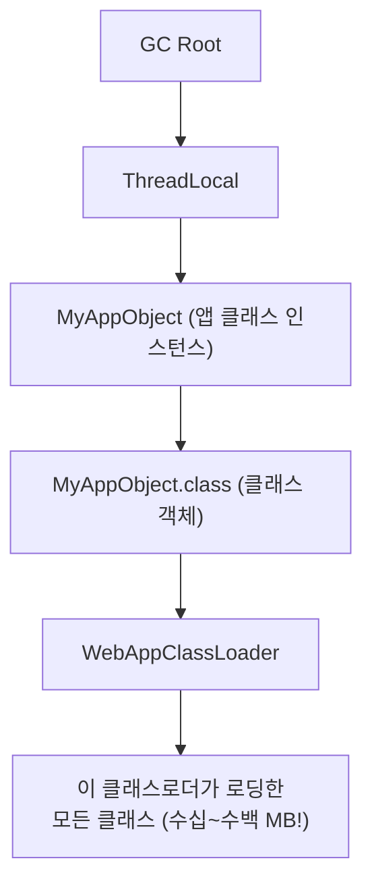

# 06. 메모리 누수 패턴 - Gamma

---

## 이 챕터를 왜 알아야 하냐면

05장에서 GC를 배웠지? "GC가 알아서 치워주니까 메모리 걱정 없다"고?

**틀렸어.**

GC는 "도달 불가능한" 객체만 수거한다. 문제는 **안 쓰는데 참조가 남아있는 객체**. 이건 GC가 "아, 이거 아직 쓰는 거구나" 하고 안 건드려. 그러면 메모리에 계속 쌓인다. 이게 **메모리 누수(Memory Leak)**야.

"Java는 GC가 있으니까 메모리 누수 안 나요" — 이 말을 하는 순간, 네가 누수를 일으키는 사람이 될 확률이 올라간다.

---

## 1. 메모리 누수란? - "체크아웃 안 된 호텔 객실"

### 비유: 호텔 운영

!!! tip "비유: 호텔 = JVM Heap"
    투숙객(객체)이 체크인하고, 일 끝나면 체크아웃한다.
    체크아웃하면 청소(GC)해서 다음 손님한테 방을 준다.

    근데 손님이 체크아웃 했는데 프론트 시스템에서 기록이 안 지워졌다면?

    - 방은 비어있는데 "사용 중"으로 표시됨
    - 새 손님한테 그 방을 줄 수 없음
    - 방(메모리)이 점점 부족해짐
    - 결국 "빈 방 없습니다" = OutOfMemoryError

    이게 메모리 누수야. 객체는 안 쓰는데, 참조(기록)가 남아서 GC가 못 치우는 것.

비유는 이해 돕기용이고, 정확한 정의:

> **메모리 누수 = 프로그램이 더 이상 사용하지 않는 객체에 대한 참조가 여전히 유지되어, GC가 해당 객체를 회수하지 못하는 상태**

핵심은 **"안 쓰는데 참조가 남아있는 것"**이야.

---

## 2. 정상 vs 누수 - "그래프로 구분하기"

### 2.1 정상 패턴 (톱니 모양)

```
Heap 사용량
│
│         /\          /\          /\          /\
│        /  \        /  \        /  \        /  \
│       /    \      /    \      /    \      /    \
│      /      \    /      \    /      \    /      \
│     /        \  /        \  /        \  /        \
│    /          \/          \/          \/          \
│   /                                                \
│──/─────────────────────────────────────────────────── 바닥선 (일정!)
│
└──────────────────────────────────────────────────────→ 시간
     ↑GC       ↑GC       ↑GC       ↑GC

특징:
- 사용량이 올라갔다가 GC 때 확 떨어진다
- 바닥선(GC 후 최소 사용량)이 일정하다
- 톱니 모양이 규칙적이다
- 이게 건강한 상태
```

### 2.2 누수 패턴 (우상향)

```
Heap 사용량
│
│                                              /\  ← OOM 임박!
│                                         /\  /  \
│                                    /\  /  \/
│                               /\  /  \/
│                          /\  /  \/
│                     /\  /  \/
│                /\  /  \/
│           /\  /  \/
│      /\  /  \/
│ /\  /  \/
│/  \/
│
│──────────────────────────────────────────────────────→ 시간
│  ↗ ↗ ↗ ↗ ↗ ↗ ↗ ↗ ↗  바닥선이 계속 올라간다!

특징:
- GC 후에도 줄어드는 양이 점점 적어진다
- 바닥선이 시간이 갈수록 올라간다
- 결국 GC 해도 공간 부족 → OOM
- 이게 누수 상태
```

### 2.3 핵심 구분 기준

| 지표 | 정상 | 누수 |
|------|------|------|
| GC 후 바닥선 | 일정 | 점점 올라감 |
| Full GC 빈도 | 가끔 | 점점 잦아짐 |
| Full GC 후 회수량 | 충분 | 점점 줄어듦 |
| Old 사용량 추이 | 안정 | 지속 증가 |
| 서비스 운영 시간 | 무관 | 오래 돌수록 악화 |

---

## 3. 전형적 누수 패턴 10가지

### 패턴 1: Static 컬렉션 무한 추가

**가장 흔하고, 가장 치명적인 패턴.**

```java
// ❌ 누수 코드
public class EventLogger {
    // static List → 클래스가 살아있는 한 GC 대상 안 됨
    private static final List<String> eventLog = new ArrayList<>();

    public void logEvent(String event) {
        eventLog.add(event);  // 추가만 하고 제거 안 함
        // 서버 돌아가는 내내 리스트가 커짐
        // 1일: 10만 건, 1주: 70만 건, 1달: 300만 건...
        // 결국 OOM
    }
}
```

```java
// ✅ 수정 코드
public class EventLogger {
    // 방법 1: 크기 제한
    private static final int MAX_SIZE = 10000;
    private static final List<String> eventLog = new ArrayList<>();

    public void logEvent(String event) {
        if (eventLog.size() >= MAX_SIZE) {
            eventLog.remove(0);  // 오래된 거 제거
        }
        eventLog.add(event);
    }

    // 방법 2: 외부 저장소 사용 (DB, 파일, Kafka)
    // → 메모리에 쌓지 말고 밖으로 보내라
}
```

**왜 위험한가**: `static` 필드는 GC Root야. 여기서 참조되는 모든 객체는 GC 대상에서 제외된다. static 컬렉션에 계속 넣으면 = GC 불가능한 객체가 무한히 늘어남.

---

### 패턴 2: 리스너/콜백 미해제

```java
// ❌ 누수 코드
public class DataScreen {
    public DataScreen(EventBus eventBus) {
        // 리스너 등록 — 이 객체가 eventBus에 참조됨
        eventBus.register(this);
    }

    @Subscribe
    public void onDataUpdate(DataEvent event) {
        // 데이터 처리
    }

    // 화면 닫힐 때 unregister 안 함!
    // → DataScreen 객체가 사라져야 하는데
    // → eventBus가 계속 참조하고 있어서 GC 못 함
    // → 화면 열고 닫을 때마다 누수
}
```

```java
// ✅ 수정 코드
public class DataScreen implements AutoCloseable {
    private final EventBus eventBus;

    public DataScreen(EventBus eventBus) {
        this.eventBus = eventBus;
        eventBus.register(this);
    }

    @Override
    public void close() {
        eventBus.unregister(this);  // 반드시 해제!
    }
}
```

**왜 위험한가**: 이벤트 버스, Observable 패턴에서 구독 등록하고 해제 안 하면, 발행자가 구독자를 계속 참조하므로 구독자 객체가 GC 안 됨. GUI 앱에서 특히 흔함.

---

### 패턴 3: Inner Class의 외부 참조

```java
// ❌ 누수 코드
public class Outer {
    private byte[] largeData = new byte[10 * 1024 * 1024]; // 10MB

    // 비정적 내부 클래스 → 외부 클래스(Outer) 참조를 암묵적으로 가짐
    public class Inner {
        public void doSomething() {
            // Inner만 필요한데, Outer의 참조도 같이 물고 있음
        }
    }

    public Inner createInner() {
        return new Inner();
        // 반환된 Inner가 살아있는 한, Outer(+10MB)도 GC 안 됨!
    }
}
```

```java
// ✅ 수정 코드
public class Outer {
    private byte[] largeData = new byte[10 * 1024 * 1024];

    // static 내부 클래스 → 외부 참조 없음
    public static class Inner {
        public void doSomething() {
            // Outer 참조 없이 독립적
        }
    }
}
```

**왜 위험한가**: Java의 비정적(non-static) 내부 클래스는 컴파일 시 외부 클래스의 참조(`Outer.this`)를 자동으로 가진다. Inner만 필요한데 Outer까지 메모리에 잡혀있게 됨. 특히 외부 클래스가 큰 데이터를 가지고 있으면 그만큼 누수.

---

### 패턴 4: 리소스 미해제 (Connection, Stream)

```java
// ❌ 누수 코드
public List<String> readData() throws Exception {
    Connection conn = dataSource.getConnection();  // 커넥션 획득
    PreparedStatement ps = conn.prepareStatement("SELECT * FROM TB_USER");
    ResultSet rs = ps.executeQuery();

    List<String> result = new ArrayList<>();
    while (rs.next()) {
        result.add(rs.getString("USER_NM"));
    }

    // 여기서 예외 발생하면? conn, ps, rs 닫히지 않음!
    // 커넥션 풀 고갈 → 서비스 멈춤
    // + 관련 네이티브 메모리도 해제 안 됨

    rs.close();
    ps.close();
    conn.close();
    return result;
}
```

```java
// ✅ 수정 코드 (try-with-resources)
public List<String> readData() throws Exception {
    try (Connection conn = dataSource.getConnection();
         PreparedStatement ps = conn.prepareStatement("SELECT * FROM TB_USER");
         ResultSet rs = ps.executeQuery()) {

        List<String> result = new ArrayList<>();
        while (rs.next()) {
            result.add(rs.getString("USER_NM"));
        }
        return result;
    }
    // try 블록 벗어나면 자동 close. 예외 발생해도 close 보장.
}
```

**왜 위험한가**: DB 커넥션, 파일 스트림, 소켓 등은 OS 자원과 연결되어 있다. close 안 하면 Java 객체 자체는 GC될 수 있어도, 네이티브 리소스(파일 핸들, 소켓, 커넥션)는 해제 안 됨. 커넥션 풀 고갈은 서비스 장애 직결.

---

### 패턴 5: 캐시 무제한 성장

```java
// ❌ 누수 코드
public class UserCache {
    // 크기 제한 없는 HashMap을 캐시로 사용
    private static final Map<Long, UserDTO> cache = new HashMap<>();

    public UserDTO getUser(Long userId) {
        if (cache.containsKey(userId)) {
            return cache.get(userId);
        }
        UserDTO user = userRepository.findById(userId);
        cache.put(userId, user);  // 넣기만 하고 빼는 로직 없음!
        return user;
    }
    // 사용자 10만 명이면 캐시에 10만 건 → 메모리 폭탄
}
```

```java
// ✅ 수정 코드
public class UserCache {
    // 방법 1: LRU 캐시 (크기 제한)
    private static final Map<Long, UserDTO> cache =
        new LinkedHashMap<Long, UserDTO>(100, 0.75f, true) {
            @Override
            protected boolean removeEldestEntry(Map.Entry<Long, UserDTO> eldest) {
                return size() > 1000;  // 1000개 넘으면 가장 오래된 거 제거
            }
        };

    // 방법 2: WeakHashMap (GC가 필요하면 수거 허용)
    private static final Map<Long, UserDTO> weakCache = new WeakHashMap<>();

    // 방법 3: Caffeine, Guava Cache 같은 전문 캐시 라이브러리 사용 (권장)
}
```

**왜 위험한가**: HashMap은 put된 모든 키-값 쌍에 대한 강한 참조(Strong Reference)를 유지한다. 크기 제한이나 만료 정책 없으면 메모리가 무한히 커진다. "캐시니까 빠르게 조회하려고" 좋은 의도였는데 결과는 OOM.

---

### 패턴 6: ThreadLocal 미정리

```java
// ❌ 누수 코드
public class RequestContext {
    private static final ThreadLocal<UserSession> context = new ThreadLocal<>();

    public static void set(UserSession session) {
        context.set(session);
    }

    public static UserSession get() {
        return context.get();
    }

    // remove() 안 함!
}

// 서블릿에서 사용
public class MyServlet extends HttpServlet {
    @Override
    protected void doGet(HttpServletRequest req, HttpServletResponse resp) {
        RequestContext.set(new UserSession(req));
        // ... 비즈니스 로직 ...
        // 요청 끝났는데 remove 안 함!

        // 문제: 톰캣은 스레드 풀을 쓴다.
        // 이 스레드가 다음 요청을 처리할 때도 이전 UserSession이 남아있음
        // → 스레드가 재사용될 때마다 이전 세션 객체가 누적
        // → 스레드 수 x 누적 세션 = 누수
    }
}
```

```java
// ✅ 수정 코드
public class MyServlet extends HttpServlet {
    @Override
    protected void doGet(HttpServletRequest req, HttpServletResponse resp) {
        try {
            RequestContext.set(new UserSession(req));
            // ... 비즈니스 로직 ...
        } finally {
            RequestContext.remove();  // 반드시 finally에서 제거!
        }
    }
}
```

**왜 위험한가**: 웹 서버(Tomcat 등)는 스레드 풀을 사용한다. 스레드가 요청 처리 후 풀로 반환되는데, ThreadLocal 값은 스레드에 바인딩되어 있어서 반환돼도 남아있다. 다음 요청이 같은 스레드를 쓸 때 이전 데이터가 보이는 보안 문제 + 메모리 누수가 동시에 발생.

---

### 패턴 7: 클래스로더 누수

```java
// ❌ 누수 시나리오 (주로 웹 앱 재배포 시 발생)

// 1. 웹 앱이 커스텀 클래스로더로 클래스를 로딩
// 2. 해당 클래스가 static 필드에 큰 데이터를 가짐
// 3. 웹 앱 언디플로이(재배포)
// 4. 클래스로더는 해제되어야 하는데...
// 5. 어딘가에서 이 클래스(또는 인스턴스)를 참조하고 있으면
// 6. 클래스로더 전체가 GC 안 됨
// 7. 클래스로더가 로딩한 모든 클래스 + 관련 메모리 전부 잔류

// 대표적 원인:
// - 앱에서 JDBC 드라이버를 직접 등록하고 해제 안 함
// - ThreadLocal에 앱 클래스 인스턴스 저장
// - Logging 프레임워크가 앱 클래스 참조
```



!!! danger ""
    WebAppClassLoader를 GC하고 싶은데 ThreadLocal이 잡고 있어서 못 함.
    재배포할 때마다 Metaspace/메모리 계속 증가.

**왜 위험한가**: 클래스로더 하나가 누수되면 그 로더가 로딩한 **모든 클래스의 메타데이터**가 Metaspace에 잔류한다. 웹 앱을 핫 디플로이할 때마다 Metaspace가 쌓여서 결국 OOM. Tomcat에서 "잠재적 메모리 누수 감지" 경고가 이거야.

---

### 패턴 8: String.intern() 남용

```java
// ❌ 누수 코드
public class StringProcessor {
    public void process(List<String> inputs) {
        for (String input : inputs) {
            // intern()은 문자열을 String Pool에 영구 저장
            String interned = input.intern();
            // 입력이 다양하면 String Pool이 무한히 커짐
            // Java 7+에서 String Pool은 Heap에 있지만
            // intern된 문자열은 GC되기 어려움
        }
    }
}
```

```java
// ✅ 수정 코드
// intern()은 정해진 소수의 문자열(enum 대용 등)에만 사용
// 동적으로 생성되는 다양한 문자열에 intern() 쓰지 마라

// 필요하다면 직접 캐시 관리
private final Map<String, String> stringCache =
    new LinkedHashMap<>(1000, 0.75f, true) {
        @Override
        protected boolean removeEldestEntry(Map.Entry<String, String> e) {
            return size() > 5000;
        }
    };
```

**왜 위험한가**: `intern()`은 JVM의 String Pool에 문자열을 등록한다. 한번 들어가면 참조가 유지되어 GC 대상에서 제외된다. 고정된 소수의 값이면 괜찮지만, 사용자 입력이나 로그 메시지 같은 동적 문자열에 쓰면 Pool이 폭발.

---

### 패턴 9: subList / substring 원본 참조

```java
// ❌ 누수 코드 (Java 7 이전 substring 이슈)
// Java 7 이전: String.substring()이 원본 char[]를 공유했음

String huge = readHugeFile();            // 10MB 문자열
String tiny = huge.substring(0, 10);     // 10글자만 필요
huge = null;                             // huge 참조 해제

// Java 6: tiny가 원본 10MB char[]를 여전히 참조!
// 10글자만 쓰는데 10MB가 메모리에 잡힘

// Java 7+에서는 substring이 새 char[] 복사하도록 수정됨
// 하지만 List.subList()는 아직 원본 참조!
```

```java
// ❌ subList 누수 (현재도 해당됨!)
List<String> bigList = loadHugeList();        // 100만 건
List<String> subList = bigList.subList(0, 10); // 10건만 필요

bigList = null;  // 원본 해제하고 싶은데...
// subList는 bigList의 뷰(View)! 원본을 내부적으로 참조!
// bigList 100만 건이 GC 안 됨!
```

```java
// ✅ 수정 코드
// subList 결과를 새 리스트로 복사
List<String> safeSubList = new ArrayList<>(bigList.subList(0, 10));
bigList = null;  // 이제 원본 GC 가능
```

**왜 위험한가**: `List.subList()`는 원본 리스트의 **뷰(view)**를 반환한다. 원본에 대한 참조를 내부적으로 유지하기 때문에, subList만 들고 있어도 원본 전체가 GC 안 됨. 이건 지금 Java에서도 동일하게 적용됨.

---

### 패턴 10: Timer / ScheduledExecutor 미정리

```java
// ❌ 누수 코드
public class DataRefresher {
    public void startRefresh() {
        Timer timer = new Timer();
        timer.scheduleAtFixedRate(new TimerTask() {
            @Override
            public void run() {
                // 이 TimerTask는 비정적 내부 클래스
                // → DataRefresher 참조를 가짐
                refreshData();
            }
        }, 0, 60000);  // 1분마다 실행

        // timer.cancel() 안 하면?
        // → Timer 스레드가 계속 살아있음
        // → TimerTask가 DataRefresher를 참조
        // → DataRefresher와 그 안의 모든 데이터가 GC 안 됨
    }
}
```

```java
// ✅ 수정 코드
public class DataRefresher implements AutoCloseable {
    private final ScheduledExecutorService scheduler =
        Executors.newSingleThreadScheduledExecutor();
    private ScheduledFuture<?> future;

    public void startRefresh() {
        future = scheduler.scheduleAtFixedRate(
            this::refreshData,  // 메서드 참조 (static이면 더 안전)
            0, 60, TimeUnit.SECONDS
        );
    }

    @Override
    public void close() {
        if (future != null) {
            future.cancel(false);
        }
        scheduler.shutdown();  // 반드시 종료!
    }
}
```

**왜 위험한가**: 스케줄링된 작업은 별도 스레드에서 돈다. 이 스레드가 살아있으면 작업(Task) 객체가 참조하는 모든 것이 GC 안 됨. 특히 Timer는 예외 발생 시 스레드가 죽는 문제도 있어서, ScheduledExecutorService가 권장됨.

---

## 4. 주의사항 / 함정

### 함정 1: "메모리 많이 쓰는 거 = 누수"

```
❌ 메모리를 많이 쓰는 것과 누수는 다른 거야.

많이 쓰는 것: 대용량 데이터 처리, 캐시 적재 등 (의도적)
누수: 안 쓰는 데이터가 해제 안 되는 것 (비의도적)

구분법: GC 후 바닥선이 올라가면 누수, 안 올라가면 정상 사용량.
```

### 함정 2: "WeakReference 쓰면 누수 안 난다"

```
❌ WeakReference는 만능이 아니야.
   GC 시점이 예측 불가 → 캐시 히트율이 불안정
   WeakHashMap은 Key가 Weak인 거지, Value가 Weak인 게 아니야
   Value에서 Key를 강하게 참조하면 여전히 누수

✅ 전문 캐시 라이브러리(Caffeine, Guava Cache)가 더 안전하고 예측 가능.
```

### 함정 3: "OOM 터지면 무조건 누수"

```
❌ OOM 원인은 누수만이 아니야.

OOM 원인 목록:
1. 메모리 누수 (이 챕터 내용)
2. 힙 크기 부족 (-Xmx가 너무 작음)
3. 한 번에 너무 큰 데이터 로딩 (100만 건 전체 조회)
4. Metaspace 부족 (동적 클래스 생성 과다)
5. Direct Memory 부족 (NIO, Netty)
6. 스레드 너무 많이 생성 (unable to create new native thread)

원인 파악이 먼저야. 무조건 "누수겠지" 하면 삽질한다.
```

### 함정 4: "누수 찾으려면 코드를 한 줄씩 봐야 한다"

```
❌ 코드 리뷰로 누수 찾는 건 비효율적이야.

✅ 도구를 써라:
   1. JVisualVM / JConsole → 실시간 메모리 모니터링
   2. jmap -histo:live → 힙 내 객체 수/크기 확인
   3. Heap Dump + MAT (Memory Analyzer Tool) → 누수 객체 추적
   4. GC 로그 분석 → 바닥선 추이 확인
   5. -XX:+HeapDumpOnOutOfMemoryError → OOM 시 자동 덤프
```

---

## 5. 누수 조기 발견 지표

!!! warning "누수 조기 발견 체크리스트"
    - [ ] GC 후 Heap 바닥선이 지속 상승하는가? → Yes면 누수 강력 의심
    - [ ] Full GC 빈도가 시간이 갈수록 증가하는가? → Yes면 Old가 계속 차는 중
    - [ ] Full GC 후 회수되는 메모리양이 줄어드는가? → Yes면 회수 불가 객체가 늘어나는 중
    - [ ] 서비스 재시작 후엔 괜찮다가 시간 지나면 느려지는가? → Yes면 누수 전형적 패턴
    - [ ] 특정 기능 사용 후에 메모리가 증가하고 안 내려오는가? → Yes면 해당 기능에 누수 코드 있을 확률 높음

    **모니터링 권장 항목:**

    - Heap 사용량 추이 (Grafana, Prometheus)
    - GC 횟수/시간 추이
    - Old Generation 사용률
    - 스레드 수 추이
    - 커넥션 풀 사용률

---

## 6. 10가지 패턴 정리표

| # | 패턴 | 원인 | 핵심 해결책 |
|---|------|------|-------------|
| 1 | Static 컬렉션 무한 추가 | static + 추가만 + 제거 없음 | 크기 제한 or 외부 저장소 |
| 2 | 리스너/콜백 미해제 | register만 하고 unregister 안 함 | 반드시 해제 코드 작성 |
| 3 | Inner Class 외부 참조 | 비정적 내부 클래스의 암묵적 외부 참조 | static inner class 사용 |
| 4 | 리소스 미해제 | Connection, Stream close 안 함 | try-with-resources |
| 5 | 캐시 무제한 성장 | HashMap에 넣기만 함 | LRU 캐시 or 캐시 라이브러리 |
| 6 | ThreadLocal 미정리 | 스레드 풀에서 remove 안 함 | finally에서 remove() |
| 7 | 클래스로더 누수 | 재배포 시 이전 클래스로더 참조 잔류 | 참조 정리, 드라이버 해제 |
| 8 | String.intern() 남용 | 동적 문자열 intern | 고정 값에만 intern 사용 |
| 9 | subList 원본 참조 | View가 원본 리스트 참조 유지 | new ArrayList<>(subList) |
| 10 | Timer/Scheduler 미정리 | 스케줄링 스레드 + 태스크 참조 | shutdown() / cancel() |

---

## 7. 정리

### 한 줄 정리

> **메모리 누수 = 안 쓰는데 참조가 남아있는 것. GC는 참조 있으면 못 건드린다. 참조를 끊어주는 건 개발자 몫이다.**

### 이 챕터에서 반드시 기억할 것

1. **"Java는 GC 있으니 누수 없다"는 거짓말이야.** GC는 도달 불가능한 객체만 수거한다. 참조가 남아있으면 못 건드려.
2. **누수 = 바닥선 상승.** GC 후 최소 사용량이 올라가면 누수 신호.
3. **static 컬렉션이 가장 흔한 누수 원인.** static은 GC Root야. 거기에 무한히 넣으면 무한히 쌓여.
4. **등록했으면 해제해라.** 리스너, ThreadLocal, 스케줄러, 커넥션. 열었으면 닫아라.
5. **코드 리뷰보다 도구가 빠르다.** 힙덤프 + MAT로 누수 객체 추적하는 게 정공법.

---

### 확인 문제 (5문제)

> 다음 문제를 풀어봐. 답 못 하면 위에서 다시 읽어.

**Q1.** "메모리 누수"를 한 문장으로 정의해봐. "메모리가 부족한 것"이라고 하면 불합격이야.

**Q2.** 아래 코드에서 누수가 발생하는 이유와 해결 방법을 말해봐:
```java
public class MetricsCollector {
    private static final Map<String, Long> metrics = new HashMap<>();

    public void record(String key, long value) {
        metrics.put(key, value);
    }
}
```
(key가 요청마다 다른 값이라고 가정)

**Q3.** ThreadLocal 누수가 특히 웹 서버에서 위험한 이유를 스레드 풀과 연관지어 설명해봐.

**Q4.** 다음 메모리 사용 그래프에서 누수 여부를 판단하고 근거를 말해봐:
```
GC 1회차 후 바닥: 200MB
GC 2회차 후 바닥: 230MB
GC 3회차 후 바닥: 265MB
GC 4회차 후 바닥: 310MB
```

**Q5.** `List.subList()`가 왜 메모리 누수를 일으킬 수 있는지 설명하고, 안전하게 사용하는 방법을 말해봐.

??? success "정답 보기"
    **A1.** 메모리 누수란, 프로그램이 더 이상 사용하지 않는 객체에 대한 참조가 여전히 유지되어 GC가 해당 객체를 회수하지 못하는 상태. 핵심은 "안 쓰는데 참조가 남아있는 것"이지, 단순히 "메모리가 부족한 것"이 아니다.

    **A2.** 누수 원인: `static Map`에 `put`만 하고 `remove`가 없다. key가 요청마다 다른 값이면 Map이 무한히 커진다. `static`은 GC Root이므로 Map에 들어간 모든 키-값 쌍이 GC 대상에서 제외된다.
    해결: (1) 크기 제한이 있는 캐시 사용(LRU), (2) 불필요한 키 제거 로직 추가, (3) `ConcurrentHashMap` + 주기적 cleanup, (4) 전문 캐시 라이브러리(Caffeine) 사용.

    **A3.** 웹 서버(Tomcat 등)는 스레드 풀을 사용해서 스레드를 재활용한다. 요청 처리 후 스레드가 풀로 반환되는데, ThreadLocal 값은 스레드에 바인딩되어 있어서 반환돼도 사라지지 않는다. (1) 다음 요청이 같은 스레드를 받으면 이전 요청의 데이터가 보이는 보안 문제, (2) remove() 안 하면 스레드 수만큼 객체가 영구 잔류하는 메모리 누수, (3) 스레드가 재사용될 때마다 이전 ThreadLocal 값 위에 새 값이 덮어씌워지지만, 이전 값 객체는 GC 타이밍에 따라 바로 안 사라질 수 있음.

    **A4.** 누수다. 근거: GC 후 바닥선이 200→230→265→310으로 매번 올라가고 있다. 정상이면 GC 후 바닥선이 일정해야 한다. 바닥선 상승 = GC가 회수 못 하는 객체(참조가 남아있는 객체)가 계속 쌓이는 중. 이 추세가 계속되면 결국 Old Generation이 가득 차서 Full GC 빈발 → OOM 발생.

    **A5.** `List.subList()`는 원본 리스트의 뷰(view)를 반환한다. 새로운 리스트가 아니라 원본 리스트를 내부적으로 참조하는 래퍼 객체야. 그래서 subList만 유지하고 원본을 `null`로 해제해도, subList가 원본에 대한 참조를 잡고 있어서 원본 전체가 GC 안 된다. 원본이 100만 건이고 10건만 필요해도 100만 건이 메모리에 남는 거야.
    안전한 방법: `new ArrayList<>(bigList.subList(0, 10))` -- 새 리스트로 복사하면 원본 참조가 끊긴다.

---

**"Java에 GC가 있으니 누수 걱정 없다고? 그 자신감이 누수를 만든다. Not quite my tempo."**
