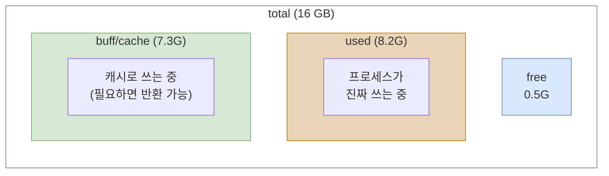
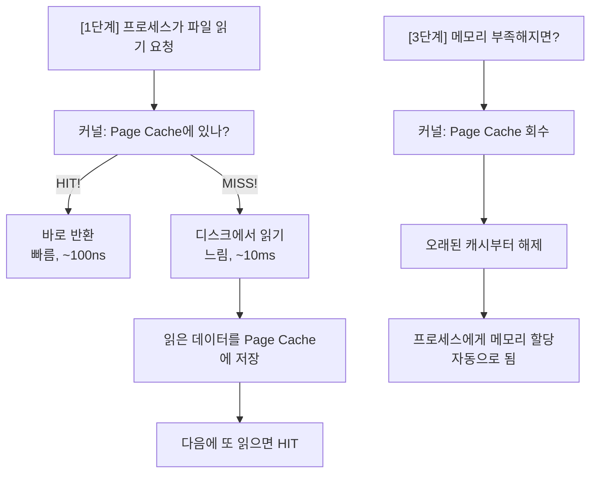
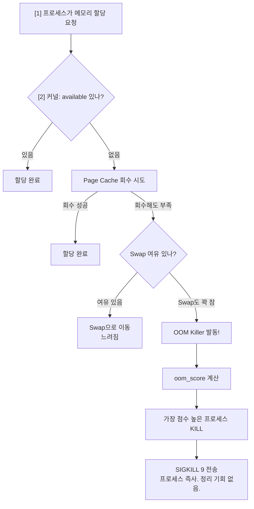
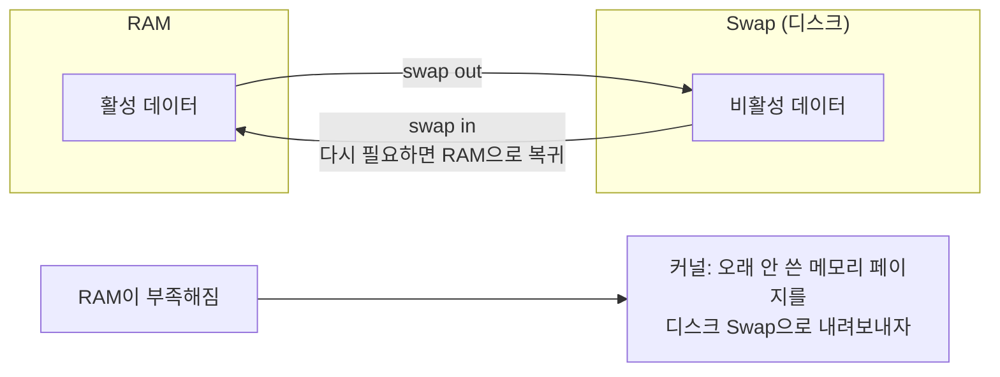

# 07. 리눅스 메모리 관리 - Delta

---

## 1. 리눅스의 메모리 철학 - "남는 메모리는 낭비다"

리눅스의 메모리 관리 철학을 한 마디로 요약하면 이거야:

> **"놀고 있는 RAM은 쓸모없는 RAM이다."**

윈도우에 익숙한 사람은 "메모리 사용량이 90%!!" 하면 겁먹잖아.
리눅스는 다르다. **의도적으로** 메모리를 캐시로 채운다.

!!! tip "리눅스 메모리 철학"
    **Windows 방식:**
    "메모리 80%? 위험하다! 줄여야 해!"

    **Linux 방식:**
    "메모리 80%? 나머지 20%는 왜 놀고 있어? 캐시로 채워서 디스크 I/O 줄이자!"

    | 구분 | 속도 |
    |------|------|
    | 디스크 읽기 | ~10ms (느림) |
    | RAM 읽기 | ~100ns (100,000배 빠름) |

    한 번 읽은 파일을 RAM에 캐시해두면 다음에 또 읽을 때 디스크 안 가도 돼.
    이게 **Page Cache**야.

핵심: 리눅스가 메모리를 많이 쓰고 있다고 "문제 있다"고 판단하면 안 돼.
**뭘로** 쓰고 있는지를 봐야 해.

---

## 2. free -h 출력값 완전 해석

이게 리눅스 메모리 확인의 시작이자 끝이야.

```bash
$ free -h
              total        used        free      shared  buff/cache   available
Mem:           16Gi        8.2Gi       512Mi       256Mi       7.3Gi       7.5Gi
Swap:          4.0Gi       128Mi       3.9Gi
```

### 각 필드 해석

!!! note "free -h 필드 완전 해석"
    | 필드 | 설명 |
    |------|------|
    | **total** | 물리 RAM 전체 용량 (16GB 꽂았으면 16Gi. 단, 커널이 좀 먹어서 약간 적음) |
    | **used** | 프로세스가 실제로 쓰고 있는 메모리 (애플리케이션 코드, JVM 힙, 스택 등) |
    | **free** | 진짜 아무도 안 쓰는 메모리 (캐시도 안 됨. 완전 비어있는 상태) |
    | **shared** | tmpfs 등 공유 메모리 (여러 프로세스가 공유하는 메모리) |
    | **buff/cache** | 커널이 캐시로 쓰고 있는 메모리. buffer = 디스크 블록 메타데이터 캐시, cache = 파일 내용(Page Cache) 캐시. 프로세스가 메모리 달라고 하면 즉시 반환 가능 |
    | **available** | 프로세스가 "지금 당장" 쓸 수 있는 메모리. free + 반환 가능한 buff/cache. **이게 진짜 봐야 할 값이야** |

### 위 예시에서의 계산

```
total:       16 GB
used:        8.2 GB  ← 프로세스가 실제로 먹고 있는 양
free:        0.5 GB  ← "아무도 안 쓰는" 메모리 (적어 보이지?)
buff/cache:  7.3 GB  ← 리눅스가 캐시로 채워놓은 것
available:   7.5 GB  ← 실제로 쓸 수 있는 양 (free + 회수 가능 캐시)

→ free가 0.5GB밖에 없어서 겁먹을 필요 없다.
→ available이 7.5GB나 있으니까 여유 충분.
```

### 관계도



!!! abstract "available (7.5G)"
    free (0.5G) + 반환 가능한 buff/cache = 프로세스가 당장 쓸 수 있는 메모리

---

## 3. "free가 0인데 괜찮아?" - buff/cache의 진실

이 질문은 리눅스 초보가 100% 하는 질문이야.

```
$ free -h
              total    used    free    shared  buff/cache   available
Mem:           16Gi    6.0Gi    52Mi    128Mi      9.9Gi      9.7Gi
```

**"free가 52MB밖에 없어요! 서버 터지나요?!"**

아니. 전혀 안 터져.

!!! tip "해석"
    - **free = 52MB** -- 겁먹지 마. 이건 "캐시조차 안 된" 메모리일 뿐.
    - **buff/cache = 9.9GB** -- 리눅스가 디스크 캐시로 잘 쓰고 있는 것. 프로세스가 메모리 필요하면 즉시 반환됨.
    - **available = 9.7GB** -- 이게 실제 여유! 충분함.

    리눅스: "메모리 놀리느니 캐시라도 하지, 뭐"

### 진짜 걱정해야 할 때

```
상황 1: 괜찮은 경우
  free = 50MB, buff/cache = 10GB, available = 9.5GB
  → buff/cache가 많은 거지, 메모리 부족이 아님

상황 2: 걱정해야 하는 경우
  free = 50MB, buff/cache = 200MB, available = 200MB
  → available도 적음 = 진짜 메모리 부족

상황 3: 비상인 경우
  free = 10MB, buff/cache = 100MB, available = 80MB, swap used = 3GB
  → available 거의 없고 swap 폭발 = OOM Killer 카운트다운 시작
```

**결론: free 말고 available을 봐라.**

---

## 4. 페이지 캐시 (Page Cache)

buff/cache의 대부분을 차지하는 게 Page Cache야.

### 동작 원리



### 왜 이렇게 하냐?

```
같은 파일 3번 읽는 상황:

Page Cache 없을 때:
  1번째: 디스크 → 10ms
  2번째: 디스크 → 10ms
  3번째: 디스크 → 10ms
  합계: 30ms

Page Cache 있을 때:
  1번째: 디스크 → 10ms (MISS, 캐시에 저장)
  2번째: 캐시 → 0.0001ms (HIT!)
  3번째: 캐시 → 0.0001ms (HIT!)
  합계: ~10ms

→ 3배 빨라짐.
→ 로그 파일, 설정 파일, 라이브러리 등 반복 읽는 파일이 많을수록 효과 극대화.
```

---

## 5. /proc/meminfo 주요 필드 해석

`free -h`보다 더 상세한 정보를 원하면 이걸 봐.

```bash
$ cat /proc/meminfo
```

!!! note "/proc/meminfo 핵심 필드"
    | 필드 | 값 예시 | 설명 |
    |------|---------|------|
    | MemTotal | 16384000 kB | 물리 RAM 전체 |
    | MemFree | 512000 kB | free -h의 free |
    | MemAvailable | 7680000 kB | free -h의 available |
    | Buffers | 204800 kB | 디스크 블록 메타데이터 캐시 |
    | Cached | 7168000 kB | Page Cache (파일 내용 캐시) |
    | SwapCached | 32000 kB | Swap에서 다시 RAM으로 온 캐시 |
    | SwapTotal | 4096000 kB | Swap 전체 크기 |
    | SwapFree | 3968000 kB | 안 쓰고 있는 Swap |
    | Dirty | 1024 kB | 수정됐지만 아직 디스크에 안 쓴 캐시 |
    | Slab | 512000 kB | 커널 내부 자료구조용 메모리 |
    | SReclaimable | 384000 kB | Slab 중 회수 가능한 부분 |
    | SUnreclaim | 128000 kB | Slab 중 회수 불가능한 부분 |
    | Committed_AS | 12288000 kB | 프로세스가 할당 요청한 총량 |
    | VmallocTotal | ... kB | 커널 가상 메모리 공간 |
    | AnonPages | 6144000 kB | 파일 매핑 아닌 프로세스 메모리 (힙, 스택 등) |

### 실전에서 주목할 필드

| 필드 | 언제 봐야 하나 | 위험 신호 |
|------|---------------|-----------|
| MemAvailable | 항상 | total의 10% 이하 |
| SwapFree | Swap 사용 의심 시 | SwapTotal - SwapFree 증가 추세 |
| Dirty | 디스크 I/O 문제 시 | 수백 MB 이상 누적 |
| AnonPages | 메모리 누수 의심 시 | 계속 증가하면 누수 |
| Committed_AS | Overcommit 확인 | MemTotal보다 훨씬 크면 주의 |

---

## 6. top/htop에서 메모리 보는 법

### VIRT, RES, SHR 차이

top에서 프로세스별 메모리를 보면 3개 컬럼이 나와. 이거 구분 못 하면 삽질한다.

```
$ top
  PID USER      PR  NI    VIRT    RES    SHR S  %CPU  %MEM     TIME+ COMMAND
 1234 tomcat    20   0   8.5g   2.1g   12m S   5.0  13.1   100:23 java
```

!!! note "VIRT / RES / SHR 완전 해석"
    **VIRT (Virtual Memory Size)**

    "이 프로세스가 주소 공간으로 잡아놓은 전체 크기"

    - 실제로 물리 RAM을 그만큼 쓰는 게 아님!
    - mmap, 공유 라이브러리, malloc 예약분 다 포함
    - JVM이라면 -Xmx만큼 통째로 잡아놓으니까 엄청 큼
    - 이 값만 보고 "메모리 많이 먹네" 하면 틀린 거야

    **RES (Resident Set Size)**

    "실제로 물리 RAM에 올라가 있는 크기"

    - 이게 진짜 이 프로세스가 지금 쓰고 있는 물리 메모리
    - 모니터링할 때 이걸 봐야 함
    - 단, 공유 메모리(SHR)도 포함되어 있음

    **SHR (Shared Memory)**

    "다른 프로세스와 공유하는 메모리"

    - 공유 라이브러리(libc 등) 매핑
    - 이 프로세스 "만의" 메모리 = RES - SHR

    **실전 판단 공식:**

    - 이 프로세스의 실제 메모리 사용량 = **RES**
    - 이 프로세스 "고유" 메모리 = **RES - SHR**
    - VIRT는 참고용. 겁먹지 마.

### 예시: JVM 프로세스

```
VIRT = 8.5GB  ← -Xmx8g로 설정해서 가상 주소 공간 크게 잡음
RES  = 2.1GB  ← 실제 물리 RAM에 2.1GB 올라가 있음
SHR  = 12MB   ← 공유 라이브러리 부분

→ "8.5GB나 먹어요!!" → 아니, 진짜 먹는 건 2.1GB.
→ RES가 시간이 지나면서 -Xmx에 근접하면 그때 걱정해.
```

---

## 7. 모니터링 도구마다 Memory Usage가 다른 이유

이건 실전에서 혼란 일으키는 주범이야.

### 같은 서버, 다른 숫자

```
서버 상태:
  total = 16GB, used = 8GB, free = 0.5GB,
  buff/cache = 7.5GB, available = 8GB

도구 A (used/total):
  8GB / 16GB = 50%   "메모리 50% 사용 중"

도구 B ((total - available) / total):
  (16 - 8) / 16 = 50%   "메모리 50% 사용 중"

도구 C ((total - free) / total):
  (16 - 0.5) / 16 = 96.8%   "메모리 97% 사용 중!!"
```

| 계산 방식 | 위 예시 값 | 특징 |
|-----------|-----------|------|
| used / total | 50% | buff/cache 제외. 합리적. |
| (total-available) / total | 50% | available 기반. **가장 정확.** |
| (total-free) / total | 96.8% | buff/cache도 "사용"으로 침. 패닉 유발. 잘못된 방식. |

!!! warning "권장 방식"
    **(total - available) / total** -- 이걸로 통일해라.

### 도구별 주의사항

```
Grafana + node_exporter:
  → 기본 쿼리가 (total-free)/total 일 수 있음
  → (total-available)/total로 바꿔야 정확함

Zabbix:
  → 템플릿에 따라 다름. 확인 필수

AWS CloudWatch:
  → "Used Memory %"가 buff/cache 포함인지 확인

Datadog:
  → system.mem.usable = available 기반. 합리적.
```

**핵심: 모니터링 대시보드 만들 때 "이 메모리 %가 어떤 공식으로 계산되는지" 반드시 확인해라.**

---

## 8. OOM Killer 상세

### OOM Killer가 뭐냐

Out Of Memory Killer. 메모리가 진짜 바닥나면 커널이 프로세스를 죽여서 메모리를 확보하는 메커니즘이야.



### oom_score: 누굴 죽일지 결정하는 점수

```
커널은 각 프로세스마다 oom_score를 계산해.

계산 기준:
  1. 메모리를 많이 쓸수록 점수 높음
  2. 실행 시간이 짧을수록 점수 높음 (오래된 프로세스 보호)
  3. root 프로세스는 점수 감소
  4. 자식 프로세스 많을수록 점수 높음

점수 확인:
$ cat /proc/{PID}/oom_score
```

```bash
# 각 프로세스의 oom_score 확인
$ cat /proc/1234/oom_score
650

# oom_score_adj 확인 (-1000 ~ 1000)
$ cat /proc/1234/oom_score_adj
0
```

### oom_score_adj: 점수 조정

!!! note "oom_score_adj 설정"
    **범위: -1000 ~ 1000**

    | 값 | 의미 |
    |----|------|
    | -1000 | 절대 죽이지 마 (OOM Killer 면제) |
    | 0 | 기본값 (커널이 알아서 판단) |
    | 1000 | 제일 먼저 죽여 (희생양) |

    **설정 방법:**

    ```bash
    $ echo -1000 > /proc/{PID}/oom_score_adj    # 보호
    $ echo  500  > /proc/{PID}/oom_score_adj    # 우선 제거 대상
    ```

    **systemd 서비스 파일에서:**

    ```ini
    [Service]
    OOMScoreAdjust=-900    # 이 서비스는 웬만하면 죽이지 마
    ```

!!! warning "주의"
    -1000으로 모든 프로세스 보호하면 OOM 상황에서 커널 패닉(시스템 다운) 발생 가능. 중요한 프로세스 1-2개만 보호해라.

### dmesg에서 OOM 로그 찾기

OOM Killer가 작동했는지 확인하는 방법:

```bash
# OOM 로그 검색
$ dmesg | grep -i "oom"
$ dmesg | grep -i "killed process"

# 또는 시스템 로그에서
$ grep -i "oom" /var/log/messages
$ journalctl | grep -i "oom-kill"
```

```
OOM 로그 예시:

[12345.678901] java invoked oom-killer: gfp_mask=0x14201ca, order=0
[12345.678902] Out of memory: Kill process 5678 (java) score 850
               or sacrifice child
[12345.678903] Killed process 5678 (java) total-vm:8589934kB,
               anon-rss:6291456kB, file-rss:12288kB

해석:
  → java 프로세스(PID 5678)가 OOM Killer에 의해 죽음
  → oom_score: 850 (높음 = 메모리 많이 씀)
  → total-vm: 가상 메모리 ~8GB
  → anon-rss: 실제 사용 메모리 ~6GB
  → 이 서버는 메모리가 부족했다는 뜻
```

### OOM 방지법

```
1. 메모리 충분히 확보
   → 애플리케이션 요구량 + OS/캐시 여유분 + 버퍼 20%

2. Swap 설정 (급한 불 끄기용)
   → Swap이 있으면 OOM 전에 Swap 먼저 씀
   → 느려지지만 죽진 않음

3. JVM -Xmx 적절히 설정
   → 물리 RAM의 60-70%까지만
   → OS + 비힙 메모리 공간 남겨야 함

4. 모니터링 알림 설정
   → available이 total의 15% 이하면 경고
   → available이 total의 10% 이하면 긴급

5. oom_score_adj로 중요 프로세스 보호
   → DB, 웹서버 등 핵심 프로세스 보호
   → 로그 수집기 등 덜 중요한 건 양보
```

---

## 9. Swap 상세

### Swap이 뭐냐

물리 RAM이 부족할 때 디스크를 RAM처럼 쓰는 것.



!!! danger "문제"
    디스크 속도 <<<< RAM 속도

    - Swap 쓰기 시작하면 시스템이 눈에 띄게 느려짐
    - **"Swap 사용 = 메모리 부족 경고 신호"**

### swappiness 설정

```
swappiness = 커널이 얼마나 적극적으로 Swap을 쓸지 결정하는 값

범위: 0 ~ 100 (기본값: 60)

  0   = 가능한 한 Swap 안 씀 (RAM 죽어도 안 씀은 아님)
  60  = 기본값 (적당히 Swap 활용)
  100 = 적극적으로 Swap 사용

서버 환경 권장값:
  → 일반 서버: 10~30
  → DB 서버: 1~10 (디스크 I/O 최소화)
  → JVM 서버: 1~10 (GC가 Swap된 메모리 접근하면 재앙)
```

```bash
# 현재 swappiness 확인
$ cat /proc/sys/vm/swappiness
60

# 임시 변경 (재부팅하면 초기화)
$ sysctl vm.swappiness=10

# 영구 변경 (/etc/sysctl.conf에 추가)
$ echo "vm.swappiness=10" >> /etc/sysctl.conf
$ sysctl -p
```

### JVM + Swap = 재앙

!!! danger "JVM에서 Swap이 치명적인 이유"
    GC가 "모든 살아있는 객체를 스캔"해야 하는데 일부 객체가 Swap(디스크)에 있으면?

    - GC: "이 객체 확인해야지" --> 디스크에서 읽기 --> **10ms**
    - GC: "저 객체도 확인" --> 또 디스크에서 읽기 --> **10ms**
    - GC: "이것도..." --> 또... --> **10ms**

    원래 50ms면 끝날 GC가 10초, 30초, 심하면 분 단위로 늘어남.
    STW(Stop The World)가 그만큼 길어지고 애플리케이션 완전 멈춤.

    **결론: JVM 서버에서 swappiness=1 로 설정해라. Swap 쓸 바에 차라리 OOM으로 재시작하는 게 나아.**

---

## 10. vmstat 읽는 법

```bash
$ vmstat 1 5     # 1초 간격으로 5번 출력
procs -----------memory---------- ---swap-- -----io---- -system-- ------cpu-----
 r  b   swpd   free   buff  cache   si   so    bi    bo   in   cs us sy id wa st
 2  0  12800 524288 204800 7340032    0    0    24    48  512  1024 15  3 80  2  0
 1  0  12800 520192 204800 7344128    0    0     8    32  480   980 12  2 84  2  0
```

| 그룹 | 필드 | 설명 |
|------|------|------|
| **procs** | r | CPU 실행 대기 프로세스 수 (높으면 CPU 부족) |
| | b | I/O 대기(blocked) 프로세스 수 |
| **memory** | swpd | 사용 중인 Swap 크기 (kB) |
| | free | 여유 메모리 (kB) |
| | buff | Buffer 크기 (kB) |
| | cache | Cache 크기 (kB) |
| **swap** | si (swap in) | 디스크-->RAM (kB/s). 0이 아니면 경고. |
| | so (swap out) | RAM-->디스크 (kB/s). 0이 아니면 경고. |
| **io** | bi (blocks in) | 디스크에서 읽은 블록/s |
| | bo (blocks out) | 디스크에 쓴 블록/s |
| **cpu** | us | 사용자 모드 CPU % |
| | sy | 시스템(커널) 모드 CPU % |
| | id | idle CPU % (높을수록 여유) |
| | wa | I/O 대기 CPU % (높으면 디스크 병목) |
| | st | 가상화 환경에서 steal된 CPU % |

### vmstat에서 메모리 문제 징후

```
위험 신호 1: si/so 값이 0이 아님
  → Swap in/out 발생 중 = 메모리 부족
  → si/so가 지속적으로 나오면 메모리 증설 필요

위험 신호 2: swpd 값이 계속 증가
  → Swap 사용량이 늘어나고 있음
  → 메모리 누수 또는 용량 부족

위험 신호 3: free가 계속 감소하고 cache도 줄어듦
  → 캐시마저 회수되는 중 = 메모리 심각하게 부족

위험 신호 4: b (blocked) 값이 높고 wa (I/O wait)도 높음
  → Swap I/O 때문에 프로세스가 대기 중
  → 시스템 전체 성능 저하
```

---

## 11. 주의사항 / 함정

!!! danger "함정 모음 - 이거 모르면 삽질해"
    **함정 1:** "free가 0이니까 메모리 부족이다"
    --> 틀림. available을 봐라.

    **함정 2:** "VIRT가 8GB니까 메모리를 8GB 먹고 있다"
    --> 틀림. RES를 봐라. VIRT는 가상 주소 공간일 뿐.

    **함정 3:** "모니터링 툴에서 메모리 95%래요!!"
    --> 계산 방식 확인해라. (total-free)/total이면 캐시 포함이야.

    **함정 4:** "Swap 4GB 설정해놨으니 안심"
    --> Swap 쓰기 시작하면 이미 늦은 거야. Swap은 보험이지 해결책 아님.

    **함정 5:** "oom_score_adj = -1000 으로 다 보호하면 되지?"
    --> 전부 보호하면 OOM 상황에서 커널 패닉 --> 서버 통째로 다운.

    **함정 6:** "buff/cache가 높으니까 문제다"
    --> 정상이야. 리눅스가 의도적으로 캐시하는 거야. available이 충분하면 OK.

    **함정 7:** "메모리 높으면 echo 3 > /proc/sys/vm/drop_caches 해서 캐시 날리면 되잖아"
    --> 운영 서버에서 이거 하면 캐시 날아가서 디스크 I/O 폭증. 일시적으로 더 느려져. 응급 상황 아니면 하지 마.

---

## 12. 정리

### 핵심 요약표

| 항목 | 핵심 |
|------|------|
| 리눅스 철학 | 남는 메모리 = 캐시로 활용 |
| 진짜 봐야 할 값 | `available` (free 아님!) |
| buff/cache | 디스크 캐시. 필요하면 회수 가능. 정상임. |
| Page Cache | 파일 내용을 RAM에 캐시. 디스크 I/O 줄여줌. |
| VIRT | 가상 주소 공간. 실제 사용량 아님. |
| RES | 실제 물리 메모리 사용량. 이걸 봐라. |
| OOM Killer | 메모리 바닥나면 프로세스 죽임. oom_score로 결정. |
| Swap | 디스크를 RAM처럼. 쓰기 시작하면 경고 신호. |
| swappiness | JVM 서버면 1~10. DB 서버도 낮게. |
| 모니터링 % | (total-available)/total 방식으로 통일해라. |

### 한 줄 정리

> **리눅스 메모리는 `free`가 아니라 `available`을 봐라. buff/cache는 정상이다. Swap은 경고 신호다.**

### 이 챕터에서 반드시 기억할 것

1. `free -h` 출력에서 **available**이 핵심
2. buff/cache가 높은 건 **정상** (리눅스 철학)
3. top에서 **RES**가 실제 메모리 사용량
4. 모니터링 도구의 메모리 **% 계산 방식**을 반드시 확인
5. OOM Killer는 **dmesg**에서 확인
6. JVM 서버에서 Swap은 **재앙** (swappiness 낮춰라)

---

### 확인 문제 (5문제)

> 다음 문제를 풀어봐. 답 못 하면 위에서 다시 읽어.

**Q1.** `free -h` 출력에서 free가 100MB이고 buff/cache가 12GB, available이 11GB인 서버가 있다. 이 서버의 메모리 상태는 어떤가? 왜?

**Q2.** top에서 어떤 Java 프로세스의 VIRT가 10GB, RES가 3GB, SHR이 20MB다. 이 프로세스가 실제로 물리 RAM에서 사용 중인 메모리는 대략 얼마인가?

**Q3.** 모니터링 대시보드에서 Memory Usage가 95%로 표시되는데, `free -h`로 확인하니 available이 total의 40%다. 왜 이런 차이가 발생하나?

**Q4.** JVM 서버에서 swappiness를 60(기본값)으로 두면 왜 위험한가? 어떤 값으로 설정해야 하고, 그 이유는?

**Q5.** `dmesg | grep -i "killed process"` 결과로 OOM Kill 로그가 발견됐다. 향후 이 문제를 방지하기 위한 조치를 3가지 이상 말해봐.

??? success "정답 보기"
    **A1.** 이 서버의 메모리 상태는 **정상(여유 있음)**이다. free가 100MB로 적어 보이지만, 리눅스는 남는 메모리를 의도적으로 Page Cache(buff/cache)로 활용한다. 프로세스가 메모리를 요청하면 buff/cache에서 회수하므로, 실제로 사용 가능한 메모리는 available = 11GB다. 메모리 부족을 판단할 때는 free가 아니라 available을 봐야 한다.

    **A2.** 실제 물리 RAM 사용량은 **RES = 약 3GB**다. VIRT(10GB)는 가상 주소 공간으로, JVM이 -Xmx 등으로 예약해놓은 것이지 실제 물리 메모리를 그만큼 쓰는 게 아니다. 이 프로세스 "고유" 메모리는 RES - SHR = 약 2.98GB. VIRT만 보고 "10GB 먹고 있다"고 판단하면 틀린 거다.

    **A3.** 모니터링 도구가 **(total - free) / total** 방식으로 계산하고 있기 때문이다. 이 방식은 buff/cache도 "사용 중"으로 포함하므로 수치가 부풀려진다. 정확한 방식은 **(total - available) / total**이고, 이 경우 60%가 되어 실제 상황을 정확히 반영한다. 대시보드의 쿼리를 available 기반으로 수정해야 한다.

    **A4.** JVM 서버에서 swappiness가 높으면, GC 수행 시 Swap으로 내려간 메모리 페이지를 디스크에서 다시 읽어야 한다. GC는 모든 살아있는 객체를 스캔해야 하는데, 객체가 Swap에 있으면 디스크 I/O가 발생해서 원래 50ms면 끝날 GC가 수십 초까지 늘어난다. 이 동안 STW로 애플리케이션이 멈춘다. **swappiness=1~10**으로 설정해야 하며, Swap을 쓸 바에 OOM으로 재시작하는 게 낫다.

    **A5.**

    1. **메모리 증설** 또는 **JVM -Xmx 조정**: 물리 RAM 대비 JVM 힙이 너무 크면 OS/비힙 메모리 공간이 부족해진다. 물리 RAM의 60-70%까지만 -Xmx로 설정한다.
    2. **모니터링 알림 설정**: available이 total의 15% 이하일 때 경고, 10% 이하일 때 긴급 알림을 설정해서 OOM 전에 인지한다.
    3. **oom_score_adj 설정**: 핵심 프로세스(DB, WAS)에 -900~-1000을 설정해서 OOM Killer 대상에서 보호한다.
    4. **메모리 누수 점검**: 애플리케이션에 메모리 누수가 있는지 힙 덤프 분석을 수행한다.
    5. **Swap 설정**: Swap이 없었다면 적절한 크기의 Swap을 설정해서 OOM Kill 전에 버퍼 역할을 하게 한다(단, JVM 서버면 swappiness는 낮게).
