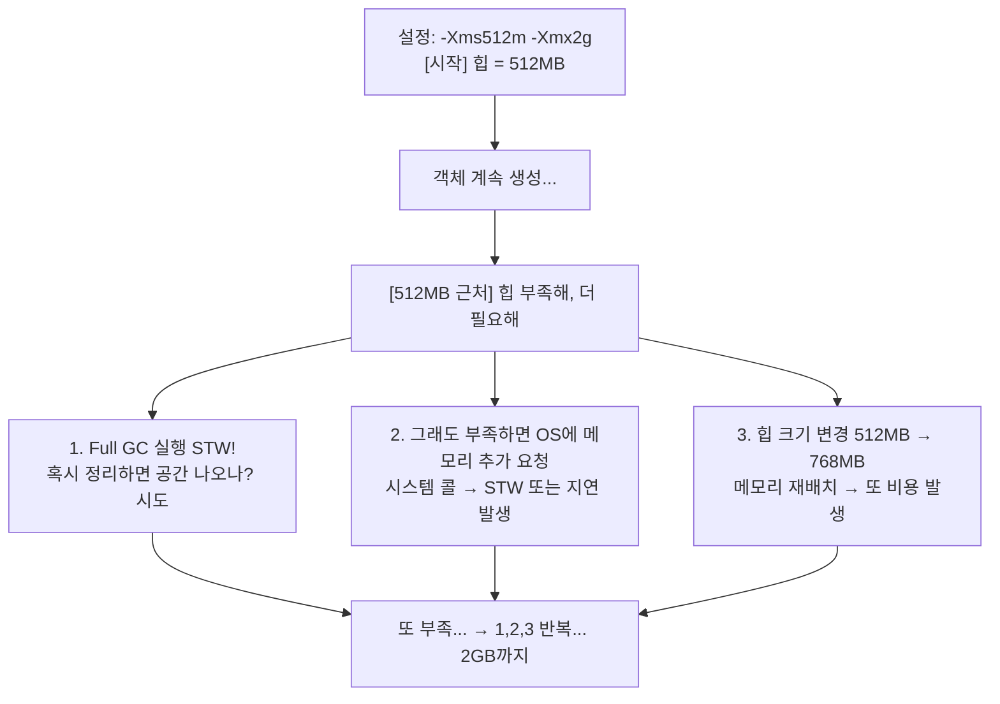
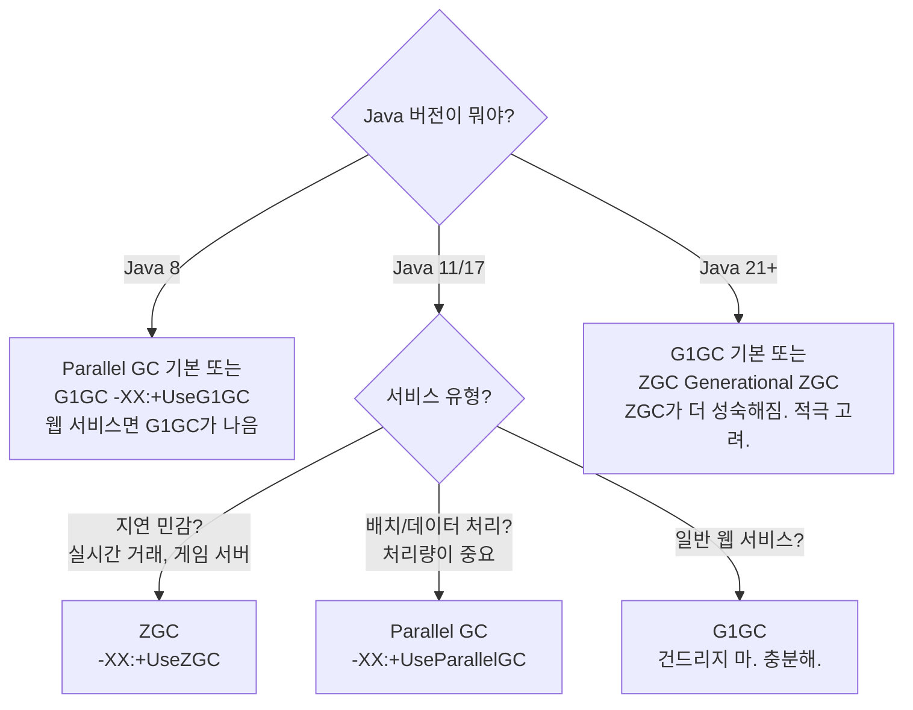

# 08. JVM 튜닝과 진단도구 - Delta

---

## 1. 필수 JVM 옵션 - "이것만은 알아야 해"

JVM 옵션을 모르고 자바 서버 운영하는 건, 차 계기판 안 보고 고속도로 달리는 거야.

!!! note "JVM 필수 옵션 총정리"
    **`-Xms512m`** -- 힙 메모리 초기 크기 (Heap Initial Size)

    - JVM 시작할 때 OS한테 "이만큼 메모리 줘" 하고 받아오는 크기
    - 이것보다 더 필요하면 OS한테 추가 요청함

    **`-Xmx2g`** -- 힙 메모리 최대 크기 (Heap Maximum Size)

    - 힙이 이 이상으로 커질 수 없음
    - 이걸 넘으면 OutOfMemoryError: Java heap space

    **`-Xss512k`** -- 스레드 스택 크기 (Stack Size per Thread)

    - 각 스레드가 쓸 수 있는 스택 크기
    - 재귀 깊으면 StackOverflowError --> 이 값 키울 수 있음
    - 기본값: 대체로 512KB~1MB (OS/JVM 버전마다 다름)
    - 스레드 1000개면 스택만 500MB~1GB 먹는 거야

    **`-XX:MetaspaceSize=256m`** -- Metaspace 초기 임계값

    - 이 크기 넘으면 Full GC 트리거 + Metaspace 확장
    - 너무 작으면 시작할 때 불필요한 GC 발생

    **`-XX:MaxMetaspaceSize=512m`** -- Metaspace 최대 크기

    - 설정 안 하면 물리 메모리 한도까지 무제한 확장
    - 클래스 로딩 누수 있으면 메모리 폭발
    - 반드시 설정해라. "무제한"은 운영 환경에서 무책임한 거야.

### 기타 중요 옵션

!!! tip "추가 JVM 옵션"
    | 옵션 | 설명 |
    |------|------|
    | `-XX:+HeapDumpOnOutOfMemoryError` | OOM 발생 시 자동으로 힙 덤프 생성. 운영 서버 필수. 이거 없으면 OOM 나도 원인 못 찾아. |
    | `-XX:HeapDumpPath=/var/log/java/heapdump.hprof` | 힙 덤프 저장 경로 지정. 디스크 여유 확인 필수! 힙이 4GB면 덤프도 ~4GB |
    | `-XX:+UseG1GC` | G1 GC 사용 (Java 9+ 기본값) |
    | `-XX:MaxGCPauseMillis=200` | GC 일시정지 목표 시간 (G1 GC). "200ms 이내로 GC 해줘" (목표일 뿐, 보장 아님) |
    | `-Xlog:gc*:file=gc.log:time,uptime,level,tags` | GC 로그 파일로 기록 (Java 9+). Java 8: `-verbose:gc -Xloggc:gc.log` |
    | `-XX:+ExitOnOutOfMemoryError` | OOM 발생 시 JVM 즉시 종료. 컨테이너 환경에서 유용 (죽어야 재시작됨) |

---

## 2. 왜 -Xms와 -Xmx를 같게 설정하는가

이거 면접 단골 질문이야. 모르면 부끄러운 거다.

### 다르게 설정했을 때 문제



!!! danger "문제"
    - 힙 확장할 때마다 Full GC + OS 요청 비용 발생
    - 확장 과정에서 STW가 추가로 발생할 수 있음
    - 특히 서버 시작 직후 트래픽 들어오면 GC 지옥

### 같게 설정했을 때

```
설정: -Xms2g -Xmx2g

[시작] 힙 = 2GB (시작부터 OS한테 2GB 받아옴)
  │
  ↓  객체 계속 생성...
  │
  → 힙 확장 자체가 없음
  → 확장으로 인한 Full GC 없음
  → OS 추가 요청 없음
  → 예측 가능한 성능

결론: 운영 환경에서는 -Xms = -Xmx. 무조건.
```

### 왜 개발 환경에서는 다르게 해도 되냐?

```
개발 환경:
  → 다른 프로세스도 많이 돌림 (IDE, 브라우저, DB 등)
  → 메모리 넉넉하지 않을 수 있음
  → -Xms256m -Xmx1g 식으로 필요한 만큼만 쓰게 하는 게 합리적

운영 환경:
  → 이 서버는 이 애플리케이션 전용
  → 메모리 계획 세우고 배치한 거
  → -Xms = -Xmx 로 확정. 예측 가능한 동작이 중요.
```

---

## 3. 힙 사이즈 결정 가이드

"그래서 -Xmx를 얼마로 잡아야 해?" — 이걸 모르면 설계 못 한 거야.

### 물리 RAM에서 힙에 쓸 수 있는 양

!!! note "물리 RAM 16GB 서버의 메모리 분배"
    | 구분 | 크기 | 설명 |
    |------|------|------|
    | OS 커널 + 시스템 프로세스 | 1~2 GB | 리눅스 자체가 먹는 것 |
    | Page Cache (여유분) | 1~2 GB | 디스크 I/O 캐시용 |
    | JVM 비힙 메모리 (Metaspace, 스레드 스택, Direct Buffer, JIT 등) | 1~2 GB | Metaspace, NIO Direct Buffer, 코드 캐시 등 |
    | **JVM 힙 (-Xmx)** | **10~11 GB** | **이게 네가 쓸 수 있는 것** |

    **공식: -Xmx = 물리RAM x 60~70%**

    - 16GB x 60% = 9.6GB
    - 16GB x 70% = 11.2GB
    - --> -Xmx10g ~ -Xmx11g 정도가 적절

!!! warning "80% 이상 잡으면?"
    OS가 메모리 부족해서 Swap 쓰기 시작. 07장에서 배웠지? JVM + Swap = 재앙

### RAM 크기별 가이드

| 물리 RAM | -Xmx 권장 | 비고 |
|----------|-----------|------|
| 4 GB | 2~2.5 GB | 소규모 서비스 |
| 8 GB | 5~5.5 GB | 일반 WAS |
| 16 GB | 10~11 GB | 표준 운영 서버 |
| 32 GB | 20~22 GB | 대규모 서비스 |
| 64 GB | 40~45 GB | 대용량 처리. G1/ZGC 권장 |

### 비힙 메모리 계산 (놓치면 OOM)

```
JVM이 쓰는 메모리 = 힙만이 아니야!

전체 JVM 메모리 = 힙 + Metaspace + 스레드 스택 × 스레드 수
                 + Direct Buffer + 코드 캐시 + GC 오버헤드 + ...

예시 계산:
  힙:              10 GB
  Metaspace:       256 MB
  스레드 스택:     1MB × 200 스레드 = 200 MB
  Direct Buffer:   256 MB
  코드 캐시:       240 MB (기본값)
  GC 오버헤드:     ~200 MB
  ─────────────────────
  합계:            약 11.1 GB

  물리 RAM이 16GB면 OS용으로 ~5GB 남음. 충분.
  물리 RAM이 12GB면 OS용으로 ~0.9GB. 위험!

→ 힙만 생각하면 안 돼. 비힙도 계산해라.
```

---

## 4. GC 알고리즘 선택 가이드

"어떤 GC 쓸까?" — 이건 트레이드오프 분석이야. 무조건 좋은 GC는 없어.

| GC | 처리량 | 지연시간 | 특징 |
|----|--------|---------|------|
| **Serial** | 낮음 | 길다 | 싱글스레드 GC. 클라이언트 앱, 힙 100MB 이하. 서버에서 절대 쓰지 마. |
| **Parallel (PS)** | 높음 | 보통 | 멀티스레드 GC. 처리량(throughput) 중시. 배치 작업에 적합. Java 8 기본값. |
| **G1** | 높음 | 짧다 | Region 기반. 대용량 힙에 적합. Java 9+ 기본값. 범용으로 무난. -XX:MaxGCPauseMillis로 목표 설정. |
| **ZGC** | 높음 | 매우짧음 | 초저지연. STW < 1~2ms. 힙 수백 GB도 OK. Java 15+. 지연 민감한 서비스에 적합. |
| **Shenandoah** | 높음 | 매우짧음 | ZGC와 유사. Red Hat 주도. Java 12+. 역시 초저지연. |

### 언제 뭘 써야 하는가



!!! info "우리 LMS 프로젝트?"
    Java 8 기반, 일반 웹 서비스 --> G1GC 쓰면 됨 (`-XX:+UseG1GC`)

---

## 5. JVM 진단 도구 상세

장애 터졌을 때 이 도구 못 쓰면 눈 뜨고 당하는 거야.

### 5.1 jps - 프로세스 목록

```bash
# 실행 중인 JVM 프로세스 목록
$ jps
1234 Bootstrap        ← Tomcat
5678 Jps              ← jps 자기 자신

# 전체 패키지명 + JVM 인자 보기
$ jps -lvm
1234 org.apache.catalina.startup.Bootstrap
     -Xms2g -Xmx2g -XX:+UseG1GC start

# 이게 첫 번째 단계야.
# "PID 뭐야?" 모르면 아무 진단 도구도 못 써.
```

### 5.2 jstat - GC 통계 실시간

```bash
# GC 통계 실시간 확인 (1초 간격, 10번)
$ jstat -gc 1234 1000 10
```

!!! note "jstat -gc 출력 해석"
    | 필드 | 의미 | 비고 |
    |------|------|------|
    | S0C/S0U | Survivor 0 용량/사용량 | |
    | S1C/S1U | Survivor 1 용량/사용량 | |
    | EC/EU | Eden 용량/사용량 | |
    | OC/OU | Old 용량/사용량 | **이게 계속 차면 누수 의심** |
    | MC/MU | Metaspace 용량/사용량 | |
    | CCSC/CCSU | Compressed Class Space 용량/사용량 | |
    | YGC | Young GC 횟수 | |
    | YGCT | Young GC 총 소요 시간(초) | |
    | FGC | Full GC 횟수 | **이게 증가하면 위험** |
    | FGCT | Full GC 총 소요 시간(초) | **이게 크면 STW 길다는 뜻** |
    | CGC | Concurrent GC 횟수 (G1) | |
    | CGCT | Concurrent GC 시간 | |
    | GCT | 전체 GC 총 시간 | |

```bash
# 비율로 보기 (더 읽기 쉬움)
$ jstat -gcutil 1234 1000 10

  S0     S1     E      O      M     CCS    YGC   YGCT    FGC   FGCT     GCT
 50.00   0.00  50.00  75.00  97.06  93.75   150   1.234    5   0.987   2.677
#                     ^^^^^                              ^^^^^
#                     Old 75%                           Full GC 5번
#                     아직 OK                           횟수와 시간 주시
```

### 뭘 봐야 하냐

```
1. O (Old 영역 사용률)
   → 지속적으로 증가 추세? → 메모리 누수 의심
   → GC 후에도 안 줄어듦? → 확실한 누수

2. FGC (Full GC 횟수)
   → 짧은 시간에 급증? → 힙 부족 또는 누수
   → 1시간에 수십 번? → 심각한 상태

3. FGCT / FGC (Full GC 1회 평균 시간)
   → FGCT / FGC > 1초? → STW가 1초 넘음. 사용자 체감.
   → > 5초? → 서비스 장애 수준

4. YGCT / YGC (Young GC 1회 평균 시간)
   → 보통 10~100ms 정도가 정상
   → 500ms 넘으면 Young 영역 너무 큰 거
```

### 5.3 jmap - 힙 정보

```bash
# 힙 히스토그램 (어떤 객체가 메모리를 많이 먹고 있는지)
$ jmap -histo 1234 | head -20
```

```
 num     #instances         #bytes  class name
─────────────────────────────────────────────────
   1:       1258940      150000000  [B              ← byte 배열
   2:        892340       85000000  [C              ← char 배열
   3:        750000       60000000  java.lang.String
   4:        345000       27600000  com.example.UserDTO
   5:        234000       18720000  java.util.HashMap$Node
```

```
해석:
  → [B, [C, String이 상위에 있는 건 보통 정상
  → 특정 도메인 클래스(UserDTO 등)가 수십만 개? → 의심
  → 시간 두고 여러 번 찍어서 증가 추세 확인
```

```bash
# 힙 덤프 생성 (⚠️ 운영 서버 주의!)
$ jmap -dump:format=b,file=/tmp/heapdump.hprof 1234
```

### 5.4 jcmd - 종합 진단 도구

jcmd는 jmap, jstat, jinfo 등의 기능을 통합한 도구야. 이거 하나면 거의 다 돼.

```bash
# 사용 가능한 명령어 목록
$ jcmd 1234 help

# 힙 덤프 생성 (jmap 대신 권장)
$ jcmd 1234 GC.heap_dump /tmp/heapdump.hprof

# 현재 JVM 플래그 확인
$ jcmd 1234 VM.flags

# JVM 시스템 프로퍼티 확인
$ jcmd 1234 VM.system_properties

# GC 실행 요청 (System.gc() 호출)
$ jcmd 1234 GC.run

# 힙 히스토그램 (jmap -histo 대신)
$ jcmd 1234 GC.class_histogram

# 스레드 덤프 (jstack 대신)
$ jcmd 1234 Thread.print
```

```
왜 jcmd를 권장하냐?
  → jmap은 내부적으로 Serviceability Agent를 써서 대상 JVM을 일시정지시킬 수 있음
  → jcmd는 JVM 내부 API를 직접 쓰므로 더 안전
  → Java 9+에서는 jcmd가 표준 진단 도구
```

### 5.5 jstack - 스레드 덤프

```bash
# 스레드 덤프 생성
$ jstack 1234 > /tmp/threaddump.txt

# 또는 jcmd로
$ jcmd 1234 Thread.print > /tmp/threaddump.txt
```

```
스레드 덤프 출력 예시:

"http-nio-8080-exec-1" #25 daemon prio=5 os_prio=0
   java.lang.Thread.State: WAITING (on object monitor)
    at java.lang.Object.wait(Native Method)
    - waiting on <0x00000000f8c08e90> (a java.lang.Object)
    at com.example.SlowService.processData(SlowService.java:45)
    at com.example.Controller.handleRequest(Controller.java:78)

해석:
  → 스레드 이름: http-nio-8080-exec-1 (Tomcat 워커 스레드)
  → 상태: WAITING (뭔가 기다리는 중)
  → 어디서 대기 중인지 스택트레이스로 추적 가능
```

```
언제 스레드 덤프를 뜨나:
  1. 애플리케이션이 응답 안 할 때 (행 상태)
  2. CPU 100% 찍을 때 (어떤 스레드가 폭주?)
  3. 데드락 의심 시
  → 3~5초 간격으로 3번 연속 찍어서 비교해라
  → 같은 스레드가 같은 위치에 있으면 그게 병목
```

---

## 6. 힙 덤프 (Heap Dump)

### 언제 떠야 하는가

!!! note "힙 덤프를 떠야 하는 상황"
    1. **OutOfMemoryError 발생 시** -- `-XX:+HeapDumpOnOutOfMemoryError`로 자동 생성 권장
    2. **Old 영역 사용률이 GC 후에도 계속 증가할 때** -- jstat -gcutil로 확인 후 결정
    3. **Full GC가 반복적으로 발생하는데 메모리가 안 줄어들 때** -- 확실한 누수 징후
    4. **특정 시점의 메모리 상태를 분석하고 싶을 때** -- 부하 테스트 후, 장시간 운영 후 등

### 운영 서버에서 힙 덤프 뜰 때 주의사항

이거 모르고 운영 서버에서 함부로 뜨면 사고야.

!!! warning "운영 서버 힙 덤프 주의사항"
    **1. 디스크 공간 확인 필수**

    - 힙이 4GB면 덤프 파일도 ~4GB
    - 디스크 꽉 차면 서버 추가 장애 발생
    - `df -h`로 여유 공간 먼저 확인!

    **2. STW (Stop The World) 발생**

    - 힙 덤프 생성 중 JVM 일시 정지
    - 힙이 클수록 정지 시간 김 (4GB면 수십 초~분)
    - 트래픽 많은 시간대 피할 것

    **3. live 옵션 주의**

    - `jmap -dump:live,...` 하면 덤프 전 Full GC 실행
    - 살아있는 객체만 덤프 (파일 크기 줄어듦)
    - 하지만 Full GC STW가 추가됨
    - 운영 서버에서는 live 없이 일단 전체 덤프 권장

    **4. 민감 정보 포함 가능**

    - 힙에 비밀번호, 토큰, 개인정보가 있을 수 있음
    - 덤프 파일 보안 관리 필수
    - 분석 끝나면 삭제

### 자동 힙 덤프 필수 설정

```bash
# 이 옵션 없이 운영 서버 돌리면 OOM 나도 원인 못 찾아.
# JVM 시작 옵션에 반드시 추가:

-XX:+HeapDumpOnOutOfMemoryError
-XX:HeapDumpPath=/var/log/java/heapdump_%p.hprof

# %p = PID 치환 → 여러 번 죽어도 덮어쓰지 않음
```

---

## 7. Eclipse MAT 기본 사용법

힙 덤프를 떴으면 분석해야지. MAT(Memory Analyzer Tool)이 표준 도구야.

### 설치

```
1. https://eclipse.dev/mat/ 에서 다운로드
2. Standalone 버전 권장 (Eclipse 플러그인보다 독립 실행이 편함)
3. 큰 덤프 분석 시 MAT 자체의 메모리도 늘려야 함:
   MemoryAnalyzer.ini 에서 -Xmx 수정
   → 분석할 덤프의 1.5~2배 정도
   → 4GB 덤프 분석하려면 MAT도 -Xmx6g ~ -Xmx8g
```

### 7.1 Leak Suspects Report

!!! note "Leak Suspects Report"
    MAT이 자동으로 분석해서 "이게 누수 원인일 수 있어" 하고 알려줌

    **열기:** File > Open Heap Dump > (자동으로 분석 시작) > Leak Suspects Report 선택

    **보고서 내용 예시:**

    > **Problem Suspect 1**
    >
    > 클래스 `com.example.CacheManager`의 인스턴스가 1,245,678 개의 객체를 참조하며 전체 힙의 68%를 차지합니다.
    >
    > --> 이 클래스가 뭔지 찾아가서 왜 이렇게 많은 객체를 들고 있는지 분석해라

    **이걸 먼저 봐라. 80%의 경우 여기서 원인 찾을 수 있어.**

### 7.2 Dominator Tree

!!! note "Dominator Tree"
    "이 객체가 없어지면 같이 GC될 객체들"을 트리로 보여줌

    **열기:** 상단 메뉴 아이콘 또는 Query Browser > Dominator Tree

    **출력 예시:**

    | Class Name | Shallow | Retained |
    |-----------|---------|----------|
    | com.example.CacheManager | 64 B | **2,147 MB** |
    | -- java.util.HashMap | 48 B | 2,147 MB |
    | ---- HashMap$Node[] | 4 MB | 2,146 MB |
    | ------ com.example.UserDTO | 128 B | ... |

    - **Shallow Heap** = 이 객체 자체의 크기
    - **Retained Heap** = 이 객체가 GC되면 같이 해제되는 총 크기

    Retained Heap이 큰 객체 = 메모리의 지배자. CacheManager가 2.1GB의 Retained Heap? 이놈이 들고 있는 HashMap이 원인.

### 7.3 Histogram

!!! note "Histogram"
    "어떤 클래스의 인스턴스가 몇 개이고 얼마나 먹고 있는가"

    **열기:** 상단 아이콘 또는 Query Browser > Histogram

    | Class Name | Objects | Shallow Heap |
    |-----------|---------|-------------|
    | byte[] | 1,258,940 | 150 MB |
    | char[] | 892,340 | 85 MB |
    | java.lang.String | 750,000 | 18 MB |
    | com.example.UserDTO | 345,000 | **42 MB** |
    | java.util.HashMap$Node | 234,000 | 9 MB |

    **사용법:**

    1. Regex Filter로 자기 패키지 필터링 (`com.example.*`)
    2. 인스턴스 수가 비정상적으로 많은 클래스 찾기
    3. 우클릭 > List Objects > with incoming references --> "누가 이 객체를 참조하고 있는지" 추적

### 7.4 Shortest Path to GC Root

!!! abstract "Shortest Path to GC Root"
    "이 객체가 왜 GC 안 되는 거야?"에 대한 답

    **사용법:**

    1. Histogram에서 의심 클래스 선택
    2. 우클릭 > Merge Shortest Paths to GC Roots
    3. > exclude all phantom/weak/soft etc. references (약한 참조 제외 --> Strong Reference만 보기)

    **결과 예시:**

    ```
    GC Root: Thread "main"
      └─ com.example.AppContext (static)
         └─ com.example.CacheManager
            └─ java.util.HashMap
               └─ com.example.UserDTO  ← 이게 GC 안 됨
    ```

    **해석:**

    - UserDTO가 GC 안 되는 이유: HashMap이 참조 --> CacheManager가 참조 --> AppContext(static)가 참조 --> GC Root(Thread)
    - static CacheManager가 HashMap을 들고 있고, 거기에 UserDTO를 계속 넣기만 하고 안 빼면 누수!

    **이게 메모리 누수 추적의 핵심 기법이야. "누가 이 객체를 놓아주지 않는가?"를 찾는 것.**

---

## 8. 주의사항 / 함정

!!! danger "함정 모음"
    **함정 1:** "-Xmx를 물리 RAM 전부로 설정"
    --> OS, 비힙, 캐시 공간 없음 --> Swap --> GC 재앙 --> OOM. 60~70%까지만.

    **함정 2:** "-XX:MaxMetaspaceSize 설정 안 함"
    --> 기본값 = 무제한. 클래스 로딩 누수 시 물리 메모리 전부 먹을 수 있음. 반드시 상한 설정 (256m~512m 정도).

    **함정 3:** "운영 서버에서 jmap -dump:live"
    --> live 옵션 = Full GC 선행. 운영 중에 Full GC = STW = 장애. 급하면 live 없이. 또는 jcmd 사용.

    **함정 4:** "GC 로그 안 남김"
    --> 장애 후 분석 불가. "왜 터졌어요?" --> "몰라요". 운영 서버에서 GC 로그는 필수. 디스크 부담 거의 없음.

    **함정 5:** "HeapDumpOnOutOfMemoryError 설정 안 함"
    --> OOM 나도 증거가 없음. 사후 분석 불가. 운영 서버 JVM 옵션에 반드시 포함.

    **함정 6:** "jstat 한 번 찍고 판단"
    --> 한 번은 스냅샷일 뿐. 추세를 봐야 해. 최소 5분~10분 간격으로 여러 번 찍어서 추세 확인.

    **함정 7:** "MAT에서 Shallow Heap만 보고 판단"
    --> Shallow는 객체 자체 크기일 뿐. Retained Heap을 봐야 진짜 영향 파악.

---

## 9. 정리

### 핵심 요약표

| 항목 | 핵심 |
|------|------|
| -Xms = -Xmx | 운영 환경 필수. 힙 확장 비용 제거. |
| -Xmx 크기 | 물리 RAM의 60~70%. 비힙 고려. |
| MaxMetaspaceSize | 반드시 설정. 기본값(무제한)은 위험. |
| HeapDumpOnOOME | 운영 서버 필수. 없으면 OOM 원인 못 찾음. |
| GC 선택 | Java 8: G1GC, Java 11+: G1GC(기본), 저지연: ZGC |
| jps | PID 확인. 모든 진단의 시작. |
| jstat -gcutil | GC 통계 실시간. Old% 추세와 FGC 횟수 주목. |
| jcmd | 종합 진단. jmap보다 안전. |
| jstack | 스레드 덤프. 행, 데드락, CPU 폭주 진단. |
| MAT - Leak Suspects | 자동 누수 분석. 먼저 봐라. |
| MAT - Dominator Tree | Retained Heap으로 지배자 찾기. |
| MAT - GC Root Path | "왜 GC 안 되나" 추적. 누수의 핵심. |

### 한 줄 정리

> **JVM 튜닝은 -Xms=-Xmx + HeapDumpOnOOME + GC로그가 기본. 장애 시 jstat으로 추세 보고, 힙 덤프 떠서 MAT으로 Retained Heap 분석.**

### 이 챕터에서 반드시 기억할 것

1. **-Xms = -Xmx** (운영 서버 필수)
2. **-XX:+HeapDumpOnOutOfMemoryError** (운영 서버 필수)
3. **-Xmx는 물리 RAM의 60~70%** (비힙 메모리 고려)
4. jstat에서 **O(Old)% 추세**와 **FGC 횟수**를 봐라
5. MAT에서는 **Retained Heap**이 핵심 (Shallow 아님)
6. GC Root Path 추적이 **누수 원인 찾기의 핵심**

---

### 확인 문제 (5문제)

> 다음 문제를 풀어봐. 답 못 하면 위에서 다시 읽어.

**Q1.** 운영 서버에서 -Xms512m -Xmx4g로 설정하면 어떤 문제가 생길 수 있는가? 왜 -Xms와 -Xmx를 같게 설정하는가?

**Q2.** 물리 RAM이 8GB인 서버에 -Xmx7g를 설정했다. 이게 왜 위험한가? 적절한 -Xmx 값은 얼마인가?

**Q3.** jstat -gcutil 출력에서 O(Old 영역) 사용률이 GC 후에도 70% → 75% → 80% → 85%로 계속 증가하고 있다. 이 상황은 무엇을 의미하며, 다음으로 해야 할 조치는?

**Q4.** 운영 서버에서 힙 덤프를 뜰 때 주의해야 할 점 3가지를 말해봐.

**Q5.** MAT에서 Shallow Heap과 Retained Heap의 차이는 무엇인가? 메모리 누수 분석 시 어떤 값을 봐야 하고 왜?

??? success "정답 보기"
    **A1.** -Xms(512MB)가 -Xmx(4GB)보다 작으면, JVM이 시작 시 512MB로 시작해서 메모리가 부족해질 때마다 힙을 확장한다. 확장할 때마다 Full GC가 트리거되고, OS에 메모리를 추가 요청하는 비용이 발생하며, 이 과정에서 STW가 추가로 발생할 수 있다. 특히 서버 시작 직후 트래픽이 들어오면 GC가 반복되어 성능이 불안정해진다. -Xms와 -Xmx를 같게 설정하면 힙 확장이 없으므로 이런 비용이 제거되고 예측 가능한 성능을 얻는다.

    **A2.** 물리 RAM 8GB에서 -Xmx7g면 힙만 7GB를 차지하고, OS(1~2GB), Metaspace, 스레드 스택, Direct Buffer, 코드 캐시 등 비힙 메모리(1~2GB)를 위한 공간이 부족하다. 결과적으로 OS가 Swap을 쓰기 시작하고, GC가 Swap된 메모리를 스캔하면서 STW가 급격히 늘어난다. 적절한 -Xmx는 물리 RAM의 60~70%인 **5~5.5GB** 정도다.

    **A3.** Old 영역 사용률이 GC 후에도 계속 증가하는 것은 **메모리 누수**를 강하게 의심해야 하는 상황이다. GC가 회수할 수 없는 객체(Strong Reference로 계속 참조되는)가 쌓이고 있다는 뜻이다. 다음 조치: (1) 힙 덤프를 뜬다 (jcmd {PID} GC.heap_dump 또는 -XX:+HeapDumpOnOutOfMemoryError로 대기). (2) MAT으로 분석하여 Dominator Tree에서 Retained Heap이 큰 객체를 찾고, GC Root Path를 추적하여 누가 객체를 놓아주지 않는지 찾는다.

    **A4.**

    1. **디스크 공간 확인**: 힙 크기만큼의 파일이 생성되므로(4GB 힙 = ~4GB 파일), 디스크에 충분한 여유 공간이 있는지 df -h로 확인해야 한다. 디스크 부족하면 추가 장애가 발생한다.
    2. **STW 발생**: 힙 덤프 생성 중 JVM이 일시 정지한다. 힙이 클수록 오래 걸리므로(수십 초~분), 트래픽이 적은 시간대에 수행하거나, 로드밸런서에서 해당 서버를 빼고 수행한다.
    3. **민감 정보 포함**: 힙 메모리에 비밀번호, 토큰, 개인정보가 평문으로 존재할 수 있으므로, 덤프 파일의 접근 권한을 제한하고 분석 완료 후 삭제해야 한다.

    **A5.** **Shallow Heap**은 객체 자체만의 크기다 (헤더 + 필드). HashMap 객체 자체는 48바이트 정도. **Retained Heap**은 이 객체가 GC되면 같이 해제될 수 있는 모든 객체의 총 크기다. HashMap이 100만 개의 Entry를 담고 있으면 Retained Heap은 수 GB가 될 수 있다. 메모리 누수 분석 시에는 **Retained Heap**을 봐야 한다. Shallow Heap이 작아도 Retained Heap이 크면 그 객체가 대량의 메모리를 "지배"하고 있다는 뜻이고, 그게 누수의 원인일 가능성이 높다.
