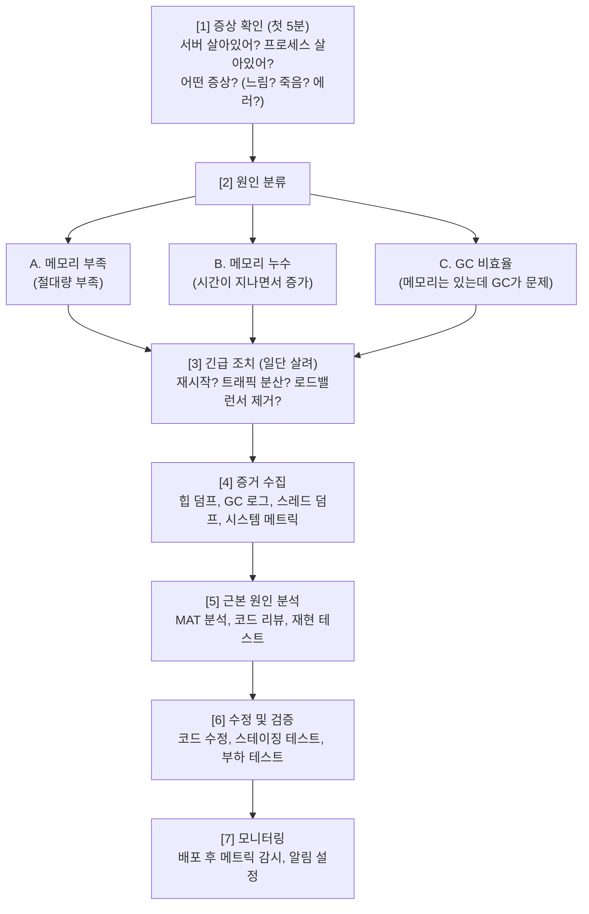
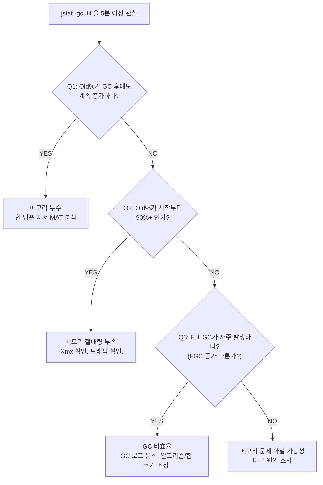

# 09. 실전 메모리 장애대응 - Omega

---

## 1. 메모리 문제 대응 흐름도

장애 터졌을 때 머리 하얘지면 안 돼. 흐름을 외우고 있어야 해.



---

## 2. "메모리 높아요" 신고 시 첫 5분 행동 순서

신고 들어오면 당황하지 말고 이 순서대로 해.

!!! danger "첫 5분 행동 순서"
    **분 0~1: 상태 확인**

    ```bash
    $ ssh 서버
    $ ps aux | grep java          # JVM 프로세스 살아있어?
    $ free -h                     # 시스템 메모리 상태는?
    $ top -bn1 | head -20         # CPU, 메모리 전체 상황은?
    ```

    **분 1~2: 메모리 상세 확인**

    ```bash
    $ jps -lvm                    # JVM PID + 옵션 확인
    $ jstat -gcutil {PID} 1000 5  # GC 상태 실시간 확인
    ```

    Old% 확인, FGC 횟수 확인, FGCT 확인

    **분 2~3: Swap + OOM 확인**

    ```bash
    $ vmstat 1 5                  # si/so (Swap I/O) 확인
    $ dmesg | grep -i oom         # OOM Killer 발동 이력 확인
    $ dmesg | grep -i "killed"    # 프로세스 강제 종료 이력
    ```

    **분 3~5: 증거 확보**

    ```bash
    $ jcmd {PID} GC.heap_dump /tmp/heap_$(date +%Y%m%d_%H%M%S).hprof
    # 힙 덤프 뜨기 (디스크 여유 확인 먼저!)
    $ jstack {PID} > /tmp/thread_$(date +%Y%m%d_%H%M%S).txt
    # 스레드 덤프 뜨기
    $ cp gc.log /tmp/gc_backup_$(date +%Y%m%d_%H%M%S).log
    # GC 로그 백업
    ```

    **중요: 증거 먼저 확보하고 재시작해라. 재시작하면 메모리 상태 초기화되어 증거 사라져.**

---

## 3. 메모리 부족 vs 메모리 누수 vs GC 비효율 구분법

이 세 가지는 증상이 비슷해서 헷갈리는데, 원인이 완전 달라.

| 구분 | 메모리 부족 | 메모리 누수 | GC 비효율 |
|------|------------|------------|----------|
| **증상** | 서버 시작 직후부터 문제 발생 | 시간이 지나면서 점점 느려짐 | 간헐적 멈춤, 응답 지연 |
| **Old 영역 추세** | 시작부터 높음 | GC 후에도 계속 증가 | GC 후 정상 수준으로 내려감 |
| **Full GC 후 Old 변화** | 못 줄임 | 점점 못 줄임 | 잘 줄임 (근데 자주 함) |
| **jstat 특징** | O% 90%+ 유지 | O% 시간에 따라 증가 | FGC 횟수 많고 FGCT 김 |
| **주요 원인** | -Xmx 너무 작음, 트래픽 급증 | 코드 버그 (06장 패턴) | 힙 크기 부적절, GC 알고리즘 부적합, 대량 임시 객체 생성 |
| **해결 방향** | -Xmx 증가, 스케일아웃 | 코드 수정, 누수 원인 제거 | GC 튜닝, 코드 최적화 |

### 구분 판단 흐름



---

## 4. 코드 레벨 예방 수칙 10가지

문제 터진 후에 고치는 건 비용이 10배야. 처음부터 잘 짜라.

### 수칙 1: try-with-resources 필수

```java
// ❌ 이렇게 하면 예외 발생 시 리소스 안 닫힘
InputStream is = new FileInputStream("data.txt");
BufferedReader br = new BufferedReader(new InputStreamReader(is));
String line = br.readLine();
// 여기서 예외 터지면? br, is 안 닫힘 = 리소스 누수
br.close();
is.close();

// ✅ try-with-resources: 예외가 나든 말든 자동으로 닫힘
try (InputStream is = new FileInputStream("data.txt");
     BufferedReader br = new BufferedReader(new InputStreamReader(is))) {
    String line = br.readLine();
    // 블록 나가면 자동 close. 예외 발생해도 자동 close.
}
```

### 수칙 2: Static 컬렉션 크기 제한

```java
// ❌ static 컬렉션에 무한정 추가 = 확정 메모리 누수
public class EventCache {
    private static final List<Event> events = new ArrayList<>();

    public static void addEvent(Event e) {
        events.add(e);  // 추가만 하고 삭제 안 함 → 누수!
    }
}

// ✅ 크기 제한 + 오래된 것 제거
public class EventCache {
    private static final int MAX_SIZE = 1000;
    private static final LinkedList<Event> events = new LinkedList<>();

    public static void addEvent(Event e) {
        events.addLast(e);
        if (events.size() > MAX_SIZE) {
            events.removeFirst();  // 오래된 것 제거
        }
    }
}

// ✅ 또는 Guava Cache / Caffeine 같은 라이브러리 사용
// → TTL(만료 시간), 최대 크기 자동 관리
```

### 수칙 3: 리스너 등록/해제 쌍

```java
// ❌ 등록만 하고 해제 안 함
public class UserView {
    public void init() {
        EventBus.register(this);  // 등록
    }
    // 화면 닫혀도 EventBus가 이 객체 참조 유지 → 누수
}

// ✅ 등록했으면 반드시 해제
public class UserView {
    public void init() {
        EventBus.register(this);
    }

    public void destroy() {
        EventBus.unregister(this);  // 반드시 해제!
    }
}
```

### 수칙 4: ThreadLocal.remove()

```java
// ❌ ThreadLocal에 set만 하고 remove 안 함
private static final ThreadLocal<UserContext> contextHolder = new ThreadLocal<>();

public void processRequest(HttpServletRequest req) {
    contextHolder.set(new UserContext(req));
    // 작업 수행...
    // remove 안 함 → 스레드 풀에서 스레드 재사용 시 이전 데이터 누수
}

// ✅ try-finally로 반드시 remove
public void processRequest(HttpServletRequest req) {
    contextHolder.set(new UserContext(req));
    try {
        // 작업 수행...
    } finally {
        contextHolder.remove();  // 반드시!
    }
}
```

### 수칙 5: 대용량 스트리밍 처리

```java
// ❌ 10만 건을 List에 전부 담기
public List<User> getAllUsers() {
    return userMapper.selectAll();  // 10만 건 → 힙에 전부 올림
}

// ✅ 페이징 처리
public List<User> getUsers(int page, int size) {
    int offset = page * size;
    return userMapper.selectPaged(offset, size);  // 100건씩
}

// ✅ 또는 MyBatis의 ResultHandler로 스트리밍
sqlSession.select("selectAll", resultContext -> {
    User user = (User) resultContext.getResultObject();
    processUser(user);  // 한 건씩 처리. 메모리에 쌓이지 않음.
});
```

### 수칙 6: StringBuilder 사용

```java
// ❌ 루프 안에서 String 연결 = 매번 새 String 객체 생성
String result = "";
for (int i = 0; i < 10000; i++) {
    result += data[i];  // 매번 새 String → 이전 것은 GC 대상 → GC 부담
}

// ✅ StringBuilder
StringBuilder sb = new StringBuilder(10000 * avgLength);  // 초기 용량 설정
for (int i = 0; i < 10000; i++) {
    sb.append(data[i]);
}
String result = sb.toString();
```

### 수칙 7: 컬렉션 초기 용량

```java
// ❌ 기본 용량으로 생성 → 내부적으로 배열 확장 반복
List<User> users = new ArrayList<>();  // 기본 10
// 10000개 넣으면 배열 확장 ~13번 (10→15→22→...→10000+)
// 확장할 때마다 기존 배열 복사 + 이전 배열 GC 대상

// ✅ 예상 크기 알면 초기 용량 설정
List<User> users = new ArrayList<>(10000);  // 확장 없음
Map<String, User> userMap = new HashMap<>(expectedSize * 4/3 + 1);
// HashMap은 load factor 0.75 고려해서 좀 크게 잡기
```

### 수칙 8: 루프 안 불필요한 객체 생성 금지

```java
// ❌ 매 반복마다 동일한 객체 생성
for (int i = 0; i < 100000; i++) {
    SimpleDateFormat sdf = new SimpleDateFormat("yyyy-MM-dd");  // 매번 new
    String date = sdf.format(records[i].getDate());
}

// ✅ 루프 밖에서 한 번만 생성
SimpleDateFormat sdf = new SimpleDateFormat("yyyy-MM-dd");
for (int i = 0; i < 100000; i++) {
    String date = sdf.format(records[i].getDate());
}

// ✅ 더 좋은 방법: Java 8+ DateTimeFormatter (스레드 안전)
DateTimeFormatter formatter = DateTimeFormatter.ofPattern("yyyy-MM-dd");
// 이건 상수로 빼도 됨 (불변 객체)
```

### 수칙 9: WeakReference 활용

```java
// ❌ Strong Reference로 캐시 → GC 대상에서 영구 제외
Map<String, BigObject> cache = new HashMap<>();
cache.put(key, bigObject);
// 캐시에서 안 빼면 영원히 메모리 점유

// ✅ WeakHashMap: 다른 곳에서 key를 참조하지 않으면 GC 허용
Map<String, BigObject> cache = new WeakHashMap<>();
cache.put(key, bigObject);
// key에 대한 다른 Strong Reference가 없으면 엔트리 자동 제거

// ⚠️ 주의: WeakHashMap은 key가 약한 참조.
//          String 리터럴처럼 intern된 key는 GC 안 되니까 의미 없음.
//          실전에서는 Guava Cache / Caffeine 쓰는 게 더 안전.
```

### 수칙 10: 커넥션 풀 모니터링

```java
// ❌ 커넥션 반환 안 함
Connection conn = dataSource.getConnection();
PreparedStatement ps = conn.prepareStatement(sql);
ResultSet rs = ps.executeQuery();
// 여기서 예외 터지면? conn 반환 안 됨 → 풀 고갈 → 메모리 + 커넥션 누수

// ✅ try-with-resources
try (Connection conn = dataSource.getConnection();
     PreparedStatement ps = conn.prepareStatement(sql);
     ResultSet rs = ps.executeQuery()) {
    // 처리...
}  // 자동 반환
```

```
커넥션 풀 모니터링 포인트:
  - Active Connections: 활성 커넥션 수 (상한에 근접하면 경고)
  - Idle Connections: 유휴 커넥션 수
  - Wait Count: 커넥션 대기 횟수 (0이 아니면 풀 부족)
  - Leak Detection: HikariCP의 leakDetectionThreshold 설정 권장
    → 커넥션 빌린 후 N초 이내 반환 안 하면 경고 로그
```

---

## 5. 운영 서버 메모리 모니터링 체크리스트

!!! warning "운영 서버 메모리 체크리스트"
    **JVM 옵션 확인**

    - [ ] -Xms = -Xmx 인가?
    - [ ] -Xmx가 물리 RAM의 60~70% 이내인가?
    - [ ] -XX:MaxMetaspaceSize 설정했나?
    - [ ] -XX:+HeapDumpOnOutOfMemoryError 설정했나?
    - [ ] -XX:HeapDumpPath 경로에 디스크 여유 있나?
    - [ ] GC 로그 남기고 있나?

    **시스템 레벨 모니터링**

    - [ ] free -h의 available 추적하고 있나?
    - [ ] Swap 사용량 추적하고 있나?
    - [ ] OOM Killer 발동 알림 설정했나?
    - [ ] swappiness 값 확인했나? (JVM 서버면 1~10)

    **JVM 레벨 모니터링**

    - [ ] 힙 사용률 (Old 영역) 추이 추적하고 있나?
    - [ ] Full GC 횟수/시간 추적하고 있나?
    - [ ] Metaspace 사용량 추적하고 있나?
    - [ ] 스레드 수 추적하고 있나?

    **알림 기준**

    - [ ] 힙 사용률 80% 이상 지속 시 경고
    - [ ] available이 total의 15% 이하 시 경고
    - [ ] Full GC 1시간에 5회 이상 시 경고
    - [ ] Full GC 1회 평균 > 3초 시 긴급
    - [ ] Swap 사용량 증가 추세 시 경고
    - [ ] OOM Kill 발생 시 즉시 알림

---

## 6. 장애 보고서 작성법

장애 복구했다고 끝이 아니야. 보고서 안 쓰면 같은 사고 또 터져.

!!! note "장애 보고서 구조"
    **1. 요약 (Executive Summary)**

    한 줄: "무슨 일이 언제 얼마나 벌어졌는가"
    예: "2026-03-10 14:30 WAS#2 OOM으로 다운, 30분간 서비스 50% 가용성 저하"

    **2. 타임라인 (Timeline)**

    | 시각 | 내용 |
    |------|------|
    | 14:00 | 평소와 동일한 트래픽 |
    | 14:25 | GC 로그에서 Full GC 빈도 증가 확인 |
    | 14:28 | 응답 시간 3초 이상으로 증가 |
    | 14:30 | OOM Killer에 의해 JVM 프로세스 종료 |
    | 14:32 | 모니터링 알림 수신 |
    | 14:35 | WAS#2 재시작 |
    | 14:40 | 서비스 정상화 확인 |
    | 15:00 | 힙 덤프 분석 시작 (자동 생성된 덤프) |

    **3. 영향 범위 (Impact)**

    영향 받은 사용자 수, 기능, 시간. 예: "학습자 약 200명이 30분간 강의 시청 불가"

    **4. 근본 원인 (Root Cause)**

    "코드에서 사유: 왜 이렇게 됐는가"
    예: "UserProgressService에서 전체 학습기록을 List에 적재하고 해제하지 않아 메모리 누수 발생. 매 API 호출마다 평균 2MB씩 누적되어 4시간 후 힙 소진."

    **5. 조치 내용 (Actions Taken)**

    - 긴급 조치: "WAS#2 재시작"
    - 근본 수정: "UserProgressService 쿼리를 페이징으로 변경, 불필요한 List 참조 제거"

    **6. 재발 방지 (Prevention)**

    - 코드 수정 내용
    - 추가 모니터링/알림 설정
    - 리뷰 프로세스 개선
    - "힙 사용률 80% 이상 5분 지속 시 알림 추가"
    - "대량 조회 코드에 대해 코드 리뷰 시 페이징 확인 항목 추가"

    **7. 교훈 (Lessons Learned)**

    뭘 배웠는가. 다음에 다르게 할 것은?

---

## 7. 실전 시나리오 3가지

### 시나리오 1: "서버 갑자기 죽었어요" (OOM Killer)

!!! example "시나리오 1: 서버 갑자기 죽음"
    **신고:** "수강생이 강의 못 봐요. 서버가 안 응답해요."

    **[Step 1] 확인**

    ```bash
    $ ssh was-server-02
    $ ps aux | grep java           # 프로세스 없음! JVM이 죽었다.
    $ dmesg | grep -i "killed"
    # "Out of memory: Kill process 1234 (java) score 850"
    # OOM Killer가 JVM을 죽인 거야.
    ```

    **[Step 2] 증거 확인**

    ```bash
    $ ls -la /var/log/java/
    # heapdump_1234.hprof 파일 있음 (HeapDumpOnOOME 덕분)
    # gc.log 있음
    ```

    **[Step 3] 긴급 조치**

    - WAS 재시작
    - 로드밸런서에서 다른 서버가 트래픽 받고 있는지 확인

    **[Step 4] 분석**

    - 힙 덤프를 MAT으로 분석
    - Leak Suspects: "HashMap이 힙의 72% 차지"
    - Dominator Tree 추적: SessionManager (static) -> ConcurrentHashMap -> 50,000개의 SessionData 객체
    - 세션 만료 처리가 안 되고 있었음!

    **[Step 5] 수정**

    - SessionManager에 세션 만료 로직 추가
    - TTL 30분, 최대 세션 수 제한
    - 스테이징에서 부하 테스트 -> 메모리 안정적 확인 -> 배포

    **[Step 6] 재발 방지**

    - 힙 사용률 80% 이상 5분 지속 시 알림 추가
    - 세션 수 모니터링 추가

### 시나리오 2: "서버 점점 느려져요" (메모리 누수)

!!! example "시나리오 2: 점점 느려짐"
    **신고:** "오전엔 괜찮았는데 오후 되니까 느려졌어요." / "재시작하면 괜찮아지는데 또 느려져요."

    "재시작하면 괜찮다" = 메모리 누수의 전형적 증상이야.

    **[Step 1] 확인**

    ```bash
    $ jstat -gcutil {PID} 5000 20    # 5초 간격으로 20번 관찰
    ```

    ```
      S0     S1     E      O      M     FGC   FGCT
      0.00  45.00  72.00  65.00  97.00   12   3.456  <- 시작
      ...
      0.00  38.00  55.00  68.00  97.00   13   3.890  <- 3분 후
      ...
      0.00  42.00  61.00  72.00  97.00   15   4.567  <- 5분 후
    ```

    O(Old)가 65 -> 68 -> 72 로 증가 중! FGC 후에도 Old가 줄어들지 않고 증가! **메모리 누수 확정.**

    **[Step 2] 힙 덤프**

    ```bash
    $ jcmd {PID} GC.heap_dump /tmp/leak_analysis.hprof
    # (디스크 여유 확인 후!)
    ```

    **[Step 3] MAT 분석**

    - Histogram에서 com.example 패키지 필터링
    - AuditLog 클래스 인스턴스 200만 개 발견
    - Shortest Path to GC Root: Thread "main" -> AuditService (singleton) -> ArrayList&lt;AuditLog&gt; -- 여기에 계속 쌓이고 있었음!
    - AuditService가 감사 로그를 메모리에 쌓고 있었음. DB에 쓰려고 배치로 모아두는데, 실제로 flush 안 됨. 리스트가 무한 증가.

    **[Step 4] 수정**

    - AuditService flush 로직 버그 수정
    - flush 후 리스트 clear 추가
    - 리스트 최대 크기 제한 + 초과 시 강제 flush

    **[Step 5] 검증**

    - 스테이징에서 8시간 부하 테스트
    - jstat -gcutil로 Old 추세 확인 -> 안정적 유지 확인 -> 배포

### 시나리오 3: "가끔 멈춰요" (Full GC STW)

!!! example "시나리오 3: 간헐적 멈춤"
    **신고:** "가끔 5~10초 동안 아무 응답이 없어요." / "새로고침하면 돌아오긴 하는데, 또 멈춰요."

    간헐적 멈춤 = Full GC STW(Stop The World) 의심 1순위.

    **[Step 1] GC 로그 확인**

    ```
    [Full GC (Allocation Failure)
     2048M->1920M(2048M), 8.234 secs]
             ^              ^
             |              +-- 8.2초 동안 STW!
             +-- 2048MB에서 1920MB로. 겨우 128MB 회수.
    ```

    Full GC가 8초나 걸리고, 메모리도 거의 못 줄임. 1시간에 20번 이상 발생.

    **[Step 2] 원인 분석**

    ```bash
    $ jstat -gcutil {PID} 1000 30
    ```

    - O(Old) = 93~95% 왔다갔다
    - Full GC 해도 90% 이하로 안 내려감
    - 하지만 "점점 증가"는 아님. 일정 범위에서 왔다갔다.
    - 이건 누수가 아니야. **힙이 워크로드 대비 너무 작은 거야.**

    **[Step 3] 확인**

    ```bash
    $ jcmd {PID} VM.flags | grep Xmx
    # -Xmx2g -- 서버 RAM은 16GB인데 힙이 2GB. 너무 작았음.
    ```

    추가 확인: GC 알고리즘이 Parallel GC (Java 8 기본값). 대용량 힙에 Parallel GC = Full GC 시 STW 김.

    **[Step 4] 조치**

    - `-Xms8g -Xmx8g` (RAM 16GB의 50%)
    - `-XX:+UseG1GC` (Parallel -> G1으로 변경)
    - `-XX:MaxGCPauseMillis=200` (G1 목표 지연 시간 설정)

    **[Step 5] 결과**

    - Full GC 거의 안 발생
    - G1의 Mixed GC로 Old 영역 점진적 정리
    - STW < 200ms 유지
    - "가끔 멈춤" 증상 해소

---

## 8. 주의사항 / 함정

!!! danger "함정 모음"
    **함정 1: "일단 재시작하면 되지"**
    --> 재시작하면 증거 사라져! 힙 덤프, 스레드 덤프 먼저 떠놓고 재시작. HeapDumpOnOOME 설정했으면 자동 생성되니까 확인.

    **함정 2: "메모리 높으니까 -Xmx 올리면 되지"**
    --> 누수면 올려봤자 시간 벌 뿐. 근본 원인 안 잡으면 또 터짐. 부족이면 올려야 맞고, 누수면 코드 고쳐야 맞아.

    **함정 3: "GC 튜닝하면 해결되겠지"**
    --> GC 튜닝은 마지막 수단. 먼저 코드 수준에서 최적화해라. 쓸데없이 큰 객체 안 만드는 게 GC 옵션 100개 바꾸는 것보다 효과적.

    **함정 4: "프로파일러 없이 추측으로 최적화"**
    --> "이 부분이 문제인 것 같아서..." = 90% 확률로 틀림. 측정 먼저. jstat, 힙 덤프, GC 로그로 증거 확보 후 수정.

    **함정 5: "개발 환경에서 안 터졌으니 괜찮아"**
    --> 개발 환경은 데이터 적고, 사용자 없고, 시간 짧아. 누수는 시간 + 부하가 쌓여야 드러나. 부하 테스트 필수.

    **함정 6: "모니터링만 하면 되지"**
    --> 모니터링은 감지 도구야, 예방 도구가 아니야. 코드 리뷰 + 부하 테스트 + 모니터링, 세 가지 다 해야 해.

---

## 9. 정리

### 핵심 요약표

| 항목 | 핵심 |
|------|------|
| 첫 5분 | 상태 확인 → jstat → swap/OOM 확인 → 증거 확보 → 재시작 |
| 증거 확보 | 재시작 전에 힙 덤프 + GC 로그 + 스레드 덤프 |
| 부족 vs 누수 | 시작부터 높음 = 부족, 시간 따라 증가 = 누수 |
| GC 비효율 | FGC 많고 FGCT 긴데, Old가 GC 후 내려감 |
| 코드 예방 | try-with-resources, 컬렉션 크기 제한, ThreadLocal.remove() |
| 보고서 | 타임라인 + 근본 원인 + 조치 + 재발 방지 |
| 시나리오 1 | OOM Kill → dmesg 확인 → 힙 덤프 분석 |
| 시나리오 2 | 점점 느림 → Old% 증가 추세 → 누수 분석 |
| 시나리오 3 | 간헐적 멈춤 → Full GC STW → 힙/GC 조정 |

### 한 줄 정리

> **장애 대응은 "증거 확보 → 원인 분류 → 수정 → 재발 방지"야. 재시작부터 하면 증거 사라진다.**

### 이 챕터에서 반드시 기억할 것

1. **재시작 전에 증거 확보** (힙 덤프, GC 로그, 스레드 덤프)
2. 메모리 **부족 vs 누수 vs GC 비효율** 구분할 줄 알아야 함
3. 코드 예방 수칙 10가지 중 **try-with-resources, static 컬렉션 제한, ThreadLocal.remove()** 가 가장 중요
4. **측정 먼저, 추측으로 최적화하지 마**
5. 장애 보고서에 **재발 방지**가 빠지면 보고서가 아님

---

### 확인 문제 (5문제)

> 다음 문제를 풀어봐. 답 못 하면 위에서 다시 읽어.

**Q1.** 운영 서버에서 "메모리 높아요" 신고가 들어왔다. 첫 5분 동안 확인해야 할 항목을 순서대로 말해봐.

**Q2.** jstat -gcutil 관찰 결과 Old 영역이 GC 후에도 55% → 60% → 67% → 73%으로 계속 증가하고 있다. Full GC가 발생해도 기준선이 내려가지 않는다. 이건 메모리 부족인가, 메모리 누수인가, GC 비효율인가? 다음 조치는?

**Q3.** 다음 코드의 메모리 문제를 지적하고 수정해봐.

```java
public class ReportService {
    private static final List<ReportData> reportCache = new ArrayList<>();

    public void generateReport(String userId) {
        List<ReportData> data = reportMapper.selectAll(userId);
        reportCache.addAll(data);
        // 보고서 생성 로직...
    }
}
```

**Q4.** 서버가 간헐적으로 5~10초간 멈추는 증상이 있다. GC 로그를 확인했더니 Full GC가 1시간에 15번 발생하고, 각 Full GC에 6~8초가 걸린다. 하지만 Full GC 후 Old 영역은 50%로 줄어든다 (누수는 아님). 이 상황의 원인은 무엇이고 어떻게 해결하는가?

**Q5.** 장애 보고서에 반드시 포함되어야 하는 핵심 항목 5가지를 말하고, 그중 "재발 방지"가 왜 가장 중요한지 설명해봐.

??? success "정답 보기"
    **A1.** 순서:

    1. 서버 접속 후 JVM 프로세스 생존 확인 (`ps aux | grep java`)
    2. 시스템 메모리 상태 확인 (`free -h` -> available 확인)
    3. 전체 상황 파악 (`top`)
    4. JVM PID 확인 (`jps -lvm`)
    5. GC 상태 실시간 확인 (`jstat -gcutil {PID} 1000 5` -> Old%, FGC 확인)
    6. Swap/OOM 확인 (`vmstat`, `dmesg | grep -i oom`)
    7. 증거 확보 (힙 덤프, 스레드 덤프, GC 로그 백업)

    이후 필요하면 재시작. 핵심은 **증거 확보를 재시작 전에 하는 것**.

    **A2.** **메모리 누수**다. Old 영역이 GC 후에도 기준선이 계속 올라가는 것은, GC가 회수할 수 없는 객체(Strong Reference로 계속 참조되는)가 누적되고 있다는 뜻이다. 메모리 부족이라면 시작부터 높고, GC 비효율이라면 GC 후 잘 줄어든다. 다음 조치: (1) 힙 덤프를 뜬다(`jcmd {PID} GC.heap_dump`). (2) MAT의 Leak Suspects Report로 자동 분석. (3) Dominator Tree에서 Retained Heap이 큰 객체 찾기. (4) Shortest Path to GC Root로 "누가 이 객체를 놓아주지 않는지" 추적. (5) 해당 코드 수정.

    **A3.** 문제점:

    - `static final List<ReportData> reportCache`에 `addAll`로 계속 추가만 하고 제거하지 않는다. static 필드이므로 JVM이 종료될 때까지 GC 대상이 되지 않는다.
    - `reportMapper.selectAll`이 대량 데이터를 한 번에 메모리에 적재할 수 있다.
    - generateReport가 호출될 때마다 reportCache가 무한 증가 -> 확정 메모리 누수.

    수정:

    ```java
    public class ReportService {
        // 캐시 크기 제한 + 만료 시간 설정 (Caffeine 등 사용)
        private static final Cache<String, List<ReportData>> reportCache =
            Caffeine.newBuilder()
                .maximumSize(100)       // 최대 100개 키
                .expireAfterWrite(10, TimeUnit.MINUTES)  // 10분 후 만료
                .build();

        public void generateReport(String userId) {
            List<ReportData> data = reportCache.get(userId,
                key -> reportMapper.selectAll(key));  // 캐시 미스 시만 DB 조회
            // 보고서 생성 로직...
        }
    }
    ```

    또는 캐시 라이브러리 없이 간단히:

    ```java
    private static final int MAX_CACHE = 1000;
    private static final LinkedHashMap<String, List<ReportData>> cache =
        new LinkedHashMap<>(16, 0.75f, true) {
            protected boolean removeEldestEntry(Map.Entry e) {
                return size() > MAX_CACHE;
            }
        };
    ```

    **A4.** 원인: **힙 크기가 워크로드 대비 부족하고/하거나 GC 알고리즘이 부적합**하다. Full GC 후 Old가 50%로 줄어드는 것은 누수가 아니라 워킹 셋이 힙의 절반 정도를 차지하고 있다는 뜻이다. 남은 공간이 적어 자주 Full GC가 발생하고, 매번 6~8초의 STW가 발생하며 사용자가 멈춤을 체감한다.

    해결:

    1. **힙 크기 증가**: -Xmx를 늘려서 Old 영역에 여유를 준다 (워킹 셋의 2~3배 권장).
    2. **GC 알고리즘 변경**: Parallel GC -> G1GC로 변경. G1은 점진적으로 Old를 정리해서 Full GC를 최소화한다.
    3. **-XX:MaxGCPauseMillis=200** 설정으로 G1의 STW 목표 시간 제한.
    4. 대용량 임시 객체 생성 코드가 있다면 코드 최적화도 병행.

    **A5.** 핵심 5가지: (1) 요약, (2) 타임라인, (3) 근본 원인, (4) 조치 내용, (5) 재발 방지.

    "재발 방지"가 가장 중요한 이유: 장애는 터질 수 있다. 같은 장애가 두 번 터지는 건 조직의 실패다. 긴급 조치는 "불 끄기"일 뿐이고, 근본 원인 분석은 "왜 불이 났는지" 파악이고, 재발 방지가 "다시 불 안 나게" 하는 진짜 해결이다. 모니터링 알림 추가, 코드 리뷰 체크리스트 강화, 부하 테스트 자동화 등 구체적인 액션 아이템이 있어야 보고서의 의미가 있다. 재발 방지 없는 장애 보고서는 일기장이야.
