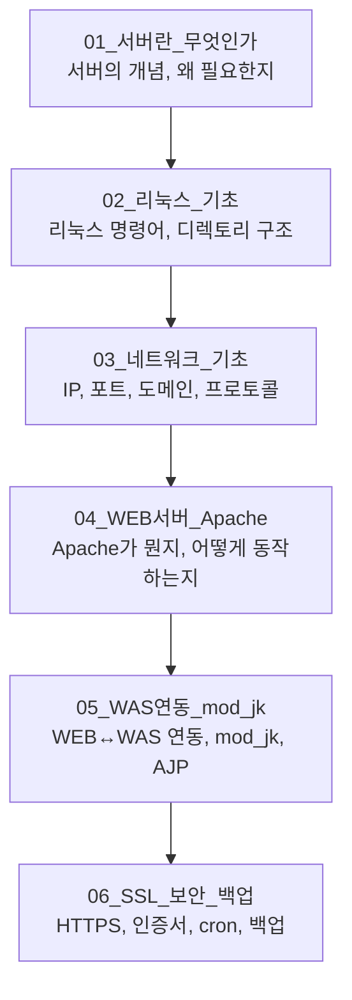

# 서버 인프라 기초 - 학습 로드맵

> **"돌아가요"는 0점. "왜 돌아가는지 설명할 수 있어요"가 시작이야.**

---

## 학습 순서 (반드시 순서대로)

## 학습 규칙

1. **읽기만 하지 마.** 각 파일 끝에 검증 질문이 있다. 대답 못 하면 다시 읽어.
2. **외우지 마.** 왜 그런지 이해해. "원래 그래요"는 존재하지 않는다.
3. **실습해.** 명령어는 직접 쳐봐. 눈으로만 보면 3일 뒤에 까먹는다.

## 난이도 표시

| 표시 | 의미 |
|------|------|
| 🟢 | 기초 - 모르면 안 됨 |
| 🟡 | 중급 - 실무에서 자주 나옴 |
| 🔴 | 심화 - 이거 알면 좀 치는 거 |

## 실습 환경 (참고)

이 학습자료는 아래 실제 서버를 기반으로 작성됨:
- **서버**: R-ictintern-WEB
- **OS**: Rocky Linux 8
- **WEB**: Apache httpd 2.4.37 + mod_jk
- **WAS**: Tomcat (10.64.147.88:8209)
- **도메인**: ictintern.or.kr / global.ictintern.or.kr / internnet.hanium.or.kr
