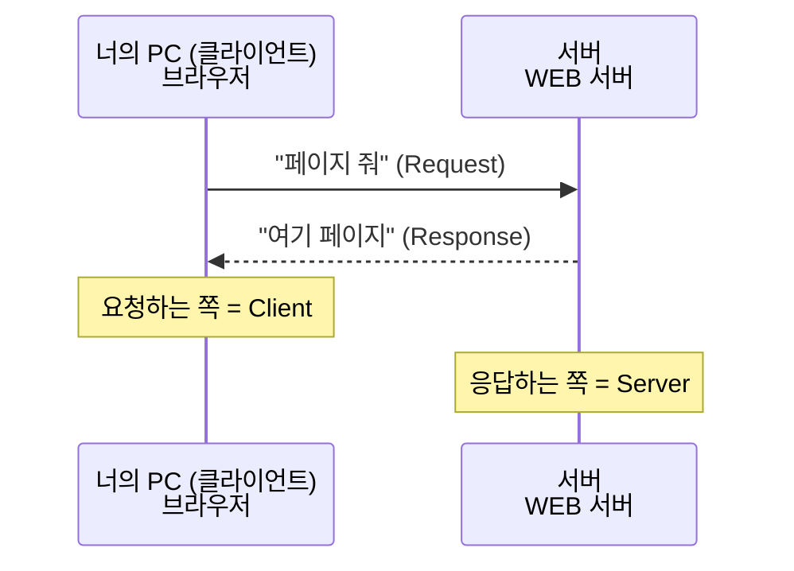
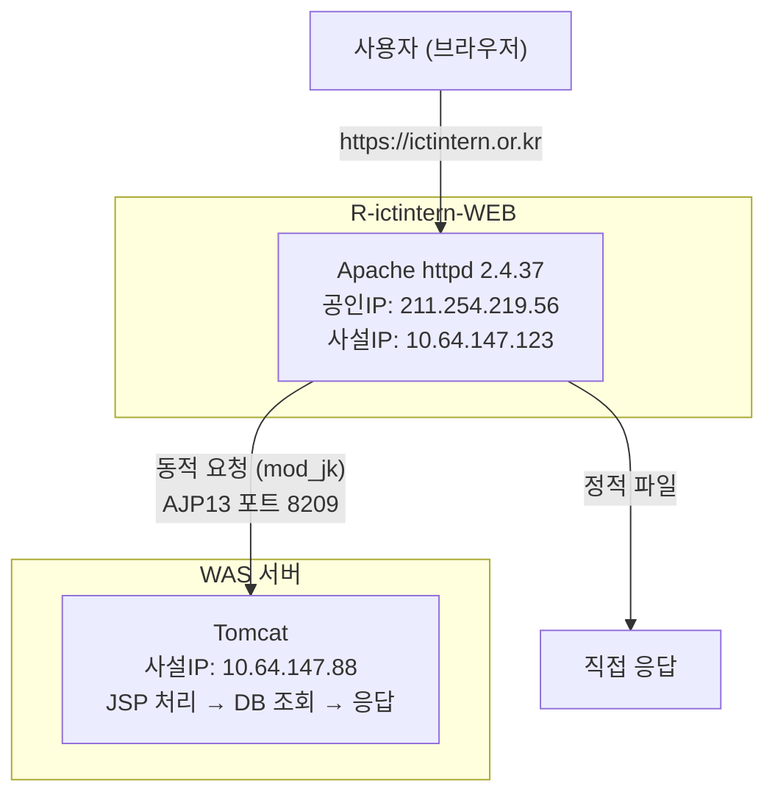

# 01. 서버란 무엇인가

> **"서버가 뭐야?" 이 질문에 10초 안에 명확하게 대답 못 하면, 이 파일부터 다시 읽어.**

---

## 🟢 서버 = 요청에 응답하는 컴퓨터

서버(Server)는 특별한 게 아니다. **누군가의 요청(Request)을 받아서 응답(Response)을 돌려주는 컴퓨터**다.



**핵심**: 서버는 24시간 켜져 있으면서 요청을 기다리는 컴퓨터다. 그게 전부다.

---

## 🟢 서버의 종류

"서버"라는 단어가 여러 의미로 쓰인다. 혼동하지 마.

### 1. 하드웨어 서버 (물리 서버)

실제 컴퓨터 장비다. 데이터센터 서버실에 랙(Rack)에 꽂혀있다.

!!! example "데이터센터 서버실"
    서버실에는 랙(Rack)에 서버들이 꽂혀 있다:

    | 서버 | 역할 |
    |------|------|
    | 서버 1 | WEB |
    | 서버 2 | WAS |
    | 서버 3 | DB |

### 2. 소프트웨어 서버 (서버 프로그램)

컴퓨터 위에서 돌아가는 **프로그램**이다.

| 소프트웨어 서버 | 하는 일 |
|----------------|---------|
| **WEB 서버** (Apache, Nginx) | HTML, CSS, 이미지 등 정적 파일 전달 |
| **WAS** (Tomcat, JBoss) | Java/JSP 같은 동적 처리 |
| **DB 서버** (MySQL, Oracle, CUBRID) | 데이터 저장/조회 |
| **파일 서버** (FTP, NFS) | 파일 저장/공유 |
| **메일 서버** (Postfix) | 이메일 송수신 |

### 3. 역할로 부르는 서버

| 이름 | 의미 |
|------|------|
| 운영 서버 (Production) | 실제 사용자가 접속하는 서버 |
| 개발 서버 (Development) | 개발자가 테스트하는 서버 |
| 스테이징 서버 (Staging) | 운영 배포 전 최종 테스트 서버 |

---

## 🟢 WEB 서버 vs WAS (이거 구분 못 하면 실무에서 바보됨)

### WEB 서버

**정적(Static) 콘텐츠**를 처리한다.

정적 = 누가 요청해도 똑같은 결과
- HTML 파일
- CSS 파일
- JavaScript 파일
- 이미지 (jpg, png)

대표: **Apache**, Nginx

### WAS (Web Application Server)

**동적(Dynamic) 콘텐츠**를 처리한다.

동적 = 요청에 따라 결과가 달라짐
- 로그인하면 내 이름이 나옴 (사용자마다 다름)
- 게시판 목록 (데이터베이스에서 가져옴)
- 성적 조회 (학번에 따라 다름)

대표: **Tomcat**, JBoss, WebLogic

### 왜 분리하는가?

!!! danger "이렇게 하면 안 됨 (WAS 하나로 다 처리)"
    사용자 → Tomcat이 HTML도 주고, JSP도 처리하고, 이미지도 줌

    **문제:**

    1. Tomcat이 과부하 → 동적 처리가 느려짐
    2. 이미지 100개 요청 때문에 로그인 처리가 밀림

!!! tip "이렇게 해야 됨 (역할 분리)"
    ```mermaid
    graph LR
        A[사용자] --> B["Apache (WEB)"]
        B -->|이미지, CSS, JS| C[바로 응답 - 빠름]
        B -->|JSP 요청| D["Tomcat (WAS) - 동적 처리"]
    ```

    **장점:**

    1. 각자 잘하는 거 하니까 효율적
    2. WAS 터져도 WEB은 "점검 중" 페이지 보여줄 수 있음
    3. WEB 서버 여러 대 → WAS 하나 (로드밸런싱 가능)

### 실제 R-ictintern-WEB 서버 구조



---

## 🟢 온프레미스 vs 클라우드

### 온프레미스 (On-Premise)

직접 서버 장비를 사서 데이터센터에 넣는 것.

- 장점: 완전한 통제권, 보안 관리 가능
- 단점: 비쌈, 장비 고장나면 직접 교체, 확장 어려움

### 클라우드 (Cloud)

AWS, Azure, NCP(네이버 클라우드) 같은 곳에서 서버를 빌리는 것.

- 장점: 필요할 때 늘리고 줄이고, 장비 관리 안 해도 됨
- 단점: 매달 돈 나감, 다른 회사에 의존

**R-ictintern-WEB 서버는?**
→ 클라우드 서버 (xvda 디바이스 = 가상 디스크 = 클라우드 VM)

---

## 🟡 서버 접속 방법

### SSH (Secure Shell)

서버는 모니터가 없다. **원격으로 접속**해서 명령어로 조작한다.

```bash
# SSH 접속 명령어
ssh root@211.254.219.56

# 의미:
# ssh    = SSH 프로토콜로 접속하겠다
# root   = root 계정으로 (관리자)
# @      = ~에
# 211.254.219.56 = 이 IP 서버에
```

접속 도구:
- **PuTTY** (Windows에서 가장 많이 씀)
- **MobaXterm** (파일 전송까지 됨)
- **Windows Terminal** (Windows 11 기본)

### SCP / SFTP

서버에서 파일을 가져오거나 올릴 때 사용.

```bash
# 서버 → 로컬로 파일 다운로드
scp root@211.254.219.56:/tmp/web_backup/etc_httpd.tar.gz C:\backup\

# 로컬 → 서버로 파일 업로드
scp C:\file.txt root@211.254.219.56:/tmp/
```

---

## 검증 질문 (대답 못 하면 다시 읽어)

!!! question "Q1. 서버란 무엇인가? (한 문장으로)"

!!! question "Q2. WEB 서버와 WAS의 차이는?"
    → "정적/동적"만 말하면 50점.
    → "왜 분리하는지"까지 말해야 100점.

!!! question "Q3. R-ictintern-WEB 서버에서 사용자가 JSP 페이지를 요청하면 어떤 경로로 처리되는가? (순서대로)"

!!! question "Q4. 온프레미스와 클라우드의 차이는?"
    R-ictintern-WEB은 어느 쪽인지 어떻게 판단했는가?
