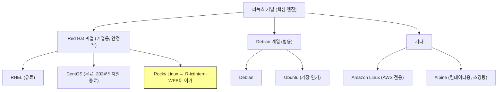

# 02. 리눅스 기초

> **"리눅스 명령어 외워야 해요?" → 외우는 게 아니라 이해하는 거야.
> 명령어가 왜 그렇게 생겼는지 알면 외울 필요 없어.**

---

## 🟢 왜 서버는 리눅스인가?

| 비교 | Windows | Linux |
|------|---------|-------|
| 라이선스 | 유료 | 무료 (대부분) |
| GUI | 있음 (마우스 클릭) | 없음 (터미널 명령어) |
| 안정성 | 재부팅 자주 필요 | 수년간 재부팅 없이 운영 가능 |
| 자원 사용 | GUI 때문에 메모리 많이 씀 | GUI 없어서 가벼움 |
| 서버 점유율 | ~20% | **~80%** |

**결론**: 서버는 모니터 없이 24시간 돌아가야 하니까, 가볍고 안정적인 리눅스가 답.

### 리눅스 배포판 (종류)



---

## 🟢 디렉토리 구조 (이거 모르면 서버에서 길 잃음)

Windows는 `C:\`, `D:\` 드라이브.
리눅스는 **전부 `/` (루트)에서 시작**한다.

```
/ (루트 - 최상위)
├── bin/      → 기본 명령어 (ls, cp, mv, cat)
├── boot/     → 부팅 관련 파일
├── dev/      → 장치 파일 (디스크, USB 등)
├── etc/      → ★ 설정 파일 전부 여기
│   ├── httpd/    → Apache 설정
│   ├── hosts     → 호스트명 매핑
│   └── crontab   → 예약 작업
├── home/     → ★ 일반 사용자 홈 디렉토리
│   ├── apache_1/  → (커스텀 Apache 설치)
│   └── didimagent/ → (모니터링 에이전트)
├── lib/      → 라이브러리 (DLL 같은 것)
├── opt/      → 추가 소프트웨어 설치 경로
├── proc/     → 프로세스 정보 (가상 파일시스템)
├── root/     → ★ root 사용자 전용 홈
├── run/      → 실행 중인 프로세스 정보
├── sbin/     → 시스템 관리 명령어
├── srv/      → 서비스 데이터
├── sys/      → 시스템 정보 (가상 파일시스템)
├── tmp/      → ★ 임시 파일 (재부팅 시 삭제될 수 있음)
├── usr/      → 사용자 프로그램, 라이브러리
└── var/      → ★ 가변 데이터 (로그, 웹 콘텐츠)
    ├── log/      → 시스템 로그
    └── www/html/ → 웹 콘텐츠 기본 경로
```

### 실무에서 자주 가는 경로

| 경로 | 용도 | 외우는 법 |
|------|------|-----------|
| `/etc/` | 설정 파일 | **et cetera** (기타 등등) |
| `/var/log/` | 로그 파일 | **var**iable (변하는 데이터) |
| `/tmp/` | 임시 파일 | **temp**orary |
| `/home/` | 사용자 홈 | 그냥 home |
| `/root/` | 관리자 홈 | root 사용자의 home |

---

## 🟢 필수 명령어 (이것만 알면 서버에서 안 죽음)

### 파일/디렉토리 탐색

```bash
# 현재 위치 확인
pwd
# 결과: /root

# 디렉토리 이동
cd /etc/httpd/     # 절대경로로 이동
cd conf/           # 상대경로로 이동 (현재 위치 기준)
cd ..              # 상위 디렉토리로
cd ~               # 홈 디렉토리로 (/root)
cd -               # 이전 디렉토리로 (뒤로가기)

# 파일 목록 보기
ls                 # 기본 목록
ls -l              # 상세 목록 (권한, 소유자, 크기, 날짜)
ls -la             # 숨김 파일(.으로 시작) 포함
ls -lh             # 크기를 읽기 좋게 (K, M, G)
ll                 # ls -l의 별칭 (CentOS/Rocky에서)
```

### ls -l 출력 읽는 법

```
-rw-r--r-- 1 root root 12372 Apr  3  2024 httpd.conf
│├──┤├──┤├──┤│ │──┤ │──┤ │───┤ │──────────┤ │────────┤
│ │   │   │  │  │    │    │      │            └ 파일명
│ │   │   │  │  │    │    │      └ 날짜
│ │   │   │  │  │    │    └ 크기 (바이트)
│ │   │   │  │  │    └ 소유 그룹
│ │   │   │  │  └ 소유자
│ │   │   │  └ 링크 수
│ │   │   └ 기타 권한
│ │   └ 그룹 권한
│ └ 소유자 권한
└ 파일 타입 (- 파일, d 디렉토리, l 심볼릭 링크)
```

### 권한 읽는 법

```
r = read (읽기)     = 4
w = write (쓰기)    = 2
x = execute (실행)  = 1

rw-r--r-- = 644
│││││││││
│││││││└┴ 기타: r-- (읽기만)
│││││└┴── 그룹: r-- (읽기만)
││└┴───── 소유자: rw- (읽기+쓰기)

rwxr-xr-x = 755
소유자: rwx (읽기+쓰기+실행)
그룹: r-x (읽기+실행)
기타: r-x (읽기+실행)
```

### 파일 내용 보기

```bash
# 파일 전체 보기
cat httpd.conf

# 앞부분만 (기본 10줄)
head httpd.conf
head -20 httpd.conf    # 앞 20줄

# 뒷부분만
tail httpd.conf
tail -f access_log     # ★ 실시간 로그 모니터링 (Ctrl+C로 종료)

# 페이지 단위로 보기 (긴 파일)
less httpd.conf        # 화살표로 이동, q로 종료

# 특정 문자열 검색하며 보기
grep "ServerName" httpd.conf           # 파일에서 검색
grep -r "DocumentRoot" /etc/httpd/     # 디렉토리 전체에서 검색
grep -i "error" access_log             # 대소문자 구분 없이
```

### 파일/디렉토리 조작

```bash
# 복사
cp httpd.conf httpd.conf.bak       # 파일 복사
cp -r conf/ conf_backup/           # 디렉토리 복사 (-r: 재귀)

# 이동/이름변경
mv old_name.txt new_name.txt       # 이름 변경
mv file.txt /tmp/                  # 파일 이동

# 생성
mkdir backup                       # 디렉토리 생성
mkdir -p /a/b/c/d                  # 중간 경로까지 한번에 생성
touch newfile.txt                  # 빈 파일 생성

# 삭제 (⚠️ 주의! 휴지통 없음! 바로 삭제!)
rm file.txt                        # 파일 삭제
rm -r directory/                   # 디렉토리 삭제
rm -rf directory/                  # 강제 삭제 (물어보지 않음)
#       ↑ 이거 잘못 치면 서버 날아감. 절대 함부로 쓰지 마.
```

### 디스크/용량 확인

```bash
# 디스크 전체 사용량
df -h
# Filesystem      Size  Used Avail Use% Mounted on
# /dev/xvda2       17G   10G  5.8G  64% /

# 디렉토리별 용량
du -sh /home/*
# 798M    /home/apache_1
# 540M    /home/didimagent

# du 옵션 의미
# -s: summary (합계만)
# -h: human-readable (K, M, G)
```

### 프로세스 관리

```bash
# 실행 중인 프로세스 보기
ps aux                      # 전체 프로세스
ps aux | grep httpd         # Apache 프로세스만

# 실시간 모니터링 (작업관리자 같은 것)
top                         # CPU, 메모리 사용량 실시간
                            # q로 종료

# 서비스 관리 (systemd)
systemctl status httpd      # Apache 상태 확인
systemctl start httpd       # Apache 시작
systemctl stop httpd        # Apache 중지
systemctl restart httpd     # Apache 재시작
systemctl enable httpd      # 부팅 시 자동 시작 설정
```

---

## 🟡 파이프(|)와 리다이렉션(>, >>)

### 파이프 (|)

앞 명령어의 출력을 뒤 명령어의 입력으로 넘긴다.

```bash
# Apache 프로세스 찾기
ps aux | grep httpd
# ps aux의 결과를 → grep에 넘겨서 → httpd가 포함된 줄만 출력

# 파일 개수 세기
ls -l /etc/ | wc -l
# ls -l의 결과를 → wc -l(줄 수 세기)에 넘김

# 용량 순 정렬
du -sh /home/* | sort -h
# 용량을 → 크기 순으로 정렬
```

### 리다이렉션 (>, >>)

```bash
# 명령어 결과를 파일에 저장
crontab -l > /tmp/crontab_backup.txt      # 덮어쓰기
echo "추가 내용" >> /tmp/crontab_backup.txt  # 이어쓰기

# 에러 무시
ls /없는경로 2>/dev/null
# 2 = 에러 출력
# /dev/null = 블랙홀 (버리기)
```

---

## 🟡 압축/해제 (tar)

### tar 명령어 옵션 외우는 법

```
tar [옵션] [파일명] [대상]

c = create (만들기)
x = extract (풀기)
z = gzip (gz 압축)
f = file (파일 지정)
v = verbose (과정 표시)
```

### 실전

```bash
# 압축하기
tar czf backup.tar.gz /etc/httpd/conf/
#   c = 새로 만들기
#   z = gzip 압축
#   f = 파일명 지정

# 압축 풀기
tar xzf backup.tar.gz
#   x = 풀기
#   z = gzip
#   f = 파일명

# 내용만 확인 (풀지 않고)
tar tzf backup.tar.gz
#   t = 목록 보기

# "Removing leading '/'" 경고
# → 정상임. 절대경로(/)를 제거해서 안전하게 압축하는 것
# → 풀 때 현재 디렉토리 기준으로 풀림
```

---

## 🟡 사용자와 권한

### root vs 일반 사용자

| 구분 | root (관리자) | 일반 사용자 |
|------|---------------|-------------|
| 권한 | 모든 권한 보유 | 제한된 권한 |
| 프롬프트 | `#` | `$` |
| 홈 디렉토리 | `/root/` | `/home/사용자명/` |
| 주의 | 잘못하면 서버 날아감 | - |

### 권한 변경

```bash
# 권한 변경
chmod 755 script.sh        # rwxr-xr-x
chmod 644 config.txt       # rw-r--r--

# 소유자 변경
chown apache:apache /var/www/html/
#     사용자:그룹   대상경로
```

---

## 🔴 실제 서버에서 확인한 것들 (R-ictintern-WEB)

### 디렉토리 구조 해석

```
/etc/httpd/conf/httpd.conf       ← Apache 메인 설정
/etc/httpd/conf/workers.properties ← mod_jk 워커 설정
/etc/httpd/conf.d/vhosts.conf    ← 가상호스트 (도메인 3개)
/etc/httpd/conf.d/ssl.conf       ← SSL 설정
/etc/httpd/conf.d/modjk.conf     ← mod_jk 모듈 설정
/home/apache_1/                  ← 별도 설치 Apache
/home/apache_1/logs/             ← 로그 748M
/root/Apache/                    ← SSL 인증서 보관
/root/bin/apache_log.sh          ← 로그 관리 스크립트
```

### crontab 해석

```bash
# 이 서버의 crontab
55 22 * * * /usr/bin/chronyc -a 'burst 4/4' && /usr/bin/chronyc -a makestep
00 02 * * * /root/bin/apache_log.sh

# 분 시 일 월 요일 명령어
# 55 22 * * *  = 매일 22시 55분에
# 00 02 * * *  = 매일 02시 00분에

# * = 모든 값 (매일, 매월, 모든 요일)
```

---

## 검증 질문

!!! question "Q1. / (루트)와 /root/의 차이는?"

!!! question "Q2. /etc/는 무슨 용도의 디렉토리인가?"
    이 서버에서 Apache 설정은 /etc/ 어디에 있었나?

!!! question "Q3. ls -la 출력에서 drwxr-xr-x의 의미를 설명해봐."
    d는 뭐고, rwx는 뭐고, r-x는 뭐야?

!!! question "Q4. tar czf의 각 옵션(c, z, f)의 의미는?"
    "Removing leading '/'" 경고가 뜨는 이유는?

!!! question "Q5. '55 22 * * *'는 언제 실행되는 cron인가?"
    "00 02 * * 1"이면 언제 실행되겠는가?

!!! question "Q6. rm -rf를 함부로 쓰면 안 되는 이유는?"
    리눅스에 휴지통이 있나?
