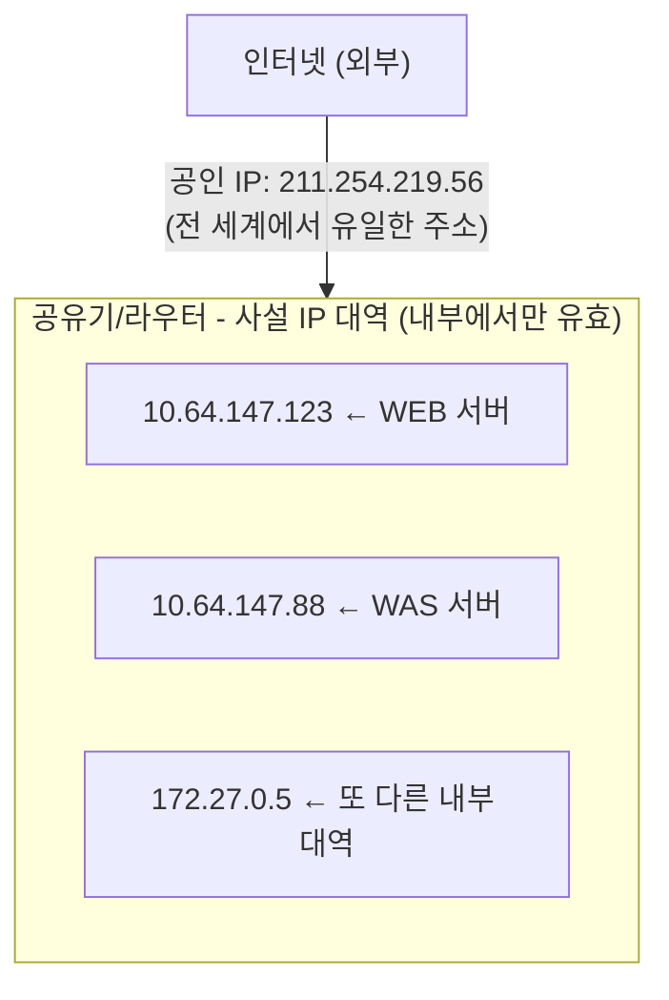
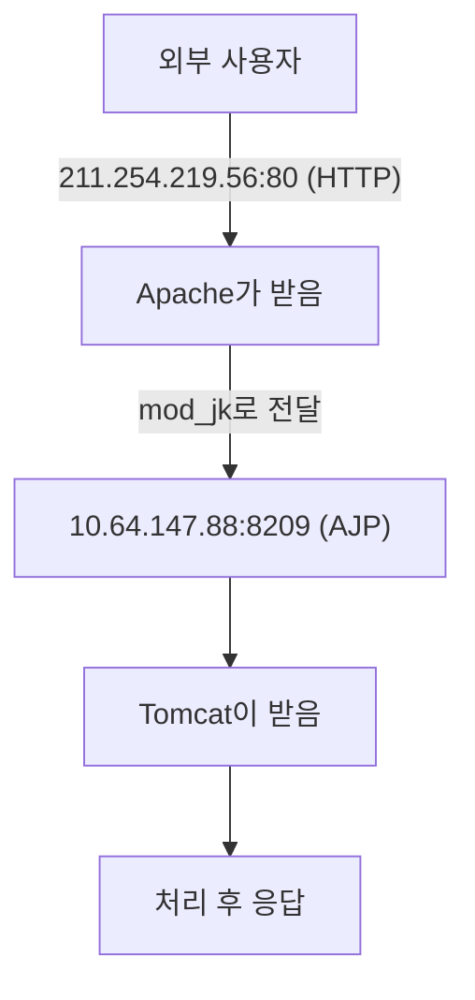
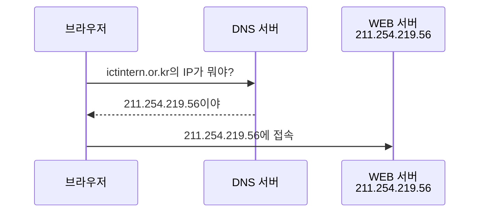
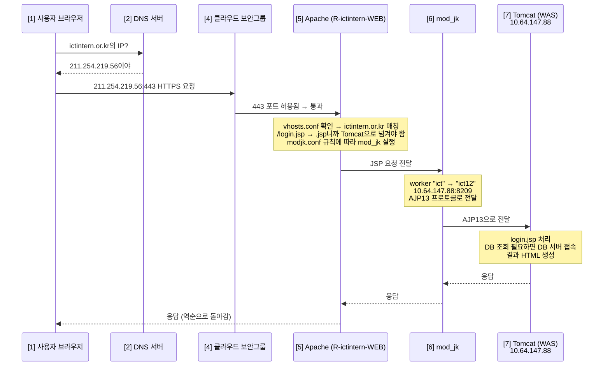

# 03. 네트워크 기초

> **"IP가 뭐야?" "포트가 뭐야?" "DNS가 뭐야?"
> 이 세 개 대답 못 하면 서버 만지지 마. 사고 친다.**

---

## 🟢 IP 주소 = 서버의 주소

모든 컴퓨터(서버)는 네트워크에서 **고유한 주소**를 가진다. 그게 IP.

!!! note "비유"
    현실 세계: 서울시 강남구 역삼동 123-45 ← 집 주소

    네트워크: 211.254.219.56 ← IP 주소

### 공인 IP vs 사설 IP



### 사설 IP 대역 (이건 외워)

| 대역 | 범위 | 규모 |
|------|------|------|
| **10.x.x.x** | 10.0.0.0 ~ 10.255.255.255 | 대규모 (기업, 클라우드) |
| **172.16~31.x.x** | 172.16.0.0 ~ 172.31.255.255 | 중규모 |
| **192.168.x.x** | 192.168.0.0 ~ 192.168.255.255 | 소규모 (가정, 소기업) |

**R-ictintern-WEB 서버 해석:**

| IP | 종류 | 용도 |
|----|------|------|
| `211.254.219.56` | 공인 IP | 외부 사용자 접속용 |
| `10.64.147.123` | 사설 IP (10.x) | WAS(10.64.147.88)와 내부 통신 |
| `172.27.0.5` | 사설 IP (172.x) | 관리용 내부 네트워크 |

**왜 사설 IP가 2개?**
→ 네트워크 인터페이스(NIC)가 2개이거나, 가상 네트워크가 2개.
→ 역할 분리: 하나는 WAS 통신용, 하나는 관리용.

---

## 🟢 포트 (Port) = 서버 안에서의 문 번호

IP가 **건물 주소**라면, 포트는 **몇 호실**인지.

!!! note "포트 주소 해석"
    `211.254.219.56:80` → IP 주소(건물 주소) `:` 구분자 `80` 포트 번호(80번 문)

하나의 서버(IP)에서 여러 서비스가 각각 다른 포트로 동작:

| 주소 | 서비스 |
|------|--------|
| `211.254.219.56:80` | Apache (HTTP) |
| `211.254.219.56:443` | Apache (HTTPS) |
| `211.254.219.56:22` | SSH (원격 접속) |
| `211.254.219.56:8209` | Tomcat AJP (내부 연동) |

### 잘 알려진 포트 (외워)

| 포트 | 서비스 | 설명 |
|------|--------|------|
| **22** | SSH | 원격 접속 |
| **80** | HTTP | 웹 (암호화 없음) |
| **443** | HTTPS | 웹 (암호화) |
| **3306** | MySQL | DB |
| **8080** | Tomcat HTTP | WAS 직접 접속 |
| **8009/8209** | AJP | WEB↔WAS 내부 연동 |

### R-ictintern-WEB에서의 포트



**왜 8209야? 8009 아니고?**
→ 기본 AJP 포트가 8009인데, 이 서버는 8209로 변경함.
→ 같은 서버에 Tomcat이 여러 개 돌 수 있어서, 포트 충돌 방지용.

---

## 🟢 프로토콜 = 통신 규칙

"어떤 방식으로 대화할 건지" 약속한 것.

| 프로토콜 | 풀네임 | 용도 |
|----------|--------|------|
| **HTTP** | HyperText Transfer Protocol | 웹 페이지 전송 (암호화 없음) |
| **HTTPS** | HTTP + Secure (SSL/TLS) | 웹 페이지 전송 (암호화) |
| **SSH** | Secure Shell | 서버 원격 접속 |
| **FTP** | File Transfer Protocol | 파일 전송 |
| **AJP** | Apache JServ Protocol | Apache↔Tomcat 내부 연동 |
| **TCP** | Transmission Control Protocol | 신뢰성 있는 데이터 전송 |

### HTTP vs HTTPS

!!! danger "HTTP (포트 80)"
    브라우저 → `"비밀번호: 1234"` → 서버

    누구나 볼 수 있음 (평문 전송)

!!! tip "HTTPS (포트 443)"
    브라우저 → `"#@$%&*!@#"` → 서버 → (복호화) → `"비밀번호: 1234"`

    암호화되어 있어서 중간에 못 봄

### AJP (Apache JServ Protocol)

!!! abstract "AJP - 이 서버에서 쓰는 WEB↔WAS 연동 프로토콜"
    **특징:**

    - 바이너리 프로토콜 (HTTP보다 가볍고 빠름)
    - 내부 네트워크 전용 (외부에 노출하면 안 됨!)
    - 포트: 기본 8009, 이 서버는 8209

    **workers.properties에서:**

    ```properties
    worker.ict12.type=ajp13     # AJP 버전 1.3 사용
    worker.ict12.host=10.64.147.88
    worker.ict12.port=8209
    ```

---

## 🟢 도메인 & DNS

### 도메인 = IP의 별명

!!! note "도메인이란"
    사람이 기억하기 쉽게 IP에 이름을 붙인 것.

    | 형태 | 예시 | 기억 |
    |------|------|------|
    | IP 주소 | `211.254.219.56` | 어려움 |
    | 도메인 | `ictintern.or.kr` | 쉬움 |

    둘 다 같은 서버를 가리킴.

### DNS (Domain Name System) = 전화번호부



### 이 서버의 도메인

!!! note "VirtualHost 설정 (vhosts.conf)"
    ```mermaid
    graph LR
        A["internnet.hanium.or.kr"] --> D["211.254.219.56"]
        B["ictintern.or.kr"] --> D
        C["global.ictintern.or.kr"] --> D
    ```

    하나의 IP에 여러 도메인 가능 = VirtualHost.
    Apache가 요청의 Host 헤더를 보고 구분함.

### /etc/hosts

DNS보다 먼저 확인하는 **로컬 도메인 매핑 파일**.

```bash
# R-ictintern-WEB의 /etc/hosts
127.0.0.1   localhost localhost.localdomain
::1         localhost localhost.localdomain

# 기본값만 있음 = 커스텀 도메인 매핑 없음
# 그래서 백업 안 한 것
```

---

## 🟡 방화벽 (Firewall)

### 개념

!!! abstract "방화벽 개념"
    서버로 들어오는 트래픽을 허용/차단하는 문지기.

    ```mermaid
    graph LR
        A["외부"] --> B["방화벽<br/>'너 통과, 너 차단' 결정"]
        B --> C["서버"]
    ```

    **규칙 예시:**

    | 포트 | 서비스 | 정책 |
    |------|--------|------|
    | 80 | HTTP | 허용 |
    | 443 | HTTPS | 허용 |
    | 22 | SSH | 특정 IP만 허용 |
    | 3306 | DB | 차단 |

### R-ictintern-WEB 방화벽 상태

```bash
# iptables -L -n 결과
Chain INPUT (policy ACCEPT)    ← 들어오는 거 전부 허용
Chain FORWARD (policy ACCEPT)  ← 전달하는 거 전부 허용
Chain OUTPUT (policy ACCEPT)   ← 나가는 거 전부 허용

# 방화벽 규칙이 없음 = 모든 포트 열려있음
# 실무에서는 위험할 수 있음 (필요한 포트만 열어야 함)
# 이 서버는 클라우드 보안그룹(Security Group)에서
# 네트워크 레벨로 제어하고 있을 가능성 높음
```

---

## 🟡 네트워크 흐름 전체 그림

사용자가 `https://ictintern.or.kr/login.jsp` 접속 시:



---

## 검증 질문

!!! question "Q1. 공인 IP와 사설 IP의 차이는?"
    10.64.147.123은 어느 쪽이고, 왜 그렇게 판단했나?

!!! question "Q2. 포트가 뭔가? 한 서버에서 여러 포트를 쓰는 이유는?"

!!! question "Q3. 이 서버에서 AJP 포트가 8009가 아니라 8209인 이유는 뭘까?"

!!! question "Q4. 사용자가 ictintern.or.kr에 접속할 때, 네트워크 흐름을 DNS부터 응답까지 순서대로 설명해봐."

!!! question "Q5. 이 서버의 방화벽이 전부 ACCEPT인 건 안전한가?"
    그럼 보안은 어디서 하고 있을까?

!!! question "Q6. 하나의 IP(211.254.219.56)에 도메인 3개가 연결돼 있다. Apache는 어떻게 구분하는가?"
