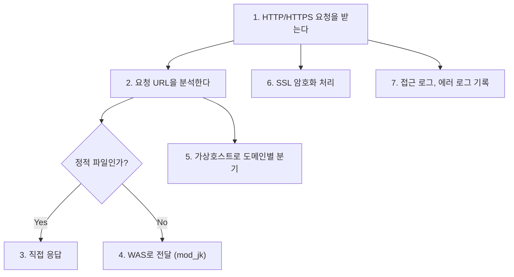
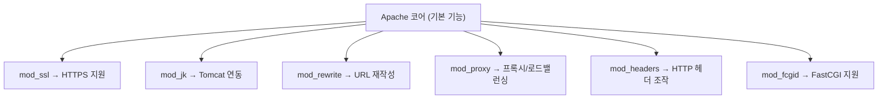

# 04. WEB 서버 - Apache

> **"Apache가 뭐야?" → "웹 서버요" → 0점.
> "HTTP 요청을 받아서 정적 파일을 응답하거나 동적 요청을 WAS로 전달하는 서버 소프트웨어" → 이제 시작.**

---

## 🟢 Apache란?

**Apache HTTP Server (httpd)** = 세계에서 가장 많이 쓰이는 WEB 서버.

| 항목 | 값 |
|------|-----|
| 정식 이름 | Apache HTTP Server |
| 프로세스명 | httpd |
| 개발 | Apache Software Foundation |
| 라이선스 | 무료 (오픈소스) |
| 이 서버 버전 | 2.4.37 |

### Apache가 하는 일



---

## 🟢 Apache 설치 방식 2가지

### 1. RPM(패키지) 설치

```bash
# yum/dnf으로 설치 (CentOS/Rocky)
yum install httpd

# 설치 경로
/etc/httpd/          ← 설정 파일
/usr/sbin/httpd      ← 실행 파일
/var/log/httpd/      ← 로그
/var/www/html/       ← 웹 콘텐츠 기본 경로

# 장점: 쉬움, systemctl로 관리, 자동 업데이트
# 단점: 커스터마이징 제한
```

### 2. 소스(컴파일) 설치

```bash
# 소스코드 다운 → 컴파일 → 설치
./configure --prefix=/home/apache_1
make
make install

# 설치 경로 (직접 지정)
/home/apache_1/conf/     ← 설정 파일
/home/apache_1/bin/      ← 실행 파일
/home/apache_1/logs/     ← 로그
/home/apache_1/modules/  ← 모듈

# 장점: 경로/옵션 자유롭게 커스터마이징
# 단점: 업데이트 수동, 관리 복잡
```

### R-ictintern-WEB은?

!!! warning "R-ictintern-WEB에는 둘 다 있다!"
    | 설치 방식 | 경로 | 상태 |
    |-----------|------|------|
    | RPM 설치 | `/etc/httpd/` (httpd 2.4.37) | **실제 운영 중** |
    | 소스 설치 | `/home/apache_1/` (별도 Apache) | 이전 설치 흔적 |

    `/home/apache_1/`은 이전에 소스 설치한 흔적 (conf, logs 등이 남아있음).

    이런 경우가 실무에서 흔함: 이전 담당자가 소스 설치 → 이후 담당자가 RPM으로 교체, 근데 이전 설치를 안 지움.

---

## 🟢 Apache 설정 파일 구조

### /etc/httpd/ 디렉토리

```
/etc/httpd/
├── conf/
│   ├── httpd.conf          ★ 메인 설정 파일 (핵심 중의 핵심)
│   ├── magic               (MIME 타입 판별 규칙)
│   └── workers.properties  ★ mod_jk 워커 설정
├── conf.d/
│   ├── vhosts.conf         ★ 가상호스트 설정 (도메인별 분기)
│   ├── modjk.conf          ★ mod_jk 모듈 설정
│   ├── ssl.conf            ★ SSL/HTTPS 설정
│   ├── ssl.conf.20241211   (SSL 설정 백업 - 2024-12-11)
│   ├── autoindex.conf      (디렉토리 목록 표시 설정)
│   ├── fcgid.conf          (FastCGI 설정)
│   ├── manual.conf         (Apache 매뉴얼 설정)
│   ├── userdir.conf        (사용자 디렉토리 설정)
│   ├── welcome.conf        (기본 환영 페이지 설정)
│   └── README
├── logs/                   → /var/log/httpd/ 심볼릭 링크
├── modules/                → /usr/lib64/httpd/modules/ 심볼릭 링크
└── run/                    → /run/httpd/ 심볼릭 링크
```

---

## 🟡 httpd.conf 핵심 설정 해설

### ServerRoot

```apache
ServerRoot "/etc/httpd"
# Apache의 기준 디렉토리
# 다른 설정에서 상대 경로 쓰면 여기 기준
```

### Listen

```apache
Listen 80
# Apache가 80번 포트에서 요청을 기다림
# HTTPS는 ssl.conf에서 Listen 443 설정
```

### DocumentRoot

```apache
DocumentRoot "/var/www/html"
# 웹 콘텐츠 기본 경로
# http://ictintern.or.kr/index.html
# → /var/www/html/index.html 파일을 응답

# 이 서버는 /var/www/html이 거의 비어있음
# 왜? → 실제 콘텐츠는 Tomcat(WAS)에서 처리하니까
```

### Directory 설정

```apache
<Directory "/var/www/html">
    Options Indexes FollowSymLinks
    AllowOverride None
    Require all granted
</Directory>

# Options Indexes: 디렉토리 목록 표시 (⚠️ 보안상 끄는 게 좋음)
# FollowSymLinks: 심볼릭 링크 따라감
# AllowOverride None: .htaccess 파일 무시
# Require all granted: 모든 접근 허용
```

### Include

```apache
IncludeOptional conf.d/*.conf
# conf.d/ 디렉토리의 모든 .conf 파일을 불러옴
# → vhosts.conf, modjk.conf, ssl.conf 등이 여기서 로드됨
```

---

## 🟡 vhosts.conf (가상호스트)

**하나의 서버(IP)에서 여러 도메인을 서비스**하는 설정.

```apache
# HTTP (포트 80) - ictintern.or.kr
<VirtualHost *:80>
    DocumentRoot "/var/www/html"
    ServerName ictintern.or.kr
</VirtualHost>

# HTTP (포트 80) - global.ictintern.or.kr
<VirtualHost *:80>
    DocumentRoot "/var/www/html"
    ServerName global.ictintern.or.kr
</VirtualHost>

# 동작 방식:
# 1. 요청이 들어옴
# 2. Host 헤더 확인 (ictintern.or.kr? global.ictintern.or.kr?)
# 3. 매칭되는 VirtualHost 블록으로 분기
# 4. 해당 DocumentRoot에서 파일 제공
```

### 왜 DocumentRoot가 다 같은 "/var/www/html"인가?

!!! note "왜 DocumentRoot가 다 같은가?"
    이 서버는 정적 파일을 거의 안 씀.
    모든 요청을 mod_jk로 Tomcat에 넘김.
    그래서 DocumentRoot는 형식적인 것.
    실제 콘텐츠는 Tomcat이 생성해서 응답.

---

## 🟡 Apache 로그

### access_log (접속 로그)

```
# 누가, 언제, 뭘 요청했는지 기록
211.100.2.5 - - [27/Feb/2026:10:30:15 +0900] "GET /login.jsp HTTP/1.1" 200 5432
│             │  │──────────────────────────│ │──────────────────│ │─│ │──│
│             │  │                          │ │                  │ │ │ └ 응답 크기 (바이트)
│             │  │                          │ │                  │ └ 상태 코드
│             │  │                          │ └ 요청 내용
│             │  └ 시간
│             └ 인증 사용자 (없으면 -)
└ 접속 IP

# 상태 코드
200 = 정상
301 = 영구 이동 (리다이렉트)
302 = 임시 이동
403 = 접근 거부
404 = 페이지 없음
500 = 서버 내부 오류 ← 이거 보이면 비상
502 = Bad Gateway (WAS 연결 실패)
503 = 서비스 불가 (과부하)
```

### error_log (에러 로그)

```
# 에러 발생 시 기록. 장애 추적의 핵심.
[Mon Feb 27 10:30:15.123456 2026] [proxy:error] [pid 1234]
AH00959: ap_proxy_connect_backend disabling worker for (10.64.147.88)

# → Tomcat 연결 실패 시 이런 로그가 남음
```

### 실시간 로그 모니터링

```bash
# 접속 로그 실시간 보기
tail -f /var/log/httpd/access_log

# 에러 로그 실시간 보기
tail -f /var/log/httpd/error_log

# 500 에러만 필터링
tail -f /var/log/httpd/access_log | grep " 500 "
```

---

## 🟡 Apache 서비스 관리

```bash
# 상태 확인
systemctl status httpd

# 시작 / 중지 / 재시작
systemctl start httpd
systemctl stop httpd
systemctl restart httpd       # 연결 끊김 (서비스 중단)
systemctl reload httpd        # ★ 설정만 다시 로드 (연결 유지, 안전)

# 부팅 시 자동 시작
systemctl enable httpd

# 설정 파일 문법 검사 (재시작 전 반드시!)
httpd -t
# Syntax OK → 안전하게 reload/restart 가능
# Syntax error → 고치고 다시 검사
```

### restart vs reload

!!! danger "restart"
    1. Apache 완전히 중지
    2. 다시 시작
    → 순간적으로 서비스 끊김 (사용자가 에러 볼 수 있음)

!!! tip "reload"
    1. 설정 파일만 다시 읽음
    2. 기존 연결은 유지
    → 서비스 끊김 없음 (운영 중에 안전)

!!! warning "실무 원칙"
    실무에서는 reload를 먼저 시도하고, 안 되면 restart 한다.

---

## 🔴 Apache 모듈 시스템

Apache는 **모듈(Module)**로 기능을 확장한다.



### 이 서버에서 쓰는 핵심 모듈

| 모듈 | 설정 파일 | 역할 |
|------|-----------|------|
| **mod_jk** | modjk.conf | Apache↔Tomcat 연동 |
| **mod_ssl** | ssl.conf | HTTPS 암호화 |
| **mod_fcgid** | fcgid.conf | FastCGI 처리 |

---

## 검증 질문

!!! question "Q1. Apache의 프로세스명은 뭔가?"
    systemctl로 Apache를 관리할 때 어떤 이름을 쓰는가?

!!! question "Q2. httpd.conf에서 DocumentRoot가 '/var/www/html'인데, 이 서버의 /var/www/html은 거의 비어있다. 왜?"

!!! question "Q3. VirtualHost가 뭔가? 왜 필요한가?"
    이 서버에 VirtualHost가 몇 개 있고, 어떻게 구분하는가?

!!! question "Q4. restart와 reload의 차이는?"
    운영 중인 서버에서 설정을 변경하면 뭘 써야 하는가?

!!! question "Q5. httpd -t는 뭘 하는 명령어인가?"
    왜 restart/reload 전에 반드시 해야 하는가?

!!! question "Q6. access_log에서 상태 코드 500과 502의 차이는?"
    502가 뜨면 어디를 의심해야 하는가?

!!! question "Q7. 이 서버에 Apache가 2개 설치되어 있다."
    각각 어디에 있고, 어떤 게 실제 운영 중인가?
