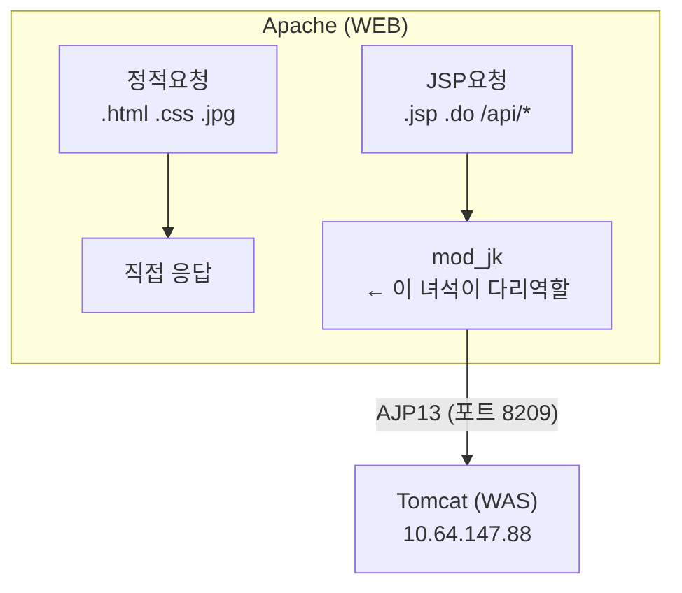
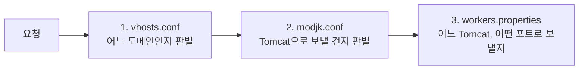
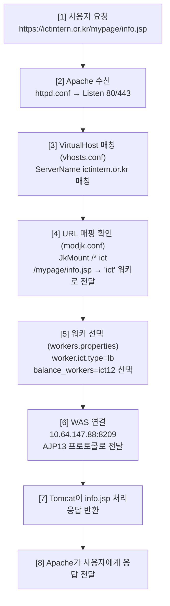

# 05. WAS 연동 - mod_jk

> **"mod_jk가 뭐야?" → "Apache랑 Tomcat 연결해주는 거요" → 50점.
> "왜 mod_jk고, 어떤 설정으로 어떻게 연결되는지"까지 설명해야 100점.**

---

## 🟢 mod_jk가 뭔가?

Apache(WEB)와 Tomcat(WAS)을 **AJP 프로토콜로 연결**해주는 Apache 모듈.

!!! note "mod_jk의 역할"
    Apache 혼자서는 JSP를 처리 못 함.
    JSP 요청이 오면 → "나 이거 못 해" → mod_jk에게 넘김 → Tomcat이 처리



---

## 🟢 mod_jk 관련 설정 파일 3개

| 파일 | 경로 | 역할 |
|------|------|------|
| **modjk.conf** | /etc/httpd/conf.d/ | mod_jk 모듈 로드 + URL 매핑 규칙 |
| **workers.properties** | /etc/httpd/conf/ | WAS 서버 연결 정보 (IP, 포트) |
| **vhosts.conf** | /etc/httpd/conf.d/ | 도메인별 설정 (mod_jk와 연결) |



---

## 🟡 modjk.conf 상세 해설

```apache
# mod_jk 모듈 로드
LoadModule jk_module modules/mod_jk.so

# workers.properties 파일 위치 지정
JkWorkersFile /etc/httpd/conf/workers.properties

# mod_jk 로그 설정
JkLogFile /var/log/httpd/mod_jk.log
JkLogLevel info

# URL 매핑 규칙
JkMount /* ict
# → 모든 요청(/*)을 "ict" 워커로 전달

# 특정 확장자만 보내는 경우 (이 서버는 아니지만 알아둬)
# JkMount /*.jsp ict      ← .jsp만 Tomcat으로
# JkMount /*.do ict       ← .do만 Tomcat으로
# JkMount /api/* ict      ← /api/ 경로만 Tomcat으로
```

### JkMount 규칙이 중요한 이유

!!! danger "JkMount /* ict (전체 전달)"
    모든 요청을 Tomcat으로 보냄.
    이미지, CSS, JS도 다 Tomcat이 처리.
    비효율적이지만 설정이 단순.

!!! tip "JkMount /*.jsp ict / JkMount /*.do ict (선택적 전달)"
    JSP, .do만 Tomcat으로.
    나머지는 Apache가 직접 처리.
    효율적이지만 설정이 복잡.

!!! note ""
    이 서버는 `/*` (전체 전달) 방식일 가능성 높음.

---

## 🟡 workers.properties 완전 해설

이 서버의 실제 설정을 한 줄씩 뜯어보자.

### 워커 목록

```properties
worker.list=all,jkstatus,ict
```
→ 사용할 워커 이름 목록. **ict**가 실제 서비스 워커.

### 템플릿 (공통 설정)

```properties
worker.template.type=ajp13
# → AJP 1.3 프로토콜 사용

worker.template.maintain=60
# → 60초마다 연결 상태 점검

worker.template.lbfactor=1
# → 로드밸런싱 가중치 (1 = 동일)

worker.template.ping_mode=A
# → 모든 상황에서 ping 확인
# A = All (Connect + Prepost + Interval)

worker.template.ping_timeout=2000
# → ping 응답 2초 안에 안 오면 연결 끊음

worker.template.prepost_timeout=2000
# → 요청 전송 전 연결 확인 대기 시간 2초

worker.template.socket_timeout=300
# → 소켓 연결 유지 시간 300초 (5분)
# → 5분 동안 데이터 없으면 연결 끊음

worker.template.socket_connect_timeout=2000
# → 소켓 연결 시도 대기 2초

worker.template.socket_keepalive=true
# → TCP keepalive 활성화 (연결 유지 확인)

worker.template.connection_pool_timeout=60
# → 연결 풀에서 60초 이상 안 쓴 연결은 정리

worker.template.connect_timeout=10000
# → 최초 연결 시 10초까지 대기

worker.template.recovery_options=7
# → 장애 복구 옵션 (비트 플래그)
```

### recovery_options=7 의 의미

!!! abstract "비트 플래그(Bit Flag) 해설"
    | 값 | 의미 | 플래그 |
    |----|------|--------|
    | 1 | 에러 시 워커 재사용 | RECOVER_ABORT_IF_ERROR |
    | 2 | 클라이언트 에러도 복구 | RECOVER_ABORT_IF_CLIENTERROR |
    | 4 | 소켓 에러 시 복구 | RECOVER_ABORT_IF_SOCK_ERROR |
    | **7** | **1 + 2 + 4 = 전부 활성화** | |

    즉, 어떤 종류의 에러든 발생하면 복구를 시도한다. 가장 안전한 설정.

### 실제 워커 (WAS 서버 연결)

```properties
worker.ict12.reference=worker.template
# → 위 템플릿 설정을 상속받음

worker.ict12.host=10.64.147.88
# → WAS 서버 IP

worker.ict12.port=8209
# → AJP 포트
```

### 로드밸런서

```properties
worker.ict.type=lb
# → lb = Load Balancer (로드밸런서 타입)

worker.ict.method=Session
# → 세션 기반 분배
# Session: 세션 ID 기반 라우팅
# Request: 요청 수 기반
# Traffic: 트래픽 양 기반

worker.ict.sticky_session=True
# → 스티키 세션 활성화
# → 한 번 ict12로 간 사용자는 계속 ict12로 감

worker.ict.balance_workers=ict12
# → 밸런싱 대상: ict12 하나
# → 현재는 WAS가 1대라서 밸런싱이 사실상 의미 없음
# → WAS 추가하면: balance_workers=ict12,ict13,ict14
```

---

## 🟡 전체 요청 흐름 (설정 파일 기준)



---

## 🔴 Sticky Session의 문제점

!!! abstract "Sticky Session = 한 사용자가 특정 WAS에 고정"
    **장점:**

    - 세션 데이터가 해당 WAS에만 있어도 됨
    - 세션 공유 설정 불필요

    **단점:**

    - 해당 WAS가 죽으면? → 그 사용자의 세션 날아감 (로그인 풀림)
    - 특정 WAS에 부하 집중 가능
    - WAS 증설/감축 시 세션 재분배 문제

    **대안:**

    1. 세션 클러스터링 (WAS끼리 세션 공유)
    2. 세션을 DB/Redis에 저장 (외부 세션 저장소)
    3. JWT 토큰 방식 (서버에 세션 안 저장)

---

## 🔴 mod_jk vs mod_proxy_ajp vs mod_proxy_http

| 방식 | 프로토콜 | 장점 | 단점 |
|------|----------|------|------|
| **mod_jk** | AJP13 | 성능 좋음, 안정적 | 별도 설치 필요, 레거시 |
| **mod_proxy_ajp** | AJP13 | Apache 기본 내장 | mod_jk보다 기능 적음 |
| **mod_proxy_http** | HTTP | 설정 간단 | AJP보다 오버헤드 큼 |

!!! note "이 서버가 mod_jk를 쓰는 이유"
    mod_jk → 오래된 방식이지만 안정적. 레거시 시스템에서 많이 씀.
    최근 트렌드는 mod_proxy 또는 Nginx reverse proxy.

    - 오래 전에 구축된 시스템이라서
    - 안정적으로 잘 돌아가고 있으면 굳이 안 바꿈
    - **"돌아가는 거 건드리지 마" = 인프라의 금언**

---

## 검증 질문

!!! question "Q1. mod_jk의 역할을 한 문장으로 설명해봐."

!!! question "Q2. workers.properties에서 'worker.ict.type=lb'의 의미는?"
    현재 WAS가 1대인데 왜 로드밸런서 타입을 쓰는가?

!!! question "Q3. recovery_options=7은 왜 7인가?"
    1, 2, 4는 각각 뭐고, 왜 다 더한 건가?

!!! question "Q4. sticky_session=True일 때, WAS가 장애 나면 어떻게 되는가?"
    이걸 해결하려면 어떤 방법이 있는가? (3가지)

!!! question "Q5. JkMount /* ict 와 JkMount /*.jsp ict 의 차이는?"
    성능 관점에서 어느 쪽이 더 좋은가? 왜?

!!! question "Q6. 사용자 요청이 들어왔을 때, modjk.conf → workers.properties 순서로 어떻게 처리되는지 설명해봐."

!!! question "Q7. mod_jk 대신 mod_proxy_http를 쓰면 뭐가 달라지는가?"
