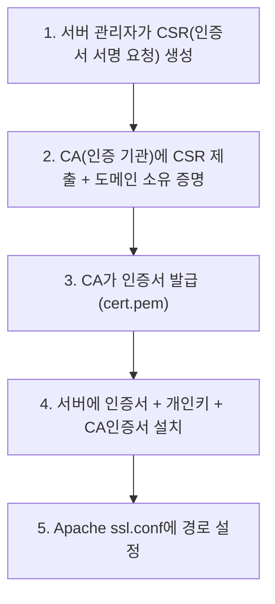
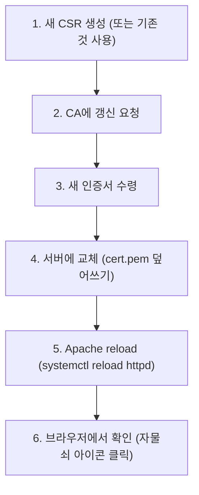

# 06. SSL, 보안, 백업

> **"HTTPS 설정했어요" → "왜 필요한지, 인증서가 뭔지, 만료되면 어떻게 되는지"
> 이거 설명 못 하면 설정한 게 아니라 복붙한 거야.**

---

## 🟢 SSL/TLS란?

### 한 줄 정의

**인터넷 통신을 암호화하는 프로토콜.** HTTP + SSL = HTTPS.

!!! danger "HTTP (암호화 없음)"
    브라우저 → `"ID: admin, PW: 1234"` → 서버

    해커가 중간에서 볼 수 있음 (평문)

!!! tip "HTTPS (SSL 암호화)"
    브라우저 → `"x#8@kQ!m$2pL"` → 서버 → 복호화 → `"ID: admin, PW: 1234"`

    암호화되어 있어서 못 봄

### SSL vs TLS

!!! note "SSL vs TLS"
    | 이름 | 설명 |
    |------|------|
    | SSL (Secure Sockets Layer) | 옛날 버전 (보안 취약, 사용 안 함) |
    | TLS (Transport Layer Security) | 현재 버전 (실제로 쓰는 것) |

    근데 관행적으로 "SSL"이라고 부름.
    "SSL 인증서" = 실제로는 TLS 인증서.

---

## 🟢 SSL 인증서란?

### 인증서 = 신분증

!!! example "인증서 = 신분증 비유"
    **현실 세계:**
    "저 강남구청 직원이에요" → "신분증 보여주세요" → 신분증 확인 → "네 맞네요"

    **인터넷:**
    "저 ictintern.or.kr이에요" → "인증서 보여줘" → 인증서 확인 → "네 맞네요"

### 인증서 구성 요소

| 파일 | 역할 | 비유 |
|------|------|------|
| **cert.pem** (인증서) | "나는 ictintern.or.kr이다" 증명 | 신분증 |
| **key.pem** (개인키) | 암호화/복호화 키 | 신분증의 도장 |
| **TuringSignCA.pem** (CA 인증서) | "이 인증서를 발급한 기관" 증명 | 발급 기관 직인 |

### 인증서 발급 과정



### R-ictintern-WEB의 SSL 인증서

```
/root/Apache/
├── cert.pem           ← 서버 인증서 (2024-12-12)
├── key.pem            ← 개인키 (⚠️ 절대 외부 유출 금지!)
└── TuringSignCA.pem   ← CA 인증서 (Turing Sign CA)

/etc/pki/tls/certs/localhost.crt    ← 기본 인증서
/etc/pki/tls/private/localhost.key  ← 기본 개인키

/root/ssl_global.ictintern.or.kr.zip ← global 도메인 전용 SSL
```

### ssl.conf에서의 설정

```apache
# 인증서 경로 지정
SSLCertificateFile /etc/pki/tls/certs/localhost.crt
SSLCertificateKeyFile /etc/pki/tls/private/localhost.key
# SSLCertificateChainFile /etc/pki/tls/certs/server-chain.crt

# /root/Apache/ 의 cert.pem, key.pem은
# vhosts.conf의 HTTPS VirtualHost에서 설정되어 있을 수 있음
```

---

## 🟡 SSL 인증서 관리

### 인증서 만료

!!! warning "인증서 만료"
    인증서에는 유효기간이 있다 (보통 1년).

    **만료되면?**

    - 브라우저에 "이 사이트는 안전하지 않습니다" 경고
    - 사용자가 접속 못 함 (또는 겁먹고 안 함)
    - 서비스 장애나 마찬가지

    **확인 방법:**

    ```bash
    openssl x509 -in /root/Apache/cert.pem -noout -dates
    # notBefore=Dec 12 00:00:00 2024 GMT  ← 발급일
    # notAfter=Dec 12 23:59:59 2025 GMT   ← 만료일
    ```

### 인증서 갱신 절차



### 개인키(key.pem) 관리

!!! danger "절대 규칙"
    1. 개인키는 절대 외부에 공유하지 않는다
    2. 이메일로 보내지 않는다
    3. 권한은 600 (소유자만 읽기/쓰기)
    4. 유출되면 인증서 재발급 필수

    ```bash
    chmod 600 /root/Apache/key.pem
    # -rw------- (소유자만 읽기쓰기)
    ```

---

## 🟡 Cron (예약 작업)

### cron이란?

!!! note "cron이란"
    리눅스의 예약 작업 스케줄러.
    "매일 새벽 2시에 이 스크립트 실행해" 같은 반복 작업을 자동화.
    Windows의 "작업 스케줄러"와 같은 역할.

### crontab 문법

```
┌───── 분 (0-59)
│ ┌───── 시 (0-23)
│ │ ┌───── 일 (1-31)
│ │ │ ┌───── 월 (1-12)
│ │ │ │ ┌───── 요일 (0-7, 0과 7=일요일)
│ │ │ │ │
* * * * * 명령어

예시:
0 2 * * *     = 매일 02:00
30 9 * * 1    = 매주 월요일 09:30
0 0 1 * *     = 매월 1일 00:00
*/5 * * * *   = 5분마다
0 9-18 * * *  = 매일 9시~18시 매 정각
```

### R-ictintern-WEB의 crontab

```bash
# crontab 1: 시간 동기화
55 22 * * * /usr/bin/chronyc -a 'burst 4/4' && /usr/bin/chronyc -a makestep

# 해석:
# 매일 22:55에 실행
# chronyc = 시간 동기화 도구 (NTP 클라이언트)
# burst 4/4 = NTP 서버에 4번 빠르게 시간 확인
# makestep = 시간 차이가 크면 강제 보정
# 왜 필요? → 서버 시간이 틀리면 인증서 검증 실패, 로그 시간 꼬임

# crontab 2: 로그 관리
00 02 * * * /root/bin/apache_log.sh

# 해석:
# 매일 02:00에 실행
# Apache 로그 정리/로테이션 스크립트
# 왜 새벽 2시? → 사용자 적은 시간에 디스크 I/O 발생시키려고
```

### crontab 관리 명령어

```bash
crontab -l          # 현재 등록된 예약 작업 보기
crontab -e          # 편집 (vi 에디터)
crontab -r          # ⚠️ 전체 삭제 (주의!)

# 시스템 전체 crontab
cat /etc/crontab

# 특정 사용자 crontab
crontab -u apache -l
```

---

## 🟡 백업 전략

### 백업의 3-2-1 원칙

!!! abstract "3-2-1 원칙"
    | 숫자 | 의미 |
    |------|------|
    | **3** | 데이터를 3개 이상 복사본 유지 |
    | **2** | 2가지 이상 다른 매체에 저장 |
    | **1** | 1개는 물리적으로 다른 장소에 |

    **예시:**

    1. 원본 (서버)
    2. 로컬 백업 (같은 서버 /tmp/web_backup/) ← 이거만 하면 부족!
    3. 외부 백업 (로컬 PC, NAS, 클라우드) ← 이거까지 해야 완료

### 이 서버 백업에서 한 것

!!! warning "문제점"
    `/tmp/web_backup/`에 백업 파일이 생성되지만, 이것은 같은 서버에 있음!
    서버가 삭제되면 백업도 같이 날아감!

    → 반드시 SCP/SFTP로 로컬이나 다른 서버로 다운로드해야 함

### 서버에서 파일 다운로드 (SCP)

```bash
# 전체 백업 폴더를 로컬로 다운로드
scp -r root@211.254.219.56:/tmp/web_backup/ C:\Users\tideflo\Desktop\WEB백업\

# 개별 파일 다운로드
scp root@211.254.219.56:/tmp/web_backup/etc_httpd.tar.gz C:\backup\

# MobaXterm 사용 시:
# 왼쪽 파일 브라우저에서 드래그 앤 드롭으로도 가능
```

### tar 압축 해제 (복원 시)

```bash
# 압축 해제
tar xzf etc_httpd.tar.gz

# 특정 경로에 풀기
tar xzf etc_httpd.tar.gz -C /복원경로/

# 내용만 확인
tar tzf etc_httpd.tar.gz
```

---

## 🟡 서버 보안 기초

### 최소 권한 원칙

!!! abstract "최소 권한 원칙"
    "필요한 만큼만 허용하고, 나머지는 다 차단"

!!! danger "나쁜 예"
    iptables 전부 ACCEPT (이 서버 상태)

!!! tip "좋은 예"
    - 80, 443만 외부 허용
    - 22는 관리자 IP만 허용
    - 나머지 전부 차단

### 서버 보안 체크리스트

!!! warning "서버 보안 체크리스트"
    - [ ] SSH root 직접 로그인 제한 (키 기반 인증 사용)
    - [ ] 불필요한 포트 차단 (방화벽)
    - [ ] Apache 버전 정보 숨기기 (ServerTokens Prod)
    - [ ] 디렉토리 인덱싱 비활성화 (Options -Indexes)
    - [ ] SSL 인증서 만료일 관리
    - [ ] 로그 모니터링 (비정상 접근 감시)
    - [ ] OS 및 소프트웨어 보안 패치 적용
    - [ ] 개인키 파일 권한 확인 (chmod 600)

---

## 🔴 실무 장애 시나리오 (이걸 알면 쫄지 않음)

### 시나리오 1: "사이트가 안 열려요"

!!! example "확인 순서"
    **1. Apache 프로세스 확인**
    → `systemctl status httpd` → 죽어있으면 start

    **2. 포트 확인**
    → `netstat -tlnp | grep 80` → 80 포트 listen 안 하면 설정 오류

    **3. 로그 확인**
    → `tail -50 /var/log/httpd/error_log` → 에러 메시지 확인

    **4. 방화벽 확인**
    → 80/443 포트 열려있는지

    **5. DNS 확인**
    → `nslookup ictintern.or.kr` → IP가 맞는지

### 시나리오 2: "로그인이 안 돼요" (502 에러)

!!! danger "502 Bad Gateway = Apache는 살아있는데 Tomcat 연결 실패"

!!! example "확인 순서"
    **1. Tomcat 프로세스 확인 (WAS 서버에서)**
    → `ps aux | grep tomcat`

    **2. AJP 포트 확인 (WAS 서버에서)**
    → `netstat -tlnp | grep 8209`

    **3. mod_jk 로그 확인**
    → `tail -50 /var/log/httpd/mod_jk.log`
    → "worker ict12 in error state" 같은 메시지

    **4. 네트워크 확인**
    → `ping 10.64.147.88` (WAS IP)
    → `telnet 10.64.147.88 8209` (AJP 포트 연결 테스트)

### 시나리오 3: "인증서 만료"

!!! warning "증상: 브라우저에 '안전하지 않음' 경고"

!!! example "확인 및 조치"
    **확인:**
    ```bash
    openssl x509 -in /root/Apache/cert.pem -noout -dates
    ```

    **조치:**

    1. CA에 인증서 갱신 요청
    2. 새 인증서 수령
    3. cert.pem 교체
    4. `httpd -t` (문법 검사)
    5. `systemctl reload httpd`
    6. 브라우저에서 자물쇠 확인

---

## 이 서버 백업 최종 정리

!!! abstract "R-ictintern-WEB 백업 전체 구성"
    `/tmp/web_backup/` (총 397M, 파일 8개)

    **설정 파일 (필수)**

    | 파일 | 크기 | 내용 |
    |------|------|------|
    | etc_httpd.tar.gz | 20K | RPM 설정 |
    | apache1_conf.tar.gz | 252K | 커스텀 설정 |
    | ssl_certs.tar.gz | 16K | SSL 인증서 |
    | crontab_root.txt | 4K | 예약 작업 |
    | root_scripts.tar.gz | 4K | 관리 스크립트 |
    | ssh_keys.tar.gz | 4K | SSH 키 |

    **데이터 (선택)**

    | 파일 | 크기 | 내용 |
    |------|------|------|
    | apache1_logs.tar.gz | 194M | 운영 로그 |
    | didimagent.tar.gz | 204M | 모니터링 |

!!! danger "주의"
    `/tmp/web_backup/`은 서버 안에 있음 → 서버 삭제 전 반드시 외부로 다운로드!

---

## 검증 질문

!!! question "Q1. SSL 인증서의 3가지 파일(cert.pem, key.pem, CA.pem)의 각각의 역할은?"

!!! question "Q2. key.pem의 권한이 600이어야 하는 이유는?"
    644면 뭐가 문제인가?

!!! question "Q3. 이 서버의 crontab에 시간 동기화가 있다. 서버 시간이 틀리면 어떤 문제가 발생하는가? (3가지)"

!!! question "Q4. 백업 파일이 /tmp/web_backup/에 있다. 이 상태로 서버가 삭제되면 어떻게 되는가?"
    3-2-1 원칙에 비추어 지금 부족한 점은?

!!! question "Q5. 502 에러가 발생했다. 어디부터 확인하는가?"
    순서대로 말해봐.

!!! question "Q6. SSL 인증서가 만료됐다. 조치 순서를 말해봐."
    httpd -t를 왜 reload 전에 하는가?
