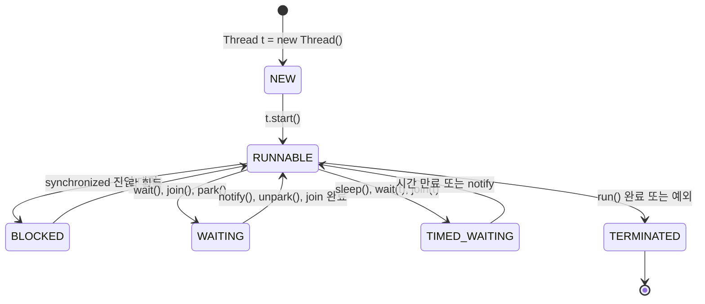

# 03. 스레드 생명주기

**이 장의 목표**: 스레드가 태어나서 죽을 때까지의 상태 변화를 이해한다

---

## 1. 스레드의 6가지 상태

Java 스레드는 `Thread.State` enum으로 6가지 상태를 가진다.

!!! note "스레드 생명주기 (6가지 상태)"

    1. **NEW**: 생성됨 (아직 start() 안 함)
    2. **RUNNABLE**: 실행 가능 (CPU 할당 대기 or 실행 중)
    3. **BLOCKED**: 락 대기 (synchronized 진입 대기)
    4. **WAITING**: 무기한 대기 (다른 스레드가 깨워줘야 함)
    5. **TIMED_WAITING**: 시간 제한 대기 (일정 시간 후 자동 복귀)
    6. **TERMINATED**: 종료됨 (run() 끝남, 다시 못 살림)

---

## 2. 상태 전이 다이어그램



---

## 3. 각 상태 상세 설명

### 3.1 NEW

```java
Thread t = new Thread(() -> System.out.println("실행"));
// 이 시점에서 t의 상태: NEW
// 아직 start() 안 했으니까 그냥 객체만 만든 상태
```

```
비유: 신입사원 채용됨. 아직 출근 안 함.
```

### 3.2 RUNNABLE

```java
t.start();
// 이 시점에서 t의 상태: RUNNABLE
// OS에 의해 CPU를 받으면 실행됨
```

```
RUNNABLE = "실행 가능" 상태
  → CPU를 받으면 실행 중
  → CPU를 안 받으면 실행 대기 중
  → Java에서는 "실행 중"과 "실행 대기"를 구분하지 않는다
  → 둘 다 RUNNABLE

비유: 출근해서 일할 준비 완료. 사장(CPU)이 일 시키면 바로 함.
```

### 3.3 BLOCKED

```java
synchronized(lock) {
    // 다른 스레드가 이미 이 lock을 잡고 있으면
    // 이 스레드는 BLOCKED 상태가 됨
    // lock이 풀릴 때까지 대기
}
```

```
비유: 회의실에 들어가려는데 다른 팀이 쓰고 있음. 문 앞에서 대기.
```

### 3.4 WAITING

```java
// 방법 1: Object.wait()
synchronized(lock) {
    lock.wait();  // 누군가가 lock.notify() 해줄 때까지 무기한 대기
}

// 방법 2: Thread.join()
t.join();  // 스레드 t가 끝날 때까지 무기한 대기

// 방법 3: LockSupport.park()
LockSupport.park();  // 누군가 unpark() 해줄 때까지 대기
```

```
비유: "부르면 올게" 하고 쉬는 중. 누가 부를 때까지 무기한 대기.
```

### 3.5 TIMED_WAITING

```java
// 방법 1: Thread.sleep()
Thread.sleep(1000);  // 1초 동안 대기 후 자동 복귀

// 방법 2: Object.wait(timeout)
lock.wait(5000);  // 5초 대기 또는 notify 시 복귀

// 방법 3: Thread.join(timeout)
t.join(3000);  // 3초 대기 또는 t 종료 시 복귀

// 방법 4: Timer.schedule()
timer.schedule(task, 0, 1000);  // ← 우리 코드! 1초마다 반복
```

```
비유: "1초 후에 다시 올게" 하고 잠깐 쉬는 중.

우리 서버의 Timer-0:
  task 실행 → TIMED_WAITING (1초) → task 실행 → TIMED_WAITING (1초) → ...
  이걸 서버 꺼질 때까지 무한 반복
```

### 3.6 TERMINATED

```java
// run() 메서드가 끝나면 자동으로 TERMINATED
// 또는 run() 안에서 예외가 발생하면 TERMINATED

Thread t = new Thread(() -> System.out.println("끝"));
t.start();
// ... run() 완료 후
// t의 상태: TERMINATED
// 다시 start() 불가. 죽은 스레드는 살릴 수 없다.
```

```
비유: 퇴사. 다시 입사 불가.
```

---

## 4. 상태 확인하는 법

```java
Thread t = new Thread(() -> {
    try {
        Thread.sleep(5000);
    } catch (InterruptedException e) {}
});

System.out.println(t.getState());  // NEW
t.start();
System.out.println(t.getState());  // RUNNABLE
Thread.sleep(100);
System.out.println(t.getState());  // TIMED_WAITING (sleep 중)
t.join();
System.out.println(t.getState());  // TERMINATED
```

---

## 5. 우리 서버 Timer-0의 생명주기

!!! example "Timer-0 스레드의 일생"

    ```mermaid
    flowchart TD
        A[서버 시작] --> B["new Timer(true)"]
        B --> C["Timer-0 스레드 생성 [NEW]"]
        C --> D["내부에서 start() 호출 [RUNNABLE]"]
        D --> E["timer.schedule(task, 0, 1000)"]
        E --> F["task.run() 실행 [RUNNABLE]<br/>126개 XML 체크"]
        F --> G["완료 후 1초 대기 [TIMED_WAITING]"]
        G --> F
        F -.-> H["서버 종료 (destroy() 호출)"]
        H --> I["timer.cancel()"]
        I --> J["Timer-0 스레드 종료 [TERMINATED]"]
    ```

    서버가 안 꺼지면? Timer-0는 영원히 RUNNABLE <-> TIMED_WAITING

    그 동안 DelegatingClassLoader 계속 누적

---

## 6. 핵심 정리

!!! abstract "핵심 정리"

    **스레드 6가지 상태:** NEW -- RUNNABLE -- (BLOCKED/WAITING/TIMED_WAITING) -- TERMINATED

    - **RUNNABLE**: 실행 중 + 실행 대기 (Java는 구분 안 함)
    - **BLOCKED**: 락(synchronized) 대기
    - **WAITING**: 무기한 대기 (notify/unpark 필요)
    - **TIMED_WAITING**: 시간 제한 대기 (sleep, schedule)
    - **TERMINATED**: 끝. 재시작 불가.

    **우리 서버 Timer-0:**
    RUNNABLE <-> TIMED_WAITING 무한 반복. 서버 꺼질 때까지 TERMINATED 안 됨. 그 동안 참조 잡고 있으니 GC 불가.

    **다음 장:** 동기화와 락 -- 두 스레드가 동시에 같은 걸 건드리면 뭐가 일어나는지
